# REPO: Docs

Kho lưu trữ tài liệu cá nhân chứa các **kiến thức thiết yếu** về lập trình, bảo mật, và công nghệ. Đây là những phần **mình cần thiết cho bản thân**, không phải một kho kiến thức đầy đủ toàn bộ. Tài liệu được tổng hợp từ các nguồn mở trên Internet và được tùy chỉnh theo nhu cầu riêng.

> **Lưu ý:** Đây là **tài liệu cá nhân** của mình, không phải hướng dẫn chính thức hay kho tham khảo đầy đủ. Nội dung chỉ bao gồm những phần mình cần và dựa trên kinh nghiệm riêng.

---

## Bản đồ Tri thức & Mục lục

```mermaid
flowchart TD
    accTitle: Bản đồ Tri thức Kho lưu trữ Tài liệu
    accDescr: Tổng quan sơ đồ các chuyên đề kỹ thuật, thiết kế mẫu và kiến trúc phần mềm trong repository

    Repo["Repo Docs"]

    Repo --> Prog["1. Programming Languages"]
    Repo --> Sec["2. Security"]
    Repo --> DP["3. Design Patterns"]
    Repo --> Arch["4. Software Architecture<br/>(Đang triển khai)"]
    Repo --> Net["5. Computer Networking"]
    Repo --> WebPush["6. Web Notifications"]
    Repo --> Nginx["7. NGINX Server"]
    Repo --> DB["8. Database Internals"]
    Repo --> VCS["9. Version Control System"]

    Prog --> Java["Java"]
    Prog --> JS["JavaScript"]

    Sec --> JWT["JWT Authentication"]
    Sec --> OAuth["OAuth Authorization"]

    DP --> SOLID["SOLID Principles"]
    DP --> Creational["Creational Patterns"]
    DP --> Behavioral["Behavioral Patterns"]

    Arch --> UIArch["MVC / MVVM / MVP"]
    Arch --> DDD["Domain-Driven Design (DDD)"]
    Arch --> CleanArch["Clean Architecture"]
    Arch --> HexArch["Hexagonal Architecture"]
    Arch --> OnionArch["Onion Architecture"]
```

### 1. [Programming Languages](programming_languages/) - Ngôn ngữ lập trình
*   [Java](programming_languages/java/) - Tài liệu và PDF về Java
*   [JavaScript](programming_languages/javascript/) - Tài liệu về JavaScript

### 2. [Security](security/) - Xác thực và Bảo mật
*   [JWT](security/jwt/README.md) - JSON Web Tokens - Xác thực và bảo mật
*   [OAuth](security/oauth/) - Xác thực và ủy quyền OAuth

### 3. [Design Patterns](design_patterns/) - Mẫu thiết kế phần mềm
*   [SOLID Principles](design_patterns/solid/) - 5 Nguyên lý thiết kế hướng đối tượng
*   [Creational Patterns](design_patterns/creational/) - Các mẫu thiết kế khởi tạo
*   [Behavioral Patterns](design_patterns/behavioral/) - Các mẫu thiết kế hành vi

### 4. [Software Architecture](architecture/) - Kiến trúc phần mềm *(Đang triển khai)*
*   MVC / MVVM / MVP - Các mẫu kiến trúc giao diện & ứng dụng
*   DDD (Domain-Driven Design) - Thiết kế hướng tên miền
*   Clean Architecture - Kiến trúc sạch
*   Hexagonal Architecture - Kiến trúc lục giác (Ports & Adapters)
*   Onion Architecture - Kiến trúc hành tây

### 5. [Computer Networking](computer_networking/) - Mạng máy tính
*   [Computer Networking](computer_networking/) - Các kiến thức về mạng máy tính và giao thức mạng

### 6. [Web Notifications](web_notifications/) - Thông báo đẩy trên nền web
*   [Web Notifications](web_notifications/) - Kiến trúc, luồng hoạt động FCM/Web Push API và hướng dẫn triển khai

### 7. [NGINX](nginx/README.md) - Web Server & Reverse Proxy
*   [NGINX](nginx/README.md) - Hướng dẫn toàn diện từ kiến trúc Event-Driven, C10K, Cấu hình, Caching, SSL/TLS đến Trade-offs

### 8. [Database Internals](database/README.md) - Cơ sở Dữ liệu
*   [MVCC, Index & Case Studies](database/README.md) - Phân tích chuyên sâu MVCC, B+Tree Index, Covering Index, Workload Trade-offs và Case Study Uber Migration

### 9. [Version Control System](version_control_system/README.md) - Hệ thống Quản lý Phiên bản
*   [Git & GitHub](version_control_system/README.md) - Hướng dẫn toàn diện từ Version Control đến cộng tác phần mềm

---

## Liên hệ

-   **GitHub:** [MaiTheHao](https://github.com/MaiTheHao)

    

