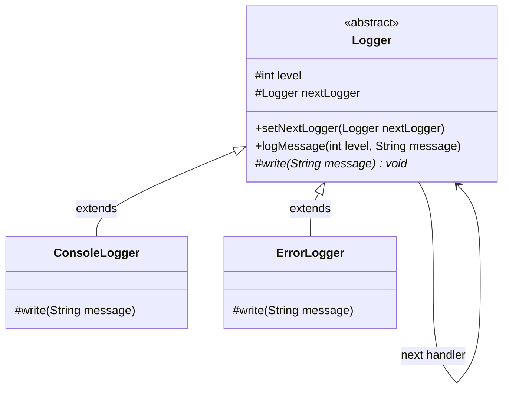

# Chain of Responsibility Pattern

Chain of Responsibility (còn gọi là Chuỗi trách nhiệm) là mẫu thiết kế hành vi cho phép truyền các yêu cầu dọc theo một chuỗi các đối tượng xử lý (handlers). Khi nhận được yêu cầu, mỗi handler sẽ quyết định xử lý nó hoặc chuyển tiếp cho handler tiếp theo trong chuỗi.

## Mục lục

-   [1. Định nghĩa & Mục đích](#1-định-nghĩa--mục-đích)
-   [2. Cấu trúc (UML & Mermaid)](#2-cấu-trúc-uml--mermaid)
-   [3. Ứng dụng thực tế](#3-ứng-dụng-thực-tế)
-   [4. Ví dụ code Java](#4-ví-dụ-code-java)
-   [5. Ưu & Nhược điểm](#5-ưu--nhược-điểm)

---

## 1. Định nghĩa & Mục đích

Chain of Responsibility giúp giảm liên kết chặt chẽ (decoupling) giữa đối tượng gửi yêu cầu và các đối tượng nhận yêu cầu bằng cách cho phép nhiều đối tượng đều có cơ hội xử lý yêu cầu đó.

---

## 2. Cấu trúc (UML & Mermaid)

Dưới đây là sơ đồ lớp mô tả cấu trúc của mẫu thiết kế Chain of Responsibility:



| Thành phần/Bước | Vai trò/Mô tả | Chi tiết |
| :--- | :--- | :--- |
| `Logger` | Abstract Handler | Định nghĩa phương thức liên kết chuỗi (`setNextLogger`) và xử lý/chuyển tiếp thông điệp (`logMessage`). |
| `ConsoleLogger` | Concrete Handler | Triển khai ghi nhật ký thông tin thông thường ra console khi có thẩm quyền. |
| `ErrorLogger` | Concrete Handler | Triển khai ghi nhật ký lỗi hệ thống ra tệp tin lỗi chuyên biệt. |

---

## 3. Ứng dụng thực tế

Áp dụng mẫu thiết kế Chain of Responsibility khi:
*   Có nhiều hơn một đối tượng có khả năng xử lý yêu cầu và đối tượng xử lý thực tế chỉ được xác định động tại runtime.
*   Bạn muốn phát ra yêu cầu cho một trong nhiều đối tượng xử lý mà không cần chỉ định tường minh đối tượng nào.
*   Danh sách các đối tượng xử lý yêu cầu cần được thay đổi động, linh hoạt.

---

## 4. Ví dụ code Java

Ví dụ xây dựng hệ thống ghi nhật ký (`Logger`) phân cấp chuỗi, chuyển tiếp yêu cầu từ cấp lỗi `ErrorLogger` sang cấp ghi thông tin thông thường `ConsoleLogger`.

```java
// 1. Handler Abstract Class
abstract class Logger {
    public static int INFO = 1;
    public static int ERROR = 2;

    protected int level;
    protected Logger nextLogger;

    public void setNextLogger(Logger nextLogger) {
        this.nextLogger = nextLogger;
    }

    public void logMessage(int level, String message) {
        if (this.level <= level) {
            write(message); // Đủ thẩm quyền thì xử lý
        }
        if (nextLogger != null) {
            nextLogger.logMessage(level, message); // Truyền tiếp cho người kế nhiệm
        }
    }

    abstract protected void write(String message);
}

// 2. Concrete Handlers
class ConsoleLogger extends Logger {
    public ConsoleLogger(int level) { this.level = level; }
    @Override
    protected void write(String message) { System.out.println("Console: " + message); }
}

class ErrorLogger extends Logger {
    public ErrorLogger(int level) { this.level = level; }
    @Override
    protected void write(String message) { System.out.println("Error File: " + message); }
}
```

---

## 5. Ưu & Nhược điểm

### Ưu điểm
*   **Loose Coupling:** Người gửi không cần biết handler nào xử lý yêu cầu của mình.
*   **Linh hoạt:** Dễ dàng thay đổi thứ tự hoặc thêm/bớt các handler trong chuỗi tại runtime.
*   **Single Responsibility:** Tách biệt các logic xử lý nghiệp vụ của từng đối tượng độc lập.

### Nhược điểm
*   Không có gì đảm bảo yêu cầu sẽ được xử lý nếu nó đi hết chuỗi mà không gặp handler phù hợp.
*   Khó gỡ lỗi (debug) và theo dõi dấu luồng thực hiện của yêu cầu dọc theo chuỗi.

---
[← Quay lại mục lục Behavioral](README.md)
