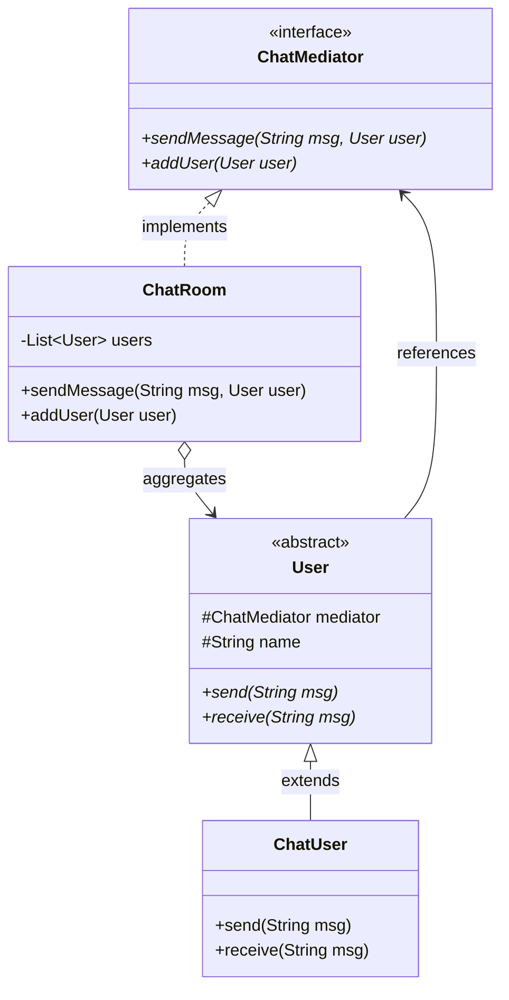

# Mediator Pattern

Mediator (còn gọi là Người trung gian) là mẫu thiết kế hành vi định nghĩa một đối tượng đóng vai trò trung gian để quản lý tương tác và giao tiếp giữa một tập hợp các đối tượng khác (Colleagues).

## Mục lục

-   [1. Định nghĩa & Mục đích](#1-định-nghĩa--mục-đích)
-   [2. Cấu trúc (UML & Mermaid)](#2-cấu-trúc-uml--mermaid)
-   [3. Ứng dụng thực tế](#3-ứng-dụng-thực-tế)
-   [4. Ví dụ code Java](#4-ví-dụ-code-java)
-   [5. Ưu & Nhược điểm](#5-ưu--nhược-điểm)

---

## 1. Định nghĩa & Mục đích

Mediator thúc đẩy liên kết lỏng lẻo (loose coupling) bằng cách giữ cho các đối tượng không trực tiếp tham chiếu hoặc tương tác lẫn nhau. Thay vào đó, mọi luồng giao tiếp đều đi qua Mediator, giúp thay đổi tương tác của chúng một cách độc lập.

---

## 2. Cấu trúc (UML & Mermaid)

Dưới đây là sơ đồ lớp mô tả cấu trúc của mẫu thiết kế Mediator:



| Thành phần/Bước | Vai trò/Mô tả | Chi tiết |
| :--- | :--- | :--- |
| `ChatMediator` | Interface Trung gian | Khai báo phương thức đăng ký thành viên và chuyển tiếp tin nhắn. |
| `ChatRoom` | Concrete Mediator | Cài đặt `ChatMediator`, quản lý danh sách người dùng và điều phối gửi nhận tin nhắn. |
| `User` | Colleague Class | Lớp trừu tượng định nghĩa các đối tượng cần giao tiếp với nhau qua `ChatMediator`. |
| `ChatUser` | Concrete Colleague | Lớp cụ thể của `User`, thực hiện gửi/nhận tin nhắn gián tiếp thông qua trung gian `ChatRoom`. |

---

## 3. Ứng dụng thực tế

Áp dụng mẫu thiết kế Mediator khi:
*   Tập hợp các đối tượng giao tiếp với nhau theo những cách phức tạp tạo thành một mạng lưới phụ thuộc phi cấu trúc và khó hiểu.
*   Muốn tái sử dụng một đối tượng nhưng khó khăn vì nó tham chiếu trực tiếp và phụ thuộc vào quá nhiều đối tượng khác.
*   Một hành vi phân tán giữa nhiều lớp cần phải được tùy biến mà không muốn tạo ra quá nhiều lớp con.

---

## 4. Ví dụ code Java

Ví dụ mô phỏng phòng chat (`ChatRoom`) làm trung gian điều phối tin nhắn giữa các người dùng (`ChatUser`) mà họ không cần gửi trực tiếp cho nhau.

```java
import java.util.ArrayList;
import java.util.List;

// 1. Mediator Interface
interface ChatMediator {
    void sendMessage(String msg, User user);
    void addUser(User user);
}

// 2. Colleague Abstract Class
abstract class User {
    protected ChatMediator mediator;
    protected String name;

    public User(ChatMediator med, String name) {
        this.mediator = med;
        this.name = name;
    }
    public abstract void send(String msg);
    public abstract void receive(String msg);
}

// 3. Concrete Mediator
class ChatRoom implements ChatMediator {
    private List<User> users = new ArrayList<>();

    @Override
    public void addUser(User user) { this.users.add(user); }

    @Override
    public void sendMessage(String msg, User sender) {
        for (User u : users) {
            if (u != sender) { u.receive(msg); } // Gửi cho mọi người trừ người gửi
        }
    }
}

// 4. Concrete Colleague
class ChatUser extends User {
    public ChatUser(ChatMediator med, String name) { super(med, name); }

    @Override
    public void send(String msg) {
        System.out.println(this.name + " sends: " + msg);
        mediator.sendMessage(msg, this); // Giao tiếp thông qua Mediator
    }

    @Override
    public void receive(String msg) {
        System.out.println(this.name + " received: " + msg);
    }
}
```

---

## 5. Ưu & Nhược điểm

### Ưu điểm
*   **Loose Coupling:** Các thành phần Colleague hoàn toàn độc lập và không liên kết trực tiếp với nhau.
*   **Đơn giản hóa giao tiếp:** Giảm bớt các kết nối chéo đa chiều (n-n) chuyển thành kết nối hình sao đơn giản (1-n).
*   Tập trung hóa quyền điều phối giao tiếp và hành vi vào một nơi duy nhất.

### Nhược điểm
*   **God Object:** Bản thân Mediator có thể trở nên cực kỳ cồng kềnh, phức tạp vì phải gánh chịu mọi luồng xử lý và giao tiếp của hệ thống.
*   Khó bảo trì và kiểm thử chính lớp Mediator này.

---
[← Quay lại mục lục Behavioral](README.md)
