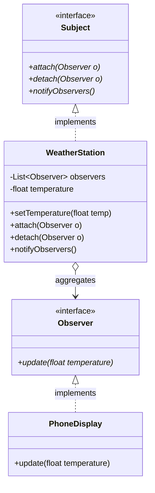

# Observer Pattern

Observer (còn gọi là Publish-Subscribe) là mẫu thiết kế định nghĩa một mối quan hệ phụ thuộc một-nhiều (one-to-many) giữa các đối tượng. Khi trạng thái của một đối tượng (Subject) thay đổi, tất cả đối tượng phụ thuộc (Observers) sẽ nhận được thông báo và tự động cập nhật.

## Mục lục

-   [1. Định nghĩa & Mục đích](#1-định-nghĩa--mục-đích)
-   [2. Cấu trúc (UML & Mermaid)](#2-cấu-trúc-uml--mermaid)
-   [3. Ứng dụng thực tế](#3-ứng-dụng-thực-tế)
-   [4. Ví dụ code Java](#4-ví-dụ-code-java)
-   [5. Ưu & Nhược điểm](#5-ưu--nhược-điểm)

---

## 1. Định nghĩa & Mục đích

Mục đích chính của Observer là giữ cho các đối tượng liên quan luôn đồng bộ về mặt trạng thái mà không tạo ra sự liên kết chặt chẽ (tight coupling) giữa chúng.

---

## 2. Cấu trúc (UML & Mermaid)

Dưới đây là sơ đồ lớp mô tả cấu trúc của mẫu thiết kế Observer:



| Thành phần/Bước | Vai trò/Mô tả | Chi tiết |
| :--- | :--- | :--- |
| `Subject` | Interface Chủ thể | Định nghĩa các phương thức để thêm (`attach`), xóa (`detach`) và thông báo (`notifyObservers`) các observer. |
| `WeatherStation` | Concrete Subject | Cài đặt interface `Subject`, lưu trữ danh sách các observer và thông báo khi nhiệt độ thay đổi. |
| `Observer` | Interface Người quan sát | Khai báo phương thức `update` nhận dữ liệu mới cập nhật từ Subject. |
| `PhoneDisplay` | Concrete Observer | Cài đặt `Observer` và cập nhật thông tin hiển thị khi nhận được sự thay đổi nhiệt độ. |

---

## 3. Ứng dụng thực tế

Mẫu thiết kế Observer được áp dụng rộng rãi khi:
*   Một khía cạnh trừu tượng phụ thuộc vào một khía cạnh khác. Đóng gói chúng vào các đối tượng riêng biệt cho phép thay đổi độc lập.
*   Thay đổi ở một đối tượng yêu cầu cập nhật các đối tượng khác và bạn không biết trước số lượng đối tượng cần cập nhật là bao nhiêu.
*   Đối tượng cần thông báo cho các đối tượng khác mà không cần biết cụ thể lớp triển khai của chúng.

---

## 4. Ví dụ code Java

Ví dụ mô phỏng một trạm thời tiết (`WeatherStation`) cập nhật nhiệt độ và tự động gửi thông báo đến các màn hình điện thoại (`PhoneDisplay`).

```java
import java.util.ArrayList;
import java.util.List;

// 1. Observer Interface
interface Observer {
    void update(float temperature);
}

// 2. Subject Interface
interface Subject {
    void attach(Observer o);
    void detach(Observer o);
    void notifyObservers();
}

// 3. Concrete Subject
class WeatherStation implements Subject {
    private List<Observer> observers = new ArrayList<>();
    private float temperature;

    public void setTemperature(float temp) {
        this.temperature = temp;
        notifyObservers(); // Tự động thông báo khi có sự thay đổi
    }

    @Override
    public void attach(Observer o) { observers.add(o); }

    @Override
    public void detach(Observer o) { observers.remove(o); }

    @Override
    public void notifyObservers() {
        for (Observer o : observers) {
            o.update(temperature);
        }
    }
}

// 4. Concrete Observer
class PhoneDisplay implements Observer {
    @Override
    public void update(float temperature) {
        System.out.println("Phone Display: Temperature updated to " + temperature + " degrees.");
    }
}
```

---

## 5. Ưu & Nhược điểm

### Ưu điểm
*   **Loose Coupling:** Subject chỉ biết danh sách đối tượng triển khai interface `Observer`, không cần biết lớp cụ thể.
*   **Nguyên tắc Open/Closed:** Dễ dàng bổ sung thêm các loại Observer mới mà không cần chỉnh sửa code của Subject.
*   Mối quan hệ được cấu hình linh hoạt trong thời gian chạy (runtime).

### Nhược điểm
*   **Thông báo rác:** Nếu không hủy đăng ký (`detach`), các observer có thể gây rò rỉ bộ nhớ hoặc nhận thông báo không cần thiết.
*   **Thứ tự không đảm bảo:** Không có cơ chế cam kết thứ tự thông báo giữa các observer.

---
[← Quay lại mục lục Behavioral](README.md)
