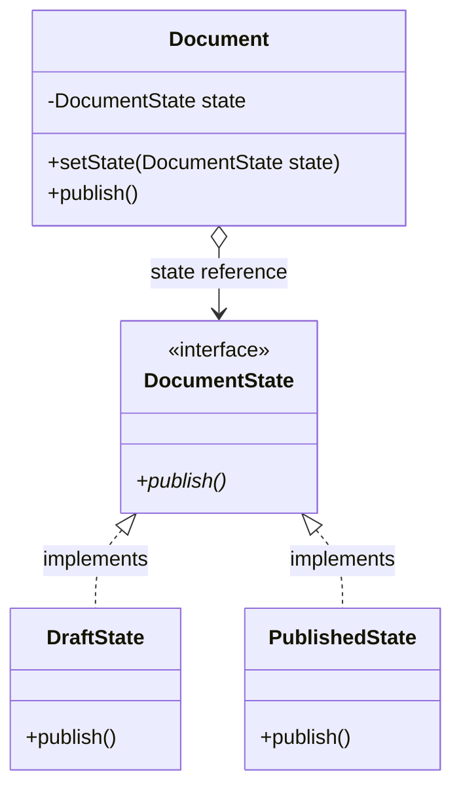

# State Pattern

State (còn gọi là Objects for States) là mẫu thiết kế hành vi cho phép một đối tượng thay đổi hành vi của nó khi trạng thái nội bộ của nó thay đổi. Nhìn từ bên ngoài, đối tượng trông như thể đang thay đổi hoàn toàn lớp (class) của chính nó.

## Mục lục

-   [1. Định nghĩa & Mục đích](#1-định-nghĩa--mục-đích)
-   [2. Cấu trúc (UML & Mermaid)](#2-cấu-trúc-uml--mermaid)
-   [3. Ứng dụng thực tế](#3-ứng-dụng-thực-tế)
-   [4. Ví dụ code Java](#4-ví-dụ-code-java)
-   [5. Ưu & Nhược điểm](#5-ưu--nhược-điểm)

---

## 1. Định nghĩa & Mục đích

Mục đích của mẫu State là đóng gói các hành vi phụ thuộc vào trạng thái thành các lớp trạng thái riêng biệt. Nhờ đó, thay vì sử dụng các cấu trúc điều kiện phức tạp dựa trên biến trạng thái của đối tượng, Context chỉ cần ủy quyền xử lý cho đối tượng trạng thái hiện tại.

---

## 2. Cấu trúc (UML & Mermaid)

Dưới đây là sơ đồ lớp mô tả cấu trúc của mẫu thiết kế State:



| Thành phần/Bước | Vai trò/Mô tả | Chi tiết |
| :--- | :--- | :--- |
| `DocumentState` | Interface Trạng thái | Định nghĩa giao diện chung cho các hành vi liên quan đến một trạng thái cụ thể. |
| `DraftState` | Concrete State | Triển khai hành vi xuất bản khi tài liệu đang ở trạng thái bản nháp (Draft). |
| `PublishedState`| Concrete State | Triển khai hành vi xuất bản khi tài liệu đã được xuất bản (Published). |
| `Document` | Context | Duy trì trạng thái hiện tại (`DocumentState`) và ủy nhiệm cuộc gọi thực thi cho trạng thái đó. |

---

## 3. Ứng dụng thực tế

Áp dụng mẫu thiết kế State khi:
*   Hành vi của đối tượng phụ thuộc trực tiếp vào trạng thái hiện tại của nó và hành vi đó phải tự động thay đổi tại runtime.
*   Các thao tác nghiệp vụ chứa các câu lệnh điều kiện rẽ nhánh khổng lồ và lặp đi lặp lại phụ thuộc vào biến trạng thái của đối tượng.

---

## 4. Ví dụ code Java

Ví dụ mô phỏng quy trình xuất bản tài liệu (`Document`) thay đổi hành vi tương ứng khi ở trạng thái bản nháp (`DraftState`) hoặc đã xuất bản (`PublishedState`).

```java
// 1. State Interface
interface DocumentState {
    void publish();
}

// 2. Concrete States
class DraftState implements DocumentState {
    @Override
    public void publish() { System.out.println("Document is in Draft. Moving to Review..."); }
}

class PublishedState implements DocumentState {
    @Override
    public void publish() { System.out.println("Document is already Published. No action needed."); }
}

// 3. Context
class Document {
    private DocumentState state;

    public Document() {
        this.state = new DraftState(); // Trạng thái mặc định
    }

    public void setState(DocumentState state) { this.state = state; }

    public void publish() {
        state.publish(); // Ủy quyền xử lý cho trạng thái hiện tại
    }
}
```

---

## 5. Ưu & Nhược điểm

### Ưu điểm
*   **Single Responsibility:** Tổ chức code rõ ràng bằng cách đóng gói các hành vi của từng trạng thái cụ thể vào các lớp độc lập.
*   **Open/Closed:** Dễ dàng bổ sung thêm trạng thái mới mà không ảnh hưởng đến cấu trúc Context hoặc các trạng thái cũ.
*   Loại bỏ các cấu trúc logic rẽ nhánh cồng kềnh khó bảo trì.

### Nhược điểm
*   Tăng số lượng lớp trạng thái khi hệ thống có quá nhiều chuyển đổi nhỏ.
*   Có thể bị dư thừa nếu hệ thống chỉ có một vài trạng thái đơn giản và hiếm khi thay đổi.

---
[← Quay lại mục lục Behavioral](README.md)
