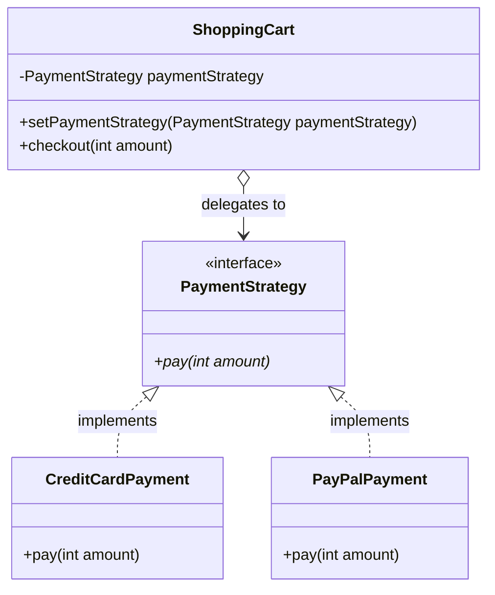

# Strategy Pattern

Strategy (còn gọi là Policy) là mẫu thiết kế hành vi cho phép định nghĩa một họ các thuật toán, đóng gói từng thuật toán lại và giúp chúng có thể thay thế hoán đổi linh hoạt cho nhau tại thời điểm chạy (runtime).

## Mục lục

-   [1. Định nghĩa & Mục đích](#1-định-nghĩa--mục-đích)
-   [2. Cấu trúc (UML & Mermaid)](#2-cấu-trúc-uml--mermaid)
-   [3. Ứng dụng thực tế](#3-ứng-dụng-thực-tế)
-   [4. Ví dụ code Java](#4-ví-dụ-code-java)
-   [5. Ưu & Nhược điểm](#5-ưu--nhược-điểm)

---

## 1. Định nghĩa & Mục đích

Strategy cho phép thuật toán biến đổi một cách độc lập với các client (đối tượng) sử dụng chúng. Mẫu này tách biệt phần xử lý logic nghiệp vụ phức tạp của thuật toán khỏi ngữ cảnh (Context) sử dụng nó.

---

## 2. Cấu trúc (UML & Mermaid)

Dưới đây là sơ đồ lớp mô tả cấu trúc của mẫu thiết kế Strategy:



| Thành phần/Bước | Vai trò/Mô tả | Chi tiết |
| :--- | :--- | :--- |
| `PaymentStrategy` | Interface Chiến lược | Định nghĩa phương thức thanh toán chung (`pay`). |
| `CreditCardPayment` | Concrete Strategy | Triển khai phương thức thanh toán thông qua thẻ tín dụng. |
| `PayPalPayment` | Concrete Strategy | Triển khai phương thức thanh toán thông qua ví điện tử PayPal. |
| `ShoppingCart` | Context | Giữ tham chiếu đến `PaymentStrategy` và ủy quyền thanh toán cho chiến lược đang được cấu hình. |

---

## 3. Ứng dụng thực tế

Áp dụng mẫu thiết kế Strategy khi:
*   Có nhiều lớp liên quan chỉ khác nhau ở hành vi của chúng.
*   Bạn cần các biến thể khác nhau của một thuật toán (ví dụ: các giải thuật tối ưu hóa về tốc độ hoặc dung lượng).
*   Muốn ẩn cấu trúc dữ liệu phức tạp đặc thù của thuật toán khỏi client.
*   Một lớp định nghĩa nhiều hành vi và chúng được thể hiện bằng nhiều câu lệnh rẽ nhánh (`if-else`, `switch-case`).

---

## 4. Ví dụ code Java

Ví dụ dưới đây triển khai giỏ hàng `ShoppingCart` có thể thay đổi động hình thức thanh toán (`PaymentStrategy`) giữa thẻ tín dụng và PayPal.

```java
// 1. Strategy Interface
interface PaymentStrategy {
    void pay(int amount);
}

// 2. Concrete Strategies
class CreditCardPayment implements PaymentStrategy {
    @Override
    public void pay(int amount) {
        System.out.println("Paid " + amount + " using Credit Card.");
    }
}

// 3. Concrete Strategies
class PayPalPayment implements PaymentStrategy {
    @Override
    public void pay(int amount) {
        System.out.println("Paid " + amount + " using PayPal.");
    }
}

// 4. Context
class ShoppingCart {
    private PaymentStrategy paymentStrategy;

    // Cho phép thay đổi thuật toán thanh toán động
    public void setPaymentStrategy(PaymentStrategy paymentStrategy) {
        this.paymentStrategy = paymentStrategy;
    }

    public void checkout(int amount) {
        paymentStrategy.pay(amount); // Ủy quyền cho Strategy
    }
}
```

---

## 5. Ưu & Nhược điểm

### Ưu điểm
*   Dễ dàng chuyển đổi linh hoạt giữa các thuật toán tại runtime.
*   Loại bỏ các khối điều kiện phức tạp (`if-else` hoặc `switch-case`).
*   Tuân thủ nguyên lý Single Responsibility và Open/Closed.

### Nhược điểm
*   Client sử dụng bắt buộc phải biết sự khác biệt giữa các Strategy để lựa chọn chính xác.
*   Tăng số lượng lớp (classes) trong ứng dụng.
*   Tốn chi phí khởi tạo và giao tiếp thông qua interface.

---
[← Quay lại mục lục Behavioral](README.md)
