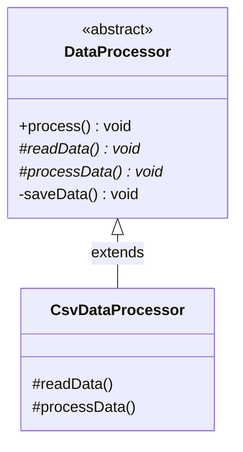

# Template Method Pattern

Template Method là mẫu thiết kế hành vi định nghĩa bộ khung (skeleton) của một thuật toán trong một phương thức của lớp cha, trì hoãn việc định nghĩa các bước triển khai chi tiết cụ thể cho các lớp con.

## Mục lục

-   [1. Định nghĩa & Mục đích](#1-định-nghĩa--mục-đích)
-   [2. Cấu trúc (UML & Mermaid)](#2-cấu-trúc-uml--mermaid)
-   [3. Ứng dụng thực tế](#3-ứng-dụng-thực-tế)
-   [4. Ví dụ code Java](#4-ví-dụ-code-java)
-   [5. Ưu & Nhược điểm](#5-ưu--nhược-điểm)

---

## 1. Định nghĩa & Mục đích

Template Method cho phép các lớp con định nghĩa lại hoặc tùy biến một số bước cụ thể của thuật toán mà không làm thay đổi cấu trúc tổng thể và các bước cốt lõi của thuật toán đó.

---

## 2. Cấu trúc (UML & Mermaid)

Dưới đây là sơ đồ lớp mô tả cấu trúc của mẫu thiết kế Template Method:



| Thành phần/Bước | Vai trò/Mô tả | Chi tiết |
| :--- | :--- | :--- |
| `DataProcessor` | Abstract Class | Định nghĩa phương thức khuôn mẫu (`process`) được khai báo `final` để tránh ghi đè, và các phương thức trừu tượng phụ trợ. |
| `CsvDataProcessor`| Concrete Class | Kế thừa lớp cha, triển khai chi tiết các phương thức xử lý đặc thù cho tệp tin CSV (`readData`, `processData`). |

---

## 3. Ứng dụng thực tế

Áp dụng mẫu thiết kế Template Method khi:
*   Bạn muốn triển khai các phần bất biến của một thuật toán một lần duy nhất và để các lớp con chịu trách nhiệm phần biến đổi.
*   Cần tái cấu trúc để gom nhóm các hành vi chung giữa các lớp con vào một lớp cha chung để tránh trùng lặp mã nguồn.
*   Muốn kiểm soát các điểm mở rộng (hooks) của các lớp con tại những thời điểm cố định được cho phép.

---

## 4. Ví dụ code Java

Ví dụ triển khai lớp trừu tượng `DataProcessor` làm khuôn mẫu xử lý dữ liệu và lớp con `CsvDataProcessor` chuyên biệt hóa đọc và xử lý cấu trúc dữ liệu CSV.

```java
// 1. Abstract Class (Khuôn mẫu)
abstract class DataProcessor {
    // Template Method: final để cấm lớp con thay đổi cấu trúc thuật toán
    public final void process() {
        readData();
        processData();
        saveData();
    }

    // Các bước bắt buộc lớp con phải cụ thể hóa
    protected abstract void readData();
    protected abstract void processData();

    // Bước có sẵn implementation chung
    private void saveData() {
        System.out.println("Saving data to database...");
    }
}

// 2. Concrete Class
class CsvDataProcessor extends DataProcessor {
    @Override
    protected void readData() {
        System.out.println("Reading data from CSV file...");
    }

    @Override
    protected void processData() {
        System.out.println("Processing CSV data structures...");
    }
}
```

---

## 5. Ưu & Nhược điểm

### Ưu điểm
*   **Tránh trùng lặp code:** Giúp đưa các phần code chung của thuật toán lên lớp cha để tái sử dụng tối đa.
*   Dễ dàng tùy biến hành vi của lớp con tại các bước cụ thể mà không phá vỡ cấu trúc tổng thể.
*   Cung cấp các hook để kiểm soát việc kế thừa và mở rộng hành vi một cách an toàn.

### Nhược điểm
*   Cấu trúc phân tầng lớp kế thừa sâu có thể làm code trở nên khó theo dõi luồng thực thi.
*   Lớp con bị giới hạn và phụ thuộc chặt chẽ vào cấu trúc khung thuật toán của lớp cha.

---
[← Quay lại mục lục Behavioral](README.md)
