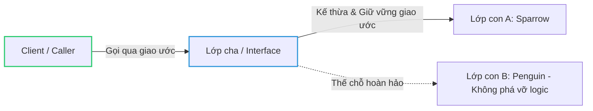

# Liskov Substitution Principle (LSP)

**Các đối tượng lớp con có thể thay thế lớp cha mà không làm thay đổi tính đúng đắn của chương trình.**

---

## Ví dụ

### Trường hợp sai

```java
public class Bird {
    public void fly() { System.out.println("Tôi đang bay!"); }
}

public class Penguin extends Bird {
    @Override
    public void fly() {
        throw new UnsupportedOperationException("Chim cánh cụt không thể bay!");
    }
}

public class BirdShow {
    public void startShow(Bird bird) { bird.fly(); }
}
```

### Trường hợp đúng

```java
public class Bird {...}

public interface Flyable {
    void fly();
}

public class Sparrow extends Bird implements Flyable {
    @Override
    public void fly() { System.out.println("Chim sẻ đang bay!"); }
}

public class Penguin extends Bird {...}

public class BirdShow {
    public void startFlyingShow(Flyable flyingBird) { flyingBird.fly(); }
}
```

Ban đầu định nghĩa `Bird` phải biết bay, nhưng `Penguin` lại không biết bay dẫn đến lỗi `Penguin` là `Bird` nhưng không hoạt động như `Bird` được định nghĩa.

Bằng cách tạo interface `Flyable`, `Bird` giờ định chỉ định nghĩa thuộc tính không khẳng định khả năng bay do đó `Penguin` giờ đây là `Bird` và hoạt động như `Bird` được định nghĩa.

---

> **Tính đúng đắn (Program Correctness) là gì?**
>
> "Tính đúng đắn" ở đây chính là **sự nhất quán về mặt hành vi và logic của hệ thống (Behavioral Consistency)**. Nó đảm bảo rằng khi một lớp con thế chỗ lớp cha, chương trình phải tiếp tục chạy đúng theo kỳ vọng thiết kế mà:
> 1. Không bị crash hoặc ném ra các ngoại lệ (Exceptions) bất ngờ mà lớp cha chưa từng khai báo (như trường hợp ném lỗi của `Penguin`).
> 2. Không làm thay đổi kết quả logic nghiệp vụ, gây ra các lỗi ngầm (Silent Bugs) do phá vỡ các quy tắc bất biến của lớp cha (như ví dụ kinh điển về lớp con `Square` làm hỏng hành vi thay đổi kích thước độc lập của lớp cha `Rectangle`).

---

## 3 Quy tắc Vàng bảo vệ Tính đúng đắn (Design by Contract)

Để đảm bảo tính đúng đắn khi kế thừa, lớp con phải tuyệt đối tuân thủ giao ước (contract) của lớp cha:

1. **Tiền điều kiện (Preconditions) không được mạnh hơn:** Lớp con không được đòi hỏi nhiều điều kiện hơn lớp cha trước khi thực thi hàm. (Ví dụ: lớp cha nhận mọi số thực, lớp con không được từ chối số âm).
2. **Hậu điều kiện (Postconditions) không được yếu hơn:** Lớp con phải đảm bảo kết quả trả về chặt chẽ hoặc khắt khe tương đương lớp cha. (Ví dụ: lớp cha hứa trả về giá trị non-null, lớp con không được phép trả về `null`).
3. **Bất biến (Invariants) phải được bảo toàn:** Những trạng thái hoặc logic luôn luôn đúng ở lớp cha thì ở lớp con cũng phải luôn luôn đúng (Ví dụ: quy tắc đổi chiều rộng và chiều cao độc lập của hình chữ nhật không được phép bị phá vỡ ở hình vuông).

### Sơ đồ mối liên kết thay thế đúng chuẩn LSP



### Bảng phân tích hành vi để duy trì LSP

| Thành phần/Bước | Vai trò/Mô tả | Chi tiết |
| :--- | :--- | :--- |
| **Tiền điều kiện** | Giao ước đầu vào (Input Contract) | Lớp con không được phép thu hẹp tập đầu vào hợp lệ của lớp cha. |
| **Hậu điều kiện** | Giao ước đầu ra (Output Contract) | Lớp con phải đảm bảo chất lượng đầu ra đúng hoặc khắt khe hơn lớp cha. |
| **Bất biến (Invariant)** | Quy tắc bất biến của đối tượng | Mọi đặc tính logic không đổi của lớp cha phải được giữ nguyên vẹn ở lớp con. |

---

## Lợi ích

-   Đảm bảo hệ thống phân cấp đúng đắn.
-   Tránh lỗi khi dùng lớp con thay lớp cha.
-   Tăng khả năng tái sử dụng.

---
[← Quay lại mục lục SOLID](README.md)
