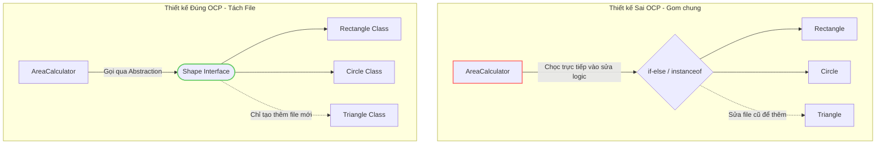

# Open Closed Principle (OCP)

**Một thực thể phần mềm nên được mở để mở rộng nhưng đóng để sửa đổi.**

---

## Ví dụ

Giả sử có lớp `AreaCalculator` để tính diện tích các hình.

### Trường hợp sai

```java
public class AreaCalculator {
    public double calculateTotalArea(Object[] shapes) {
        double totalArea = 0;
        for (Object shape : shapes) {
            if (shape instanceof Rectangle) {...}
            if (shape instanceof Circle) {...}
            // Thêm hình mới phải sửa lớp này!
        }
        return totalArea;
    }
}
```

### Trường hợp đúng

```java
public interface Shape {
    double getArea();
}

public class Rectangle implements Shape {
    private double width, height;
    @Override
    public double getArea() { return width * height; }
}

public class Circle implements Shape {
    private double radius;
    @Override
    public double getArea() { return Math.PI * radius * radius; }
}

public class AreaCalculator {
    public double calculateTotalArea(Shape[] shapes) {
        double totalArea = 0;
        for (Shape shape : shapes) {
            totalArea += shape.getArea();
        }
        return totalArea;
    }
}
```

Ban đầu, nếu muốn thêm `Shape` chúng ta phải sửa lại source trong `AreaCalculator` bằng cách thêm `if-else`.

Bằng cách tạo interface `Shape` với method `getArea()`, các `ConcreteShape` chỉ cần triển khai `Shape` do đó khi thêm bất kỳ hình dạng nào thì miễn là implement của `Shape` thì `AreaCalculator` vẫn chạy mà không gây lỗi.

---

## Tại sao tạo nhiều file sinh ra boilerplate nhưng lại tối ưu hơn?

Mặc dù việc tách nhỏ class tạo ra nhiều file và sinh thêm boilerplate code (như khai báo interface, class triển khai con), nhưng đây là một sự đánh đổi cực kỳ xứng đáng để đổi lấy các giá trị cốt lõi:

1. **Giới hạn vùng ảnh hưởng (Blast Radius):** Nếu có lỗi phát sinh trong lớp mới được thêm vào, nó sẽ hoàn toàn bị cô lập và không làm ảnh hưởng đến các thành phần cũ đang chạy ổn định.
2. **Hạn chế xung đột mã nguồn (Git Conflict):** Nhiều lập trình viên có thể đồng thời thêm các tính năng mới bằng cách tạo các file khác nhau mà không chạm chung vào một file dẫn đến conflict khi merge code.
3. **Tối ưu hóa quy trình kiểm thử (Testing & CI/CD):** Không cần kiểm thử lại (regression test) các module cũ vì mã nguồn của chúng không hề bị tác động hay biên dịch lại.

### Sơ đồ tư duy so sánh thiết kế OCP



### Bảng phân tích chi tiết sự đánh đổi

| Tiêu chí | Gom chung 1 file (Sai OCP) | Chia nhiều file (Đúng OCP) |
| :--- | :--- | :--- |
| **Boilerplate** | Rất ít, viết code nhanh trong ngắn hạn. | Nhiều hơn, cần khai báo `interface` và lớp triển khai con. |
| **Blast Radius** | **Rộng**: Lỗi ở tính năng mới có thể làm hỏng tính năng cũ. | **Hẹp**: Lỗi bị cô lập hoàn toàn trong file mới. |
| **Merge Conflict** | **Cao**: Nhiều lập trình viên cùng sửa chung một file. | **Thấp**: Mỗi người làm việc trên một file độc lập. |
| **Bảo trì lâu dài** | Cực kỳ phức tạp khi số lượng class tăng lên. | Rất dễ bảo trì, dễ thay đổi hoặc gỡ bỏ tính năng cũ. |

---

## Lợi ích

-   Dễ mở rộng, không cần sửa code cũ.
-   Tăng khả năng bảo trì, giảm lỗi.
-   Thiết kế lỏng lẻo, các module ít phụ thuộc nhau.

---
[← Quay lại mục lục SOLID](README.md)
