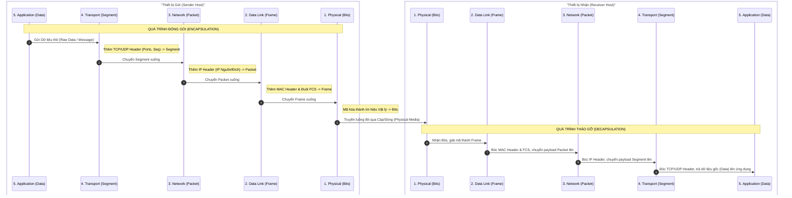

# Bộ Giao thức TCP/IP và So sánh Đối chiếu với OSI

Bộ giao thức **TCP/IP (Transmission Control Protocol/Internet Protocol)** đại diện cho kiến trúc thực tế được áp dụng để xây dựng mạng Internet toàn cầu ngày nay. Khác với mô hình lý thuyết OSI, TCP/IP được hình thành thông qua thực tiễn kỹ nghệ và hướng tới tính tối giản, khả năng chịu lỗi cực cao và hiệu suất truyền tải tối đa.

## Mục lục

*   [1. Kiến trúc Thực tiễn của Bộ Giao thức TCP/IP](#1-kiến-trúc-thực-tiễn-của-bộ-giao-thức-tcpip)
*   [2. Cơ chế Đóng gói và Tháo gỡ Dữ liệu](#2-cơ-chế-đóng-gói-và-tháo-gỡ-dữ-liệu)
*   [3. Phân tích So sánh Kỹ thuật Đối chiếu giữa OSI và TCP/IP](#3-phân-tích-so-sánh-kỹ-thuật-đối-chiếu-giữa-osi-và-tcpip)
*   [4. Đánh giá Thực tiễn và Nghiệp vụ Doanh nghiệp](#4-đánh-giá-thực-tiễn-và-nghiệp-vụ-doanh-nghiệp)
*   [5. Danh sách các Đường dẫn Tham chiếu Kỹ thuật](#5-danh-sách-các-đường-dẫn-tham-chiếu-kỹ-thuật)

---

## 1. Kiến trúc Thực tiễn của Bộ Giao thức TCP/IP

### Lịch sử Phát triển và Triết lý Thiết kế
Mô hình TCP/IP được phát triển thông qua các dự án nghiên cứu của Bộ Quốc phòng Hoa Kỳ (DoD) dành cho mạng ARPANET từ cuối thập niên 1970. Nó không được tạo ra từ một phòng tiêu chuẩn hóa học thuật mà được hình thành song song với quá trình phát triển các giao thức thực tế của Internet toàn cầu.

Mục tiêu ban đầu của hai nhà thiết kế **Vint Cerf** và **Bob Kahn** khi xây dựng TCP/IP là tạo ra một kiến trúc mạng cực kỳ bền bỉ, có khả năng tự động định tuyến lại dòng dữ liệu và duy trì liên lạc ngay cả khi một phần lớn hạ tầng mạng vật lý bị phá hủy hoặc gặp sự cố. 

Triết lý này dẫn đến nguyên lý **"End-to-End Argument" (Lập luận đầu-cuối)**: mạng lõi bên dưới nên được thiết kế càng đơn giản, càng tối giản càng tốt; mọi tác vụ phức tạp liên quan đến việc kiểm soát lỗi, kiểm soát lưu lượng và khôi phục dữ liệu mất mát phải được đẩy về cho các thiết bị đầu cuối xử lý.

### Cấu trúc Bốn Tầng (RFC 1122) so với Năm Tầng Hiện đại
Trong lịch sử tài liệu hóa kỹ thuật mạng, tồn tại hai phiên bản định hình cấu trúc phân tầng của TCP/IP:
*   **Mô hình Bốn Tầng Tiêu chuẩn (RFC 1122)**: Đây là mô hình chính thức được định nghĩa trong tài liệu đặc tả của IETF. Bốn tầng bao gồm: *Application* (Ứng dụng), *Transport/Host-to-Host* (Giao vận), *Internet* (Mạng) và *Link/Network Access* (Liên kết/Truy cập mạng). Trong đó, tầng *Link* gộp chung toàn bộ các đặc tính vật lý và liên kết logic của phần cứng.
*   **Mô hình Năm Tầng Hiện đại (Mô hình Lai)**: Để giúp các kỹ sư dễ dàng liên hệ với mô hình OSI trong thực tế giảng dạy và thiết kế phần cứng, mô hình 5 tầng đã được phát triển bằng cách tách tầng *Link* của mô hình cũ thành hai tầng riêng biệt: Tầng Vật lý (*Physical*) và Tầng Liên kết dữ liệu (*Data Link*).

### Bảng 2: So sánh Cấu trúc Phân tầng giữa TCP/IP (4 tầng & 5 tầng) và OSI

| Tầng OSI | Mô hình TCP/IP 4 Tầng (RFC 1122) | Mô hình TCP/IP 5 Tầng (Mô hình Lai) | Đơn vị Dữ liệu (PDU) | Giao thức Cốt lõi |
| :--- | :--- | :--- | :--- | :--- |
| Layer 7: Application | Tầng 4: Application | Tầng 5: Application | Data / Message | HTTP, FTP, SMTP, DNS, DHCP |
| Layer 6: Presentation | | | | |
| Layer 5: Session | | | | |
| Layer 4: Transport | Tầng 3: Transport | Tầng 4: Transport | Segment (TCP) / Datagram (UDP) | TCP, UDP |
| Layer 3: Network | Tầng 2: Internet | Tầng 3: Network/Internet | IP Datagram / Packet | IP (IPv4/IPv6), ICMP, ARP |
| Layer 2: Data Link | Tầng 1: Network Access | Tầng 2: Data Link | Frame | Ethernet, Wi-Fi |
| Layer 1: Physical | | Tầng 1: Physical | Bit | Đặc tả Cáp đồng, Cáp quang |

---

## 2. Cơ chế Đóng gói và Tháo gỡ Dữ liệu

Khi một ứng dụng gửi thông điệp đi, luồng thông tin sẽ trải qua quá trình đóng gói tuần tự từ trên xuống dưới. 

Tại **Tầng Ứng dụng**, dữ liệu thô của người dùng được tạo ra. Khi chuyển xuống **Tầng Giao vận**, giao thức TCP sẽ bẻ nhỏ dữ liệu này thành các phân đoạn và gắn thêm một tiêu đề chứa thông tin quan trọng như cổng nguồn (*Source Port*), cổng đích (*Destination Port*) và số thứ tự gói tin (*Sequence Number*).

Tại **Tầng Internet**, phân đoạn dữ liệu tiếp tục được đóng gói thành một IP Datagram bằng cách bổ sung tiêu đề IP chứa địa chỉ IP nguồn và IP đích. 

Xuống tới **Tầng Liên kết Dữ liệu**, IP Datagram được bọc lại trong một khung dữ liệu (*Frame*), được bổ sung tiêu đề chứa địa chỉ MAC nguồn, MAC đích và một phần đuôi **FCS (Frame Check Sequence)** để kiểm tra lỗi. Cuối cùng, **Tầng Vật lý** điều thế khung dữ liệu này thành các tín hiệu vật lý để truyền đi qua đường truyền.

Ở thiết bị nhận, quá trình này diễn ra theo chiều ngược lại (tháo gói - *decapsulation*). Mỗi tầng khi nhận được dữ liệu từ tầng dưới sẽ bóc tách phần tiêu đề tương ứng để xử lý và chỉ chuyển phần dữ liệu tải tin (*payload*) tinh khiết lên cho tầng phía trên.

> [!TIP]
> **Tối ưu hóa Phân mảnh (Fragmentation Avoidance)**:
> Để tối ưu hóa quá trình truyền tải mà không làm ảnh hưởng đến độ tin cậy của tầng giao vận, kích thước phân đoạn tối đa (**MSS - Maximum Segment Size**) của TCP được tính toán dựa trên đơn vị truyền tải tối đa (**MTU - Maximum Transmission Unit**) của tầng liên kết dữ liệu theo công thức logic sau:
> $$\text{MSS} = \text{MTU} - \text{Header}_{\text{IP}} - \text{Header}_{\text{TCP}}$$
> Trong điều kiện mạng Ethernet tiêu chuẩn, khi $\text{MTU} = 1500\text{ bytes}$, với tiêu đề IPv4 tiêu chuẩn ($20\text{ bytes}$) và tiêu đề TCP tiêu chuẩn ($20\text{ bytes}$), kích thước tối ưu của một phân đoạn TCP để tránh hiện tượng phân mảnh tại tầng mạng là **$1460\text{ bytes}$**.

### Sơ đồ luồng Đóng gói (Encapsulation) và Tháo gỡ (Decapsulation) Dữ liệu

### Bảng Phân tích Cơ chế PDU trong Quá trình Đóng gói

| Thành phần/Bước | Vai trò/Mô tả | Chi tiết |
| :--- | :--- | :--- |
| **DATA (Application)** | Dữ liệu thô ở Tầng Ứng dụng. | Là thông điệp hoặc payload nguyên bản do tiến trình ứng dụng (như trình duyệt web, email client) tạo ra. |
| **SEGMENT (Transport)** | Phân đoạn dữ liệu ở Tầng Giao vận. | TCP/UDP đính kèm Header chứa thông tin điều phối cổng mạng (**Port**) giúp định vị chính xác tiến trình trên thiết bị nhận. |
| **PACKET (Network)** | Gói tin logic ở Tầng Mạng. | IP đính kèm Header chứa thông tin định tuyến logic toàn cầu (**IP Nguồn và IP Đích**) để gói tin có thể đi xuyên qua các mạng khác nhau. |
| **FRAME (Data Link)** | Khung dữ liệu vật lý ở Tầng Liên kết dữ liệu. | Giao thức đính kèm Header chứa địa chỉ vật lý (**MAC Nguồn và MAC Đích**) và phần đuôi kiểm tra lỗi **FCS** để trung chuyển dữ liệu an toàn trong cùng một mạng LAN. |
| **BITS (Physical)** | Luồng nhị phân ở Tầng Vật lý. | Chuyển đổi toàn bộ Frame thành các xung điện, tín hiệu quang hoặc sóng điện từ để truyền đi trực tiếp trên môi trường cáp đồng, cáp quang hoặc không dây. |

---

## 3. Phân tích So sánh Kỹ thuật Đối chiếu giữa OSI và TCP/IP

Để hiểu rõ sự khác biệt bản chất giữa hai mô hình này, việc phân tích các thuộc tính kiến trúc đóng vai trò cực kỳ quan trọng.

### Bảng 3: So sánh Đối chiếu Đặc tính Kỹ thuật giữa OSI và TCP/IP

| Đặc tính Kỹ thuật | Mô hình Tham chiếu OSI | Bộ Giao thức TCP/IP |
| :--- | :--- | :--- |
| **Số lượng Tầng** | 7 Tầng | 4 hoặc 5 Tầng |
| **Phân tách Phiên & Trình diễn** | Có tầng Session (Layer 5) và Presentation (Layer 6) độc lập. | Không có; toàn bộ chức năng được tích hợp vào tầng Application. |
| **Tính Độc lập Giao thức** | Độc lập hoàn toàn (Protocol-agnostic); được thiết kế trước giao thức. | Phụ thuộc vào giao thức (Protocol-dependent); được xây dựng dựa trên giao thức thực tế. |
| **Cơ chế Độ Tin cậy** | Phân bổ đa tầng (Layer 2, 3 và 4). | Tập trung chủ yếu tại tầng Giao vận (Layer 4) qua TCP. |
| **Dịch vụ Tầng Mạng** | Hỗ trợ cả không hướng kết nối (CLNS) và hướng kết nối (CONS). | Chỉ hỗ trợ dịch vụ không hướng kết nối (giao thức IP). |
| **Tiêu chí Định tuyến** | Sử dụng địa chỉ NSAP (Network Service Access Point). | Sử dụng địa chỉ logic IP (IPv4/IPv6). |

### Ánh xạ Hệ thống Phân tầng và Tích hợp Chức năng
Một trong những khác biệt kỹ thuật lớn nhất nằm ở cách phân chia ranh giới chức năng của các tầng trên. Mô hình OSI duy trì sự tách biệt nghiêm ngặt giữa tầng phiên, tầng trình diễn và tầng ứng dụng. Điều này đảm bảo tính độc lập tối đa của dữ liệu và khả năng quản lý kết nối phức tạp, tuy nhiên nó lại tạo ra một độ trễ xử lý (*processing overhead*) đáng kể do dữ liệu phải đi qua nhiều tầng đệm của hệ điều hành.

Ngược lại, TCP/IP tích hợp toàn bộ chức năng của ba tầng trên cùng này vào một tầng duy nhất: **Tầng Ứng dụng**. Sự hợp nhất này mang lại những ưu thế kỹ thuật vượt trội bao gồm tối ưu hóa hiệu năng bằng việc loại bỏ các tầng trung gian giúp giảm số lượng lời gọi hàm hệ thống (*system calls*) và các thao tác sao chép dữ liệu trong bộ nhớ của nhân hệ điều hành. Đồng thời, thiết kế này trao quyền chủ động cho ứng dụng, cho phép các nhà phát triển phần mềm tự thiết kế cơ chế mã hóa, nén hoặc duy trì phiên kết nối phù hợp nhất với đặc thù của ứng dụng (ví dụ: HTTP tự quản lý trạng thái phiên thông qua Cookies/Sessions).

### Tính độc lập Giao thức và Khả năng Tương thích
Mô hình OSI được thiết kế theo cách tiếp cận độc lập hoàn toàn với giao thức (*protocol-agnostic*). Nó định nghĩa ra các "vị trí" và "tiêu chuẩn chức năng" trước, sau đó mới phát triển các giao thức để lấp đầy các vị trí đó. Cách tiếp cận này giúp OSI có tính tổng quát cực cao và có thể áp dụng cho bất kỳ hệ thống truyền thông nào (kể cả mạng phi IP).

Ngược lại, mô hình TCP/IP được thiết kế theo hướng hướng giao thức (*protocol-oriented*). Mô hình này ra đời sau khi các giao thức thực tế (như TCP và IP) đã được chuẩn hóa và hoạt động ổn định. Do đó, các tầng của TCP/IP phản ánh trực tiếp cấu trúc hoạt động của các giao thức cụ thể này.

### So sánh Dịch vụ Hướng kết nối và Không hướng kết nối
Mô hình OSI hỗ trợ cả dịch vụ hướng kết nối (CONS) và không hướng kết nối (CLNS) ở ngay tầng mạng (Layer 3). Điều này cho phép các thiết bị định tuyến trong mạng OSI có thể thiết lập các mạch ảo vật lý để đảm bảo băng thông và thứ tự gói tin cho từng luồng dữ liệu cụ thể.

Đối với TCP/IP, tầng Internet (Layer 3) được thiết kế để chỉ chạy duy nhất một mô hình không hướng kết nối (giao thức IP). Mọi gói tin IP đều được xử lý và định tuyến một cách độc lập thông qua cơ chế "best-effort". Mọi yêu cầu về độ tin cậy, thứ tự truyền nhận và khôi phục lỗi được đẩy hoàn toàn lên tầng giao vận (Layer 4) xử lý thông qua giao thức TCP. Sự đơn giản hóa này ở tầng mạng là nhân tố quyết định giúp Internet có khả năng mở rộng (*scale*) lên quy mô toàn cầu với hàng tỷ thiết bị kết nối mà các thiết bị định tuyến trung gian không bị quá tải bộ nhớ do phải duy trì trạng thái kết nối của hàng triệu phiên đồng thời.

---

## 4. Đánh giá Thực tiễn và Nghiệp vụ Doanh nghiệp

### Lịch sử Cuộc chiến Giao thức (Protocol Wars)
Giai đoạn từ những năm 1970 đến đầu thập niên 1990 chứng kiến sự phân cực sâu sắc trong giới công nghệ toàn cầu, thường được gọi là **"Cuộc chiến Giao thức" (Protocol Wars)**. Mô hình OSI nhận được sự hậu thuẫn chính trị mạnh mẽ từ Liên minh Viễn thông Quốc tế (ITU), các chính phủ châu Âu và Bộ Thương mại Hoa Kỳ, những đơn vị đã ra sắc lệnh yêu cầu mọi hệ thống mua sắm công của chính phủ phải tuân thủ chuẩn OSI.

Tuy nhiên, đến giữa thập niên 1990, TCP/IP đã giành chiến thắng hoàn toàn và trở thành tiêu chuẩn *de facto* duy nhất của Internet toàn cầu. Sự phổ biến nhanh chóng của Unix trong các môi trường học thuật, kết hợp với tính chất mở của cộng đồng phát triển IETF, đã đẩy nhanh tốc độ triển khai thực tế của TCP/IP vượt xa tiến độ thảo luận mang tính hành chính của các ủy ban ISO.

### Bốn Nguyên nhân Thất bại của OSI theo Andrew Tanenbaum
Nhà khoa học máy tính lỗi lạc **Andrew Tanenbaum** đã đúc rút sự thất bại của bộ tiêu chuẩn OSI qua bốn nguyên nhân kinh điển:
1.  **Thời điểm tồi (Bad Timing)**: OSI được hoàn thiện quá muộn. Khi ủy ban tiêu chuẩn của OSI vẫn đang tranh cãi về các đặc tả kỹ thuật phức tạp, các trường đại học và cơ quan chính phủ Mỹ đã đổ hàng triệu USD để xây dựng hạ tầng thực tế chạy trên TCP/IP, tạo ra một hiệu ứng khóa công nghệ (*lock-in*) cực kỳ mạnh mẽ do sự phụ thuộc lối mòn (*path dependency*).
2.  **Công nghệ tồi (Bad Technology)**: Thiết kế phân tầng của OSI bị đánh giá là mất cân bằng. Trong khi hai tầng Session và Presentation gần như trống rỗng về mặt chức năng thực tế, tầng Data Link lại bị nhồi nhét quá nhiều trách nhiệm phức tạp dẫn đến sự trùng lặp cơ chế kiểm soát lỗi với tầng giao vận.
3.  **Triển khai tồi (Bad Implementations)**: Những phiên bản phần mềm đầu tiên chạy trên giao thức OSI cực kỳ cồng kềnh, ngốn tài nguyên và đầy lỗi (*buggy*), khiến cụm từ "chuẩn OSI" thời kỳ đó bị đánh giá đồng nghĩa với chất lượng kém. Ngược lại, bộ mã nguồn TCP/IP được tích hợp miễn phí và tối ưu hóa cực tốt bên trong hệ điều hành Unix, giúp nó nhanh chóng chiếm lĩnh thị trường.
4.  **Chính trị tồi (Bad Politics)**: TCP/IP được phát triển bởi giới kỹ sư, nhà khoa học theo triết lý nguồn mở, tự do và linh hoạt, trong khi OSI bị coi là sản phẩm của các ủy ban hành chính hóa, quan liêu của các tập đoàn độc quyền viễn thông châu Âu.

### Tác động Tài chính và Vận hành (CAPEX và OPEX)
Dưới góc độ quản trị doanh nghiệp, việc áp dụng nguyên lý đơn giản hóa của TCP/IP mang lại những lợi ích kinh tế to lớn liên quan đến chi phí đầu tư ban đầu (**CAPEX**) và chi phí vận hành (**OPEX**). 

Sự gia tăng số lượng các tầng trung gian trong mô hình OSI không chỉ làm tăng độ trễ tính toán mà còn làm trầm trọng thêm các phụ thuộc chéo giữa các tầng. Mỗi khi một tầng được cập nhật hoặc thay đổi thuật toán, các nhà phát triển phải tối ưu hóa lại các giao thức ở các tầng liền kề để tránh hiện tượng suy giảm hiệu năng đột ngột. Điều này đẩy chi phí nghiên cứu và vận hành hệ thống lên rất cao.

Sự tinh gọn của TCP/IP giúp đơn giản hóa kiến trúc phần cứng của các thiết bị chuyển mạch và định tuyến, giảm thiểu năng lượng tiêu thụ, rút ngắn thời gian phát triển sản phẩm của các nhà sản xuất thiết bị gốc (OEMs) và giảm bớt gánh nặng quản trị cho các kỹ sư hệ thống trong doanh nghiệp.

### Phương pháp xử lý Sự cố Hệ thống (Troubleshooting)
Mặc dù TCP/IP thống trị tuyệt đối về mặt kỹ thuật, mô hình OSI vẫn giữ nguyên giá trị cốt lõi của nó như một "ngôn ngữ chung" trong hoạt động đào tạo, thiết kế hệ thống và chẩn đoán sự cố mạng của doanh nghiệp. Khi tiến hành chẩn đoán một lỗi kết nối phức tạp trong hạ tầng doanh nghiệp, việc tư duy theo mô hình OSI giúp cô lập nguyên nhân gốc rễ một cách khoa học theo hai phương pháp tiếp cận:

*   **Phương pháp Bottom-Up (Từ dưới lên)**: Bắt đầu kiểm tra từ Tầng Vật lý (như cắm lại cáp, kiểm tra đèn cổng switch) $\rightarrow$ Tầng Liên kết dữ liệu (kiểm tra địa chỉ MAC, cấu hình VLAN) $\rightarrow$ Tầng Mạng (kiểm tra ping IP, định tuyến) $\rightarrow$ lên dần các tầng ứng dụng. Đây là phương pháp tối ưu nhất để xử lý các sự cố mất kết nối hoàn toàn.
*   **Phương pháp Top-Down (Từ trên xuống)**: Kiểm tra từ Tầng Ứng dụng (xem dịch vụ web có chạy không, DNS có phân giải đúng không) $\rightarrow$ đi xuống dưới. Phù hợp cho các sự cố liên quan đến lỗi phần mềm ứng dụng khi đường truyền mạng cơ bản vẫn thông suốt.

Việc phân khúc rạch ròi 7 tầng giúp đội ngũ kỹ thuật của doanh nghiệp tránh được việc chẩn đoán mò mẫm, rút ngắn thời gian khắc phục sự cố (**MTTR - Mean Time to Repair**), từ đó giảm thiểu thiệt hại tài chính do thời gian ngừng hoạt động (*downtime*) gây ra.

### Ứng dụng An ninh Mạng Đa tầng trong Thực tế Doanh nghiệp
Trong kỷ nguyên điện toán đám mây và an ninh mạng hiện đại, mô hình OSI cung cấp một khung tham chiếu vô giá để thiết kế chiến lược phòng thủ chiều sâu (*Defense in Depth*) và phân loại các giải pháp bảo mật của doanh nghiệp.

### Bảng 4: Bản đồ An ninh Mạng và Quản lý Rủi ro Đa tầng

| Tầng Hệ thống (OSI) | Mối đe dọa & Loại hình Tấn công | Giải pháp & Công nghệ Phòng thủ Doanh nghiệp |
| :--- | :--- | :--- |
| **Layer 7: Application** | Tấn công lạm dụng API, SQL Injection, Cross-Site Scripting (XSS), HTTP Flood, DNS Spoofing. | Tường lửa Ứng dụng Web (**WAF**), Cloudflare Gateway, kiểm tra DNS bảo mật, xác thực người dùng (**Zero Trust**). |
| **Layer 4: Transport** | SYN Flood, UDP Amplification, quét cổng (Port Scanning). | Giới hạn tốc độ kết nối (*Rate Limiting*), Tường lửa Mạng (*Network Firewall*) lọc dựa trên Port/Protocol. |
| **Layer 3: Network** | IP Spoofing, tấn công định tuyến, ICMP Flooding. | Tường lửa lọc IP nguồn/đích, cấu hình định tuyến tĩnh an toàn, dịch vụ chống DDoS quy mô lớn. |
| **Layer 2: Data Link** | MAC Flooding, ARP Spoofing, VLAN Hopping. | Kích hoạt tính năng DHCP Snooping, Dynamic ARP Inspection (**DAI**), bảo mật cổng (*Port Security*) trên Switch. |
| **Layer 1: Physical** | Cắt trộm cáp, nghe lén tín hiệu quang, phá hoại thiết bị vật lý. | Bảo vệ phòng máy chủ nghiêm ngặt, mã hóa dữ liệu đường truyền vật lý, thiết lập đường truyền chuyên dụng. |

---

## 5. Danh sách các Đường dẫn Tham chiếu Kỹ thuật

*   [Cloudflare Learning - Giáo trình Kiến thức Tổng quan về Mô hình OSI](https://www.cloudflare.com/learning/ddos/glossary/open-systems-interconnection-model-osi/)
*   [Cloudflare Learning - Phân tích Chức năng Tầng Mạng (Layer 3)](https://www.cloudflare.com/learning/network-layer/what-is-the-network-layer/)
*   [Cloudflare Learning - Định nghĩa và Cơ chế Tầng Ứng dụng (Layer 7)](https://www.cloudflare.com/learning/ddos/what-is-layer-7/)
*   [Cloudflare Fundamentals - Bản đồ Sản phẩm và Phân tầng Mạng Hệ thống](https://developers.cloudflare.com/fundamentals/reference/network-layers/)
*   [Cisco Systems - Tài liệu Đào tạo Bộ Giao thức TCP/IP và Mô hình Internet](https://www.cisco.com/E-Learning/bulk/public/tac/cim/cib/using_cisco_ios_software/linked/tcpip.htm)
*   [IETF RFC 1122 - Tài liệu Đặc tả Yêu cầu đối với Máy chủ Internet](https://datatracker.ietf.org/doc/html/rfc1122)
*   [GeeksforGeeks - Phân tích và So sánh Chi tiết giữa OSI và TCP/IP](https://www.geeksforgeeks.org/computer-networks/difference-between-osi-model-and-tcp-ip-model/)
*   [Check Point Software - So sánh Kiến trúc Hệ thống OSI và TCP/IP dưới góc độ Bảo mật](https://www.checkpoint.com/cyber-hub/network-security/what-is-the-osi-model-understanding-the-7-layers/osi-model-vs-tcp-ip-model/)

---
*   [← Quay lại: Mô hình Tham chiếu OSI 7 Tầng](./osi_7_layers.md)
*   [← Quay lại mục lục](../README.md)
