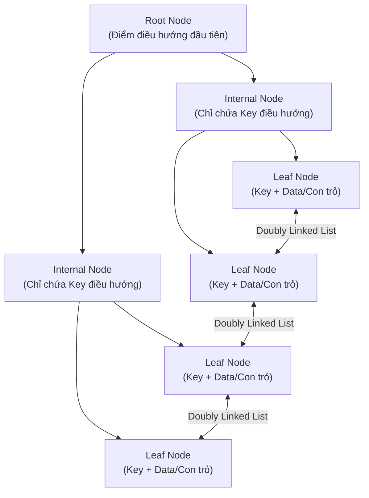
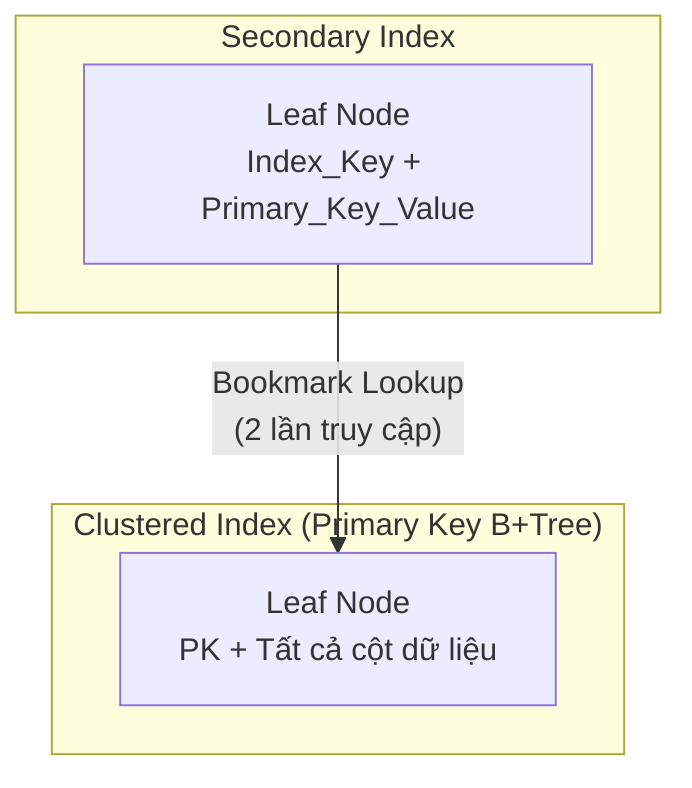

# Chương 2. Index Internals & Covering Index

Chương này phân tích cấu trúc B+Tree, sự khác biệt giữa Clustered Index và Secondary Index trong PostgreSQL và MySQL InnoDB, cùng kỹ thuật Covering Index (Index-Only Scan) để tối ưu hiệu năng truy vấn.

## Mục lục

-   [2.1 Cấu trúc dữ liệu B+Tree trong CSDL](#21-cấu-trúc-dữ-liệu-btree-trong-csdl)
-   [2.2 Clustered Index vs Secondary Index](#22-clustered-index-vs-secondary-index)
-   [2.3 Covering Index & Index-Only Scan](#23-covering-index--index-only-scan)

---

## 2.1 Cấu trúc dữ liệu B+Tree trong CSDL

Hầu hết các CSDL quan hệ sử dụng **B+Tree** làm cấu trúc chỉ mục tiêu chuẩn. Cấu trúc B+Tree gồm 3 tầng:



| Thành phần | Vai trò/Mô tả |
| :--- | :--- |
| **Root Node** | Điểm điều hướng đầu tiên của mọi truy vấn. |
| **Internal Nodes** | Chỉ chứa Key và con trỏ điều hướng tới cấp tiếp theo — không chứa Data. |
| **Leaf Nodes** | Chứa Key và dữ liệu thực tế (hoặc con trỏ tới dữ liệu). Nối nhau bằng **Doubly Linked List** — giúp Range Scan cực kỳ hiệu quả. |

---

## 2.2 Clustered Index vs Secondary Index

### Trong MySQL InnoDB

Bảng chính **chính là Clustered Index** — toàn bộ dữ liệu được sắp xếp và lưu trữ trong B+Tree theo thứ tự Primary Key.



| Thành phần | Mô tả |
| :--- | :--- |
| **Clustered Index** | Leaf Node chứa **toàn bộ dữ liệu** của tất cả các cột trong dòng. |
| **Secondary Index** | Leaf Node chỉ chứa `(Index_Key, Primary_Key_Value)`. |
| **Bookmark Lookup** | Khi truy vấn bằng Secondary Index, MySQL phải tìm `Primary_Key` trên Secondary Index, rồi tra lần 2 trên Clustered Index để lấy các cột còn lại. |

### Trong PostgreSQL

Dữ liệu nằm ở **bảng Heap độc lập**. Tất cả Index (chính hay phụ) đều có vai trò kỹ thuật ngang nhau.

*   Leaf Node của Index trong Postgres chứa `(Index_Key, ctid)`.
*   `ctid` chỉ thẳng tới vị trí `(Block_Number, Offset)` trong Heap Table.
*   **Điểm yếu:** Khi tuple đổi vị trí (do UPDATE tạo tuple mới), `ctid` thay đổi → Postgres buộc phải cập nhật `ctid` mới lên **tất cả** Secondary Index của bảng đó.

### Bảng So sánh

| Tiêu chí | MySQL InnoDB | PostgreSQL |
| :--- | :--- | :--- |
| **Cấu trúc lưu trữ chính** | Clustered Index (B+Tree) | Heap Table (độc lập) |
| **Leaf Node của Primary Index** | Chứa full row data | Chứa `(Index_Key, ctid)` |
| **Leaf Node của Secondary Index** | Chứa `(Index_Key, Primary_Key)` | Chứa `(Index_Key, ctid)` |
| **UPDATE ảnh hưởng Secondary Index** | Chỉ khi Primary Key thay đổi | Luôn phải cập nhật `ctid` (trừ khi đạt HOT) |

---

## 2.3 Covering Index & Index-Only Scan

**Covering Index** là trạng thái tối ưu tuyệt đối của truy vấn: CSDL lấy được **toàn bộ dữ liệu cần thiết ngay tại Leaf Node của Index** mà không phải tốn Disk I/O để nhảy về bảng chính (Heap Scan hoặc Clustered Index Lookup).

### Công thức kích hoạt Covering Index

Tất cả cột mà truy vấn cần phải **nằm hoàn toàn bên trong** tập hợp các cột của Index:

```text
SELECT_columns ∪ WHERE_columns ∪ ORDER_BY_columns ∪ GROUP_BY_columns ⊆ Index_columns
```

### Triển khai trên PostgreSQL — Từ khóa `INCLUDE`

Từ Postgres 11, từ khóa `INCLUDE` cho phép tách biệt rõ ràng giữa **Key dùng để tìm kiếm** và **Payload mang theo**:

```sql
CREATE INDEX idx_orders_user ON orders(user_id)
INCLUDE (status, total_amount);
```

*   `user_id`: Nằm ở các nút B+Tree, dùng để định vị nhanh.
*   `status`, `total_amount`: Chỉ nằm ở Leaf Node làm payload, không tốn tài nguyên so sánh/sắp xếp B+Tree.

> [!IMPORTANT]
> Để kích hoạt **Index-Only Scan**, Postgres bắt buộc phải kiểm tra **Visibility Map (VM)**. Nếu VM xác nhận Data Page là `ALL-VISIBLE` (tất cả tuple đã committed, không có dead tuple), Postgres mới bỏ qua Heap Page. Nếu chưa `ALL-VISIBLE`, Postgres vẫn phải đọc Heap Page để kiểm tra `xmin`/`xmax`.

### Triển khai trên MySQL — Composite Index

MySQL không có từ khóa `INCLUDE`. Thay vào đó, ta tạo **Composite Index** chứa tất cả các cột cần thiết:

```sql
CREATE INDEX idx_orders_user_status_total
ON orders(user_id, status, total_amount);
```

Khi chạy `EXPLAIN`, cột `Extra` xuất hiện từ khóa **`Using index`** — xác nhận MySQL đã loại bỏ được bước Bookmark Lookup về Clustered Index.

---
[← Quay lại mục lục](README.md)
