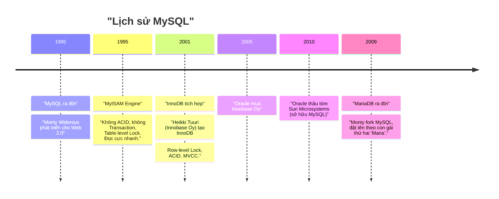
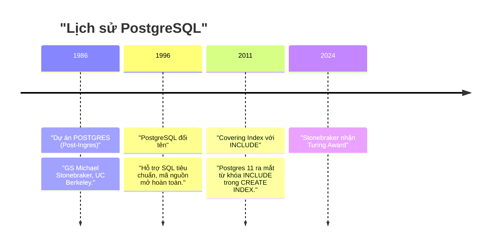

# Chương 3. Bối cảnh Lịch sử: MySQL & PostgreSQL

Chương này trình bày nguồn gốc, triết lý thiết kế và các quyết định kỹ thuật kinh điển đã định hình MySQL và PostgreSQL — hai CSDL quan hệ phổ biến nhất thế giới.

## Mục lục

- [3.1 MySQL: Triết lý "Nhanh trước, Chuẩn sau"](#31-mysql-triết-lý-nhanh-trước-chuẩn-sau)
- [3.2 PostgreSQL: Di sản học thuật Berkeley](#32-postgresql-di-sản-học-thuật-berkeley)
- [3.3 So sánh Triết lý Thiết kế](#33-so-sánh-triết-lý-thiết-kế)

---

## 3.1 MySQL: Triết lý "Nhanh trước, Chuẩn sau"

### Bối cảnh ra đời (1995)

Michael **"Monty" Widenius** phát triển MySQL nhằm phục vụ các ứng dụng Web 2.0 sơ khai. Bối cảnh phần cứng thời kỳ đó có CPU và RAM vô cùng đắt đỏ — các website cần một CSDL đọc cực nhanh cho các câu lệnh `SELECT`.

### Thiết kế MyISAM ban đầu

MyISAM không có Transaction, không Foreign Key, không MVCC, dùng Table-level Locking. Điểm mạnh duy nhất: **đọc cực kỳ nhanh** và cực ít tốn RAM — phù hợp hoàn hảo với workload Blog/CMS thời đó.

### Cú hích InnoDB

Khi các ứng dụng tài chính và TMĐT yêu cầu tính toàn vẹn dữ liệu (ACID), **Heikki Tuuri** (người Phần Lan) tạo ra Storage Engine InnoDB. Khác với MyISAM, InnoDB được thiết kế chuẩn chỉnh với:
- Row-level Locking
- Clustered Index
- Undo Log MVCC

### Sự ra đời của MariaDB

Do lo ngại Oracle sẽ độc quyền hóa hoặc thu phí MySQL, Monty Widenius đã tách (fork) mã nguồn MySQL tạo ra **MariaDB**. Tên gọi `My` là con gái đầu, `Maria` là con gái thứ hai của ông.

---

## 3.2 PostgreSQL: Di sản học thuật Berkeley

### Bối cảnh ra đời (1986)

Dự án **POSTGRES** (Post-Ingres) do Giáo sư **Michael Stonebraker** khởi xướng tại Đại học California, Berkeley. Stonebraker sau này nhận giải thưởng **Turing Award** (tương đương Nobel ngành Tin học).

### Triết lý "Never Overwrite"

Stonebraker tin rằng bộ nhớ máy tính trong tương lai sẽ đủ lớn và **không bao giờ nên ghi đè lên dữ liệu cũ**. Việc giữ lại phiên bản cũ ngay trong Heap Table sẽ giúp CSDL:
- Hỗ trợ các truy vấn phân tích lịch sử (Time-travel queries).
- Phục hồi sự cố (Crash Recovery) nhanh hơn mà không cần đọc lại log phức tạp.

### Hệ quả kiến trúc

Mô hình Append-Only của Postgres là một **kiệt tác về mặt lý thuyết học thuật** và khả năng mở rộng kiểu dữ liệu (Extensibility), nhưng lại gánh chịu điểm yếu tự nhiên về **phình bảng (Bloat)** khi đối mặt với các bài toán cập nhật dữ liệu tần suất cao trong thời đại Internet hiện đại.

---

## 3.3 So sánh Triết lý Thiết kế

| Tiêu chí | MySQL (InnoDB) | PostgreSQL |
| :--- | :--- | :--- |
| **Triết lý** | "Nhanh trước, Chuẩn sau" | "Correctness & Extensibility First" |
| **Nguồn gốc** | Thương mại → Open Source | Học thuật (UC Berkeley) → Open Source |
| **Cơ chế UPDATE** | In-place trên Clustered Index | Append-Only vào Heap |
| **Điểm mạnh** | Hiệu năng Write-heavy, ít bloat | Kiểu dữ liệu phong phú, Extensibility, ACID nghiêm ngặt |
| **Điểm yếu** | Ít linh hoạt về kiểu dữ liệu | Table Bloat dưới tải Update nặng |
| **Dọn rác** | Purge Threads (Undo Log, bảng không bloat) | AUTOVACUUM (Heap, I/O cao) |

---
[← Quay lại mục lục](README.md)
