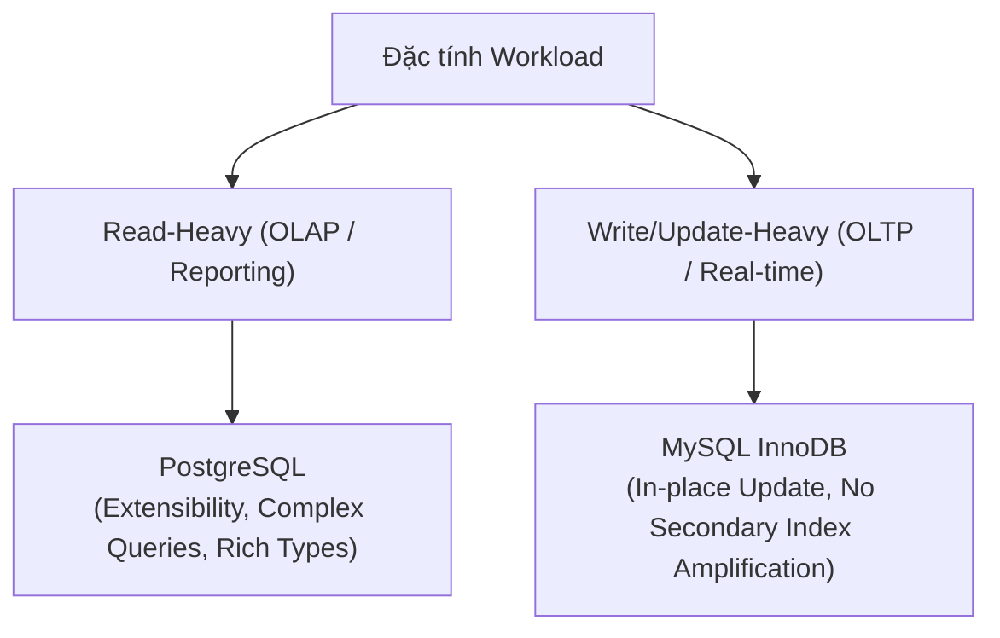
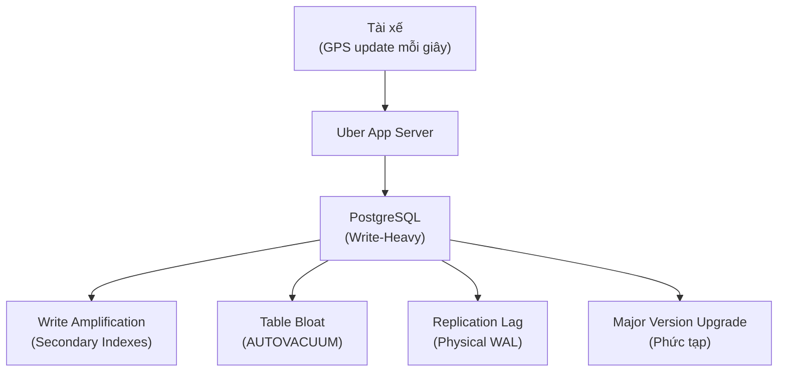
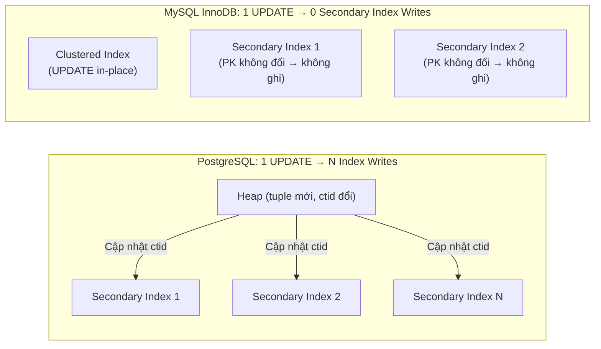

# Chương 3. Workload Use Cases & Architecture Trade-offs

Chương này phân tích các bài toán thực tế (Use Cases), khung lựa chọn kiến trúc dựa trên đặc tính Workload và đi sâu vào Case Study kinh điển: Uber Migration từ PostgreSQL sang MySQL năm 2016.

## Mục lục

- [3.1 Phân loại Workload: Read-Heavy vs Write-Heavy](#31-phân-loại-workload-read-heavy-vs-write-heavy)
- [3.2 Case Study: Uber Migration từ PostgreSQL sang MySQL](#32-case-study-uber-migration-từ-postgresql-sang-mysql)
- [3.3 Khung Quyết định Kiến trúc (Decision Framework)](#33-khung-quyết-định-kiến-trúc-decision-framework)

---

## 3.1 Phân loại Workload: Read-Heavy vs Write-Heavy

Mỗi ứng dụng có mẫu truy cập dữ liệu (Traffic Pattern) khác nhau. Việc hiểu rõ đặc tính Workload là yếu tố quyết định lựa chọn Storage Engine và hệ CSDL phù hợp.



| Loại Workload          | Đặc điểm chính                                                                              | CSDL khuyến nghị | Lý do kiến trúc                                                                          |
| :--------------------- | :------------------------------------------------------------------------------------------ | :--------------- | :--------------------------------------------------------------------------------------- |
| **Read-Heavy**         | Tần suất `SELECT` cao, nhiều truy vấn phức tạp (JOIN, Aggregation), kiểu dữ liệu đa dạng.   | **PostgreSQL**   | Heap Table + Index đa dạng hỗ trợ truy vấn phức tạp; Optimizer mạnh mẽ.                  |
| **Write/Update-Heavy** | Tần suất `UPDATE`/`INSERT` liên tục từng giây (GPS tracking, Sensor data, E-commerce cart). | **MySQL InnoDB** | In-place update trên Clustered Index không gây Write Amplification trên Secondary Index. |

---

## 3.2 Case Study: Uber Migration từ PostgreSQL sang MySQL

Năm 2016, nhóm kỹ sư Uber Engineering đăng tải bài viết gây rúng động cộng đồng công nghệ: **"Why Uber Engineering Switched from Postgres to MySQL"**.

### Bối cảnh bài toán của Uber

Dịch vụ Uber xử lý vị trí GPS của hàng triệu tài xế và hành khách. Vị trí di chuyển được **cập nhật liên tục từng giây**. Bảng dữ liệu chính có hàng chục Secondary Index để phục vụ tìm kiếm chuyến đi, tài xế khu vực.



### Bốn nguyên nhân kỹ thuật cốt lõi

#### 1. Write Amplification trên Secondary Index

- **Trong PostgreSQL:** Khi tọa độ tài xế thay đổi, tuple mới được ghi vào Heap Page làm `ctid` thay đổi. Postgres bắt buộc phải cập nhật `ctid` mới này lên **TẤT CẢ** Secondary Index của bảng — gây ra hiện tượng khuếch đại ghi (Write Amplification) gấp hàng chục lần, đè bẹp hệ thống Disk I/O.
- **Trong MySQL InnoDB:** Tọa độ `UPDATE` in-place trực tiếp trên Clustered Index. Vì Primary Key không đổi, các Secondary Index chứa Logical Pointer (Primary Key) **hoàn toàn không bị ảnh hưởng hay phải ghi lại**.



#### 2. Table Bloat & AUTOVACUUM Nghẽn I/O

Tần suất `UPDATE` khủng khiếp tạo ra hàng triệu **Dead Tuples** mỗi phút trong PostgreSQL Heap Pages. Tiến trình `AUTOVACUUM` phải hoạt động liên tục để quét dọn, tạo ra vòng lặp nghẽn I/O:

```text
UPDATE liên tục → Dead Tuples tăng
  → AUTOVACUUM quét Heap → Disk I/O bùng nổ
  → Latency tăng vọt → Hệ thống suy giảm hiệu năng
```

Trong MySQL InnoDB, bảng chính không bị phình dung lượng vì dữ liệu cũ được ghi đè in-place và đẩy sang Undo Log độc lập cho Purge Threads dọn dẹp ngầm.

#### 3. Physical Replication vs Logical Replication

PostgreSQL (thời điểm 2016) chủ yếu dùng **Physical WAL Replication** (sao chép cấp độ Byte đĩa). Khi Master bị Bloat, toàn bộ lượng dữ liệu phình bị đẩy qua mạng sang các Read Replicas, gây **Replication Lag** nghiêm trọng. MySQL sử dụng **Logical Row-Based Replication** gọn nhẹ hơn nhiều.

#### 4. Major Version Upgrade Downtime

Việc nâng cấp phiên bản lớn (Major Version Upgrade) trên PostgreSQL yêu cầu chuyển đổi cấu trúc dữ liệu đĩa, đòi hỏi Downtime kéo dài hoặc hạ tầng phụ trợ phức tạp, trong khi MySQL hỗ trợ nâng cấp mượt mà hơn cho các cụm CSDL phân tán.

---

## 3.3 Khung Quyết định Kiến trúc (Decision Framework)

Không có CSDL nào "tốt hơn" tuyệt đối. Quyết định lựa chọn phụ thuộc hoàn toàn vào bài toán nghiệp vụ cụ thể.

| Tiêu chí Đánh giá             | Chọn PostgreSQL khi...                                                | Chọn MySQL InnoDB when...                                            |
| :---------------------------- | :-------------------------------------------------------------------- | :------------------------------------------------------------------- |
| **Tính toàn vẹn & Chuẩn hóa** | Cần tuân thủ chuẩn SQL nghiêm ngặt, ràng buộc dữ liệu phức tạp.       | Ưu tiên tốc độ xử lý OLTP đơn giản, quy mô lớn.                      |
| **Tần suất UPDATE/DELETE**    | Thao tác Ghi vừa phải, hoặc chủ yếu là `INSERT` (Append-Only).        | Thao tác `UPDATE` với tần suất cực cao trên các bảng có nhiều Index. |
| **Mở rộng Kiểu dữ liệu**      | Cần hỗ trợ JSONB, PostGIS (bản đồ/địa lý), Vector Search (AI), Array. | Chủ yếu sử dụng các kiểu dữ liệu quan hệ truyền thống.               |
| **Cộng đồng & Hệ sinh thái**  | Cần các extension mạnh mẽ (TimescaleDB, Citus, pgvector).             | Cần giải pháp phân tán sẵn có (MySQL InnoDB Cluster, Galera).        |

> [!NOTE]
> Bài viết của Uber đã thúc đẩy cộng đồng PostgreSQL cải tiến mạnh mẽ trong các phiên bản sau (Postgres 10+ hỗ trợ Logical Replication, Postgres 11+ tối ưu Covering Index và HOT, Postgres 14+ nâng cấp đáng kể hiệu năng AUTOVACUUM).

---

[← Quay lại mục lục](README.md)
