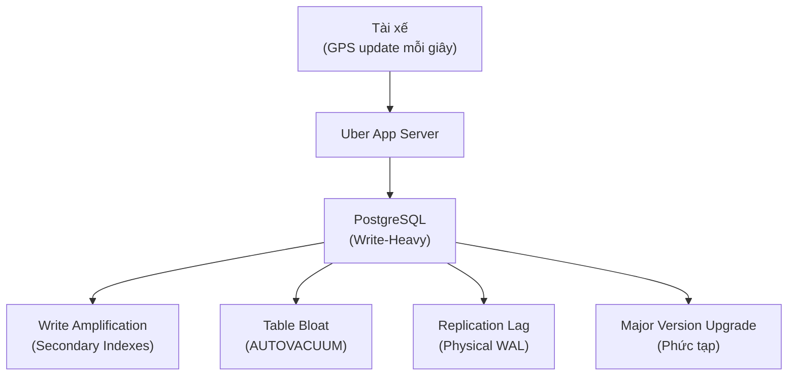
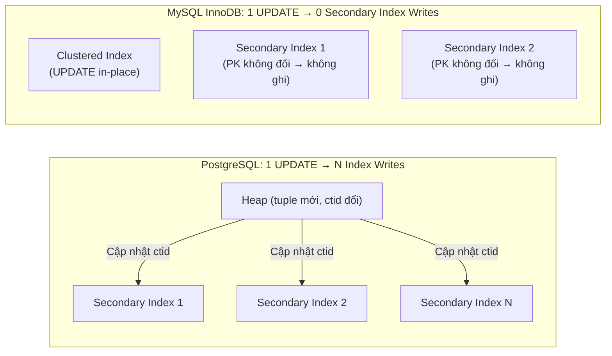

# Chương 4. Case Study: Uber Migration từ PostgreSQL sang MySQL (2016)

Chương này phân tích chi tiết quyết định kỹ thuật gây tranh cãi nhất trong cộng đồng CSDL năm 2016: Uber Engineering từ bỏ PostgreSQL để chuyển sang MySQL InnoDB — một ví dụ điển hình về việc bối cảnh nghiệp vụ va chạm với kiến trúc cốt lõi của CSDL.

## Mục lục

- [4.1 Bối cảnh nghiệp vụ của Uber](#41-bối-cảnh-nghiệp-vụ-của-uber)
- [4.2 Bốn lý do kỹ thuật chính](#42-bốn-lý-do-kỹ-thuật-chính)
- [4.3 Bài học kiến trúc rút ra](#43-bài-học-kiến-trúc-rút-ra)

---

## 4.1 Bối cảnh nghiệp vụ của Uber

Năm 2016, nhóm kỹ sư Uber đăng tải bài viết gây rúng động cộng đồng công nghệ: **"Why Uber Engineering Switched from Postgres to MySQL"**.

Dịch vụ Uber xử lý vị trí GPS của hàng triệu tài xế và hành khách. Vị trí di chuyển được **cập nhật liên tục từng giây**. Bài toán mang đặc tính **Write-Heavy / Update-Heavy cực độ** — hoàn toàn trái ngược với bài toán đọc mà PostgreSQL được tối ưu học thuật.



---

## 4.2 Bốn lý do kỹ thuật chính

### 1. Write Amplification trên Secondary Index

Bảng dữ liệu của Uber có **hàng chục Secondary Indexes** để phục vụ tìm kiếm đa chiều.

**Trong PostgreSQL:** Khi tọa độ tài xế thay đổi, một tuple mới được ghi vào Heap Page làm `ctid` thay đổi. Postgres bắt buộc phải cập nhật `ctid` mới này lên **TẤT CẢ** Secondary Index của bảng — gây ra khuếch đại ghi gấp hàng chục lần, đè bẹp hệ thống Disk I/O.

**Trong MySQL InnoDB:** Tọa độ UPDATE in-place trên Clustered Index. Vì Primary Key không đổi, các Secondary Index **hoàn toàn không bị ảnh hưởng**.



### 2. Table Bloat & AUTOVACUUM Nghẽn I/O

Tần suất UPDATE khủng khiếp tạo ra hàng triệu **Dead Tuples** mỗi phút. Tiến trình `AUTOVACUUM` của Postgres phải hoạt động liên tục để quét Data Pages, tạo ra một **vòng lặp tử thần**:

```
UPDATE nhanh → Dead Tuples tăng
  → AUTOVACUUM chạy → Disk I/O bùng nổ
  → Latency tăng vọt → Hệ thống degradation
```

Trong MySQL InnoDB: Bảng chính không bao giờ bloat vì dữ liệu được ghi đè in-place. Purge Threads dọn Undo Log ngầm mà không ảnh hưởng đến bảng chính.

### 3. Kiến trúc Replication & Connection Model

Postgres thời điểm đó sử dụng **Physical Replication** — ghi nhận sự thay đổi ở cấp độ Byte trên WAL file. Khi xảy ra Bloat trên Master, **toàn bộ dữ liệu phình** bị đẩy qua mạng sang các Slave Node, gây **Replication Lag** nghiêm trọng.

MySQL dùng **Logical Row-Based Replication** — chỉ truyền các thay đổi logic (INSERT/UPDATE/DELETE) nên gọn nhẹ hơn nhiều.

### 4. Giới hạn Nâng cấp Phiên bản

Nâng cấp phiên bản lớn (Major Version Upgrade) trên Postgres rất phức tạp do cấu trúc dữ liệu trên đĩa thay đổi — đòi hỏi downtime dài hoặc tốn nhiều tài nguyên chuyển đổi. MySQL hỗ trợ nâng cấp mượt mà hơn cho các cụm CSDL phân tán cỡ lớn của Uber.

---

## 4.3 Bài học kiến trúc rút ra

**Không có CSDL nào tốt nhất cho mọi bài toán.** Quyết định của Uber không phải là "PostgreSQL kém hơn MySQL" mà là **đặc tính workload** quyết định lựa chọn kiến trúc:

| Đặc tính Workload | Phù hợp hơn |
| :--- | :--- |
| **Read-Heavy** (phân tích, báo cáo, OLAP) | PostgreSQL — Extensibility, ACID nghiêm ngặt |
| **Write-Heavy / Update-Heavy** (GPS, IoT, real-time) | MySQL InnoDB — In-place update, ít write amplification |
| **Bài toán cần kiểu dữ liệu phong phú** (JSON, Array, Custom Type) | PostgreSQL — Extensibility vượt trội |
| **Bài toán cần Replication nhẹ, cluster lớn** | MySQL — Logical replication gọn hơn |

**Cộng đồng Postgres đã phản hồi:** Sau bài viết của Uber, cộng đồng PostgreSQL đã cải thiện đáng kể hiệu năng AUTOVACUUM, WAL Replication và Logical Replication trong các phiên bản sau. Postgres hiện đại (v14+) đã giảm đáng kể phần lớn các điểm yếu được Uber nêu ra.

---
[← Quay lại mục lục](README.md)
