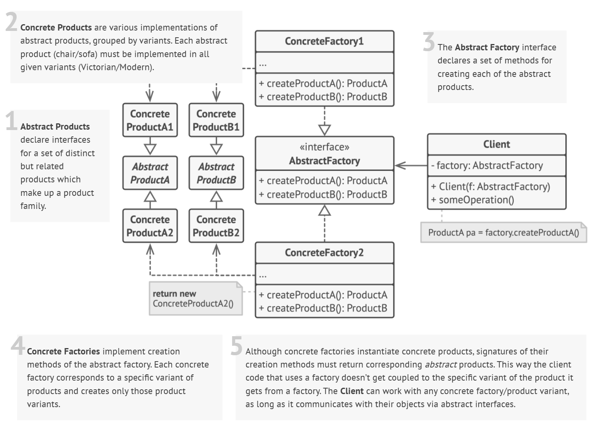
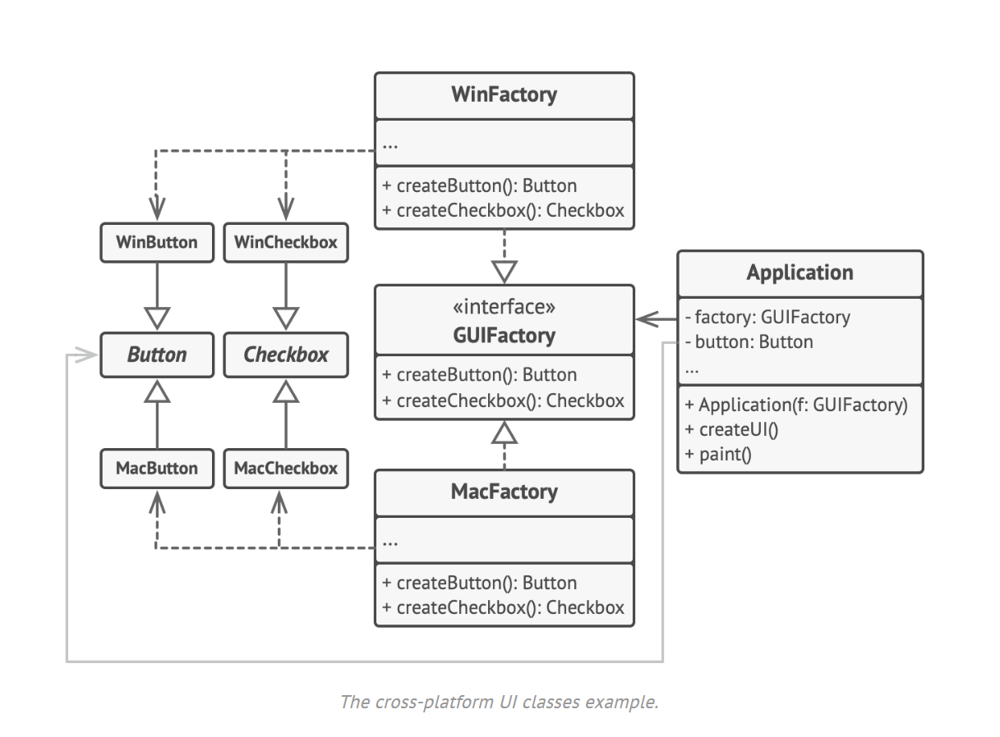

**Abstract Factory** là một mẫu thiết kế giúp tạo ra các nhóm đối tượng liên quan với nhau mà không cần chỉ rõ lớp cụ thể của chúng. Nó giống như một nhà máy sản xuất nhiều loại sản phẩm cùng lúc, giúp dễ dàng thay đổi nhóm sản phẩm mà không ảnh hưởng đến mã nguồn chính.

Tuy nhiên, cần lưu ý rằng Abstract Factory **dễ mở rộng theo chiều ngang** (thêm hãng hoặc nhóm sản phẩm mới → tạo thêm concrete factory) nhưng **khó mở rộng theo chiều dọc** (thêm loại sản phẩm mới trong nhóm → phải sửa interface và tất cả concrete factory hiện có).

Ví dụ:  
Giả sử Abstract Factory hiện tạo ra hai loại sản phẩm:

-   `Instance` (máy chủ ảo)
-   `Storage` (dịch vụ lưu trữ)

Mỗi concrete factory như `AWSFactory`, `AzureFactory`, `GCPFactory` sẽ triển khai hai phương thức:

```ts
createInstance(): Instance;
createStorage(): Storage;
```

Nếu muốn thêm loại sản phẩm mới như `Network` (mạng ảo, load balancer, VPN), bạn sẽ phải:

-   Sửa interface của Abstract Factory để thêm phương thức:
    ```ts
    createNetwork(): Network;
    ```
-   Cập nhật tất cả concrete factory để triển khai phương thức mới.
-   Điều chỉnh client code nếu cần sử dụng sản phẩm mới.

Điều này thể hiện hạn chế của Abstract Factory:

-   Dễ thêm nhà cung cấp mới
-   Khó thêm loại sản phẩm mới




