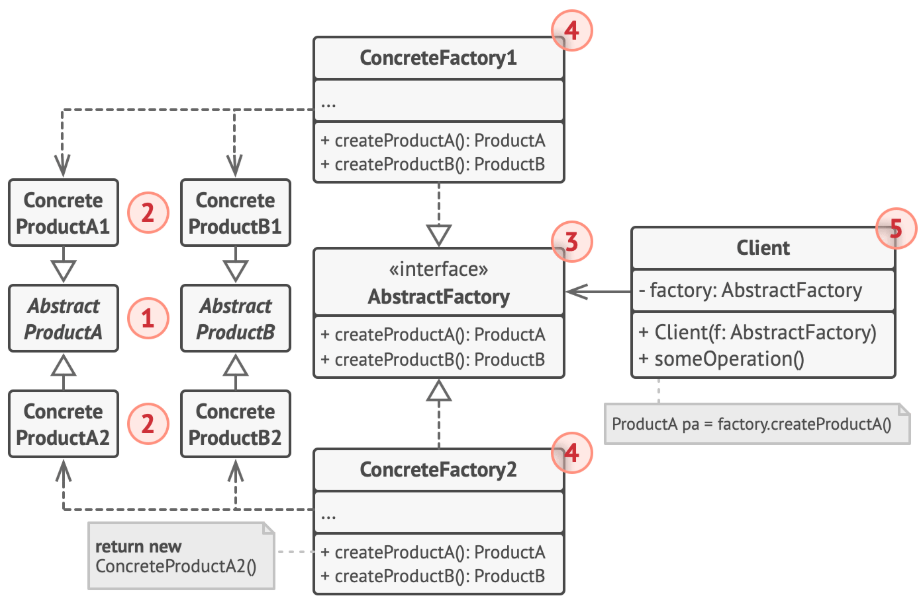

# Abstract Factory Pattern

`Abstract Factory` giúp tạo ra **họ các sản phẩm** liên quan thông qua `Concrete Factory`.

> Nó khác với `Factory Method` ở chỗ **"tạo ra họ sản phẩm"** chứ không phải một sản phẩm cụ thể.

---

## Sơ đồ UML

---

## Phân tích cấu trúc

Giả sử bạn xây dựng một hệ thống quản lý **Cloud Service** cho nhiều nhà cung cấp như **AWS**, **Azure**, **GCP**.

Mỗi nhà cung cấp sẽ có cách triển khai **tài nguyên** (**Product**) khác nhau:

-   **Máy chủ** - **Server**
-   **Dịch vụ lưu trữ** - **Storage**
-   **Dịch vụ mạng** - **Network**

Nếu sử dụng **Factory Method pattern**, bạn cần tạo nhiều **Concrete Factory** riêng biệt cho từng loại sản phẩm:

-   `ServerFactory` → `AWSServerFactory`, `AzureServerFactory`, `GCPServerFactory`
-   `StorageFactory` → `AWSStorageFactory`, `AzureStorageFactory`, `GCPStorageFactory`
-   `NetworkFactory` → `AWSNetworkFactory`, `AzureNetworkFactory`, `GCPNetworkFactory`

> Điều này làm tăng số lượng class và gây phức tạp khi muốn xây dựng hệ thống đồng nhất cho từng nhà cung cấp.

Với **Abstract Factory pattern**, bạn chỉ cần một factory cho mỗi nhà cung cấp, giúp quản lý và mở rộng dễ dàng hơn.

-   Tạo một `CloudFactory` đóng vai trò là `AbstractFactory`, gồm các phương thức: `createServer()`, `createStorage()`, `createNetwork()`.
-   Tạo các `ConcreteFactory` như `AWSFactory`, `AzureFactory`, `GCPFactory` triển khai `CloudFactory`.
-   Mỗi `ConcreteFactory` sẽ tạo ra một **họ sản phẩm** gồm nhiều loại sản phẩm liên quan thông qua các method:

    -   `AWSFactory` → `AWSServer`, `AWSStorage`, `AWSNetwork`
    -   `AzureFactory` → `AzureServer`, `AzureStorage`, `AzureNetwork`
    -   `GCPFactory` → `GCPServer`, `GCPStorage`, `GCPNetwork`

---

## Ưu và nhược điểm

### Ưu điểm

-   **Dễ mở rộng theo chiều ngang:** Thêm hãng hoặc nhóm sản phẩm mới → tạo thêm concrete factory.
-   **Đồng nhất sản phẩm:** Các sản phẩm trong cùng một họ được tạo bởi cùng một factory, đảm bảo tính tương thích.
-   **Dễ bảo trì:** Thay đổi cách tạo sản phẩm trong một họ → chỉ cần sửa concrete factory tương ứng.

### Nhược điểm

-   **Khó mở rộng theo chiều dọc:** Thêm loại sản phẩm mới trong nhóm → phải sửa interface và tất cả concrete factory hiện có.
-   **Số lượng class nhiều:** Mỗi nhóm sản phẩm cần một concrete factory riêng, làm tăng số lượng class.

> Điểm chung dễ thấy giữa `Abstract Factory pattern` và `Factory Method pattern`:
>
> -   Dễ dàng mở rộng theo chiều ngang.
> -   Dễ bảo trì do các `FactoryConcrete` tách biệt.
> -   Số lượng `ConcreteClass` nhiều.
> -   Khó mở rộng theo chiều dọc.
