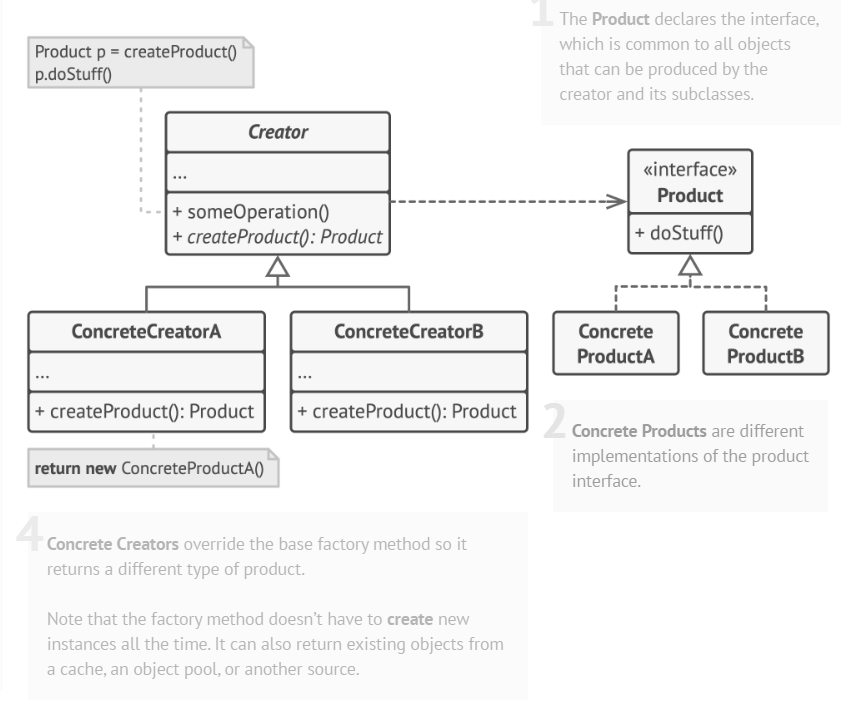

## Giới thiệu về Simple Factory (Không phải design pattern)

Có thể bạn đã biết về Simple Factory mà không để ý nó là kiểu này nè:

> Có 1 con chó nhưng có nhiều giống khác nhau:
>
> -   Giống Đức thì chim ngắn
> -   Giống Mỹ thì chân ngắn
> -   Giống Nhật thì đẹp gái

Khi tạo con chó chỉ cần:

```plaintext
if type == Đức => chó Đức
else if type == Mỹ => chó Mỹ
else if type == Nhật => chó Nhật
```

Nhưng với Simple Factory, nó không đáp ứng được **Open/Closed Principle (OCP)** vì mỗi khi thêm giống chó mới, ta phải sửa đổi mã nguồn của factory.

---

## Factory Method đáp ứng SOLID hơn

Đến với **Factory Method**, nó sẽ hoạt động đáp ứng SOLID hơn.

### Vấn đề đặt ra

-   **Product** là chó
-   Chó Đức, chó Mỹ, chó Nhật gọi là **Concrete Product** (Sản phẩm cụ thể)



### Sơ đồ UML

Nhìn vào sơ đồ UML thì thấy gì?  
Có 1 thằng **Creator** nữa, chính nó là Factory đó.

-   Factory thì có hành động tạo sản phẩm: `createProduct(): Product`
-   Với DogFactory: `createDog(): Dog`

Tại sao lại phân nhánh từ 1 Dog -> nhiều Concrete?  
Trong UML nghĩa là **kế thừa** hoặc **triển khai** (implement) tức là **mối quan hệ "is-a"**.

---

## Creator và Concrete Creator

-   **Creator**: DogFactory
-   **Concrete Creator**:
    -   Chó Đức: `GermanDogFactory`
    -   Chó Mỹ: `AmericanDogFactory`
    -   Chó Nhật: `JapaneseDogFactory`

Hiện tại ta có 1 hệ thống dựa trên **Factory Method pattern** như trong hình luôn.

---

## Tóm tắt

-   Creator ---> Product
-   Factory tạo ra sản phẩm thông qua `createProduct()` (ở đây là `createDog()`).
-   Mỗi sản phẩm được tạo ra bởi Factory, mỗi loại cụ thể do mỗi phân xưởng xử lý (Concrete Creator).

### Các phân xưởng:

-   `GermanDogFactory`
-   `AmericanDogFactory`
-   `JapaneseDogFactory`

---

## Điểm hay của Factory Method so với Simple Factory

### 1. Đáp ứng Open/Closed Principle (OCP)

-   Mỗi khi thêm loại chó, chỉ cần tạo file mới code cho từng Concrete Product - Concrete Creator là xong.
-   Không cần sửa đổi mã nguồn của các Factory đã có.

### 2. Tích hợp dễ hình dung hơn

-   Các phân xưởng (Concrete Creator) chịu trách nhiệm tạo ra sản phẩm cụ thể (Concrete Product) của mình, giúp mở rộng và bảo trì hệ thống dễ dàng hơn.
-   Mỗi phân xưởng chỉ cần quan tâm đến sản phẩm của mình mà không cần biết đến các sản phẩm khác.
-   Chỉ cần khai báo kiểu là Creator hay DogFactory, rồi truyền giá trị là các Concrete Creator là xong bởi dù là thực thể khác nhưng chỉ cần thể hiện bởi 1 kiểu là Creator.

---

Đó là cách mà **Factory Method pattern** giúp cho việc mở rộng và bảo trì hệ thống trở nên dễ dàng hơn.

**Ví dụ code:**

```java
// Product
abstract class Dog {
    public abstract void bark();
}

// Concrete Products
class GermanDog extends Dog {
    @Override
    public void bark() {
        System.out.println("Woof! I'm a German Shepherd.");
    }
}

class AmericanDog extends Dog {
    @Override
    public void bark() {
        System.out.println("Woof! I'm an American Bulldog.");
    }
}

class JapaneseDog extends Dog {
    @Override
    public void bark() {
        System.out.println("Woof! I'm a Shiba Inu.");
    }
}

// Creator
abstract class DogFactory {
    public abstract Dog createDog();
}

// Concrete Creators
class GermanDogFactory extends DogFactory {
    @Override
    public Dog createDog() {
        return new GermanDog();
    }
}

class AmericanDogFactory extends DogFactory {
    @Override
    public Dog createDog() {
        return new AmericanDog();
    }
}

class JapaneseDogFactory extends DogFactory {
    @Override
    public Dog createDog() {
        return new JapaneseDog();
    }
}

public class Main {
    public static void main(String[] args) {
        DogFactory germanFactory = new GermanDogFactory();
        DogFactory americanFactory = new AmericanDogFactory();
        DogFactory japaneseFactory = new JapaneseDogFactory();

        Dog germanDog = germanFactory.createDog();
        Dog americanDog = americanFactory.createDog();
        Dog japaneseDog = japaneseFactory.createDog();

        germanDog.bark();
        americanDog.bark();
        japaneseDog.bark();
    }
}
```

Giờ ở trên chổ Simple Factory kia thay vì truyền type rồi mỗi lần có thêm type lại thêm `if-else` hay `switch-case` thì giờ chỉ cần tạo thêm 1 Concrete Creator mới là xong.
Magic nè:

```java
Dog getDog(DogFactory concreteFactory) {
    return concreteFactory.createDog();
}
```
