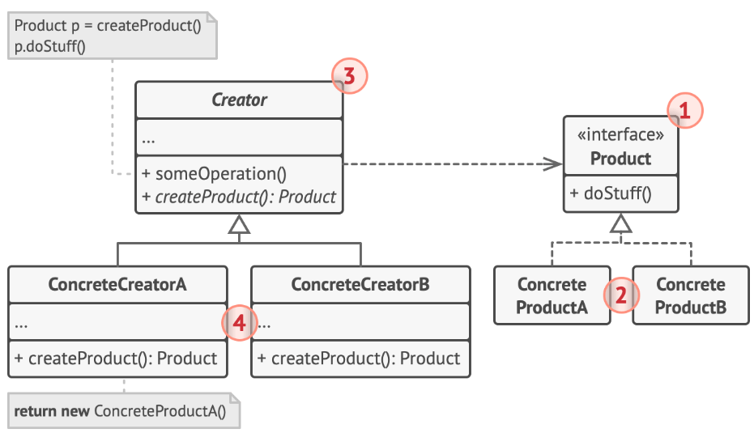

# Factory Method Pattern

## Giới thiệu về Simple Factory (Không phải design pattern)

**Có thể bạn đã biết về Simple Factory mà không để ý:**

Có một hệ thống quản lý chó, trong đó có nhiều giống chó khác nhau:

-   Giống Đức thì thông minh
-   Giống Mỹ thì mạnh mẽ
-   Giống Nhật thì đẹp gái

Khi tạo con chó chỉ cần:

```js
if type == Đức => chó Đức
else if type == Mỹ => chó Mỹ
else if type == Nhật => chó Nhật
```

Nhưng với Simple Factory, nó không đáp ứng được **Open/Closed Principle (OCP)** vì mỗi khi thêm giống chó mới, ta phải sửa đổi mã nguồn của factory.

---

## Factory Method (Design Pattern)

Đến với **Factory Method**, nó sẽ hoạt động đáp ứng SOLID hơn và sẽ giải quyết được vấn đề của `Simple Factory`.



### Sơ đồ UML

### Phân tích các thành phần trong Factory Method

-   **Product**: Interface chung cho các sản phẩm được tạo bởi Creator.
-   **Concrete Products**: Các lớp triển khai Product, đại diện cho từng loại sản phẩm cụ thể.
-   **Creator**: Khai báo phương thức factory (`createProduct()`), trả về Product. Creator có thể chứa logic nghiệp vụ liên quan đến sản phẩm.
-   **Concrete Creators**: Ghi đè phương thức factory để trả về sản phẩm cụ thể, có thể tạo mới hoặc lấy từ cache/object pool.

---

## Creator và Concrete Creator

-   **Creator**: DogFactory
-   **Concrete Creator**:
    -   Chó Đức: `GermanDogFactory`
    -   Chó Mỹ: `AmericanDogFactory`
    -   Chó Nhật: `JapaneseDogFactory`

Hiện tại ta có 1 hệ thống dựa trên **Factory Method pattern**.

---

## Ưu và nhược điểm

## Ưu điểm

-   **Mở rộng theo chiều ngang**: Khi thêm loại chó mới, chỉ cần tạo thêm một lớp `Concrete Factory` và một lớp sản phẩm mới, không ảnh hưởng đến các lớp hiện tại.
-   **Dễ bảo trì và quản lý**: Các nhà máy (factory) độc lập, mỗi nhà máy chỉ chịu trách nhiệm tạo một loại chó, giúp mã nguồn rõ ràng và dễ kiểm soát.
-   **Linh hoạt trong tích hợp**: Có thể dễ dàng kết hợp các loại factory khác nhau bằng cách sử dụng chung interface `DogFactory`.

## Nhược điểm

-   **Số lượng Class nhiều**: Khi số lượng loại chó tăng, số lượng lớp factory và sản phẩm cũng tăng theo, dẫn đến hệ thống có nhiều lớp hơn, phức tạp hơn.
-   **Hạn chế mở rộng theo chiều dọc**: Nếu cần thay đổi cách tạo chó hoặc thêm method, phải sửa `Creator` và tất cả các `Concrete Creator`.
-   **Cấu trúc phân tầng sâu**: Việc sử dụng kế thừa (`Inheritance`) có thể tạo ra hierarchy nhiều tầng, gây khó khăn trong việc hiểu và bảo trì hệ thống.

---

## Ví dụ code:

```java
// Product
abstract class Dog {
    public abstract void bark();
}

// Concrete Products
class GermanDog extends Dog {
    @Override
    public void bark() {
        System.out.println("Woof! I'm a German Shepherd.");
    }
}

class AmericanDog extends Dog {
    @Override
    public void bark() {
        System.out.println("Woof! I'm an American Bulldog.");
    }
}

class JapaneseDog extends Dog {
    @Override
    public void bark() {
        System.out.println("Woof! I'm a Shiba Inu.");
    }
}

// Creator
abstract class DogFactory {
    public abstract Dog createDog();
}

// Concrete Creators
class GermanDogFactory extends DogFactory {
    @Override
    public Dog createDog() {
        return new GermanDog();
    }
}

class AmericanDogFactory extends DogFactory {
    @Override
    public Dog createDog() {
        return new AmericanDog();
    }
}

class JapaneseDogFactory extends DogFactory {
    @Override
    public Dog createDog() {
        return new JapaneseDog();
    }
}

public class Main {
    public static void main(String[] args) {
        DogFactory germanFactory = new GermanDogFactory();
        DogFactory americanFactory = new AmericanDogFactory();
        DogFactory japaneseFactory = new JapaneseDogFactory();

        Dog germanDog = germanFactory.createDog();
        Dog americanDog = americanFactory.createDog();
        Dog japaneseDog = japaneseFactory.createDog();

        germanDog.bark();
        americanDog.bark();
        japaneseDog.bark();
    }
}
```
