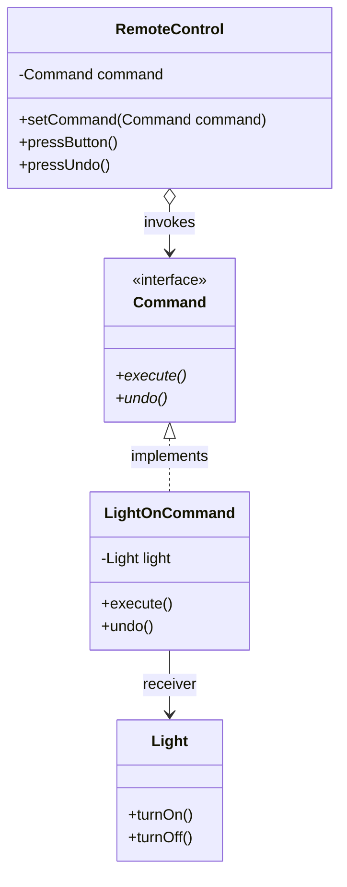
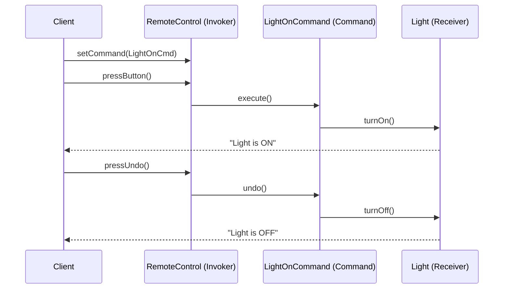
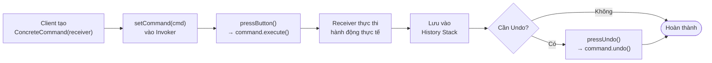

# Command Pattern

Command (còn gọi là Action hoặc Transaction) là mẫu thiết kế hành vi đóng gói một yêu cầu (request) dưới dạng một đối tượng độc lập. Nhờ đó, nó cho phép tham số hóa client với các yêu cầu khác nhau, hỗ trợ xếp hàng, ghi log và hoàn tác (undo/redo).

## Mục lục

-   [1. Định nghĩa & Mục đích](#1-định-nghĩa--mục-đích)
-   [2. Cấu trúc (UML & Mermaid)](#2-cấu-trúc-uml--mermaid)
-   [3. Ứng dụng thực tế](#3-ứng-dụng-thực-tế)
-   [4. Ví dụ code Java](#4-ví-dụ-code-java)
-   [5. Ưu & Nhược điểm](#5-ưu--nhược-điểm)

---

## 1. Định nghĩa & Mục đích

Command chuyển đổi một yêu cầu trực tiếp thành một đối tượng trung gian chứa tất cả thông tin về yêu cầu đó. Việc này trì hoãn hoặc phân tách hành động gửi yêu cầu với hành động thực thi yêu cầu thực tế.

---

## 2. Cấu trúc (UML & Mermaid)

Dưới đây là sơ đồ lớp mô tả cấu trúc của mẫu thiết kế Command:



| Thành phần/Bước | Vai trò/Mô tả | Chi tiết |
| :--- | :--- | :--- |
| `Command` | Interface Mệnh lệnh | Khai báo phương thức thực thi (`execute`) và hoàn tác (`undo`). |
| `LightOnCommand`| Concrete Command | Liên kết giữa người nhận (`Light`) và hành động cụ thể. Triển khai phương thức `execute` bằng cách gọi hàm `turnOn` của `Light`. |
| `Light` | Receiver | Đối tượng thực thi các logic thực tế đằng sau yêu cầu. |
| `RemoteControl` | Invoker | Yêu cầu `Command` thực hiện hành động bằng cách gọi phương thức `execute()`. |

### Sequence Diagram — Luồng thực thi Command & Undo



### Flowchart — Vòng đời của một Command



---
## 3. Ứng dụng thực tế

Áp dụng mẫu thiết kế Command khi:
*   Cần tham số hóa các đối tượng bằng một hành động cần thực hiện (thay thế cho cơ chế callback).
*   Muốn xếp hàng, lập lịch và thực thi các yêu cầu vào các thời điểm khác nhau.
*   Hỗ trợ tính năng hoàn tác (Undo/Redo) bằng cách lưu trữ lịch sử trạng thái của các Command.
*   Xây dựng hệ thống giao dịch (transaction) để ghi nhật ký các thay đổi phòng khi hệ thống gặp lỗi.

---

## 4. Ví dụ code Java

Ví dụ minh họa việc đóng gói yêu cầu bật/tắt thiết bị đèn (`Light`) thông qua thiết bị điều khiển từ xa (`RemoteControl`).

```java
// 1. Receiver (Người thực thi thực sự)
class Light {
    public void turnOn() { System.out.println("Light is ON"); }
    public void turnOff() { System.out.println("Light is OFF"); }
}

// 2. Command Interface
interface Command {
    void execute();
    void undo();
}

// 3. Concrete Command
class LightOnCommand implements Command {
    private Light light;

    public LightOnCommand(Light light) { this.light = light; }

    @Override
    public void execute() { light.turnOn(); }

    @Override
    public void undo() { light.turnOff(); }
}

// 4. Invoker (Người kích hoạt yêu cầu)
class RemoteControl {
    private Command command;

    public void setCommand(Command command) { this.command = command; }
    public void pressButton() { command.execute(); }
    public void pressUndo() { command.undo(); }
}
```

---

## 5. Ưu & Nhược điểm

### Ưu điểm
*   **Loose Coupling:** Tách biệt hoàn toàn đối tượng kích hoạt yêu cầu (Invoker) khỏi đối tượng xử lý yêu cầu (Receiver).
*   Dễ dàng triển khai tính năng Undo/Redo và Queue các lệnh cần thực thi.
*   Thỏa mãn nguyên lý Open/Closed vì có thể thêm Command mới mà không cần đổi mã nguồn Invoker/Receiver.

### Nhược điểm
*   Tăng số lượng lớp bổ sung đáng kể để phục vụ việc đóng gói các câu lệnh riêng lẻ.
*   Kiến trúc code trở nên phức tạp hơn đối với các thao tác đơn giản.

---
[← Quay lại mục lục Behavioral](README.md)
