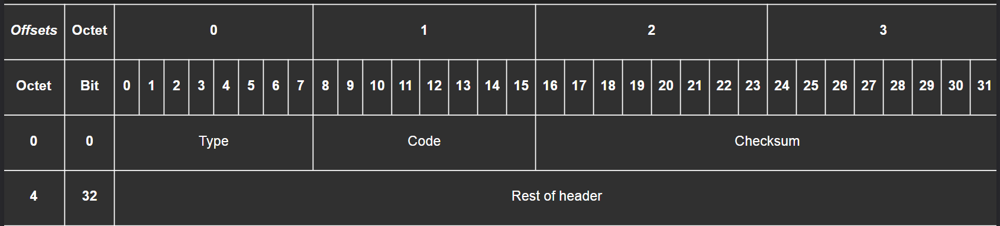

# Tổng quan về Giao thức ICMP (Internet Control Message Protocol)

**ICMP** là một giao thức hỗ trợ trong bộ giao thức Internet (IP Suite). Chủ yếu được các thiết bị mạng sử dụng để gửi các thông điệp _quản lý mạng_ và _báo lỗi_.

Không là giao thức truyền dữ liệu như **TCP** hay **UDP**, chủ yếu được dùng để **chẩn đoán mạng**.

---

## Cấu trúc của ICMP Header

ICMP được đóng gói ngay bên trong một gói tin IP. Cấu trúc header của nó khá đơn giản và cung cấp những thông tin cần thiết để chẩn đoán sự cố.

-   **Type (8 bits):** Xác định loại thông điệp. Ví dụ: `8` cho Echo Request (yêu cầu ping), `0` cho Echo Reply (phản hồi ping), `3` cho Destination Unreachable (Không thể đến đích).
-   **Code (8 bits):** Cung cấp thông tin chi tiết hơn cho trường `Type`. Ví dụ, nếu `Type` là `3` (Không thể đến đích), `Code` có thể là `1` (Host Unreachable - Host không thể đến) hoặc `3` (Port Unreachable - Cổng không thể đến).
-   **Checksum (16 bits):** Dùng để kiểm tra lỗi trong header của ICMP, đảm bảo thông điệp không bị hỏng hóc trên đường truyền.
-   **Rest of Header (32 bits):** Nội dung của phần này thay đổi tùy thuộc vào `Type` và `Code`. Ví dụ, đối với thông điệp Echo, nó chứa một định danh (identifier) và số thứ tự (sequence number) để khớp yêu cầu với phản hồi.

---

## Các ứng dụng thực tế: Ping và Traceroute

ICMP là nền tảng cho hai công cụ chẩn đoán mạng quan trọng nhất mà mọi kỹ sư đều sử dụng.

### 1. Ping

**Ping** được sử dụng để kiểm tra xem một máy chủ có "sống" và có thể kết nối được từ máy của bạn hay không.

**Cách hoạt động:**

1.  Máy của bạn (ví dụ: `192.168.1.3`) gửi một thông điệp ICMP **Echo Request** (`Type 8`) đến máy chủ đích (`192.168.10.3`).
2.  Nếu máy chủ đích nhận được yêu cầu, nó sẽ trả lời bằng một thông điệp ICMP **Echo Reply** (`Type 0`).
3.  Công cụ `ping` sẽ đo thời gian giữa lúc gửi yêu cầu và nhận phản hồi (Round Trip Time - RTT).

Nếu bạn nhận được phản hồi, điều đó có nghĩa là có một đường đi hợp lệ giữa bạn và máy chủ.

### 2. Traceroute (hoặc `tracert` trên Windows) 🗺️

**Traceroute** là một công cụ thông minh hơn, giúp bạn xác định toàn bộ đường đi (danh sách các router) mà gói tin của bạn đi qua để đến được đích.

**Cách hoạt động (một cách thông minh sử dụng TTL và ICMP):**
Cơ chế này dựa trên việc gửi các gói tin với giá trị **Time-To-Live (TTL)** tăng dần. TTL là một bộ đếm trong gói tin IP, mỗi khi đi qua một router, giá trị này sẽ giảm đi 1. Khi TTL về 0, router sẽ hủy gói tin và gửi lại một thông điệp ICMP **Time Exceeded** (`Type 11`) cho người gửi.

1.  **Gửi gói tin với TTL=1:** Gói tin đến router đầu tiên. Router này giảm TTL về 0, hủy gói tin và gửi lại thông báo `Time Exceeded`. Máy của bạn ghi lại địa chỉ IP của router đầu tiên này.
2.  **Gửi gói tin với TTL=2:** Gói tin đi qua router đầu tiên (TTL giảm còn 1), đến router thứ hai. Router thứ hai giảm TTL về 0 và gửi lại `Time Exceeded`. Máy của bạn ghi lại địa chỉ IP của router thứ hai.
3.  **Lặp lại:** Quá trình này tiếp tục với TTL=3, 4, 5,... cho đến khi gói tin đến được máy chủ đích cuối cùng.
4.  **Đến đích:** Khi máy chủ đích nhận được gói tin (lúc này TTL đã đủ lớn), nó sẽ không gửi `Time Exceeded` mà gửi lại một thông điệp **Echo Reply** (nếu là `ping`) hoặc **Destination Unreachable** (nếu `traceroute` dùng UDP đến một cổng không mở). Điều này báo hiệu cho `traceroute` biết rằng hành trình đã hoàn tất.

---

## Vấn đề bảo mật và Firewall

Vì ICMP có thể được dùng để thu thập thông tin về cấu trúc mạng (gọi là "network mapping" hoặc "ping sweeps"), nhiều quản trị viên mạng cấu hình **firewall để chặn các thông điệp ICMP** vì lý do bảo mật.

### Hậu quả của việc chặn ICMP

1.  **Ping và Traceroute không hoạt động:** Đây là hậu quả rõ ràng nhất. Bạn không thể chẩn đoán kết nối đến các máy chủ nằm sau firewall đó.
2.  **Gây ra sự cố kết nối nghiêm trọng (Path MTU Discovery):** Đây là một vấn đề tinh vi hơn. Khi một router cần gửi một gói tin lớn hơn mức MTU (Maximum Transmission Unit) của chặng mạng tiếp theo, nó cần phải phân mảnh gói tin. Nếu gói tin đó có cờ "Don't Fragment" (DF), router sẽ không phân mảnh mà thay vào đó gửi lại một thông điệp ICMP `Fragmentation Needed` (`Type 3`, `Code 4`).
    -   Nếu firewall chặn thông điệp ICMP này, máy gửi sẽ không bao giờ biết rằng nó cần phải gửi các gói tin nhỏ hơn.
    -   Kết quả là kết nối có thể bị "treo" hoặc cực kỳ chậm, một lỗi rất khó để chẩn đoán.

---

## Tóm tắt

-   **ICMP là giao thức điều khiển và báo lỗi** ở tầng Mạng (Network Layer), hoạt động song song với IP.
-   Nó rất **quan trọng để chẩn đoán** xem một host có sẵn sàng hay không và để xác định đường đi của gói tin.
-   Là nền tảng cho các công cụ thiết yếu như **`ping`** và **`traceroute`**.
-   Việc **chặn hoàn toàn ICMP bởi firewall có thể gây ra các vấn đề kết nối** khó lường, đặc biệt là với Path MTU Discovery.
