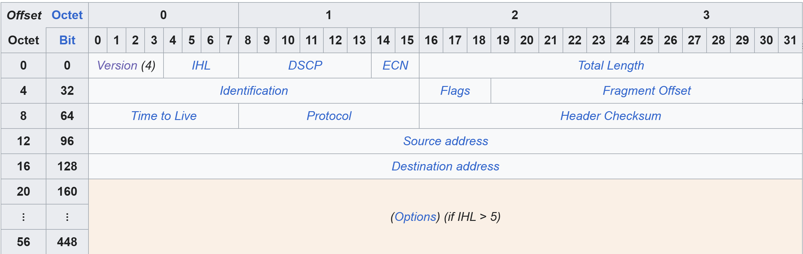

# IP Packet

Dưới đây là các thành phần chính và khái niệm quan trọng từ tài liệu, được trình bày để bạn dễ dàng nắm bắt và áp dụng.

## **1. Payload vs. Header (Dữ Liệu so với Phần Đầu)**

-   **Header (Phần Đầu):** Là phần siêu dữ liệu (metadata) của gói tin. Bạn thường không cần quan tâm đến nó trong lập trình ứng dụng hàng ngày, nhưng nó rất quan trọng để gỡ lỗi (debug) hoặc phân tích sâu các vấn đề mạng.
-   **Payload (Dữ Liệu):** Là phần dữ liệu thực tế mà ứng dụng của bạn gửi đi. Đây là phần chúng ta quan tâm nhất.
-   **Chi phí (Overhead):** Header tạo ra một "chi phí" cho việc truyền tin. Ví dụ, header IP tiêu chuẩn là 20 byte. Nếu các tùy chọn (options) được bật, nó có thể lên đến 60 byte. Đây là phần dữ liệu phụ trội, không phải dữ liệu của bạn.

> **💡 Cho Developer:** Khi tính toán kích thước dữ liệu hoặc băng thông, hãy nhớ rằng kích thước thực tế truyền đi = `Payload + Header` (thường +20 đến +60 byte).

## **2. MTU, Phân Mảnh (Fragmentation) và TTL**

-   **MTU (Maximum Transmission Unit):** Đây là kích thước tối đa của một gói tin có thể được truyền qua một mạng mà không bị phân mảnh. Trên Internet, giá trị phổ biến là **1500 byte**. Nếu gói tin của bạn lớn hơn MTU, nó sẽ cần được xử lý thông qua **Fragmentation**.
-   **Fragmentation (Phân Mảnh):**
    -   Khái niệm mạnh mẽ nhưng rất khó để triển khai đúng.
    -   Nhiều giao thức (như QUIC) hoặc cấu hình hệ thống thường **vô hiệu hóa** phân mảnh vì nó có thể gây ra các vấn đề về hiệu suất và độ phức tạp (ví dụ: nếu một mảnh bị mất, toàn bộ gói tin phải gửi lại).
-   **TTL (Time To Live):**
    -   Một trường 8-bit (1 byte) trong IP header, hoạt động như một bộ đếm.
    -   **Mục đích:** Ngăn chặn các gói tin bị mắc kẹt trong vòng lặp vô hạn trên mạng do định tuyến sai.
    -   **Cách hoạt động:** Khi gửi gói tin, máy nguồn đặt một giá trị TTL (ví dụ: 64, 128, 255). Mỗi khi gói tin đi qua một router (một "bước nhảy"), router đó sẽ **giảm giá trị TTL đi 1**. Khi TTL đạt đến 0, gói tin sẽ bị hủy.

> **💡 Cho Developer:** TTL không liên quan đến thời gian (giây), mà là số bước nhảy (hops). Nó là một cơ chế an toàn cơ bản của mạng.

## **3. Trường Protocol (Giao thức)**

-   **Mục đích:** Trường này xác định **loại giao thức** được đóng gói bên trong phần dữ liệu (payload) của IP. Nó cho biết header tiếp theo sẽ là gì (ví dụ: TCP, UDP, ICMP).
-   **Giá trị:** Đây là một trường 8-bit, cho phép định nghĩa tối đa **255** giao thức khác nhau. Các giá trị phổ biến:
    -   `1` = ICMP
    -   `6` = TCP
    -   `17` = UDP
-   **Ghi chú:** Bạn có thể sử dụng các giá trị khác cho các giao thức tùy chỉnh của mình, nhưng cả hai đầu đều phải hiểu và đồng ý về ý nghĩa của nó.

> **💡 Cho Developer:** Hệ điều hành sử dụng trường này để chuyển gói tin đến đúng xử lý (TCP stack, UDP stack, v.v.). Nếu bạn tạo một giao thức mới, bạn cần đăng ký một số protocol number cho nó.

## **4. Địa chỉ IP Nguồn/Đích (Source/Destination IP) và Spoofing**

-   **Địa chỉ IP Nguồn & Đích:** Đây là hai trường thông tin **quan trọng nhất** trong IP header. Chúng xác định gói tin từ đâu đến và cần phải đi đến đâu.
-   **Spoofing (Mạo danh IP):**
    -   **Khái niệm:** Là kỹ thuật giả mạo địa chỉ IP nguồn trong header. Về mặt kỹ thuật, một chương trình có thể tự do đặt địa chỉ IP nguồn thành bất kỳ giá trị nào nó muốn.
    -   **Thực tế:** Việc này **không dễ dàng** trên Internet công cộng.
    -   **Lý do:** Nhà cung cấp dịch vụ Internet (ISP) của bạn sử dụng **Bộ lọc thoát (Egress Filtering)**. Họ kiểm tra và chặn các gói tin có địa chỉ IP nguồn không thuộc về mạng của họ. Vì vậy, bạn không thể giả mạo một địa chỉ IP hợp lệ của người khác và gửi nó ra ngoài Internet.
    -   **Hệ quả:** Ngay cả khi bạn spoof thành công, tất cả các phản hồi sẽ được gửi đến địa chỉ IP đã bị giả mạo, không phải về máy của bạn. Điều này làm cho các cuộc tấn công dạng "one-way" (như DDoS) có thể thực hiện được, nhưng không thể thiết lập một kết nối hai chiều.

> **🔒 Cho Developer:** Đừng tin tưởng hoàn toàn vào địa chỉ IP nguồn từ phía client cho các chức năng bảo mật quan trọng, vì spoofing vẫn có thể xảy ra trong các mạng nội bộ được kiểm soát kém.

## **5. ECN (Explicit Congestion Notification - Thông báo tắc nghẽn rõ ràng)**

-   **Bài toán:** Khi mạng bị **tắc nghẽn (congestion)**, bộ đệm (buffer) trên các router đầy và chúng bắt đầu **vứt bỏ (drop)** các gói tin. Đây là dấu hiệu thụ động cho thấy mạng đang quá tải.
-   **Giải pháp - ECN:** Là một cơ chế **chủ động** để thông báo tắc nghẽn mà không cần phải vứt bỏ gói tin.
-   **Cách hoạt động:**
    1.  Khi một router phát hiện bộ đệm của nó sắp đầy (sắp xảy ra tắc nghẽn), thay vì vứt bỏ gói tin ngay lập tức, nó sẽ **đánh dấu (set bit)** ECN trong IP header.
    2.  Máy nhận thấy gói tin đã được đánh dấu "ECN", và thông báo lại cho máy gửi thông qua các cơ chế ở tầng giao vận (thường là TCP).
    3.  Máy gửi nhận được thông báo này và **chủ động giảm tốc độ truyền** để giảm tải cho mạng, trước khi tình trạng tắc nghẽn trở nên tồi tệ hơn và dẫn đến mất gói tin hàng loạt.
