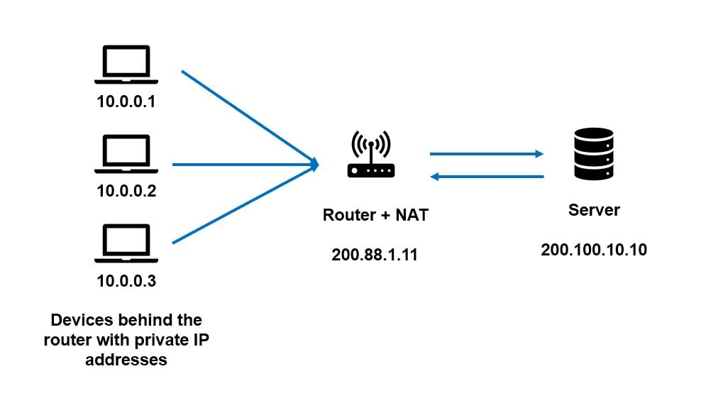

# Mục lục

-   [1. Tổng quan về NAT (Network Address Translation)](#1-tổng-quan-về-nat-network-address-translation)
-   [2. Vấn đề cần giải quyết: Tại sao NAT lại tối quan trọng?](#2-vấn-đề-cần-giải-quyết-tại-sao-nat-lại-tối-quan-trọng)
-   [3. Cách NAT hoạt động: Phép thuật đằng sau Router](#3-cách-nat-hoạt-động-phép-thuật-đằng-sau-router)
    -   [3.1. Giai đoạn 1: Gói tin đi ra Internet](#31-giai-đoạn-1-gói-tin-đi-ra-internet)
    -   [3.2. Giai đoạn 2: Gói tin phản hồi quay trở lại](#32-giai-đoạn-2-gói-tin-phản-hồi-quay-trở-lại)
-   [4. Ưu điểm và Nhược điểm](#4-ưu-điểm-và-nhược-điểm)
    -   [4.1. Ưu điểm](#41-ưu-điểm)
    -   [4.2. Nhược điểm và Giới hạn](#42-nhược-điểm-và-giới-hạn)
-   [5. Các ứng dụng nâng cao của NAT](#5-các-ứng-dụng-nâng-cao-của-nat)
    -   [5.1. Port Forwarding (Chuyển tiếp cổng)](#51-port-forwarding-chuyển-tiếp-cổng)
    -   [5.2. Layer 4 Load Balancing (Cân bằng tải lớp 4)](#52-layer-4-load-balancing-cân-bằng-tải-lớp-4)

---

# 1\. Tổng quan về NAT (Network Address Translation)

**NAT (Network Address Translation)** là một kỹ thuật nền tảng trong mạng máy tính hiện đại. Ban đầu được sinh ra như một giải pháp tình thế cho vấn đề cạn kiệt địa chỉ IPv4, NAT đã phát triển và trở thành một công cụ mạnh mẽ với nhiều ứng dụng quan trọng, từ việc tăng cường bảo mật cho đến cân bằng tải.

---

## 2\. Vấn đề cần giải quyết: Tại sao NAT lại tối quan trọng?

Vấn đề cốt lõi xuất phát từ giới hạn của **IPv4**, giao thức chỉ cung cấp khoảng 4.3 tỷ địa chỉ IP duy nhất. Trong thế giới ngày nay, với hàng tỷ thiết bị từ điện thoại, máy tính, TV, đến các thiết bị IoT, con số này là **hoàn toàn không đủ**.

Mặc dù **IPv6** là giải pháp lâu dài với không gian địa chỉ gần như vô hạn, việc chuyển đổi toàn bộ hạ tầng Internet (_routers, servers,..._) là một quá trình khổng lồ, tốn kém và phức tạp. Vì vậy, việc áp dụng IPv6 vẫn diễn ra rất chậm.

Đây là lúc NAT phát huy vai trò không thể thiếu. Nó trả lời cho câu hỏi:

> **"Làm thế nào để hàng ngàn thiết bị trong một mạng riêng (như ở nhà hoặc công ty) có thể truy cập Internet chỉ với MỘT địa chỉ IP công cộng duy nhất?"**

NAT cho phép toàn bộ thiết bị trong mạng cục bộ của bạn (_máy tính, điện thoại, TV,..._) chia sẻ chung một địa chỉ IP công cộng duy nhất do nhà cung cấp dịch vụ Internet (ISP) cấp cho router. Tất cả các thiết bị của bạn, từ máy Mac, Windows, điện thoại, TV, đều xuất hiện trên Internet với cùng một danh tính: địa chỉ IP công cộng của router.

---

## 3\. Cách NAT hoạt động: Phép thuật đằng sau Router

Để quản lý vô số kết nối đồng thời, router sẽ duy trì một **Bảng NAT (NAT Table)**. Bảng này hoạt động như một cuốn sổ ghi chép, theo dõi và ánh xạ từng kết nối từ trong mạng riêng ra ngoài Internet và ngược lại. Router hoạt động như một "người đại diện" (_proxy_) cho các thiết bị nội bộ khi chúng bước ra "thế giới Internet rộng lớn".

Hãy xem xét kịch bản phổ biến: Máy tính của bạn truy cập Google.

-   **Máy tính của bạn:** có IP riêng là `192.168.1.100`.
-   **Router (Gateway):** có IP công cộng là `203.0.113.10`.
-   **Máy chủ Google:** có IP là `8.8.8.8`.

### 3.1. Giai đoạn 1: Gói tin đi ra Internet

1.  **Tạo gói tin gốc:** Máy tính của bạn tạo một gói tin IP để gửi yêu cầu đến `google.com` (cổng `443` - HTTPS).
    -   **IP Nguồn:** `192.168.1.100` (_IP riêng_)
    -   **Cổng Nguồn:** `50000` (_một cổng ngẫu nhiên_)
    -   **IP Đích:** `8.8.8.8`
    -   **Cổng Đích:** `443`
2.  **Router thực hiện "dịch địa chỉ":** Gói tin này không thể đi ra Internet với IP nguồn là `192.168.1.100` vì đây là IP riêng, sẽ bị các router trên Internet loại bỏ. Khi gói tin đến router, nó sẽ:
    -   Thay đổi **IP Nguồn** từ IP riêng (`192.168.1.100`) thành **IP công cộng** của chính nó (`203.0.113.10`).
    -   Thay đổi **Cổng Nguồn** từ `50000` thành một cổng ngẫu nhiên khác chưa được sử dụng trên router (ví dụ: `7777`).
    -   Tạo một bản ghi **trạng thái** (_stateful_) trong **Bảng NAT** để ghi nhớ sự thay đổi này: `(192.168.1.100:50000) <-> (203.0.113.10:7777)`.
3.  **Gửi gói tin đã sửa đổi:** Gói tin sau khi được "dịch" sẽ được gửi ra Internet.
    -   **IP Nguồn:** `203.0.113.10`
    -   **Cổng Nguồn:** `7777`
    -   **IP Đích:** `8.8.8.8`
    -   **Cổng Đích:** `443`

Đối với máy chủ Google, nó chỉ thấy yêu cầu đến từ `203.0.113.10` và hoàn toàn không biết về sự tồn tại của máy tính `192.168.1.100`.

### 3.2. Giai đoạn 2: Gói tin phản hồi quay trở lại

1.  **Google gửi phản hồi:** Máy chủ Google gửi gói tin trả lời về địa chỉ đã gửi yêu cầu.
    -   **IP Nguồn:** `8.8.8.8`
    -   **Cổng Nguồn:** `443`
    -   **IP Đích:** `203.0.113.10` (_IP công cộng của router_)
    -   **Cổng Đích:** `7777` (_cổng mà router đã chọn_)
2.  **Router "dịch ngược" địa chỉ:** Router nhận được gói tin này. Nó hiểu rằng nó gần như không bao giờ là đích cuối cùng (trừ khi bạn đang truy cập trang quản trị của router). Nó nhìn vào **Cổng Đích** là `7777` và tra cứu trong Bảng NAT.
    -   Nó tìm thấy bản ghi `(192.168.1.100:50000) <-> (203.0.113.10:7777)`.
    -   Nó hiểu rằng gói tin này thực chất là dành cho máy tính `192.168.1.100` tại cổng `50000`.
    -   Nó sửa lại gói tin: thay đổi **IP Đích** thành `192.168.1.100` và **Cổng Đích** thành `50000`.
3.  **Chuyển gói tin đến máy tính:** Gói tin được dịch ngược và chuyển tiếp đến đúng máy tính trong mạng nội bộ.

Bằng cách thay đổi cả địa chỉ IP (Lớp 3) và cổng (Lớp 4), router NAT hoạt động như một thiết bị Lớp 3 và Lớp 4.

---

## 4\. Ưu điểm và Nhược điểm

### 4.1. Ưu điểm

1.  **Tiết kiệm địa chỉ IPv4:** Đây là lợi ích lớn nhất và là lý do chính NAT tồn tại.
2.  **Tăng cường bảo mật:** NAT hoạt động như một bức tường lửa cơ bản. Vì các thiết bị bên ngoài chỉ thấy IP của router, chúng không thể trực tiếp khởi tạo kết nối đến các thiết bị trong mạng nội bộ. Điều này giúp che giấu cấu trúc mạng và bảo vệ thiết bị khỏi các truy cập trái phép. Đây là một lợi ích "tình cờ" nhưng vô cùng hữu ích.

### 4.2. Nhược điểm và Giới hạn

1.  **Phá vỡ nguyên tắc End-to-End:** Nguyên tắc thiết kế cốt lõi của Internet là mọi thiết bị có thể kết nối trực tiếp với nhau. NAT phá vỡ điều này bằng cách thêm một lớp trung gian.
    > Để hiểu sâu hơn về nguyên tắc này và tại sao IPv6 giúp khôi phục nó, bạn có thể tham khảo bài viết: [**IPv4 và IPv6: Tại Sao Phải Chuyển Đổi?**](../internet_protocol/ipv4_ipv6.md#3-vấn-đề-cốt-lõi-nat-và-sự-phá-vỡ-nguyên-lý-end-to-end)
2.  **Gây khó khăn cho một số ứng dụng:** Các ứng dụng **Peer-to-Peer (P2P)**, một số game online, VoIP... có thể gặp sự cố khi hoạt động sau NAT.
3.  **Giới hạn số lượng kết nối:** Một máy tính không thể tạo ra vô hạn kết nối. Vì số hiệu cổng (_port_) là một số 16-bit, về lý thuyết, một địa chỉ IP chỉ có thể mở khoảng **65,535** kết nối đồng thời. Khi tất cả các cổng trên IP công cộng của router được sử dụng để ánh xạ cho các kết nối từ bên trong, sẽ không thể tạo thêm kết nối mới cho đến khi các kết nối cũ được giải phóng.

---

## 5\. Các ứng dụng nâng cao của NAT

Ngoài vai trò chính, các nguyên tắc của NAT còn được vận dụng để tạo ra các giải pháp mạng mạnh mẽ.

### 5.1. Port Forwarding (Chuyển tiếp cổng)

Đây là một "thủ thuật" phổ biến cho các kỹ sư backend. Giả sử bạn muốn chạy một web server trên máy tính cá nhân (ví dụ: port `8080`) và cho phép người khác từ Internet truy cập vào.

-   **Vấn đề:** Các port dưới 1024 (như port `80` cho web) thường yêu cầu quyền quản trị (_root_) để sử dụng, điều này tiềm ẩn rủi ro bảo mật.
-   **Giải pháp:** Bạn có thể chạy server ở một cổng không cần quyền cao (ví dụ `8080`). Sau đó, bạn cấu hình một quy tắc tĩnh trong Bảng NAT của router, gọi là **Port Forwarding**: "Bất kỳ lưu lượng nào đến IP công cộng của router tại **cổng 80** thì hãy chuyển tiếp (_forward_) nó đến máy tính `192.168.1.x` tại **cổng 8080**".

Bằng cách này, bạn có thể public dịch vụ của mình ra ngoài Internet một cách an toàn mà không cần quyền root.

### 5.2. Layer 4 Load Balancing (Cân bằng tải lớp 4)

Đây là một ứng dụng cực kỳ thông minh của NAT, được sử dụng trong các hệ thống hiệu năng cao như HAProxy.

-   **Ý tưởng:** Thay vì để client kết nối trực tiếp đến một trong nhiều server, client sẽ được cấu hình để gửi yêu cầu đến một **địa chỉ IP ảo (Virtual IP)** không thực sự tồn tại.
-   **Cách hoạt động:**
    1.  Client gửi một gói tin đến địa chỉ IP ảo (ví dụ: `10.0.0.99`).
    2.  Gói tin này sẽ được định tuyến đến gateway, chính là bộ cân bằng tải (Load Balancer).
    3.  Bộ cân bằng tải nhận gói tin, nhìn vào IP đích ảo và áp dụng một thuật toán (ví dụ: Round Robin) để chọn một trong các server thật (ví dụ: `192.168.1.10`, `192.168.1.11`,...).
    4.  Nó **viết lại** (_rewrite_) địa chỉ IP Đích của gói tin thành địa chỉ của server thật được chọn và gửi đi.

Bằng cách này, bộ cân bằng tải sử dụng kỹ thuật NAT để phân phối lưu lượng đến nhiều máy chủ, tăng khả năng chịu tải và độ tin cậy của hệ thống.
