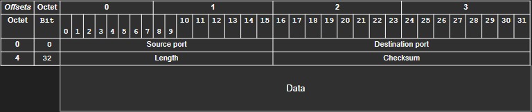

# Cấu trúc của UDP Datagram

UDP datagram gồm hai phần chính: **Header** (thông tin điều khiển) và **Data** (dữ liệu thực tế cần gửi).

Header của UDP rất nhỏ gọn, chỉ **8 bytes** (đối với IPv4). Toàn bộ UDP datagram (header + data) được đóng gói bên trong một gói tin IP, trở thành phần dữ liệu của gói IP. Về cơ bản, lớp 4 (UDP) nằm gọn bên trong lớp 3 (IP).

**Số hiệu cổng (port)** là số nguyên 16-bit, giá trị từ 0 đến 65535. Các cổng này giúp hệ điều hành xác định ứng dụng nào sẽ nhận dữ liệu.

---

# Mục lục

-   [1. Phân tích Header của UDP](#1-phân-tích-header-của-udp)
-   [2. Ý nghĩa các trường](#2-ý-nghĩa-các-trường)
-   [3. Tóm tắt](#3-tóm-tắt)

---

## 1. Phân tích Header của UDP

Header 8-byte của UDP chứa **4 trường thông tin quan trọng**, mỗi trường dài 2 bytes (16-bit):

| Trường           | Độ dài | Ý nghĩa                                                                |
| :--------------- | :----- | :--------------------------------------------------------------------- |
| Source Port      | 16-bit | Xác định ứng dụng/process gửi gói tin. Phía nhận dùng để gửi phản hồi. |
| Destination Port | 16-bit | Xác định ứng dụng/process nhận gói tin ở máy chủ đích.                 |
| Length           | 16-bit | Tổng độ dài của UDP datagram (header + data), tính bằng byte.          |
| Checksum         | 16-bit | Giá trị kiểm tra lỗi, đảm bảo tính toàn vẹn dữ liệu khi truyền tải.    |

> 📌 **Ghi nhớ:** Nếu địa chỉ IP nguồn, IP đích và cổng đích đều cố định, một máy tính chỉ có thể tạo tối đa 65,536 kết nối song song tới cùng một dịch vụ, vì mỗi kết nối phải dùng một cổng nguồn khác nhau.

---

## 2. Ý nghĩa các trường

-   **Source Port:** Xác định ứng dụng hoặc tiến trình đã gửi gói tin đi.
-   **Destination Port:** Xác định ứng dụng hoặc tiến trình sẽ nhận gói tin ở máy chủ đích (ví dụ: DNS dùng cổng 53).
-   **Length:** Tổng độ dài UDP datagram (tối thiểu 8 bytes nếu chỉ có header).
-   **Checksum:** Kiểm tra lỗi, nếu giá trị tính toán khác với giá trị trong header thì gói tin bị loại bỏ.

---

## 3. Tóm tắt

-   UDP datagram có cấu trúc đơn giản, header chỉ 8 bytes.
-   4 trường chính: Source Port, Destination Port, Length, Checksum.
-   Phù hợp cho ứng dụng cần tốc độ, chấp nhận mất mát dữ liệu nhỏ.
-   Không đảm bảo độ tin cậy, không kiểm soát thứ tự hay báo nhận.
-   **Nhược điểm:** Không đảm bảo gửi đến, không có báo nhận, không đảm bảo thứ tự, không kiểm soát luồng/tắc nghẽn, không kết nối, tiềm ẩn rủi ro bảo mật.
