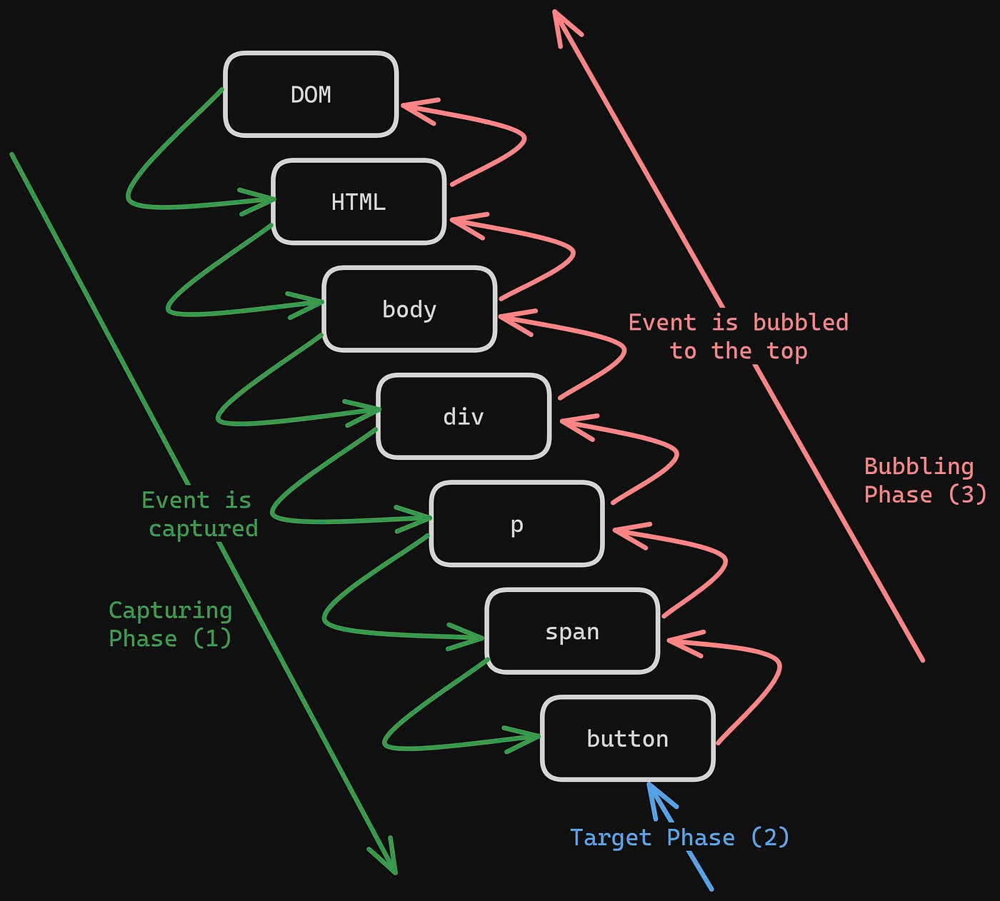

# EVENTS TRONG JAVASCRIPT

## MỤC LỤC

1. [Khái niệm cơ bản](#1-khái-niệm-cơ-bản)
2. [Tại sao cần học Events](#2-tại-sao-cần-học-events)
3. [Các loại sự kiện cơ bản](#3-các-loại-sự-kiện-cơ-bản)
4. [Cách xử lý sự kiện](#4-cách-xử-lý-sự-kiện)
5. [Cơ chế lan truyền sự kiện](#5-cơ-chế-lan-truyền-sự-kiện)
6. [Kỹ thuật nâng cao](#6-kỹ-thuật-nâng-cao)
7. [Bài tập thực hành](#7-bài-tập-thực-hành)
8. [Tham khảo đầy đủ](#8-tham-khảo-đầy-đủ)
9. [Tóm tắt](#9-tóm-tắt)

---

## 1. Khái niệm cơ bản

**Event (Sự kiện)** là những hành động mà người dùng thực hiện trên trang web hoặc những thay đổi xảy ra trong trình duyệt.

**Ví dụ dễ hiểu:** Giống như khi bấm chuông nhà, sẽ có người ra mở cửa. Trong lập trình web:

-   Click chuột = bấm chuông
-   JavaScript xử lý = người ra mở cửa
-   Kết quả hiển thị = cửa được mở

```javascript
// Ví dụ đơn giản nhất về event
const nutBam = document.getElementById('nutBam');

nutBam.addEventListener('click', function () {
	alert('Bạn vừa bấm nút!');
});
```

---

## 2. Tại sao cần học Events

### 🎯 Tạo trang web tương tác

Không có Events, trang web chỉ như một tờ báo - chỉ đọc được, không làm gì khác.

**Ví dụ thực tế:**

-   Khi bấm nút "Nộp bài" → Hiển thị điểm số
-   Khi gõ vào ô tìm kiếm → Hiện gợi ý môn học
-   Khi scroll xuống → Tự động load thêm nội dung

### 💡 So sánh cách làm cũ vs mới

**Cách cũ (không có Events):**

```html
<!-- Phải reload cả trang để làm gì đó -->
<a href="tinh-diem.php">Tính điểm trung bình</a>
```

**Cách mới (có Events):**

```javascript
// Tính luôn trên trang, không cần reload
nutTinhDiem.addEventListener('click', function () {
	const diemToan = 8,
		diemVan = 9,
		diemAnh = 7;
	const diemTB = (diemToan + diemVan + diemAnh) / 3;
	hienThiKetQua(diemTB);
});
```

---

## 3. Các loại sự kiện cơ bản

### 📱 Sự kiện chuột

| Sự kiện     | Khi nào xảy ra | Ví dụ thực tế             |
| ----------- | -------------- | ------------------------- |
| `click`     | Bấm chuột trái | Bấm nút "Nộp bài"         |
| `dblclick`  | Bấm đúp chuột  | Mở file trên máy tính     |
| `mouseover` | Đưa chuột vào  | Hiện tooltip khi rê chuột |
| `mouseout`  | Đưa chuột ra   | Ẩn tooltip đi             |

```javascript
// Ví dụ: Hiệu ứng khi rê chuột vào tên môn học
const monHoc = document.querySelectorAll('.mon-hoc');

monHoc.forEach((mon) => {
	// Khi đưa chuột vào
	mon.addEventListener('mouseover', function () {
		this.style.backgroundColor = '#e3f2fd';
		this.style.cursor = 'pointer';
	});

	// Khi đưa chuột ra
	mon.addEventListener('mouseout', function () {
		this.style.backgroundColor = '';
	});
});
```

### ⌨️ Sự kiện bàn phím

| Sự kiện   | Khi nào xảy ra  | Ví dụ thực tế             |
| --------- | --------------- | ------------------------- |
| `keydown` | Nhấn phím xuống | Gõ tên trong form đăng ký |
| `keyup`   | Thả phím ra     | Tìm kiếm tự động khi gõ   |

```javascript
// Ví dụ: Tìm kiếm học sinh khi gõ tên
const oTimKiem = document.getElementById('timKiemHocSinh');
const danhSachHocSinh = ['An', 'Bình', 'Chi', 'Dung', 'Em'];

oTimKiem.addEventListener('keyup', function () {
	const tuKhoa = this.value.toLowerCase();
	const ketQua = danhSachHocSinh.filter((ten) => ten.toLowerCase().includes(tuKhoa));
	hienThiKetQuaTimKiem(ketQua);
});
```

### 📝 Sự kiện form

| Sự kiện  | Khi nào xảy ra        | Ví dụ thực tế                 |
| -------- | --------------------- | ----------------------------- |
| `submit` | Gửi form              | Nộp bài kiểm tra              |
| `change` | Thay đổi giá trị      | Chọn lớp khác trong dropdown  |
| `focus`  | Click vào ô input     | Bắt đầu nhập điểm             |
| `blur`   | Click ra khỏi ô input | Kiểm tra điểm có hợp lệ không |

```javascript
// Ví dụ: Kiểm tra điểm khi nhập xong
const oDiem = document.getElementById('diemKiemTra');

oDiem.addEventListener('blur', function () {
	const diem = parseFloat(this.value);

	if (diem < 0 || diem > 10) {
		alert('Điểm phải từ 0 đến 10!');
		this.focus(); // Quay lại ô nhập
	} else if (diem >= 8) {
		this.style.color = 'green';
		console.log('Điểm khá giỏi!');
	}
});
```

---

## 4. Cách xử lý sự kiện

### 4.1 Cách cơ bản với addEventListener()

**Cú pháp:**

```javascript
phanTu.addEventListener('tenSuKien', hamXuLy);
```

**Ví dụ thực tế:**

```html
<button id="nutTinhDiem">Tính điểm trung bình</button>
<div id="ketQua"></div>

<script>
	const nutTinhDiem = document.getElementById('nutTinhDiem');
	const ketQua = document.getElementById('ketQua');

	// Hàm tính điểm trung bình lớp
	function tinhDiemTrungBinhLop() {
		const diemLop = [8.5, 7.2, 9.1, 6.8, 8.0, 7.5, 9.3, 8.8];
		const tongDiem = diemLop.reduce((tong, diem) => tong + diem, 0);
		const diemTB = (tongDiem / diemLop.length).toFixed(1);

		ketQua.innerHTML = `
	<h3>📊 Kết quả thống kê lớp:</h3>
	<p>Số học sinh: ${diemLop.length}</p>
	<p>Điểm trung bình: ${diemTB}</p>
	<p>Xếp loại: ${diemTB >= 8 ? 'Giỏi' : diemTB >= 6.5 ? 'Khá' : 'Trung bình'}</p>
  `;
	}

	// Gán sự kiện cho nút
	nutTinhDiem.addEventListener('click', tinhDiemTrungBinhLop);
</script>
```

### 4.2 Event Object - Đối tượng sự kiện

Mỗi khi có sự kiện xảy ra, JavaScript sẽ tạo ra một đối tượng chứa thông tin về sự kiện đó.

```javascript
// Ví dụ: Hiển thị thông tin chi tiết khi click
const nutThongTin = document.getElementById('nutThongTin');

nutThongTin.addEventListener('click', function (event) {
	console.log('Loại sự kiện:', event.type); // "click"
	console.log('Phần tử được click:', event.target); // <button>
	console.log('Tọa độ click:', event.clientX, event.clientY);

	// Ngăn hành động mặc định (nếu có)
	event.preventDefault();
});
```

---

## 5. Cơ chế lan truyền sự kiện

### 📸 Minh họa trực quan



### 5.1 Event Bubbling (Nổi bọt - Mặc định)

Sự kiện lan truyền từ phần tử con lên phần tử cha.

**Ví dụ dễ hiểu:** Giống như khi có ai đó la to trong lớp, tiếng la sẽ lan ra hành lang, rồi ra sân trường.

```html
<div id="lop" class="lop">
	<div id="ban" class="ban">
		<button id="hocSinh" class="hoc-sinh">An</button>
	</div>
</div>

<script>
	// Lắng nghe ở cấp lớp
	document.getElementById('lop').addEventListener('click', function () {
		console.log('🏫 Cô giáo nghe thấy có tiếng động trong lớp');
	});

	// Lắng nghe ở cấp bàn
	document.getElementById('ban').addEventListener('click', function () {
		console.log('🪑 Có ai đó động vào bàn này');
	});

	// Lắng nghe ở cấp học sinh
	document.getElementById('hocSinh').addEventListener('click', function () {
		console.log('👤 Học sinh vừa được click');
	});
</script>
```

**Khi click vào "An", kết quả sẽ là:**

1. "👤 Học sinh vừa được click"
2. "🪑 Có ai đó động vào bàn này"
3. "🏫 Cô giáo nghe thấy có tiếng động trong lớp"

### 5.2 Event Capturing (Bắt giữ)

Sự kiện lan truyền từ phần tử cha xuống phần tử con.

```javascript
// Để dùng capturing, thêm tham số thứ 3 là true
document.getElementById('lop').addEventListener(
	'click',
	function () {
		console.log('🏫 Cô giáo để ý trước khi xem ai gây ra');
	},
	true
); // <- true để dùng capturing
```

### 5.3 Ngăn chặn lan truyền

```javascript
document.getElementById('hocSinh').addEventListener('click', function (event) {
	console.log('👤 Học sinh được click');

	// Ngăn sự kiện lan truyền lên các phần tử cha
	event.stopPropagation();

	// Bây giờ chỉ có thông báo này hiện ra, không có thông báo nào khác
});
```

---

## 6. Kỹ thuật nâng cao

### 🎯 Event Delegation (Ủy quyền sự kiện)

**Tình huống:** Có danh sách 30 học sinh, mỗi người có nút "Xem điểm". Thay vì gán 30 event listeners, chỉ cần gán 1 cái cho danh sách.

```html
<div id="danhSachLop">
	<div class="hoc-sinh" data-ten="An" data-diem="8.5">
		<span>An</span>
		<button class="xem-diem">Xem điểm</button>
	</div>
	<div class="hoc-sinh" data-ten="Bình" data-diem="7.2">
		<span>Bình</span>
		<button class="xem-diem">Xem điểm</button>
	</div>
	<!-- ... thêm nhiều học sinh khác -->
</div>

<script>
	// Chỉ cần 1 event listener cho cả danh sách
	document.getElementById('danhSachLop').addEventListener('click', function (event) {
		// Kiểm tra xem có phải nút "Xem điểm" được click không
		if (event.target.classList.contains('xem-diem')) {
			const hocSinhDiv = event.target.closest('.hoc-sinh');
			const ten = hocSinhDiv.dataset.ten;
			const diem = hocSinhDiv.dataset.diem;

			alert(`Điểm của ${ten}: ${diem}`);
		}
	});
</script>
```

### ⚡ Debouncing - Tránh spam

**Tình huống:** Khi gõ tìm kiếm, không nên tìm kiếm sau mỗi ký tự mà đợi người dùng gõ xong.

```javascript
// Hàm tạo debounce
function taoDebounce(hamGoc, thoiGianCho) {
	let timeoutId;

	return function (...thamSo) {
		// Hủy timeout cũ
		clearTimeout(timeoutId);

		// Tạo timeout mới
		timeoutId = setTimeout(() => {
			hamGoc.apply(this, thamSo);
		}, thoiGianCho);
	};
}

// Hàm tìm kiếm gốc
function timKiemMonHoc(tuKhoa) {
	const monHoc = ['Toán', 'Lý', 'Hóa', 'Sinh', 'Văn', 'Sử', 'Địa', 'Anh'];
	const ketQua = monHoc.filter((mon) => mon.toLowerCase().includes(tuKhoa.toLowerCase()));

	console.log('Tìm thấy:', ketQua);
	hienThiKetQua(ketQua);
}

// Tạo phiên bản debounce
const timKiemDebounce = taoDebounce(function (event) {
	timKiemMonHoc(event.target.value);
}, 300); // Đợi 300ms sau khi ngừng gõ

// Sử dụng
const oTimKiem = document.getElementById('timKiemMonHoc');
oTimKiem.addEventListener('input', timKiemDebounce);
```

---

## 7. Bài tập thực hành

### 🎯 Bài 1: Máy tính điểm đơn giản

Tạo form nhập điểm 4 môn (Toán, Lý, Hóa, Văn) và tính điểm trung bình khi click nút.

```html
<!-- HTML mẫu -->
<div id="mayTinhDiem">
	<h3>📊 Máy tính điểm trung bình</h3>

	<input type="number" id="diemToan" placeholder="Điểm Toán" min="0" max="10" step="0.1" />
	<input type="number" id="diemLy" placeholder="Điểm Lý" min="0" max="10" step="0.1" />
	<input type="number" id="diemHoa" placeholder="Điểm Hóa" min="0" max="10" step="0.1" />
	<input type="number" id="diemVan" placeholder="Điểm Văn" min="0" max="10" step="0.1" />

	<button id="nutTinhDiem">Tính điểm TB</button>
	<div id="ketQuaDiem"></div>
</div>
```

**Gợi ý:**

-   Dùng addEventListener cho nút "Tính điểm TB"
-   Lấy giá trị từ các ô input bằng document.getElementById
-   Kiểm tra điểm có hợp lệ không (0-10)
-   Hiển thị kết quả và xếp loại

### 🎯 Bài 2: Danh sách công việc tương tác

Tạo todo list cho học sinh với các chức năng:

-   Thêm công việc mới
-   Đánh dấu hoàn thành
-   Xóa công việc

**Gợi ý:**

-   Dùng event delegation cho nút xóa và checkbox
-   Dùng preventDefault() cho form submit
-   Thay đổi style khi đánh dấu hoàn thành

### 🎯 Bài 3: Trò chơi đoán số

Tạo game đoán số từ 1-100 với:

-   Input nhập số dự đoán
-   Gợi ý "cao hơn" hoặc "thấp hơn"
-   Đếm số lần đoán

**Gợi ý:**

-   Dùng Math.random() để tạo số ngẫu nhiên
-   Xử lý event keypress để cho phép nhấn Enter
-   Reset game khi đoán đúng

---

## 8. Tham khảo đầy đủ

### 📋 Events chuột phổ biến

| Event         | Mô tả            | Cấp độ   |
| ------------- | ---------------- | -------- |
| `click`       | Click chuột trái | Cơ bản   |
| `dblclick`    | Click đúp        | Cơ bản   |
| `mousedown`   | Nhấn chuột xuống | Nâng cao |
| `mouseup`     | Thả chuột ra     | Nâng cao |
| `mouseover`   | Di chuột vào     | Cơ bản   |
| `mouseout`    | Di chuột ra      | Cơ bản   |
| `mousemove`   | Di chuyển chuột  | Nâng cao |
| `contextmenu` | Click chuột phải | Nâng cao |

### ⌨️ Events bàn phím

| Event      | Mô tả                        | Cấp độ   |
| ---------- | ---------------------------- | -------- |
| `keydown`  | Nhấn phím                    | Cơ bản   |
| `keyup`    | Thả phím                     | Cơ bản   |
| `keypress` | Nhấn phím ký tự (deprecated) | Nâng cao |

### 📝 Events form

| Event    | Mô tả                 | Cấp độ   |
| -------- | --------------------- | -------- |
| `submit` | Gửi form              | Cơ bản   |
| `change` | Thay đổi giá trị      | Cơ bản   |
| `input`  | Nhập dữ liệu          | Cơ bản   |
| `focus`  | Tập trung vào element | Cơ bản   |
| `blur`   | Mất tập trung         | Cơ bản   |
| `reset`  | Reset form            | Nâng cao |

### 🌐 Events trang web

| Event              | Mô tả               | Cấp độ   |
| ------------------ | ------------------- | -------- |
| `load`             | Tải xong trang      | Nâng cao |
| `DOMContentLoaded` | DOM sẵn sàng        | Nâng cao |
| `resize`           | Thay đổi kích thước | Nâng cao |
| `scroll`           | Cuộn trang          | Nâng cao |

### 💡 Phương thức Event Object

| Phương thức         | Chức năng                | Ví dụ                     |
| ------------------- | ------------------------ | ------------------------- |
| `preventDefault()`  | Ngăn hành vi mặc định    | `event.preventDefault()`  |
| `stopPropagation()` | Ngăn lan truyền          | `event.stopPropagation()` |
| `target`            | Element gây ra event     | `event.target`            |
| `currentTarget`     | Element đang xử lý event | `event.currentTarget`     |

---

## 9. Tóm tắt

### 🎯 Events là gì?

-   Các hành động của người dùng hoặc trình duyệt
-   Cách tạo tương tác cho trang web
-   Cầu nối giữa HTML và JavaScript

### 🎯 Cách sử dụng cơ bản:

```javascript
// Template cơ bản
phanTu.addEventListener('tenEvent', function (event) {
	// Xử lý sự kiện ở đây
	console.log('Có sự kiện xảy ra!');
});
```

### 🎯 3 điều quan trọng nhất:

1. **addEventListener()** - Cách chính thức để xử lý events
2. **Event bubbling** - Sự kiện lan từ con lên cha
3. **Event delegation** - Gán 1 listener cho nhiều elements

### 🎯 Tips để nhớ:

-   Events giống như chuông báo - có ai đó bấm thì có người phản hồi
-   Luôn kiểm tra dữ liệu đầu vào trước khi xử lý
-   Sử dụng console.log() để debug events
-   Event delegation giúp code gọn và hiệu quả hơn

**Lưu ý:** Events là nền tảng của mọi tương tác web. Hiểu rõ Events sẽ giúp tạo ra những trang web sinh động và thú vị!
