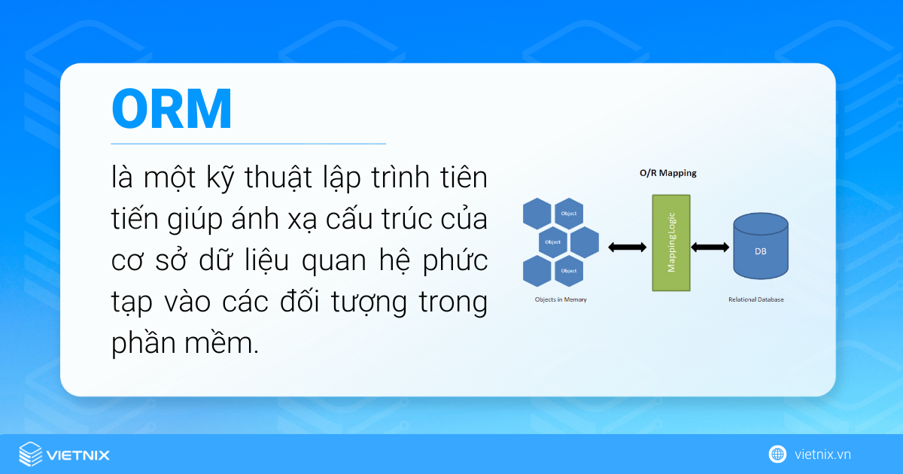

# ORM là gì? (Object-Relational Mapping)

Trước khi đi sâu vào Hibernate, hãy cùng tìm hiểu về khái niệm ORM:

ORM (Object-Relational Mapping) là kỹ thuật lập trình giúp ánh xạ giữa cấu trúc của cơ sở dữ liệu quan hệ (bảng, cột) và các đối tượng trong phần mềm. Nhờ ORM, developer thao tác dữ liệu qua các object thay vì viết truy vấn SQL phức tạp.

---

## Ưu điểm nổi bật

-   **Tăng năng suất:** Đơn giản hóa thao tác CRUD, giảm thời gian viết truy vấn.
-   **Cải thiện bảo trì:** Tách biệt logic truy vấn khỏi code nghiệp vụ, dễ chỉnh sửa.
-   **Giảm lỗi:** Tự động xử lý các vấn đề như SQL injection, lỗi cú pháp.
-   **Độc lập DB:** Dễ chuyển đổi giữa các hệ quản trị cơ sở dữ liệu.

---

## Nhược điểm cần lưu ý

-   **Hiệu suất:** Có thể sinh ra truy vấn kém tối ưu nếu không cấu hình tốt.
-   **Hạn chế linh hoạt:** Một số truy vấn SQL phức tạp khó thực hiện qua ORM.
-   **Độ phức tạp:** Đòi hỏi hiểu rõ cách ORM hoạt động để tránh lỗi.

---

## Các ORM phổ biến

|     Tên ORM      |  Ngôn ngữ/Framework   |
| :--------------: | :-------------------: |
|    SQLAlchemy    |        Python         |
|    Django ORM    |     Python/Django     |
| TypeORM, Prisma  | JavaScript/TypeScript |
|    Hibernate     |         Java          |
| Entity Framework |         .NET          |
|  Active Record   |     Ruby on Rails     |

---

> 📌 **Ghi nhớ:** ORM phù hợp với dự án cần bảo trì lâu dài, thao tác dữ liệu thường xuyên. Tuy nhiên, với các truy vấn phức tạp hoặc yêu cầu tối ưu hiệu suất, nên cân nhắc viết tay SQL.

---

Tham khảo: [vietnix.vn/orm-la-gi](https://vietnix.vn/orm-la-gi/)
