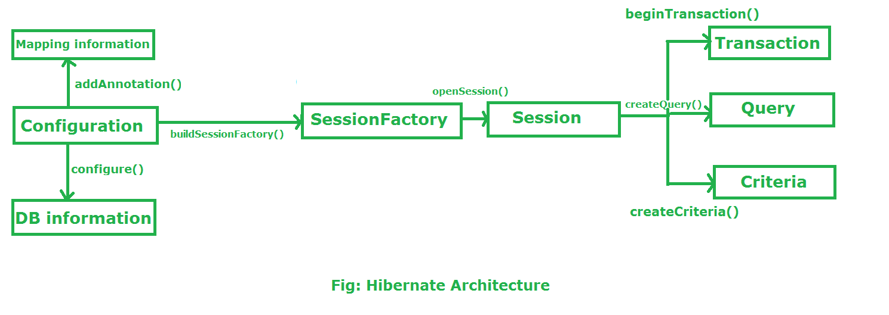
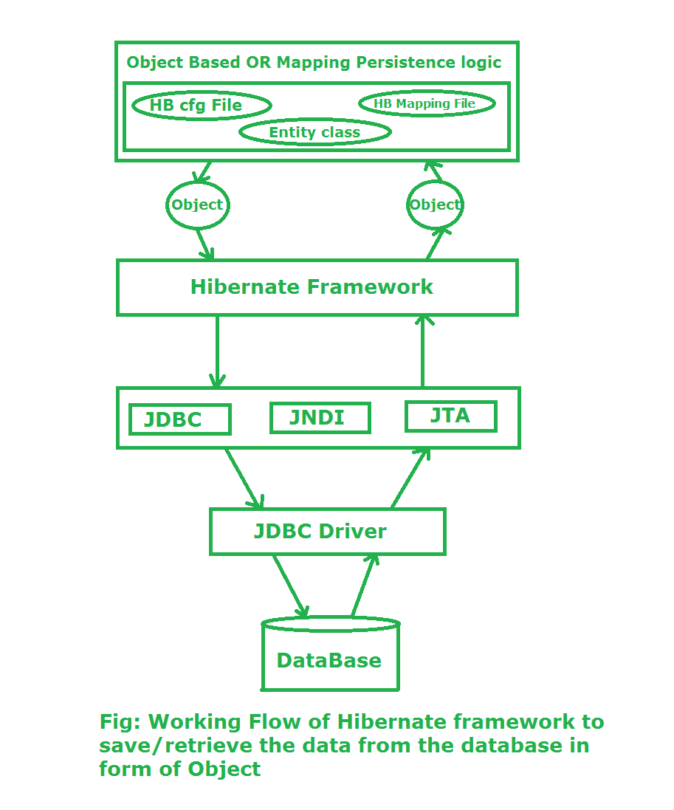

# Kiến trúc Hibernate

Hibernate là một framework được sử dụng để phát triển logic persistence độc lập với phần mềm cơ sở dữ liệu. Trong JDBC để phát triển logic persistence, chúng ta làm việc với các kiểu dữ liệu nguyên thủy. Trong khi với framework Hibernate, chúng ta sử dụng các đối tượng để phát triển logic persistence độc lập với phần mềm cơ sở dữ liệu.

## Sơ đồ Kiến trúc Hibernate



## Các thành phần chính

### **Configuration**

Configuration là một lớp có mặt trong package `org.hibernate.cfg`. Nó kích hoạt framework Hibernate và đọc cả file cấu hình và các file ánh xạ.

**Chức năng:**

-   Kích hoạt framework Hibernate
-   Đọc cả file cfg và các file ánh xạ
-   Kiểm tra xem file cấu hình có đúng cú pháp hay không

```java
// Kích hoạt framework Hibernate
Configuration cfg = new Configuration();

// Đọc cả file cfg và file ánh xạ
cfg.configure();
```

Nó kiểm tra xem file config có đúng cú pháp hay không. Nếu file config không hợp lệ thì nó sẽ ném ra một exception. Nếu hợp lệ thì nó tạo một meta-data trong bộ nhớ và trả về meta-data cho đối tượng để đại diện cho file config.

### **SessionFactory**

SessionFactory là một Interface có mặt trong package `org.hibernate` và được sử dụng để tạo đối tượng Session.

**Đặc điểm:**

-   Bất biến và thread-safe
-   Phương thức `buildSessionFactory()` thu thập meta-data từ đối tượng cfg
-   Từ đối tượng cfg, nó lấy thông tin JDBC và tạo kết nối JDBC

```java
SessionFactory factory = cfg.buildSessionFactory();
```

### **Session**

Session là một interface có mặt trong package `org.hibernate`. Đối tượng Session được tạo dựa trên đối tượng SessionFactory.

**Chức năng:**

-   Mở kết nối/Session với phần mềm cơ sở dữ liệu thông qua framework Hibernate
-   Là đối tượng nhẹ và không thread-safe
-   Đối tượng Session được sử dụng để thực hiện các thao tác CRUD

```java
Session session = factory.openSession();
```

`openSession()` là một phương thức được cung cấp bởi SessionFactory để tạo và trả về một instance Session mới. Session này không bị ràng buộc với bất kỳ transaction hoặc context nào và độc lập với các transaction đang diễn ra trong ứng dụng.

Chúng ta cũng có thể sử dụng `getCurrentSession`, trả về một Session được ràng buộc với context hiện tại, thường được quản lý bởi transaction manager hoặc framework như Spring.

```java
Session session = sessionFactory.getCurrentSession();
```

### **Transaction**

Đối tượng Transaction được sử dụng bất cứ khi nào chúng ta thực hiện bất kỳ thao tác nào và dựa trên thao tác đó có sự thay đổi trong cơ sở dữ liệu.

**Chức năng:**

-   Đưa ra chỉ thị cho cơ sở dữ liệu để biến các thay đổi xảy ra do thao tác thành vĩnh viễn bằng phương thức `commit()`

```java
Transaction tx = session.beginTransaction();
tx.commit();
```

### **Query**

Query là một interface có mặt trong package `org.hibernate`.

**Đặc điểm:**

-   Instance Query được lấy bằng cách gọi `Session.createQuery()`
-   Interface này cung cấp một số chức năng bổ sung ngoài những gì được cung cấp bởi `Session.iterate()` và `Session.find()`:
    -   Một trang cụ thể của tập kết quả có thể được chọn bằng cách gọi `setMaxResults()`, `setFirstResult()`
    -   Các tham số truy vấn có tên có thể được sử dụng

### **Criteria**

Criteria là một API đơn giản hóa để lấy các entity bằng cách kết hợp các đối tượng Criterion.

**Đặc điểm:**

-   Session là một factory cho Criteria
-   Các instance Criterion thường được lấy thông qua các phương thức factory trên Restrictions

## Luồng hoạt động trong Hibernate Framework

Giả sử chúng ta muốn chèn một đối tượng vào cơ sở dữ liệu. Ở đây đối tượng không gì khác ngoài logic persistence mà chúng ta viết trong chương trình Java và tạo một đối tượng của chương trình đó. Nếu chúng ta muốn chèn đối tượng đó vào cơ sở dữ liệu hoặc chúng ta muốn lấy đối tượng từ cơ sở dữ liệu.

Câu hỏi đặt ra là hibernate lưu đối tượng vào cơ sở dữ liệu hoặc lấy đối tượng từ cơ sở dữ liệu như thế nào. Có một số lớp mà framework Hibernate phải đi qua để đạt được nhiệm vụ trên.



### **Giai đoạn I**

Trong giai đoạn đầu tiên, chúng ta sẽ viết logic persistence để thực hiện một số thao tác cụ thể đến cơ sở dữ liệu với sự trợ giúp của file cấu hình Hibernate và file ánh xạ Hibernate. Sau đó chúng ta tạo một đối tượng của lớp cụ thể mà chúng ta đã viết logic persistence.

### **Giai đoạn II**

Trong giai đoạn thứ hai, lớp của chúng ta chứa logic persistence sẽ tương tác với framework hibernate, nơi framework hibernate cung cấp một số abstraction để thực hiện một số nhiệm vụ. Bây giờ ở đây, vai trò của lớp Java đã kết thúc. Bây giờ Hibernate chịu trách nhiệm thực hiện logic persistence với sự trợ giúp của các lớp bên dưới framework Hibernate hoặc chúng ta có thể nói rằng các lớp là triển khai nội bộ của Hibernate.

### **Giai đoạn III**

Trong giai đoạn thứ ba, framework hibernate của chúng ta tương tác với JDBC, JNDI, JTA, v.v. để đi đến cơ sở dữ liệu thực hiện logic persistence đó.

### **Giai đoạn IV & V**

Trong giai đoạn thứ tư và thứ năm, hibernate tương tác với cơ sở dữ liệu với sự trợ giúp của JDBC driver. Bây giờ ở đây hibernate thực hiện logic persistence đó, không gì khác ngoài thao tác CRUD. Nếu logic persistence của chúng ta là để lấy một bản ghi thì theo thứ tự ngược lại, nó sẽ hiển thị trên console của chương trình Java dưới dạng đối tượng.

---

## Cầu nối giữa Hibernate Native và JPA

### Hibernate như một JPA Implementation

Hibernate không chỉ là một framework ORM độc lập mà còn là một trong những implementation phổ biến nhất của Java Persistence API (JPA). Điều này có nghĩa là:

-   **Hibernate Native**: Sử dụng trực tiếp API của Hibernate
-   **Hibernate JPA**: Sử dụng Hibernate thông qua chuẩn JPA API
    [Xem chi tiết JPA ở đây](./jpa.md)

### So sánh Kiến trúc

| Thành phần      | Hibernate Native    | JPA với Hibernate      |
| --------------- | ------------------- | ---------------------- |
| Cấu hình        | `Configuration`     | `Persistence Unit`     |
| Factory         | `SessionFactory`    | `EntityManagerFactory` |
| Session/Context | `Session`           | `EntityManager`        |
| Query           | `Query`, `Criteria` | `TypedQuery`, `JPQL`   |

### Ví dụ So sánh Code

#### Hibernate Native Approach:

```java
// Cấu hình
Configuration cfg = new Configuration();
cfg.configure("hibernate.cfg.xml");
SessionFactory factory = cfg.buildSessionFactory();

// Sử dụng
Session session = factory.openSession();
Transaction tx = session.beginTransaction();

User user = new User("John Doe", "john@email.com");
session.save(user); // Hibernate specific method

tx.commit();
session.close();
```

#### JPA Approach với Hibernate Implementation:

```java
// Cấu hình
EntityManagerFactory emf = Persistence
    .createEntityManagerFactory("myPersistenceUnit");

// Sử dụng
EntityManager em = emf.createEntityManager();
em.getTransaction().begin();

User user = new User("John Doe", "john@email.com");
em.persist(user); // JPA standard method

em.getTransaction().commit();
em.close();
```

### Mapping Thành phần

#### 1. Configuration ↔ Persistence Unit

```java
// Hibernate Native
Configuration cfg = new Configuration();
cfg.setProperty("hibernate.dialect", "org.hibernate.dialect.MySQL8Dialect");
cfg.setProperty("hibernate.connection.url", "jdbc:mysql://localhost:3306/db");
```

```xml
<!-- JPA Persistence Unit -->
<persistence-unit name="myUnit">
    <properties>
        <property name="hibernate.dialect"
                  value="org.hibernate.dialect.MySQL8Dialect"/>
        <property name="javax.persistence.jdbc.url"
                  value="jdbc:mysql://localhost:3306/db"/>
    </properties>
</persistence-unit>
```

#### 2. SessionFactory ↔ EntityManagerFactory

```java
// Hibernate Native
SessionFactory factory = cfg.buildSessionFactory();

// JPA
EntityManagerFactory emf = Persistence
    .createEntityManagerFactory("myUnit");
```

#### 3. Session ↔ EntityManager

```java
// Hibernate Native
Session session = factory.openSession();

// JPA
EntityManager em = emf.createEntityManager();
```

### Tính năng Đặc biệt của Hibernate

Khi sử dụng JPA với Hibernate, bạn vẫn có thể truy cập các tính năng đặc biệt của Hibernate:

```java
// Unwrap để truy cập Hibernate Session
EntityManager em = emf.createEntityManager();
Session session = em.unwrap(Session.class);

// Sử dụng Hibernate Criteria API
Criteria criteria = session.createCriteria(User.class);
criteria.add(Restrictions.like("name", "John%"));
List<User> users = criteria.list();
```

### Lợi ích của việc sử dụng JPA

1. **Tính di động (Portability)**: Code có thể chuyển đổi giữa các ORM khác nhau
2. **Chuẩn hóa**: Tuân theo Jakarta EE/Java EE standard
3. **Tích hợp**: Dễ dàng tích hợp với Spring Framework
4. **Annotation-based**: Sử dụng annotation thay vì XML mapping

### Khi nào nên dùng cách nào?

**Sử dụng Hibernate Native khi:**

-   Cần các tính năng đặc biệt của Hibernate
-   Dự án legacy đã sử dụng Hibernate
-   Cần hiệu suất tối ưu với Hibernate-specific features

**Sử dụng JPA khi:**

-   Muốn tuân theo chuẩn Java
-   Dự án mới hoặc cần tính di động
-   Tích hợp với Spring Boot/Jakarta EE
-   Team mới học ORM

### Luồng hoạt động JPA với Hibernate


1. **Application Code** → Gọi JPA API
2. **JPA Layer** → Chuẩn hóa và chuyển tiếp
3. **Hibernate Implementation** → Xử lý ORM logic
4. **JDBC Layer** → Kết nối database
5. **Database** → Lưu trữ dữ liệu

Hibernate vẫn thực hiện tất cả logic ORM như cache, lazy loading, dirty checking, nhưng thông qua interface JPA chuẩn.
