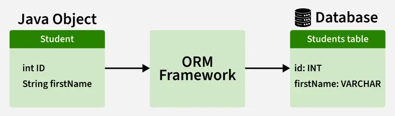

# Giới thiệu Hibernate

Hibernate là framework ORM mã nguồn mở cho Java, hỗ trợ ánh xạ giữa các lớp Java và bảng cơ sở dữ liệu. Điều này có nghĩa là bạn có thể thao tác dữ liệu từ Java sang database và ngược lại một cách dễ dàng, đồng thời đơn giản hóa các thao tác CRUD qua API hoặc HQL, giúp giảm code JDBC lặp lại.

## Các loại Hibernate

Hibernate cung cấp hai cách tiếp cận chính để làm việc với ORM:

-   **Hibernate Native**: Sử dụng trực tiếp các API và cấu hình riêng của Hibernate. Cách này cho phép truy cập đầy đủ các tính năng đặc thù của Hibernate, như HQL, caching, và các annotation riêng.

-   **Hibernate với JPA (Java Persistence API)**: Sử dụng Hibernate như một implementation của chuẩn JPA. Khi đó, bạn làm việc chủ yếu với các annotation, interface và API chuẩn của JPA, giúp ứng dụng dễ dàng chuyển đổi sang các implementation ORM khác nếu cần.

Việc lựa chọn giữa Hibernate Native và Hibernate - JPA phụ thuộc vào nhu cầu dự án: nếu cần tính linh hoạt và khả năng di động cao, nên dùng JPA; nếu muốn tận dụng tối đa các tính năng nâng cao của Hibernate, có thể dùng Hibernate Native.

**Lưu ý:** Ở tài liệu này, mình sẽ dùng Hibernate - JPA để tận dụng tính di động và chuẩn hóa.

## Tại sao sử dụng Hibernate?

Khi làm việc với JDBC, thường xảy ra một số thách thức:

### 1. **Vấn đề tính di động cơ sở dữ liệu**

Thay đổi cơ sở dữ liệu giữa chừng dự án là tốn kém vì code JDBC không có tính di động giữa các hệ thống cơ sở dữ liệu khác nhau.

### 2. **Xử lý Exception bắt buộc**

JDBC yêu cầu xử lý exception rõ ràng cho mọi thao tác cơ sở dữ liệu, điều này làm tăng độ phức tạp của code.

### 3. **Thiếu mối quan hệ cấp độ đối tượng**

JDBC hoạt động ở cấp độ bảng, vì vậy không có hỗ trợ trực tiếp cho việc quản lý các mối quan hệ đối tượng.

### 4. **Boilerplate Code**

Đối với mọi dự án, cần có code lặp lại cho các tác vụ như thiết lập kết nối, thực thi truy vấn và xử lý kết quả. Điều này làm tăng độ dài code và giảm khả năng đọc hiểu.

Để khắc phục các vấn đề trên, chúng ta sử dụng công cụ ORM tức là framework Hibernate. Bằng cách sử dụng Hibernate, chúng ta có thể tránh tất cả các vấn đề trên và tận hưởng một số tính năng bổ sung.

## Các tính năng chính của Hibernate JPA

### **ORM (Object-Relational Mapping)**

Ánh xạ các lớp Java tới các bảng cơ sở dữ liệu và các đối tượng Java tới các hàng, cho phép tương tác cơ sở dữ liệu theo hướng đối tượng.

### **Độc lập cơ sở dữ liệu**

Các ứng dụng Hibernate JPA có thể chạy trên nhiều cơ sở dữ liệu với ít thay đổi, cung cấp tính di động.

### **JPQL (Java Persistence Query Language)**

Khi sử dụng Hibernate JPA, bạn sẽ truy vấn dữ liệu bằng JPQL, một ngôn ngữ truy vấn hướng đối tượng, độc lập với cơ sở dữ liệu, cho phép thao tác dữ liệu thông qua các entity thay vì bảng.

### **Quản lý Transaction**

Hibernate JPA tích hợp với các transaction manager như JDBC hoặc JTA, cung cấp xử lý giao dịch nhất quán và đáng tin cậy thông qua API chuẩn của JPA.

### **Caching**

Hibernate JPA hỗ trợ caching cấp độ đầu tiên (entity manager) và có thể cấu hình caching cấp độ thứ hai để tăng hiệu suất truy cập dữ liệu.

### **Ánh xạ mối quan hệ**

Hibernate JPA cho phép ánh xạ các mối quan hệ đối tượng như one-to-one, one-to-many, many-to-one và many-to-many thông qua các annotation chuẩn của JPA.
