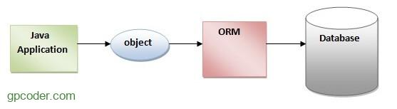
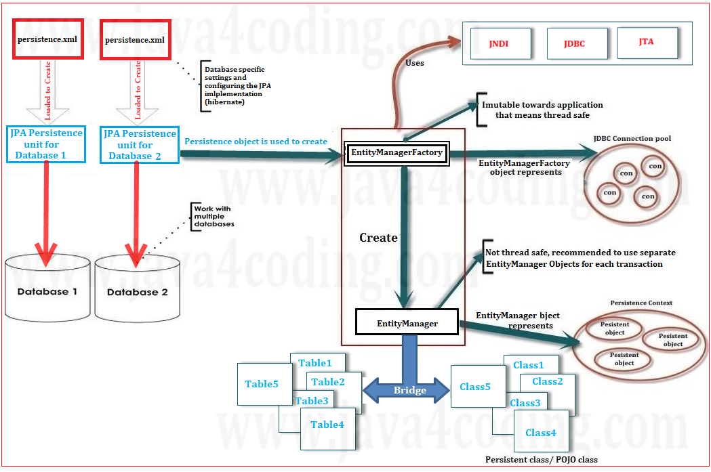

# Java Persistence API (JPA)

## Giới Thiệu JPA và Nền Tảng Lý Thuyết

### 1. JPA là gì?

Java Persistence API (JPA) là một đặc tả Java cho việc ánh xạ giữa các đối tượng Java với cơ sở dữ liệu quan hệ sử dụng công nghệ Object Relational Mapping (ORM). JPA không phải là một framework cụ thể, mà là một tập hợp các API chuẩn định nghĩa cách thức quản lý dữ liệu persistent trong các ứng dụng Java.



**Vai trò của JPA:**

-   Chuẩn hóa cách Java tương tác với tầng dữ liệu
-   Tách biệt logic nghiệp vụ khỏi chi tiết kỹ thuật của CSDL
-   Cung cấp tính portable giữa các ORM implementation khác nhau

### 2. Tầng Persistence trong Kiến Trúc Ứng Dụng

Trong kiến trúc 3-tier phổ biến:

-   **Presentation Layer**: Giao diện người dùng
-   **Business Logic Layer**: Logic nghiệp vụ
-   **Persistence Layer**: Quản lý dữ liệu và trạng thái

Tầng Persistence chịu trách nhiệm:

-   Lưu trữ và truy xuất dữ liệu
-   Đảm bảo tính toàn vẹn dữ liệu
-   Quản lý trạng thái của các đối tượng nghiệp vụ

### 3. Object-Relational Mapping (ORM)

ORM là kỹ thuật tự động chuyển đổi dữ liệu giữa hệ thống hướng đối tượng và cơ sở dữ liệu quan hệ:

-   **Đối tượng Java (Java Objects)**: Đại diện cho thực thể trong logic nghiệp vụ.
-   **Bảng CSDL (Database Tables)**: Nơi lưu trữ dữ liệu trong cơ sở dữ liệu quan hệ.

ORM giúp ánh xạ các đối tượng Java tới các bảng CSDL, cho phép thực hiện các thao tác CRUD (Create, Read, Update, Delete) một cách trực quan thông qua các phương thức của đối tượng.

### 4. Java Persistence API (JPA): Định nghĩa và Vai trò Chuẩn hóa

Java Persistence API (JPA) là một đặc tả (specification) của Java, không phải là một framework ORM cụ thể. Nó định nghĩa một tập hợp các API chuẩn để thực hiện ánh xạ đối tượng-quan hệ và quản lý các đối tượng bền vững (persistent objects).

Vai trò chính của JPA là đơn giản hóa công nghệ cho tầng persistence, giúp nhà phát triển không bị phụ thuộc vào một framework ORM độc quyền nào. Bằng cách sử dụng JPA, mã nguồn Java có thể tương thích với bất kỳ nhà cung cấp triển khai JPA nào (JPA Implementation) mà không cần thay đổi cấu trúc cơ bản. JPA đóng vai trò nền tảng trong cả môi trường Java EE/Jakarta EE và hệ sinh thái Spring hiện đại.

---

## Kiến Trúc JPA và Các Thành Phần Cốt Lõi

### 1. Kiến trúc JPA: Đặc tả và Giao diện API

Kiến trúc JPA dựa trên một số thành phần cốt lõi để quản lý vòng đời của Entity và tương tác với CSDL. Các thành phần chính bao gồm:



#### 1. ENTITY

**Vai trò:** Đại diện cho các bảng trong database dưới dạng đối tượng Java

```java
@Entity
@Table(name = "users")
public class User {
    @Id
    @GeneratedValue(strategy = GenerationType.IDENTITY)
    private Long id;
    private String name;
    private String email;
    // getters, setters, constructor
}
```

**Đặc điểm:**

-   Class Java thông thường với annotation `@Entity`
-   Mỗi instance Entity = 1 hàng trong bảng database
-   Chứa logic nghiệp vụ và quan hệ với Entity khác

#### 2. PERSISTENCE UNIT

**Vai trò:** Định nghĩa NHÓM cấu hình cho một tập hợp Entity

```xml
<!-- META-INF/persistence.xml -->
<persistence-unit name="myAppPersistenceUnit"
                  transaction-type="RESOURCE_LOCAL">
    <!-- Danh sách Entity (có thể auto-scan) -->
    <class>com.example.User</class>
    <class>com.example.Product</class>

    <!-- Cấu hình database -->
    <properties>
        <property name="javax.persistence.jdbc.url"
                  value="jdbc:mysql://localhost:3306/myapp"/>
        <property name="hibernate.dialect"
                  value="org.hibernate.dialect.MySQL8Dialect"/>
    </properties>
</persistence-unit>
```

**Đặc điểm:**

-   KHÔNG phải là class Java, mà là file cấu hình XML
-   Một ứng dụng có thể có nhiều Persistence Unit
-   Quyết định kết nối database nào, Entity nào thuộc cùng nhóm

#### 3. ENTITY MANAGER FACTORY

**Vai trò:** Tạo ra các EntityManager - đây là đối tượng NẶNG, tốn tài nguyên

```java
// Chỉ khởi tạo 1 LẦN duy nhất khi app start
public class JPAUtil {
    private static final EntityManagerFactory emf;

    static {
        emf = Persistence.createEntityManagerFactory("myAppPersistenceUnit");
    }

    public static EntityManager getEntityManager() {
        return emf.createEntityManager();
    }
}
```

**Đặc điểm:**

-   Thread-safe: nhiều thread có thể dùng chung một instance
-   Mỗi Persistence Unit ↔ 1 EntityManagerFactory
-   Nên dùng Singleton pattern để quản lý

#### 4. ENTITY MANAGER

**Vai trò:** Thực hiện các thao tác CRUD và quản lý vòng đời Entity

```java
// Mỗi request tạo một EntityManager MỚI
EntityManager em = emf.createEntityManager();
try {
    em.getTransaction().begin();

    // CRUD operations
    User user = em.find(User.class, 1L);        // READ
    em.persist(newUser);                        // CREATE
    user.setName("New Name");                   // UPDATE (automatic)
    em.remove(user);                            // DELETE

    em.getTransaction().commit();
} finally {
    em.close();  // QUAN TRỌNG: đóng sau mỗi request
}
```

#### 5. PERSISTENCE CONTEXT

**Vai trò:** Vùng nhớ tạm theo dõi trạng thái Entity trong một phiên làm việc

```java
EntityManager em = emf.createEntityManager();
// Khi EntityManager được tạo → Persistence Context tự động được tạo

// Tìm user lần 1 - đưa vào Persistence Context
User user1 = em.find(User.class, 1L);

// Tìm user lần 2 - lấy từ Persistence Context (không query DB)
User user2 = em.find(User.class, 1L);

// user1 và user2 là CÙNG instance object
System.out.println(user1 == user2); // true
```

**Tính năng quan trọng:**

-   Identity Guarantee: Đảm bảo mỗi Entity instance chỉ tồn tại 1 lần trong context
-   Dirty Checking: Tự động phát hiện thay đổi và update xuống DB khi commit
-   Transactional Write-Behind: Trì hoãn các câu lệnh SQL đến lúc commit

#### 6. QUERY LANGUAGE (JPQL)

**Vai trò:** Truy vấn dữ liệu theo hướng đối tượng thay vì bảng

```java
// JPQL - truy vấn theo Entity, không phải table
TypedQuery<User> query = em.createQuery(
    "SELECT u FROM User u WHERE u.name LIKE :name", User.class);
query.setParameter("name", "%John%");
List<User> users = query.getResultList();
```

#### 7. DATABASE LAYER

**Vai trò:** Nơi lưu trữ vật lý dữ liệu

-   JPA che giấu sự khác biệt giữa các database
-   Hibernate Dialect xử lý sự khác biệt cú pháp SQL

---

### 📊 SO SÁNH ĐẶC ĐIỂM QUAN TRỌNG

| Thành phần           | Số lượng               | Thread-safe | Thời gian sống   | Tài nguyên |
| -------------------- | ---------------------- | ----------- | ---------------- | ---------- |
| EntityManagerFactory | 1 per Persistence Unit | ✅ CÓ       | Toàn bộ ứng dụng | NẶNG       |
| EntityManager        | N (mỗi request 1 cái)  | ❌ KHÔNG    | Một request      | NHẸ        |
| Persistence Context  | 1 per EntityManager    | ❌ KHÔNG    | Một request      | TRUNG BÌNH |
| Entity               | N (tùy dữ liệu)        | ❌ KHÔNG    | Managed/Detached | NHẸ        |
