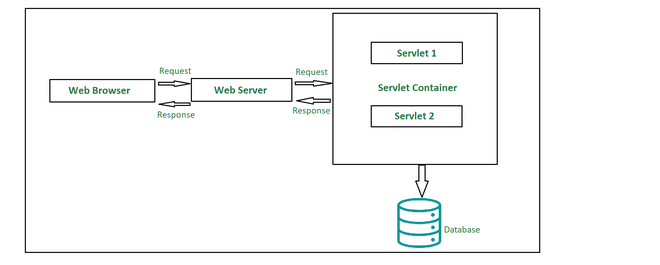
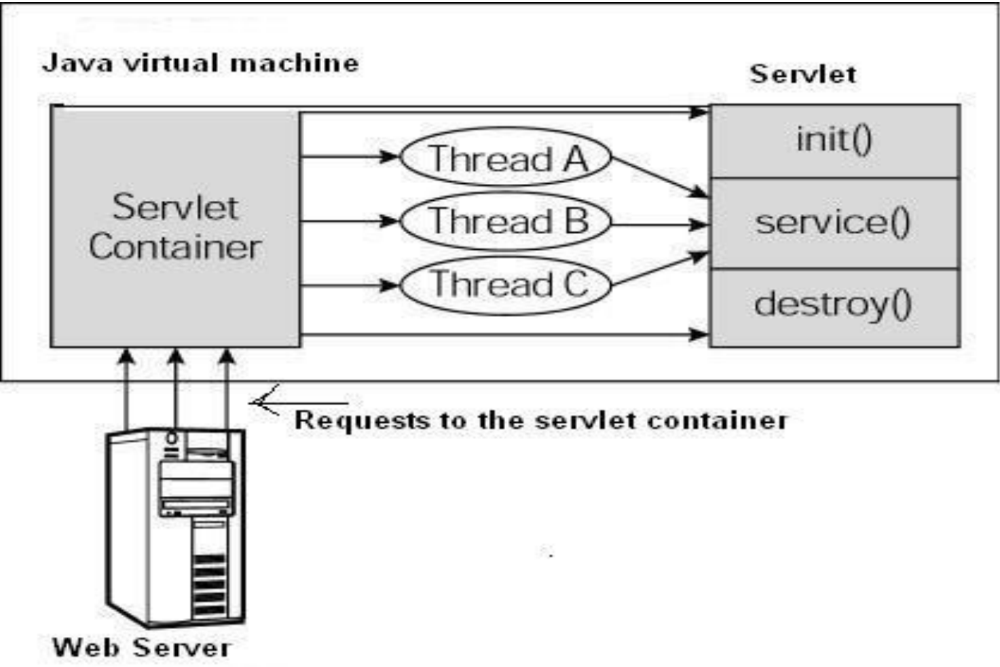

## **Servlet là gì?**

### **Khái niệm Kiến trúc**

**Servlet** là một **thành phần logic phía server** được định nghĩa bởi đặc tả Servlet, chịu trách nhiệm **xử lý các yêu cầu HTTP và tạo nội dung động**. Ở mức kiến trúc, servlet đại diện cho một đơn vị xử lý (processing unit) với các trách nhiệm:

-   **Nhận và xử lý yêu cầu HTTP** (GET, POST, PUT, DELETE...)
-   **Thực hiện logic nghiệp vụ** hoặc điều phối với các service layer
-   **Tạo và trả về phản hồi HTTP** cho client
-   **Quản lý vòng đời** thông qua các giai đoạn khởi tạo, xử lý, và hủy bỏ

### **Triển khai Cụ thể**

Trong thực tế, servlet thường được **triển khai dưới dạng lớp Java** kế thừa từ `HttpServlet` hoặc implement interface `javax.servlet.Servlet`, với các phương thức `init()`, `service()` (hoặc `doGet()`/`doPost()`), và `destroy()` để quản lý vòng đời.

## **Các thành phần trong kiến trúc Servlet**

### **Kiến trúc Tổng quan (Architectural View)**

1. **Client (Presentation Layer)**  
   **Client** trong kiến trúc trên là **trình duyệt web**, chủ yếu đóng vai trò là **trung gian gửi các yêu cầu HTTP** đến **web server**. Web server sẽ tạo ra **phản hồi** dựa trên quá trình xử lý trong **servlet** và Client sẽ tiếp tục xử lý phản hồi đó.

2. **Web Server (Static Content & Reverse Proxy)**  
   Nhiệm vụ chính của **web server** là **xử lý các yêu cầu và phản hồi** mà người dùng gửi đến, đồng thời **quản lý cách người dùng truy cập các tệp** đã được lưu trữ trên server. Web server ở đây là **phần mềm quản lý quyền truy cập vào tài nguyên hoặc dịch vụ tập trung trong mạng**. Có hai loại web server chính:

-   **Web server tĩnh**
-   **Web server động**

3. **Servlet Container (Runtime Environment)**  
   **Servlet Container** là **môi trường thực thi chuyên dụng** để quản lý và chạy các servlet. Nó cung cấp **runtime services** cho servlet: nhận yêu cầu HTTP, khởi tạo/gọi servlet tương ứng, và trả về kết quả cho client.

### **Triển khai Cụ thể (Implementation Details)**

1. **Client**: Gửi yêu cầu HTTP đến web server.
2. **Web Server**: Nhận yêu cầu, có thể trả về nội dung tĩnh hoặc chuyển tiếp đến servlet.
3. **Servlet Container**: Nhận yêu cầu từ web server, xác định servlet nào xử lý, và gọi các phương thức tương ứng (`init()`, `service()`, `destroy()`).
4. **Servlet**: Xử lý yêu cầu, thực hiện logic nghiệp vụ, và tạo phản hồi.
5. **Web Server**: Nhận phản hồi từ servlet container và gửi lại cho client.

## **Apache Tomcat**

### **Định vị trong Kiến trúc**

**Apache Tomcat** là một **triển khai cụ thể** của Servlet Container, đóng vai trò là **Web Application Server** chuyên dụng cho các ứng dụng Java web.

**Kiến trúc**: Tomcat cung cấp môi trường thực thi cho các thành phần web logic (Servlet, JSP, Filter)

**Triển khai**: Bao gồm các thành phần như Catalina (Servlet engine), Coyote (HTTP connector), Jasper (JSP compiler)

**Ưu điểm của Tomcat:**

-   **Miễn phí và mã nguồn mở**
-   **Nhẹ và tập trung vào web tier** (Servlet/JSP)
-   **Dễ cấu hình và triển khai**
-   **Cộng đồng rộng lớn và ổn định**
-   **Tích hợp engine HTTP** (Coyote) để xử lý request

**Servlet với khả năng xử lý đa luồng và tính di động** là lựa chọn tốt hơn so với CGI truyền thống. **Servlet xử lý yêu cầu và phản hồi một cách động**, phù hợp cho việc phát triển ứng dụng web cần **hỗ trợ đa giao thức** và **hiệu suất cao**.

### **Vòng đời Servlet và xử lý đa luồng**

#### **Khái niệm Thread Safety**

> **Quan trọng**: Một servlet instance thường được chia sẻ giữa nhiều thread xử lý request đồng thời. **Tuyệt đối không sử dụng instance variables mutable** trong servlet mà không đồng bộ hóa, vì có thể gây ra race condition.

Hình trên mô tả **luồng xử lý đa thread**:

-   **Các yêu cầu HTTP** gửi đến server được **Servlet Container tiếp nhận**.
-   **Container tải servlet** (nếu chưa được tải) và **gọi phương thức `init()`** một lần duy nhất.
-   **Container xử lý nhiều yêu cầu đồng thời** bằng cách **tạo nhiều luồng**, mỗi luồng thực thi phương thức `service()` của cùng một servlet instance.
-   **Mỗi luồng có đối tượng request và response riêng**, đảm bảo xử lý an toàn và hiệu quả.
