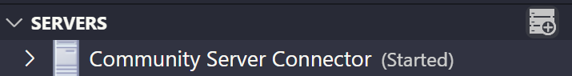
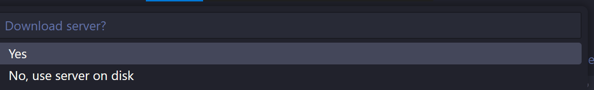

# Hướng dẫn thiết lập Apache Tomcat với VS Code và Eclipse

> **Tài liệu này hướng dẫn cách cài đặt và tích hợp server Apache Tomcat 11 vào hai môi trường phát triển (IDE) phổ biến: Visual Studio Code và Eclipse để chạy ứng dụng Java Servlet.**

## Mục lục

1. [Chuẩn bị cần thiết](#chuẩn-bị-cần-thiết)
2. [Tích hợp Tomcat vào Visual Studio Code](#tích-hợp-tomcat-vào-visual-studio-code)
3. [Tích hợp Tomcat vào Eclipse IDE](#tích-hợp-tomcat-vào-eclipse-ide)
4. [Mã nguồn tham khảo (Servlet & pom.xml)](#mã-nguồn-tham-khảo-servlet--pomxml)

---

## 1. Chuẩn bị cần thiết

Trước khi bắt đầu, hãy đảm bảo bạn đã tải và cài đặt Tomcat Apache và JDK phù hợp

---

## 2. Tích hợp Tomcat vào Visual Studio Code

VS Code sử dụng extension để quản lý các server ứng dụng. Chúng ta sẽ dùng **Community Server Connectors**.

### Bước 1: Cài đặt Extension

1. Mở VS Code.
2. Vào mục **Extensions** (`Ctrl+Shift+X`).
3. Tìm kiếm **Community Server Connectors** (của Red Hat) và nhấn **Install**.
4. Sau khi cài đặt, bạn sẽ thấy mục **SERVERS** ở thanh Explorer.

### Bước 2: Thêm Server Tomcat

1. Trong mục **SERVERS**, nhấn vào biểu tượng dấu `+` để thêm server mới.  
   
2. Khi xuất hiện tùy chọn ở phía trên, chọn **No, use server on disk** nếu bạn đã tải Tomcat về máy.  
   
3. Chọn đường dẫn tới thư mục gốc của Tomcat (nơi chứa thư mục `bin`), sau đó xác nhận để hoàn tất thêm server.

### Bước 3: Tạo và Chạy dự án

1. Tạo một project Maven webapp đơn giản.
2. Tạo file `HelloServlet.java` (xem code mẫu bên dưới).
3. Trong mục **SERVERS**, chuột phải vào server Tomcat vừa tạo và chọn **Add Deployment**.
4. Chọn project của bạn.
5. Sau khi deploy, chuột phải vào server và chọn **Start** để khởi động.
6. Truy cập `http://localhost:8080/ten-project/hello` để xem kết quả.

---

## 3. Tích hợp Tomcat vào Eclipse IDE

**Eclipse IDE for Enterprise Java and Web Developers** đã có sẵn công cụ để tích hợp server.

### Bước 1: Mở View "Servers"

1. Mở Eclipse IDE.
2. Vào menu **Window → Show View → Other...**.
3. Tìm và mở view **Servers**.

### Bước 2: Thêm Server Tomcat

1. Trong cửa sổ **Servers**, click vào liên kết `"No servers are available. Click this link to create a new server..."`.
2. Chọn **Apache → Tomcat v11.0 Server** và nhấn **Next**.
3. Nhấn **Browse...** và trỏ đến thư mục Tomcat đã giải nén.
4. Nhấn **Finish**. Server Tomcat sẽ xuất hiện trong view **Servers**.

### Bước 3: Tạo và Chạy dự án

1. Tạo một project Maven webapp (**File > New > Maven Project**).
2. Tạo file `HelloServlet.java` (xem code mẫu bên dưới).
3. Chuột phải vào project trong **Project Explorer**.
4. Chọn **Run As → Run on Server**.
5. Chọn server Tomcat đã cấu hình và nhấn **Finish**.
6. Eclipse sẽ tự động build, deploy và khởi động server. Một tab trình duyệt nội bộ sẽ mở ra hiển thị kết quả.

---

## 4. Mã nguồn tham khảo (Servlet & pom.xml)

Đây là mã nguồn cho một project Maven webapp đơn giản.

### `pom.xml`

_Cấu hình project để sử dụng Java 17 và Jakarta Servlet API._

```xml
<project xmlns="http://maven.apache.org/POM/4.0.0"
            xmlns:xsi="http://www.w3.org/2001/XMLSchema-instance"
            xsi:schemaLocation="http://maven.apache.org/POM/4.0.0 http://maven.apache.org/xsd/maven-4.0.0.xsd">
     <modelVersion>4.0.0</modelVersion>
     <groupId>com.example</groupId>
     <artifactId>mywebapp</artifactId>
     <version>1.0</version>
     <packaging>war</packaging>

     <properties>
          <project.build.sourceEncoding>UTF-8</project.build.sourceEncoding>
          <maven.compiler.source>17</maven.compiler.source>
          <maven.compiler.target>17</maven.compiler.target>
     </properties>

     <dependencies>
          <dependency>
                <groupId>jakarta.platform</groupId>
                <artifactId>jakarta.jakartaee-web-api</artifactId>
                <version>10.0.0</version>
                <scope>provided</scope>
          </dependency>
     </dependencies>

     <build>
          <finalName>mywebapp</finalName>
          <plugins>
                <plugin>
                     <artifactId>maven-war-plugin</artifactId>
                     <version>3.4.0</version>
                </plugin>
          </plugins>
     </build>
</project>
```

### `src/main/java/com/example/HelloServlet.java`

_Sử dụng annotation `@WebServlet` để khai báo servlet._

```java
package com.example;

import jakarta.servlet.annotation.WebServlet;
import jakarta.servlet.http.HttpServlet;
import jakarta.servlet.http.HttpServletRequest;
import jakarta.servlet.http.HttpServletResponse;
import java.io.IOException;
import java.io.PrintWriter;

@WebServlet("/hello")
public class HelloServlet extends HttpServlet {
     protected void doGet(HttpServletRequest request, HttpServletResponse response) throws IOException {
          response.setContentType("text/html;charset=UTF-8");
          try (PrintWriter out = response.getWriter()) {
                out.println("<html><body>");
                out.println("<h1>Hello from Apache Tomcat 11!</h1>");
                out.println("<p>IDE integration is successful.</p>");
                out.println("</body></html>");
          }
     }
}
```

| Thành phần    | Ý nghĩa                                       |
| ------------- | --------------------------------------------- |
| `@WebServlet` | Định nghĩa URL pattern cho servlet (`/hello`) |
| `doGet`       | Xử lý HTTP GET request                        |
| `PrintWriter` | Ghi nội dung HTML trả về cho client           |
