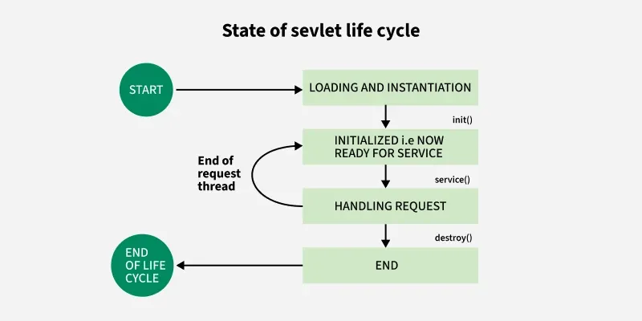

# Vòng đời Servlet Instance



## Servlet Container - Người quản lý vòng đời

**Servlet Container** (như Apache Tomcat) là **môi trường thực thi chuyên dụng** chịu trách nhiệm quản lý toàn bộ vòng đời của servlet instance:

-   **Tạo và khởi tạo** servlet instance khi cần thiết
-   **Quản lý lifecycle** từ init đến destroy
-   **Phân phối request** đến servlet instance thông qua các thread
-   **Cung cấp runtime services** như HttpServletRequest và HttpServletResponse

### Ai tạo ra Servlet Instance?

**Servlet Container** tự động tạo servlet instance dựa trên:

-   **URL pattern mapping** trong `web.xml` hoặc annotation `@WebServlet`
-   **Lazy loading**: Instance được tạo khi có request đầu tiên đến servlet đó
-   **Load-on-startup**: Có thể cấu hình để tạo instance ngay khi container khởi động

## Vòng đời của Servlet Instance

Vòng đời của một servlet instance bắt đầu từ khi đối tượng được tạo ra cho đến khi bị hủy bỏ. Các bước chính:

-   **Container tạo servlet instance** và gọi phương thức **init()** (chỉ gọi một lần).
-   **Container phân phối request** đến servlet thông qua **service()**, gọi **doGet()**, **doPost()**, v.v. tùy loại request.
-   Khi **container shutdown**, phương thức **destroy()** được gọi (chỉ một lần).
-   Đối tượng servlet sau đó sẽ được thu gom rác bởi JVM.

### Phương thức **init()** - Container Initialization

**Servlet Container gọi init()** một lần duy nhất khi servlet instance được tạo. Container truyền vào ServletConfig object chứa thông tin cấu hình.

```java
public void init(ServletConfig config) throws ServletException {
    super.init(config); // Gọi init() của lớp cha
    // Container cung cấp ServletConfig
    // Mã khởi tạo tài nguyên dùng chung...
}
```

### Phương thức **service()** - Container Request Dispatch

**Container gọi service()** mỗi khi có request đến. Container tạo HttpServletRequest và HttpServletResponse objects, sau đó gọi service() trong thread riêng biệt.

```java
public void service(ServletRequest request,
                   ServletResponse response)
    throws ServletException, IOException {
    // Container tạo request/response objects
    // Container gọi method này trong thread pool
    // Xử lý request
}
```

### Phương thức **doGet()** và **doPost()** - HTTP Method Routing

**Container routing request** dựa trên HTTP method. Service() method sẽ gọi doGet(), doPost() tương ứng.

```java
public void doGet(HttpServletRequest request,
                  HttpServletResponse response)
    throws ServletException, IOException {
    // Container đã phân loại đây là GET request
    // Xử lý GET
}

public void doPost(HttpServletRequest request,
                   HttpServletResponse response)
    throws ServletException, IOException {
    // Container đã phân loại đây là POST request
    // Xử lý POST
}
```

### Phương thức **destroy()** - Container Cleanup

**Container gọi destroy()** một lần duy nhất khi servlet instance kết thúc vòng đời (thường khi container shutdown).

```java
public void destroy() {
    // Container thông báo servlet sắp bị hủy
    // Dọn dẹp tài nguyên trước khi container remove instance
}
```

## Thread Safety và Shared Instance

**Servlet Container quản lý thread pool** và **chỉ tạo một instance servlet** cho mỗi servlet class. Container sử dụng **multi-threading** để xử lý đồng thời nhiều request:

```java
ServletInstance (shared - managed by Container)
├── Container Thread-1 → doGet(request1, response1)
├── Container Thread-2 → doPost(request2, response2)
└── Container Thread-3 → doGet(request3, response3)
```

> **Cảnh báo Thread Safety**: Vì Container chia sẻ một servlet instance giữa nhiều thread, **không sử dụng instance variables mutable** cho dữ liệu riêng từng request. Container không đảm bảo synchronization cho instance variables.

### Container vs Servlet Responsibilities

| **Servlet Container**            | **Servlet**                     |
| -------------------------------- | ------------------------------- |
| Tạo/hủy servlet instance         | Implement business logic        |
| Quản lý lifecycle (init/destroy) | Xử lý request/response          |
| Tạo request/response objects     | Định nghĩa doGet/doPost methods |
| Thread pool management           | Thread-safe implementation      |
| URL mapping & routing            | Application-specific processing |

## 📝 Ghi chú bổ sung: ServletRequest vs HttpServletRequest

### 1. **ServletRequest vs HttpServletRequest**

#### **ServletRequest**

-   **Interface gốc** trong Servlet API
-   **Mục đích**: Trừu tượng hóa một request bất kỳ (HTTP, RMI, CORBA, hay giao thức khác)
-   **Chứa thông tin cơ bản**: input stream, attributes, parameter map, locale, v.v.

#### **HttpServletRequest**

-   **Sub-interface** của ServletRequest
-   **Chuyên biệt cho HTTP protocol**
-   **Bổ sung các method HTTP-specific**: `getHeader()`, `getCookies()`, `getMethod()`, `getSession()`, `getRequestURI()`, v.v.

> **Tóm lại**: ServletRequest = generic, giao thức-agnostic. HttpServletRequest = dành riêng cho HTTP.

### 2. **Tại sao service() method dùng ServletRequest?**

```java
// javax.servlet.Servlet interface
void service(ServletRequest req, ServletResponse res)
```

-   **Lý do thiết kế**: Servlet ban đầu **không chỉ nhắm HTTP**, mà là mô hình trừu tượng cho server-side component
-   **Generic approach**: Có thể cắm vào nhiều loại container khác nhau
-   **Container implementation**: Tomcat, Jetty override lại `service()` và **downcast** ServletRequest → HttpServletRequest

### 3. **Tại sao doGet(), doPost() dùng HttpServletRequest?**

```java
// HttpServlet class
protected void doGet(HttpServletRequest req, HttpServletResponse res)
```

-   **Ngữ cảnh HTTP**: Đã chắc chắn là HTTP request, không cần giữ generic
-   **Container routing**: `service()` trong HttpServlet dispatch:
    -   GET request → gọi `doGet()`
    -   POST request → gọi `doPost()`
    -   PUT, DELETE, HEAD, OPTIONS tương tự

### 4. **Filter cũng dùng ServletRequest**

```java
// Filter interface
void doFilter(ServletRequest request, ServletResponse response, FilterChain chain)
```

-   **Apply trước servlet**: Filter được áp dụng trước khi request vào Servlet
-   **Generic design**: Lý thuyết có thể dùng cho mọi loại Servlet
-   **Thực tế casting**: Trong web app, thường cast:

```java
HttpServletRequest httpReq = (HttpServletRequest) request;
```

### **Tóm tắt Pattern**

| **Component**                | **Method Signature**                  | **Lý do**                      |
| ---------------------------- | ------------------------------------- | ------------------------------ |
| `Servlet.service()`          | `ServletRequest`                      | Generic, giao thức-independent |
| `HttpServlet.doGet/doPost()` | `HttpServletRequest`                  | HTTP-specific context          |
| `Filter.doFilter()`          | `ServletRequest`                      | Pre-servlet, generic design    |
| **Runtime**                  | Luôn là `HttpServletRequest` instance | Web container environment      |

> **Container Pattern**: Container tạo HttpServletRequest instance, nhưng pass qua ServletRequest interface để maintain generic contract.
