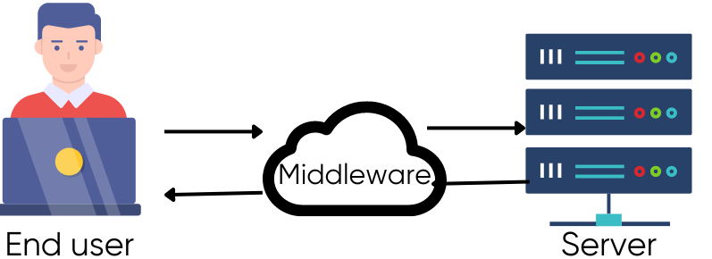

# Middleware trong Servlet - Cơ chế Filter

## 1. Filter trong Kiến trúc Servlet

### Vai trò Middleware của Filter

Trong kiến trúc Servlet, **Filter** đóng vai trò như một lớp middleware nằm giữa client và Servlet. Filter cho phép:

-   Chặn và xử lý request/response trước khi đến Servlet
-   Thực hiện các tác vụ cross-cutting như authentication, logging, hoặc data transformation
-   Kiểm soát luồng xử lý thông qua cơ chế FilterChain



Filter giúp tách biệt các logic chung ra khỏi Servlet, tăng tính modular và dễ bảo trì cho ứng dụng web Java.

## 2. Filter Lifecycle - Container Management

### Container quản lý vòng đời Filter

Tương tự như Servlet, **Container hoàn toàn quản lý** vòng đời của Filter:

```java
// Container tự động gọi các phương thức này
public void init(FilterConfig config) throws ServletException {
    // Container gọi một lần khi filter được load
}

public void doFilter(ServletRequest request, ServletResponse response,
                    FilterChain chain) throws IOException, ServletException {
    // Container gọi mỗi khi có request match URL pattern
    // Container cung cấp FilterChain để continue
}

public void destroy() {
    // Container gọi khi shutdown
}
```

### Thread Safety trong Filter

**Cảnh báo**: Giống như Servlet, **Filter instance được shared** giữa nhiều threads:

```java
Filter Instance (shared - managed by Container)
├── Container Thread-1 → doFilter(request1, response1, chain)
├── Container Thread-2 → doFilter(request2, response2, chain)
└── Container Thread-3 → doFilter(request3, response3, chain)
```

> **Quan trọng**: Không sử dụng instance variables mutable trong Filter để tránh race condition.

## 3. FilterChain - Container Mechanism

### Container xây dựng FilterChain

**Servlet Container** tự động tạo FilterChain dựa trên:

-   URL pattern mapping trong `web.xml` hoặc `@WebFilter`
-   Thứ tự khai báo filter-mapping
-   Cuối chain luôn là Servlet target

```java
// Container pattern cho FilterChain
chain.doFilter(request, response); // Container tiếp tục chain
```
