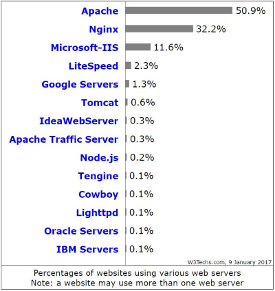
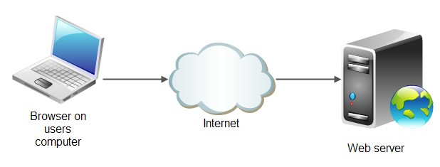
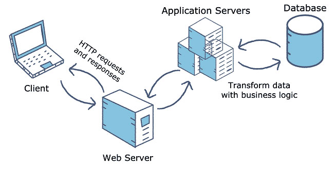

# Tổng hợp kiến thức về Web Server và App Server

## 1. Web Server là gì?

Web server là máy chủ cài đặt các chương trình phục vụ ứng dụng web. Nó tiếp nhận request từ trình duyệt và gửi phản hồi đến client thông qua giao thức HTTP hoặc các giao thức khác. Web server chủ yếu phục vụ nội dung tĩnh như HTML, CSS, JS, hình ảnh.

### Một số web server phổ biến:

-   **Apache HTTP Server**: Mã nguồn mở, chạy trên nhiều hệ điều hành, chiếm thị phần lớn.
-   **Nginx**: Nhẹ, hiệu suất cao, hỗ trợ reverse proxy, virtual hosting, HTTPS, IPv6,...
-   **IIS (Internet Information Services)**: Do Microsoft phát triển, tích hợp với Windows Server, hỗ trợ ASP.NET.
-   **Lighttpd**: Nhẹ, bảo mật, miễn phí, chạy trên nhiều hệ điều hành.

> **Lưu ý**: Tomcat không phải “web server truyền thống” như Nginx hay Apache HTTP Server. Chính xác hơn, Tomcat là một **servlet container/web application server** chuyên dùng để chạy ứng dụng Java dựa trên Servlet/JSP. Để hiểu rõ hơn về vai trò, kiến trúc và sự khác biệt giữa Tomcat và các web server truyền thống, xem chi tiết tại [Apache Tomcat: Định nghĩa, Vai trò và Kiến trúc](apache-tomcat.md).

### Cách hoạt động của web server:

1. Trình duyệt phân giải tên miền thành địa chỉ IP qua DNS.
2. Trình duyệt gửi request đến web server.
3. Web server xử lý và gửi lại nội dung trang web (hoặc thông báo lỗi nếu không tồn tại).
4. Trình duyệt nhận dữ liệu và hiển thị trang web cho người dùng.

## 2. App Server là gì?

App server (application server/máy chủ ứng dụng) là framework phần mềm cho phép tạo, vận hành và host các ứng dụng web, cung cấp môi trường chạy cho chúng. App server thường nằm giữa tầng web server và tầng backend (database server), kết nối giữa cơ sở dữ liệu và người dùng/ứng dụng thông qua các giao thức và API.

### Đặc điểm của app server:

-   Chạy các tác vụ tính toán, xử lý logic nghiệp vụ.
-   Hỗ trợ giao dịch, tổng hợp kết nối cơ sở dữ liệu, nhắn tin, bảo mật, xác thực, quản lý truy cập.
-   Có thể tích hợp hoặc chứa web server bên trong.
-   Hỗ trợ tính sẵn sàng cao, phân cụm, cân bằng tải, dự phòng, mở rộng quy mô.

### Một số app server phổ biến:

-   **Java EE**: WebLogic, GlassFish, JBoss EAP, **Apache Tomcat** (lightweight)
-   **.NET**: IIS với ASP.NET Core
-   **Node.js**: Express.js, Koa.js
-   **Python**: Django, Flask với WSGI servers

### Lợi ích khi sử dụng app server:

-   Tích hợp với web server và database server, đảm bảo tính toàn vẹn code/dữ liệu.
-   Cung cấp lớp bảo mật bổ sung, chống tấn công như SQL injection.
-   Quản lý xác thực tập trung, kiểm soát truy cập.
-   Tăng hiệu suất, khả năng mở rộng, tổng hợp kết nối database.

## 3. So sánh Web Server và App Server

| Tiêu chí         | Web Server (Nginx, Apache HTTP)        | App Server (Tomcat, JBoss)             |
| ---------------- | -------------------------------------- | -------------------------------------- |
| Chức năng chính  | Phục vụ nội dung tĩnh, reverse proxy   | Xử lý logic nghiệp vụ, ứng dụng động   |
| Nội dung phục vụ | HTML, CSS, JS, hình ảnh                | Ứng dụng web, API, dịch vụ động        |
| Deployment       | Frontend cho app server                | Backend xử lý business logic           |
| Tối ưu cho       | I/O throughput, concurrent connections | CPU-intensive processing, transactions |
