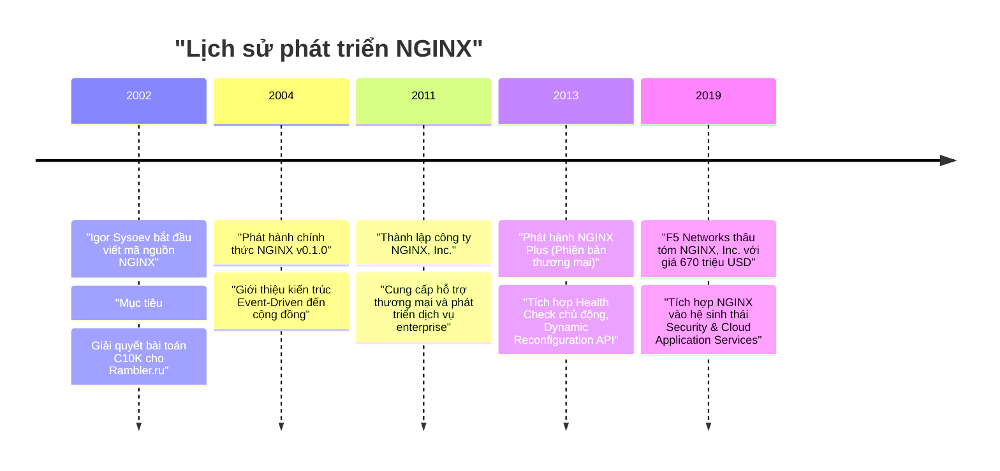
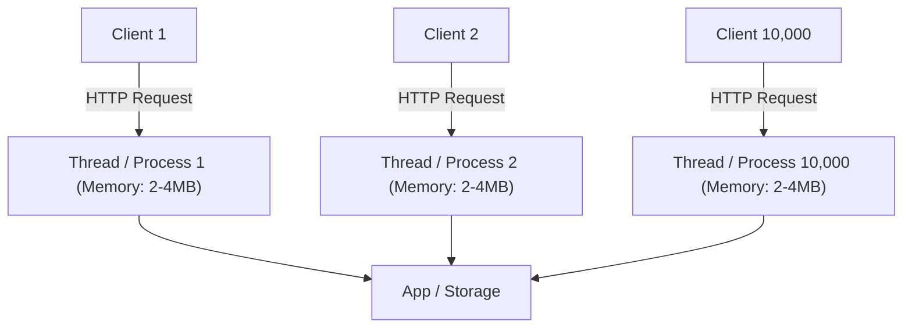
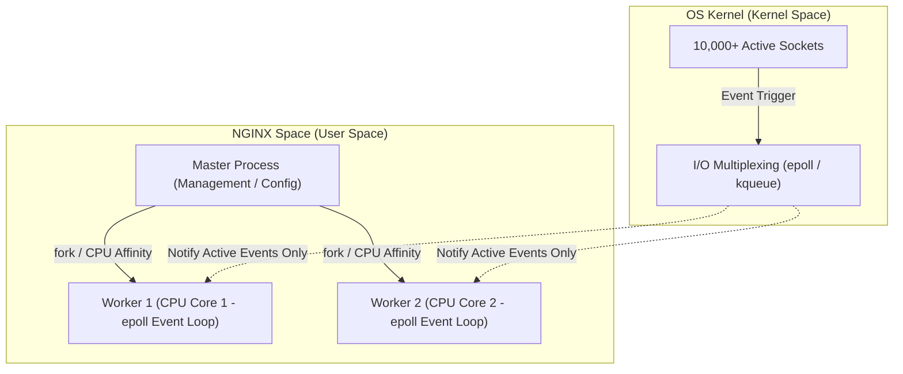

# Chương 1. Giới thiệu về NGINX & Bài toán C10K

Chương này trình bày định nghĩa NGINX, lịch sử hình thành, bản chất bài toán C10K — thách thức từng làm suy sụp hạ tầng Web truyền thống —, bước ngoặt lịch sử từ I/O Multiplexing của nhân hệ điều hành, các mục tiêu thiết kế cốt lõi và sự khác biệt giữa phiên bản NGINX Open Source với NGINX Plus.

## Mục lục

- [1.1 NGINX là gì?](#11-nginx-là-gì)
- [1.2 Lịch sử ra đời & Nguồn gốc tên gọi](#12-lịch-sử-ra-đời--nguồn-gốc-tên-gọi)
- [1.3 Bài toán C10K & Sự sụp đổ của mô hình truyền thống](#13-bài-toán-c10k--sự-sụp-đổ-của-mô-hình-truyền-thống)
- [1.4 Bước ngoặt lịch sử: I/O Multiplexing & Kiến trúc Multi-Worker](#14-bước-ngoặt-lịch-sử-io-multiplexing--kiến-trúc-multi-worker)
- [1.5 Mục tiêu thiết kế cốt lõi của NGINX](#15-mục-tiêu-thiết-kế-cốt-lõi-của-nginx)
- [1.6 NGINX Open Source vs NGINX Plus](#16-nginx-open-source-vs-nginx-plus)

---

## 1.1 NGINX là gì?

**NGINX** (phát âm là *"Engine-X"*) là một phần mềm máy chủ mã nguồn mở hiệu năng cao, được thiết kế ban đầu để phục vụ các tệp tĩnh với tốc độ tối đa và xử lý hàng chục nghìn kết nối đồng thời với lượng tài nguyên hệ thống (CPU & RAM) cực kỳ tối thiểu.

Theo thời gian, NGINX đã phát triển thành một giải pháp đa năng đóng vai trò trung tâm trong hạ tầng công nghệ hiện đại:
- **Web Server**: Phục vụ nội dung tĩnh và xử lý yêu cầu HTTP/HTTPS.
- **Reverse Proxy**: Làm trung gian tiếp nhận yêu cầu từ client và chuyển tiếp an toàn đến các ứng dụng backend.
- **Load Balancer**: Phân phối lưu lượng truy cập qua nhiều máy chủ nội bộ ở cả tầng L4 (TCP/UDP) và L7 (HTTP/gRPC).
- **API Gateway**: Quản lý, xác thực, điều hướng và giới hạn tốc độ (rate limiting) cho các dịch vụ microservices.
- **Content Cache**: Bộ đệm lưu trữ nội dung tĩnh/động giúp giảm tải triệt để cho cơ sở dữ liệu và backend servers.

---

## 1.2 Lịch sử ra đời & Nguồn gốc tên gọi

NGINX được phát triển vào năm 2002 bởi kỹ sư phần mềm người Nga **Igor Sysoev** trong thời gian ông làm việc tại Rambler (một trong những trang web cổng thông tin lớn nhất nước Nga thời điểm đó). Phiên bản mã nguồn mở chính thức được phát hành vào tháng 10 năm 2004.

Sơ đồ trên tóm tắt các cột mốc lịch sử quan trọng trong quá trình hình thành và phát triển của NGINX từ một dự án cá nhân đến khi trở thành chuẩn mực hạ tầng web toàn cầu.

**Nguồn gốc tên gọi:** Tên gọi **NGINX** xuất phát từ thuật ngữ *"Engine-X"*, hàm ý về một bộ máy động cơ (Engine) có khả năng mở rộng không giới hạn (biểu tượng $X$).

---

## 1.3 Bài toán C10K & Sự sụp đổ của mô hình truyền thống

Thuật ngữ **C10K** (Concurrent 10,000 Connections) được chuyên gia **Dan Kegel** đưa ra vào năm 1999 để mô tả thách thức kỹ thuật: *Làm thế nào để một máy chủ web duy nhất có thể xử lý đồng thời 10.000 kết nối người dùng cùng lúc mà không làm cạn kiệt tài nguyên đĩa và bộ nhớ?*

### Mô hình truyền thống (Thread / Process-per-connection)
Các web server thế hệ cũ (như Apache HTTP Server mô hình MPM Prefork hoặc Worker) gán một tiến trình (Process) hoặc một luồng (Thread) riêng biệt cho từng kết nối HTTP.

Sơ đồ trên minh họa mô hình đa luồng truyền thống. Điểm yếu chết người của mô hình này khi lượng truy cập tăng vọt bao gồm:
1. **Tiêu tốn bộ nhớ RAM vượt ngưỡng**: Mỗi luồng/tiến trình yêu cầu từ 2MB đến 4MB bộ nhớ đệm stack. Với 10.000 kết nối, hệ thống cạn kiệt từ 20GB đến 40GB RAM chỉ để duy trì trạng thái luồng.
2. **Quá tải Chuyển đổi Ngữ cảnh (Context Switching Overhead)**: Khi số lượng luồng vượt xa số lõi CPU vật lý, hệ điều hành phải liên tục dừng luồng này và bật luồng khác. Chi phí CPU dành cho context switching chiếm hầu hết năng lực xử lý, gây nghẽn toàn hệ thống (Thread Thrashing).
3. **Hiện tượng Blocking I/O**: Các hàm đọc/ghi mạng (`read()`, `write()`) hoạt động theo cơ chế chặn. Khi ứng dụng gọi `read()` trên một socket chưa có dữ liệu gửi tới, luồng xử lý bắt buộc phải rơi vào trạng thái đứng chờ (**sleep**). Việc hàng nghìn luồng bị kẹt ngủ chiếm dụng bộ nhớ khiến máy chủ nhanh chóng cạn kiệt tài nguyên.

---

## 1.4 Bước ngoặt lịch sử: I/O Multiplexing & Kiến trúc Multi-Worker

Để kiến trúc **Event-driven** (hướng sự kiện) thực sự hoạt động hiệu quả trên phần cứng CPU đa nhân, nền tảng hệ điều hành (OS Kernel) đã phải trải qua một bước ngoặt lịch sử quan trọng ở cấp độ nhân hệ thống.

### 1.4.1 Bước ngoặt Kernel: I/O Multiplexing (Đa luồng sự kiện từ Kernel)

Vào những năm 2000 - 2002, các nhà phát triển hệ điều hành đã sáng tạo ra cơ chế theo dõi sự kiện I/O thế hệ mới ở cấp độ Kernel:

* 🍎 **`kqueue`** (FreeBSD - ra đời năm 2000): NGINX ban đầu được Igor Sysoev phát triển chủ yếu trên FreeBSD nhờ tận dụng sức mạnh đột phá của `kqueue`.
* 🐧 **`epoll`** (Linux - ra đời năm 2002): Giải pháp theo dõi sự kiện hiệu năng cao tương tự trên hệ điều hành Linux.

**Cơ chế hoạt động:** Thay vì ứng dụng phải tạo ra hàng nghìn luồng để đứng chờ từng socket kết nối, NGINX gửi danh sách hàng chục nghìn socket cho Kernel và yêu cầu: *"Hãy trông chừng giúp tôi, khi nào socket nào có dữ liệu đến thì báo cho tôi!"*.

Kernel chỉ thông báo cho NGINX những socket **thực sự có sự kiện** (Event). Nhờ đó, NGINX xử lý ngay lập tức các yêu cầu có sẵn dữ liệu mà không tốn một giây phút nào rơi vào trạng thái "đứng chờ" (sleep).

### 1.4.2 Tự động hóa trên CPU Đa nhân (Multi-worker model)

Để tận dụng tối đa phần cứng CPU đa nhân hiện đại, NGINX áp dụng mô hình tiến trình **Master-Worker** với kiến trúc không chia sẻ bộ nhớ (**Shared-nothing architecture**):

* **1 Master Process**: Đóng vai trò quản lý, đọc cấu hình, mở cổng mạng đặc quyền và điều phối.
* **N Worker Process**: Số lượng Worker được cấu hình tối ưu bằng đúng số lõi CPU vật lý (`worker_processes auto;`).
* **Độc lập tuyệt đối**: Mỗi Worker được gán cố định cho một lõi CPU (thông qua CPU Affinity) và chạy một vòng lặp `epoll`/`kqueue` riêng biệt. Các Worker không chia sẻ bộ nhớ đệm hay tranh chấp dữ liệu với nhau, giúp loại bỏ hoàn toàn chi phí khóa đồng bộ (Locking contention).

Sơ đồ trên minh họa sự phối hợp giữa cơ chế I/O Multiplexing ở Kernel Space và mô hình Multi-Worker ở User Space. NGINX biến mô hình Event-driven thành hiện thực trên nền phần cứng đa nhân mà không bị cản trở bởi Blocking I/O.

| Thành phần / Khái niệm | Vai trò / Cơ chế vận hành | Lợi ích kỹ thuật |
| :--- | :--- | :--- |
| **Blocking I/O (Cũ)** | Thread gọi `read()` phải `sleep` chờ dữ liệu từ Socket | Tốn RAM lớn (2-4MB/thread), quá tải Context Switching |
| **`kqueue` / `epoll`** | Kernel theo dõi toàn bộ Socket, chỉ báo khi có Event active | Xử lý $O(1)$ sự kiện, không tốn thời gian đứng chờ |
| **Master Process** | Quản lý vòng đời tiến trình, đọc `nginx.conf`, hot reload | Giữ hệ thống ổn định, tự động phục hồi Worker bị lỗi |
| **Worker Process** | Đơn luồng, độc lập, gắn với 1 CPU Core, chạy Event Loop | Không tranh chấp bộ nhớ, tối dụng 100% hiệu năng CPU |

---

## 1.5 Mục tiêu thiết kế cốt lõi của NGINX

Nhờ sự kết hợp giữa kiến trúc **Hướng sự kiện (Event-Driven)**, **Bất đồng bộ (Asynchronous)**, **Không chặn (Non-blocking I/O)** và cơ chế **I/O Multiplexing**, NGINX đạt được hiệu năng kỷ lục trong việc giải quyết bài toán C10K.

NGINX không tạo luồng mới cho mỗi kết nối. Thay vào đó, một số lượng nhỏ các Worker Process chạy vòng lặp sự kiện duy nhất, giám sát hàng ngàn socket mạng thông qua cơ chế thông báo sự kiện cấp nhân hệ điều hành (`epoll` trên Linux hoặc `kqueue` trên BSD/macOS).

| Tiêu chí | Mô hình Luồng/Tiến trình (Apache MPM Prefork) | Mô hình Hướng sự kiện (NGINX) |
| :--- | :--- | :--- |
| **Phân bổ tài nguyên** | 1 Luồng hoặc Tiến trình cho mỗi kết nối | 1 Worker Process quản lý hàng nghìn kết nối |
| **Dung lượng RAM tiêu thụ** | Tăng tuyến tính theo kết nối ($O(N)$) | Cố định và cực kỳ thấp ($O(1)$) |
| **Chuyển đổi ngữ cảnh** | Chi phí lớn khi số kết nối cao | Gần như bằng 0 vì Worker đơn luồng liên tục xử lý event |
| **Khả năng phục vụ tệp tĩnh** | Trung bình (phụ thuộc chi phí I/O luồng) | Tối đa (sử dụng syscall zero-copy `sendfile`) |
| **Giới hạn chịu tải** | Dễ bị treo khi quá 1.000 – 5.000 kết nối | Dễ dàng xử lý > 100.000 kết nối trên phần cứng thông thường |

**Kết quả thực tế:** NGINX chỉ mất khoảng 2.5MB RAM để duy trì 10.000 kết nối HTTP không hoạt động (idle keep-alive connections), trong khi Apache có thể tiêu tốn đến vài chục Gigabyte RAM.

---

## 1.6 NGINX Open Source vs NGINX Plus

NGINX cung cấp hai phiên bản chính phù hợp với các nhu cầu triển khai khác nhau:

### NGINX Open Source
Bản mã nguồn mở hoàn toàn miễn phí, chứa đầy đủ các tính năng cốt lõi vượt trội về Web Server, Reverse Proxy, Cân bằng tải L4/L7, SSL Termination và Caching.

### NGINX Plus
Phiên bản thương mại nâng cấp dành cho doanh nghiệp lớn, tích hợp thêm các tính năng hạ tầng cao cấp:

| Tính năng | NGINX Open Source | NGINX Plus |
| :--- | :--- | :--- |
| **Cân bằng tải** | Thuật toán cơ bản (Round Robin, Least Conn, IP Hash) | Bổ sung thuật toán nâng cao và Session Persistence |
| **Kiểm tra sức khỏe** | Thụ động (phát hiện khi request bị lỗi) | Chủ động (gửi yêu cầu kiểm tra định kỳ) |
| **Cấu hình động** | Cần nạp lại tệp cấu hình khi thay đổi | Thao tác trực tiếp qua API không cần nạp lại |
| **Bảo mật & Xác thực** | Cần cài đặt module mở rộng | Tích hợp sẵn các chuẩn xác thực doanh nghiệp |
| **Giám sát hệ thống** | Thống kê số liệu cơ bản | Dashboard giao diện theo dõi thời gian thực |
| **Hỗ trợ kỹ thuật** | Hỗ trợ từ cộng đồng mã nguồn mở | Hỗ trợ kỹ thuật 24/7 chuyên nghiệp |

**Câu hỏi suy ngẫm hướng tới các chương tiếp theo:** Khi NGINX áp dụng thành công mô hình Event-driven và I/O Multiplexing này để làm **Load Balancer** đứng trước 3 server backend Node.js, theo bạn điều gì sẽ xảy ra nếu 1 trong 3 server Node.js phía sau bị sự cố (crash) đột ngột? NGINX xử lý tình huống đó ở cấp độ Event Loop và Upstream Health Check như thế nào?

---
[← Quay lại mục lục](README.md)
