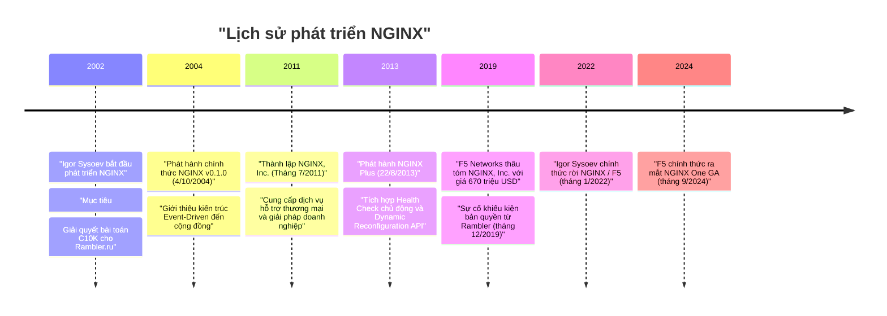
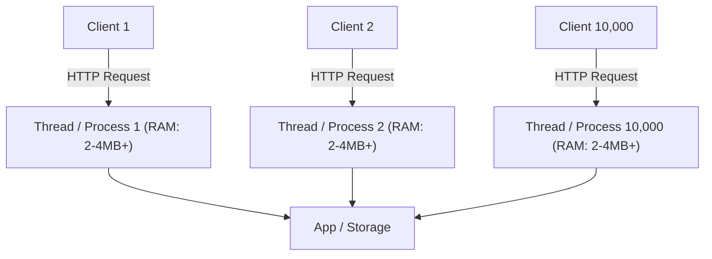
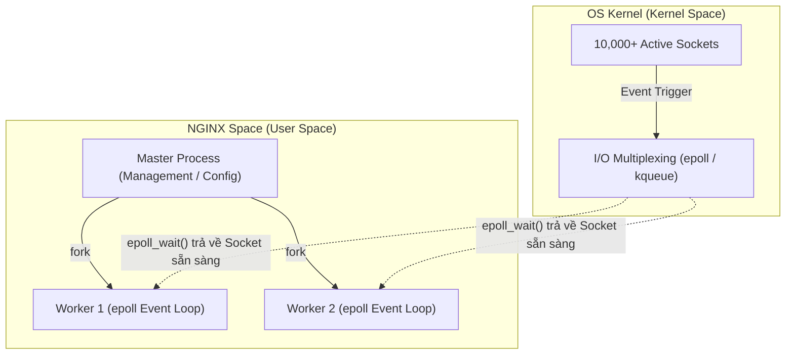

# Chương 1. Tổng quan & Lịch sử ra đời NGINX

Chương này cung cấp cái nhìn tổng quan về NGINX, nguồn gốc ra đời, kiến trúc cốt lõi giải quyết bài toán C10K và sự khác biệt giữa hai phiên bản NGINX Open Source và NGINX Plus.

## Mục lục

- [1.1 NGINX là gì?](#11-nginx-là-gì)
- [1.2 Lịch sử ra đời & Nguồn gốc tên gọi](#12-lịch-sử-ra-đời--nguồn-gốc-tên-gọi)
- [1.3 Bài toán C10K & Sự sụp đổ của mô hình truyền thống](#13-bài-toán-c10k--sự-sụp-đổ-của-mô-hình-truyền-thống)
- [1.4 Bước ngoặt lịch sử: I/O Multiplexing & Kiến trúc Multi-Worker](#14-bước-ngoặt-lịch-sử-io-multiplexing--kiến-trúc-multi-worker)
- [1.5 Mục tiêu thiết kế cốt lõi của NGINX](#15-mục-tiêu-thiết-kế-cốt-lõi-của-nginx)
- [1.6 NGINX Open Source vs NGINX Plus](#16-nginx-open-source-vs-nginx-plus)

---

## 1.1 NGINX là gì?

**NGINX** (phát âm là *"Engine-X"*) là máy chủ mã nguồn mở hiệu năng cao, ban đầu được thiết kế để phục vụ nội dung tĩnh với tốc độ tối ưu và xử lý hàng chục nghìn kết nối đồng thời với lượng tài nguyên CPU & RAM cực kỳ tiết kiệm.

Theo thời gian, NGINX phát triển thành một giải pháp đa năng trong hạ tầng hệ thống:
- **Web Server**: Phục vụ nội dung tĩnh và xử lý yêu cầu HTTP/HTTPS.
- **Reverse Proxy**: Tiếp nhận yêu cầu từ client và chuyển tiếp an toàn đến các ứng dụng backend.
- **Load Balancer**: Phân phối lưu lượng truy cập ở cả tầng L4 (TCP/UDP) và L7 (HTTP/gRPC).
- **API Gateway**: Quản lý, xác thực, điều hướng và giới hạn tốc độ (rate limiting) cho microservices.
- **Content Cache**: Bộ đệm lưu trữ nội dung tĩnh/động để giảm tải cho máy chủ backend.

---

## 1.2 Lịch sử ra đời & Nguồn gốc tên gọi

Dự án NGINX được kỹ sư phần mềm người Nga **Igor Sysoev** bắt đầu phát triển từ năm 2002 nhằm giải quyết vấn đề hiệu năng cho website Rambler.ru (một trong những cổng thông tin lượng truy cập lớn nhất nước Nga thời điểm đó).

| Thành phần/Bước | Vai trò/Mô tả | Chi tiết |
| :--- | :--- | :--- |
| **Giai đoạn khởi đầu (2002–2004)** | Igor Sysoev viết NGINX phục vụ Rambler.ru | Nhắm tới bài toán C10K, phát hành v0.1.0 ngày 04/10/2004 |
| **Thương mại hóa (2011–2013)** | Thành lập NGINX Inc. và ra mắt NGINX Plus | Cung cấp tính năng thương mại và hỗ trợ doanh nghiệp |
| **Sáp nhập & Đổi mới (2019–2024)** | F5 thâu tóm ($670M), Igor Sysoev rời F5, ra mắt NGINX One | Khép lại vụ Rambler 2019, ra mắt nền tảng NGINX One GA 09/2024 |

**Nguồn gốc tên gọi:** Tên gọi **NGINX** xuất phát từ thuật ngữ *"Engine-X"*, biểu thị một bộ máy động cơ (Engine) với khả năng mở rộng không giới hạn (ký tự $X$).

---

## 1.3 Bài toán C10K & Sự sụp đổ của mô hình truyền thống

Thuật ngữ **C10K** (Concurrent 10,000 Connections) được **Dan Kegel** đề xuất vào năm 1999 để chỉ thách thức kỹ thuật: *Làm thế nào để một máy chủ web duy nhất xử lý đồng thời 10.000 kết nối active mà không làm cạn kiệt tài nguyên hệ thống (CPU, RAM, file descriptors, sockets)?*

### Mô hình truyền thống (Thread / Process-per-connection)
Các máy chủ web thế hệ cũ (như Apache HTTP Server sử dụng MPM Prefork hoặc MPM Worker) gán một tiến trình (Process) hoặc một luồng (Thread) riêng cho từng kết nối HTTP.

| Thành phần/Bước | Vai trò/Mô tả | Chi tiết |
| :--- | :--- | :--- |
| **Client Request** | Yêu cầu kết nối HTTP từ trình duyệt client | Mỗi kết nối yêu cầu giữ 1 thread/process riêng |
| **Worker Thread/Process** | Khối xử lý đồng bộ gán riêng cho từng kết nối | Chiếm 2–4MB stack RAM (MPM Prefork có thể tốn 10–30MB+ RAM/process) |
| **Backend Storage** | Tầng ứng dụng hoặc cơ sở dữ liệu xử lý logic | Bị nghẽn do quá tải Context Switching ở cấp CPU |

Những hạn chế cốt lõi của mô hình đa luồng khi quy mô kết nối tăng vọt bao gồm:
1. **Dung lượng bộ nhớ tăng tuyến tính**: Mỗi luồng/tiến trình tiêu tốn từ 2MB đến 4MB bộ nhớ đệm stack (tùy thuộc MPM và các mô-đun nạp kèm; với mô hình MPM Prefork, mỗi tiến trình có thể chiếm 10MB–30MB+ RAM). Với 10.000 kết nối, hệ thống mất từ 20GB đến 40GB+ RAM chỉ để duy trì trạng thái luồng.
2. **Quá tải chuyển đổi ngữ cảnh (Context Switching)**: Khi số lượng luồng vượt xa số lõi CPU vật lý, CPU phải liên tục hoán đổi ngữ cảnh giữa các luồng. Chi phí overhead này chiếm phần lớn năng lực xử lý, gây tắc nghẽn hệ thống (Thread Thrashing).
3. **Chế độ Blocking I/O**: Các socket mặc định ở chế độ blocking. Khi một luồng gọi `read()` trên socket chưa có dữ liệu, luồng đó bị đẩy vào trạng thái đứng chờ (**sleep**). Hàng nghìn luồng bị kẹt ngủ tiếp tục chiếm dụng RAM, khiến tài nguyên máy chủ nhanh chóng cạn kiệt.

---

## 1.4 Bước ngoặt lịch sử: I/O Multiplexing & Kiến trúc Multi-Worker

Để kiến trúc Event-Driven vận hành hiệu quả trên CPU đa nhân, hệ điều hành đã bổ sung các cơ chế I/O Multiplexing thế hệ mới ở cấp độ Kernel.

### 1.4.1 Cơ chế I/O Multiplexing từ Kernel

Giai đoạn 2000 – 2002, các hệ điều hành giới thiệu cơ chế theo dõi sự kiện I/O tối ưu:

* 🍎 **`kqueue`** (FreeBSD - 2000): NGINX ban đầu được tối ưu trên FreeBSD nhờ tận dụng cơ chế này.
* 🐧 **`epoll`** (Linux - 2002): Cơ chế theo dõi sự kiện hiệu năng cao trên Linux.

**Cơ chế hoạt động:** NGINX đăng ký danh sách socket kết nối với Kernel thông qua `epoll_ctl()`, sau đó gọi `epoll_wait()`. Kernel theo dõi trạng thái các socket và trả về danh sách các socket thực sự có sự kiện (ready sockets). NGINX chỉ việc duyệt danh sách trả về này để thực thi callback tương ứng trong vòng lặp sự kiện (Event Loop), loại bỏ hoàn toàn thời gian đứng chờ (sleep).

### 1.4.2 Mô hình tiến trình Multi-Worker

NGINX kết hợp I/O Multiplexing với mô hình tiến trình **Master-Worker** theo nguyên lý **Shared-nothing** (không chia sẻ request context):

* **1 Master Process**: Đọc cấu hình, quản lý vòng đời tiến trình, tạo listening sockets (`bind()`/`listen()`) và fork các Worker Process.
* **N Worker Process**: Mặc định với `worker_processes auto;`, NGINX tạo số Worker tương ứng với số **logical CPU** (`sysconf(_SC_NPROCESSORS_ONLN)`).
* **Độc lập xử lý request**: Mỗi Worker vận hành một Event Loop (`epoll`/`kqueue`) riêng biệt với request context độc lập, giúp giảm tối đa tranh chấp khóa đồng bộ (locking contention). Việc gán Worker vào lõi CPU (CPU Affinity) có thể thiết lập qua directive `worker_cpu_affinity`.
* **Bộ nhớ dùng chung (Shared Memory)**: NGINX dùng shared memory cho các tác vụ cần dùng chung dữ liệu toàn hệ thống như `limit_req_zone`, `limit_conn_zone`, SSL session cache, upstream zone và cache metadata, được bảo vệ bằng mutex khi truy cập. Trạng thái của từng request riêng lẻ không bị chia sẻ giữa các Worker.

| Thành phần/Khái niệm | Vai trò/Mô tả | Chi tiết |
| :--- | :--- | :--- |
| **Blocking I/O (Cũ)** | Luồng gọi `read()` bị khóa (sleep) cho tới khi socket có dữ liệu | Tốn 2-4MB RAM/thread, gây quá tải Context Switching |
| **`kqueue` / `epoll`** | Cơ chế Kernel thông báo danh sách socket đã sẵn sàng dữ liệu | Đăng ký/Hủy $O(1)$; `epoll_wait()` chỉ trả về socket sẵn sàng, không tốn thời gian chờ |
| **Master Process** | Đọc cấu hình `nginx.conf`, quản lý tiến trình con, nạp lại cấu hình (hot reload) | Đảm bảo tính sẵn sàng, tự động khởi tạo lại Worker nếu bị lỗi |
| **Worker Process** | Xử lý yêu cầu HTTP và điều hướng sự kiện trong Event Loop đơn luồng | Tối ưu hóa bộ nhớ, tận dụng tối đa năng lực phần cứng đa nhân |

---

## 1.5 Mục tiêu thiết kế cốt lõi của NGINX

Nhờ kết hợp kiến trúc **Event-Driven**, **Asynchronous**, **Non-blocking I/O** và **I/O Multiplexing**, NGINX giải quyết triệt để bài toán C10K với mức tiêu thụ tài nguyên tối thiểu.

Mỗi Worker Process chạy một vòng lặp sự kiện đơn luồng xử lý hàng nghìn kết nối đồng thời. Với các tác vụ I/O đĩa có nguy cơ gây nghẽn, NGINX sử dụng thêm luồng phụ (Thread Pool hoặc `aio threads`) để tránh làm gián đoạn Event Loop chính.

| Tiêu chí | Mô hình Đa luồng / Đa tiến trình (như Apache MPM Prefork) | Mô hình Hướng sự kiện (NGINX) |
| :--- | :--- | :--- |
| **Phân bổ tài nguyên** | 1 Luồng hoặc Tiến trình cho mỗi kết nối | 1 Worker Process quản lý hàng nghìn kết nối đồng thời |
| **Tiêu thụ bộ nhớ RAM** | Tăng tuyến tính theo số kết nối ($O(N)$) | Tăng rất chậm / duy trì ở mức thấp khi quy mô kết nối tăng |
| **Chuyển đổi ngữ cảnh** | Chi phí Context Switching rất cao | Cực kỳ thấp do Event Loop đơn luồng |
| **Phục vụ tệp tĩnh** | Hiệu năng trung bình (phụ thuộc I/O luồng) | Tối ưu tuyệt đối (sử dụng syscall zero-copy `sendfile`) |
| **Khả năng chịu tải** | Dễ bị quá tải khi vượt mốc 1.000 – 5.000 kết nối | Có thể xử lý vượt 100.000 kết nối khi được tinh chỉnh đúng thông số hệ thống (`worker_connections`, `ulimit`, `somaxconn`) |

> [!NOTE]
> Theo tuyên bố từ tác giả Igor Sysoev, NGINX chỉ tiêu tốn khoảng **2.5MB RAM** để duy trì 10.000 kết nối HTTP ở trạng thái chờ (idle keep-alive với cấu hình đệm mặc định; chưa có benchmark độc lập công bố chính thức).

---

## 1.6 NGINX Open Source vs NGINX Plus

NGINX được phát hành dưới hai phiên bản chính:

### NGINX Open Source
Phiên bản mã nguồn mở miễn phí, cung cấp đầy đủ các tính năng cốt lõi: Web Server, Reverse Proxy, Cân bằng tải L4/L7, SSL Termination và Content Caching. Từ phiên bản 1.29.6 (tháng 3/2026), tính năng Session Persistence (`sticky`) đã được đưa vào NGINX Open Source, và thuật toán `least_time` được hỗ trợ từ NGINX 1.31.0 (tháng 5/2026).

### NGINX Plus
Phiên bản thương mại bổ sung các tính năng nâng cao phục vụ môi trường doanh nghiệp:

| Tính năng | NGINX Open Source | NGINX Plus |
| :--- | :--- | :--- |
| **Cân bằng tải** | Phổ biến (Round Robin, Least Conn, IP Hash, `sticky` từ 1.29.6, `least_time` từ 1.31.0) | Tích hợp thuật toán Random LB, Slow Start và Session Persistence nâng cao |
| **Kiểm tra sức khỏe** | Thụ động (Passive Health Check) | Chủ động gửi probe định kỳ (Active Health Check) |
| **Cấu hình động** | Cần reload tiến trình khi sửa cấu hình | Cấu hình qua Dynamic Configuration API thời gian thực |
| **Bảo mật & Xác thực** | Cần tích hợp qua `auth_request` hoặc njs/module ngoài | Tích hợp sẵn chuẩn xác thực doanh nghiệp native (`auth_jwt`, OpenID Connect) |
| **Giám sát hệ thống** | Thống kê chỉ số cơ bản (`stub_status`) | Dashboard theo dõi chỉ số thời gian thực (Real-time Metrics API) |
| **Hỗ trợ kỹ thuật** | Cộng đồng mã nguồn mở | Hỗ trợ kỹ thuật 24/7 từ F5 NGINX |

**Câu hỏi suy ngẫm hướng tới các chương tiếp theo:** Khi NGINX làm **Load Balancer** đứng trước 3 server backend Node.js, điều gì sẽ xảy ra nếu 1 trong 3 server backend bị crash? NGINX xử lý tình huống đó ở cấp độ Event Loop và Upstream Health Check như thế nào?

---
[← Quay lại mục lục](README.md)
