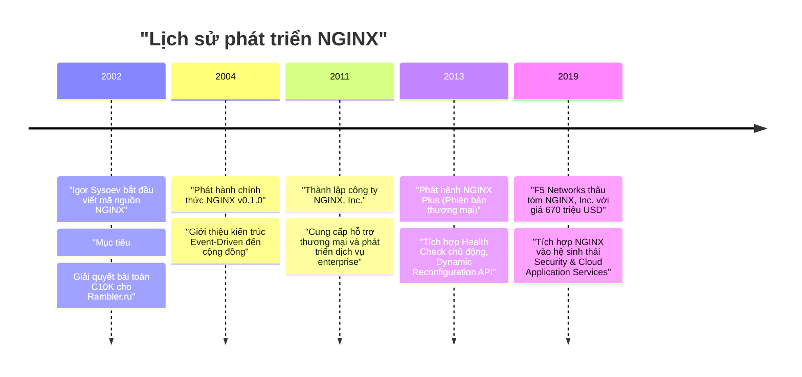
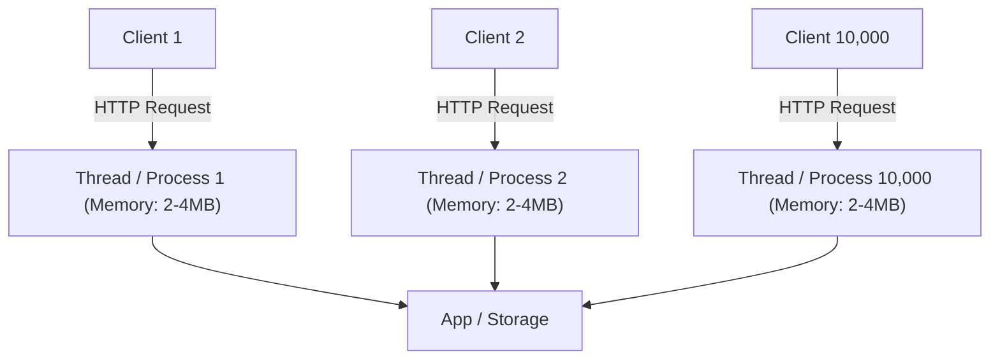

# Chương 1. Giới thiệu về NGINX & Bài toán C10K

Chương này trình bày định nghĩa NGINX, lịch sử hình thành, bản chất bài toán C10K — thách thức từng làm suy sụp hạ tầng Web truyền thống —, các mục tiêu thiết kế cốt lõi và sự khác biệt giữa phiên bản NGINX Open Source với NGINX Plus.

## Mục lục

- [1.1 NGINX là gì?](#11-nginx-là-gì)
- [1.2 Lịch sử ra đời & Nguồn gốc tên gọi](#12-lịch-sử-ra-đời--nguồn-gốc-tên-gọi)
- [1.3 Bài toán C10K & Sự sụp đổ của mô hình truyền thống](#13-bài-toán-c10k--sự-sụp-đổ-của-mô-hình-truyền-thống)
- [1.4 Mục tiêu thiết kế cốt lõi của NGINX](#14-mục-tiêu-thiết-kế-cốt-lõi-của-nginx)
- [1.5 NGINX Open Source vs NGINX Plus](#15-nginx-open-source-vs-nginx-plus)

---

## 1.1 NGINX là gì?

**NGINX** (phát âm là *"Engine-X"*) là một phần mềm máy chủ mã nguồn mở hiệu năng cao, được thiết kế ban đầu để phục vụ các tệp tĩnh với tốc độ tối đa và xử lý hàng chục nghìn kết nối đồng thời với lượng tài nguyên hệ thống (CPU & RAM) cực kỳ tối thiểu.

Theo thời gian, NGINX đã phát triển thành một giải pháp đa năng đóng vai trò trung tâm trong hạ tầng công nghệ hiện đại:
- **Web Server**: Phục vụ nội dung tĩnh và xử lý yêu cầu HTTP/HTTPS.
- **Reverse Proxy**: Làm trung gian tiếp nhận yêu cầu từ client và chuyển tiếp an toàn đến các ứng dụng backend.
- **Load Balancer**: Phân phối lưu lượng truy cập qua nhiều máy chủ nội bộ ở cả tầng L4 (TCP/UDP) và L7 (HTTP/gRPC).
- **API Gateway**: Quản lý, xác thực, điều hướng và giới hạn tốc độ (rate limiting) cho các dịch vụ microservices.
- **Content Cache**: Bộ đệm lưu trữ nội dung tĩnh/động giúp giảm tải triệt để cho cơ sở dữ liệu và backend servers.

---

## 1.2 Lịch sử ra đời & Nguồn gốc tên gọi

NGINX được phát triển vào năm 2002 bởi kỹ sư phần mềm người Nga **Igor Sysoev** trong thời gian ông làm việc tại Rambler (một trong những trang web cổng thông tin lớn nhất nước Nga thời điểm đó). Phiên bản mã nguồn mở chính thức được phát hành vào tháng 10 năm 2004.

> [!NOTE]
> **Nguồn gốc tên gọi:** Tên gọi **NGINX** xuất phát từ thuật ngữ *"Engine-X"*, hàm ý về một bộ máy động cơ (Engine) có khả năng mở rộng không giới hạn (biểu tượng $X$).

---

## 1.3 Bài toán C10K & Sự sụp đổ của mô hình truyền thống

Thuật ngữ **C10K** (Concurrent 10,000 Connections) được chuyên gia **Dan Kegel** đưa ra vào năm 1999 để mô tả thách thức kỹ thuật: *Làm thế nào để một máy chủ web duy nhất có thể xử lý đồng thời 10.000 kết nối người dùng cùng lúc mà không làm cạn kiệt tài nguyên đĩa và bộ nhớ?*

### Mô hình truyền thống (Thread / Process-per-connection)
Các web server thế hệ cũ (như Apache HTTP Server mô hình MPM Prefork hoặc Worker) gán một tiến trình (Process) hoặc một luồng (Thread) riêng biệt cho từng kết nối HTTP.

Sơ đồ trên minh họa mô hình đa luồng truyền thống. Điểm yếu chết người của mô hình này khi lượng truy cập tăng vọt bao gồm:
1. **Tiêu tốn bộ nhớ RAM vượt ngưỡng**: Mỗi luồng/tiến trình yêu cầu từ 2MB đến 4MB bộ nhớ đệm stack. Với 10.000 kết nối, hệ thống cạn kiệt từ 20GB đến 40GB RAM chỉ để duy trì trạng thái luồng.
2. **Quá tải Chuyển đổi Ngữ cảnh (Context Switching Overhead)**: Khi số lượng luồng vượt xa số lõi CPU vật lý, hệ điều hành phải liên tục dừng luồng này và bật luồng khác. Chi phí CPU dành cho context switching chiếm hầu hết năng lực xử lý, gây nghẽn toàn hệ thống (Thread Thrashing).
3. **Hiện tượng I/O Chặn (Blocking I/O)**: Khi một luồng chờ đọc dữ liệu từ đĩa hoặc mạng, nó rơi vào trạng thái ngủ (sleep) nhưng vẫn chiếm giữ bộ nhớ RAM.

---

## 1.4 Mục tiêu thiết kế cốt lõi của NGINX

Để giải quyết triệt để C10K, Igor Sysoev đã tái thiết kế NGINX dựa trên kiến trúc **Hướng sự kiện (Event-Driven)**, **Bất đồng bộ (Asynchronous)** và **Không chặn (Non-blocking I/O)**.

NGINX không tạo luồng mới cho mỗi kết nối. Thay vào đó, một số lượng nhỏ các Worker Process (thường bằng số lõi CPU vật lý) chạy một vòng lặp sự kiện (Event Loop) duy nhất, giám sát hàng ngàn socket mạng thông qua cơ chế thông báo sự kiện cấp nhân hệ điều hành (`epoll` trên Linux hoặc `kqueue` trên BSD/macOS).

| Tiêu chí | Mô hình Luồng/Tiến trình (Apache MPM Prefork) | Mô hình Hướng sự kiện (NGINX) |
| :--- | :--- | :--- |
| **Phân bổ tài nguyên** | 1 Luồng hoặc Tiến trình cho mỗi kết nối | 1 Worker Process quản lý hàng nghìn kết nối |
| **Dung lượng RAM tiêu thụ** | Tăng tuyến tính theo kết nối ($O(N)$) | Cố định và cực kỳ thấp ($O(1)$) |
| **Chuyển đổi ngữ cảnh** | Chi phí lớn khi số kết nối cao | Gần như bằng 0 vì Worker đơn luồng liên tục xử lý event |
| **Khả năng phục vụ tệp tĩnh** | Trung bình (phụ thuộc chi phí I/O luồng) | Tối đa (sử dụng syscall zero-copy `sendfile`) |
| **Giới hạn chịu tải** | Dễ bị treo khi quá 1.000 – 5.000 kết nối | Dễ dàng xử lý > 100.000 kết nối trên phần cứng thông thường |

> [!TIP]
> **Kết quả thực tế:** NGINX chỉ mất khoảng 2.5MB RAM để duy trì 10.000 kết nối HTTP không hoạt động (idle keep-alive connections), trong khi Apache có thể tiêu tốn đến vài chục Gigabyte RAM.

---

## 1.5 NGINX Open Source vs NGINX Plus

NGINX cung cấp hai phiên bản chính phù hợp với các nhu cầu triển khai khác nhau:

### NGINX Open Source
Bản mã nguồn mở hoàn toàn miễn phí, chứa đầy đủ các tính năng cốt lõi vượt trội về Web Server, Reverse Proxy, Cân bằng tải L4/L7, SSL Termination và Caching.

### NGINX Plus
Phiên bản thương mại nâng cấp dành cho doanh nghiệp lớn, tích hợp thêm các tính năng hạ tầng cao cấp:

| Tính năng | NGINX Open Source | NGINX Plus |
| :--- | :--- | :--- |
| **Cân bằng tải & Reverse Proxy** | Hỗ trợ đầy đủ (Round Robin, Least Conn, IP Hash) | Hỗ trợ bổ sung Least Time, Session Persistence |
| **Kiểm tra sức khỏe (Health Check)** | Thụ động (Passive — chỉ phát hiện khi request lỗi) | Chủ động (Active — gửi probe định kỳ kiểm tra backend) |
| **Cấu hình động (Dynamic Reconfiguration)** | Cần thực hiện `nginx -s reload` tệp cấu hình | Khai báo qua RESTful API không cần reload tiến trình |
| **Bảo mật & Xác thực** | JWT thông qua module mở rộng biên dịch ngoài | Hỗ trợ bản quyền JWT validation, OpenID Connect native |
| **Giám sát hệ thống (Monitoring)** | Trang stub_status cơ bản | Dashboard thời gian thực & Metrics chi tiết từng Upstream |
| **Hỗ trợ kỹ thuật** | Cộng đồng mã nguồn mở | Hỗ trợ 24/7 từ F5 Enterprise Support |

---
[← Quay lại mục lục](README.md)
