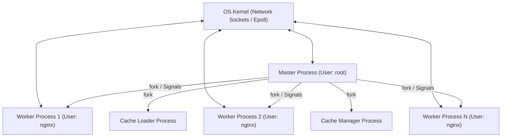
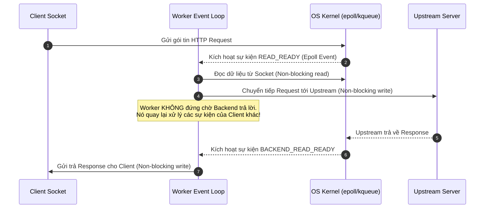
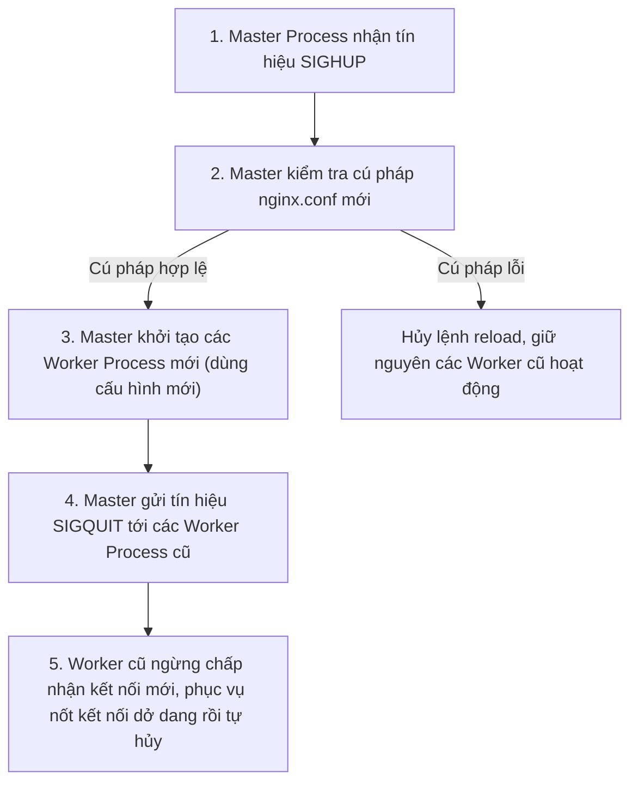

# Chương 2. Kiến trúc Hệ thống & Cơ chế Vận hành

Chương này phân tích chuyên sâu kiến trúc nội bộ của NGINX: mô hình tiến trình Master-Worker, vòng lặp sự kiện bất đồng bộ không chặn (Asynchronous Non-blocking Event Loop), các cơ chế I/O Multiplexing ở cấp nhân hệ điều hành và quy trình nạp lại cấu hình/nâng cấp không gián đoạn (Zero-downtime).

## Mục lục

- [2.1 Mô hình Tiến trình Master-Worker](#21-mô-hình-tiến-trình-master-worker)
- [2.2 Vai trò của Master Process](#22-vai-trò-của-master-process)
- [2.3 Vai trò của Worker Process](#23-vai-trò-của-worker-process)
- [2.4 Vòng lặp Sự kiện & Asynchronous Non-blocking I/O](#24-vòng-lặp-sự-kiện--asynchronous-non-blocking-io)
- [2.5 Cơ chế I/O Multiplexing: epoll vs kqueue](#25-cơ-chế-io-multiplexing-epoll-vs-kqueue)
- [2.6 Cơ chế Tín hiệu & Hot Reload / Binary Upgrade](#26-cơ-chế-tín-hiệu--hot-reload--binary-upgrade)

---

## 2.1 Mô hình Tiến trình Master-Worker

NGINX sử dụng kiến trúc đa tiến trình (Multi-Process Model) có sự phân chia trách nhiệm rõ ràng giữa một tiến trình quản lý duy nhất (**Master Process**) và nhiều tiến trình xử lý công việc (**Worker Processes**), kết hợp với các tiến trình phụ trợ quản lý bộ đệm (**Cache Loader** và **Cache Manager**).



Sơ đồ trên thể hiện cấu trúc phân cấp tiến trình trong NGINX. Master Process giữ đặc quyền cao nhất để bound port và điều khiển, trong khi các Worker Process trực tiếp giao tiếp với OS Kernel để xử lý lưu lượng mạng.

---

## 2.2 Vai trò của Master Process

**Master Process** chạy dưới quyền người dùng đặc quyền (`root`) và tuyệt đối **không** tham gia trực tiếp vào việc xử lý các kết nối HTTP của khách hàng.

Nhiệm vụ chính của Master Process bao gồm:
1. **Đọc và Phân tích Cấu hình**: Nạp tệp `nginx.conf`, kiểm tra tính toàn vẹn cú pháp và lắng nghe (bind) trên các cổng dịch vụ đặc quyền (như port 80, 443).
2. **Khởi tạo và Giám sát Worker**: Gọi hàm hệ thống `fork()` để tạo ra các Worker Process. Nếu một Worker Process bị hỏng (crash) do lỗi hệ thống, Master Process lập tức phát hiện và khởi chạy một Worker thay thế ngay lập tức.
3. **Tiếp nhận Tín hiệu Điều khiển**: Xử lý các tín hiệu từ người quản trị (như reload, stop, reopen logs) và điều phối các Worker thực thi tương ứng.

---

## 2.3 Vai trò của Worker Process

Các **Worker Process** chạy dưới tài khoản không có quyền đặc quyền (ví dụ: user `nginx` hoặc `www-data`) để đảm bảo an toàn bảo mật cho hệ thống.

Đặc điểm vận hành của Worker Process:
- **Đơn luồng (Single-Threaded)**: Mỗi Worker là một tiến trình đơn luồng độc lập, chạy một Vòng lặp Sự kiện (Event Loop) không chặn.
- **Không tranh chấp bộ nhớ**: Vì các Worker hoạt động trên không gian địa chỉ độc lập, hệ thống không cần đến các cơ chế khóa đồng bộ (Locking) phức tạp giữa các luồng, loại bỏ nguy cơ Deadlock hoặc Race Condition.
- **Số lượng Worker tối ưu**: Thường được cấu hình bằng số lượng lõi CPU vật lý (`worker_processes auto;`) để đảm bảo mỗi Worker gắn chặt với một CPU core thông qua cơ chế CPU Affinity (`worker_cpu_affinity`), giảm thiểu việc CPU cache miss.

```text
Công thức tính tổng số kết nối đồng thời tối đa (Direct Web Server):
Max Clients = worker_processes * worker_connections

Công thức tính tổng số kết nối đồng thời tối đa (Reverse Proxy):
Max Clients = (worker_processes * worker_connections) / 2
```

> [!IMPORTANT]
> Khi NGINX đóng vai trò Reverse Proxy, mỗi yêu cầu từ client sẽ tiêu tốn **2 File Descriptors (FD)**: 1 FD cho kết nối từ Client đến NGINX và 1 FD cho kết nối từ NGINX đến Upstream Backend.

---

## 2.4 Vòng lặp Sự kiện & Asynchronous Non-blocking I/O

Trái ngược với mô hình đồng bộ (Blocking I/O) nơi tiến trình phải tạm dừng hoạt động để chờ ổ đĩa hoặc mạng trả về dữ liệu, NGINX áp dụng mô hình **Bất đồng bộ Không chặn (Asynchronous Non-blocking)**.



Sơ đồ trình tự trên thể hiện vòng đời xử lý sự kiện bất đồng bộ. Worker Process đóng vai trò một State Machine (Máy trạng thái): khi nhận thông báo sự kiện từ Kernel, nó xử lý một phần công việc rồi lập tức chuyển sang sự kiện tiếp theo mà không bao giờ rơi vào trạng thái nghẽn chờ (Blocked).

---

## 2.5 Cơ chế I/O Multiplexing: epoll vs kqueue

Trái tim tạo nên tốc độ xử lý hàng trăm ngàn sự kiện/giây của NGINX là cơ chế **I/O Multiplexing** của nhân hệ điều hành.

| Cơ chế hệ điều hành | Thuật toán / Độ phức tạp | Mô tả vận hành |
| :--- | :--- | :--- |
| `select` / `poll` *(Cổ điển)* | $O(N)$ | Hệ điều hành phải quét tuần tự toàn bộ danh sách $N$ sockets để tìm socket nào có dữ liệu. Hiệu năng giảm thảm hại khi $N$ lớn. |
| `epoll` *(Linux Kernel $\ge$ 2.6)* | $O(1)$ | Nhân Linux duy trì một Event Callback List. Chỉ những sockets thực sự có sự kiện mới được trả về cho NGINX. |
| `kqueue` *(FreeBSD / macOS)* | $O(1)$ | Cơ chế thông báo sự kiện hiệu năng cao của hệ điều hành họ BSD, hỗ trợ timer và signal event. |
| `eventport` *(Solaris)* | $O(1)$ | Cơ chế Event Completion Port trên hệ điều hành Sun Solaris. |

---

## 2.6 Cơ chế Tín hiệu & Hot Reload / Binary Upgrade

NGINX được thiết kế để hoạt động liên tục 24/7/365. Mọi thao tác thay đổi cấu hình hoặc nâng cấp phiên bản phần mềm đều được thực hiện dưới cơ chế Zero-downtime thông qua các tín hiệu POSIX (POSIX Signals).

### 1. Nạp lại Cấu hình Không gián đoạn (Graceful Reload)
Khi quản trị viên thực thi lệnh `nginx -s reload` (hoặc gửi tín hiệu `SIGHUP` tới Master PID):



### 2. Nâng cấp Phần mềm Không gián đoạn (Hot Binary Upgrade)
Khi cần nâng cấp phiên bản NGINX mà không ngắt kết nối HTTP hiện tại:
1. Gửi tín hiệu `SIGUSR2` đến Master PID cũ. Master PID cũ đổi tên file PID của nó (`nginx.pid` $\rightarrow$ `nginx.pid.oldbin`), sau đó thực thi file nhị phân NGINX mới để tạo ra một Master Process thứ hai.
2. Master Process mới khởi tạo các Worker Process mới sử dụng bản nhị phân mới.
3. Gửi tín hiệu `SIGWINCH` đến Master PID cũ để nó ra lệnh đóng dần các Worker Process cũ.
4. Nếu bản nhị phân mới hoạt động ổn định, gửi tín hiệu `SIGQUIT` đến Master PID cũ để hoàn tất chuyển giao. Nếu xảy ra sự cố, gửi tín hiệu `SIGHUP` tới Master cũ để khôi phục trạng thái ban đầu.

---
[← Quay lại mục lục](README.md)
