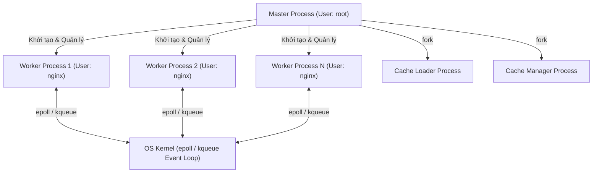
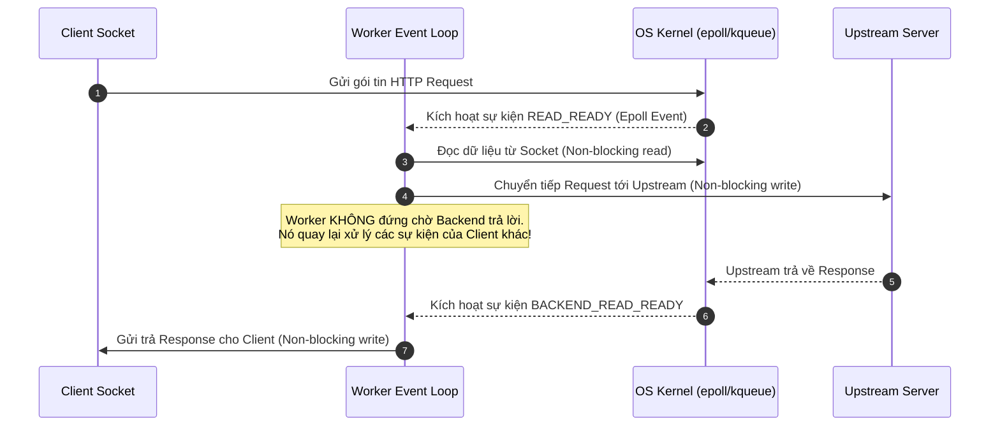
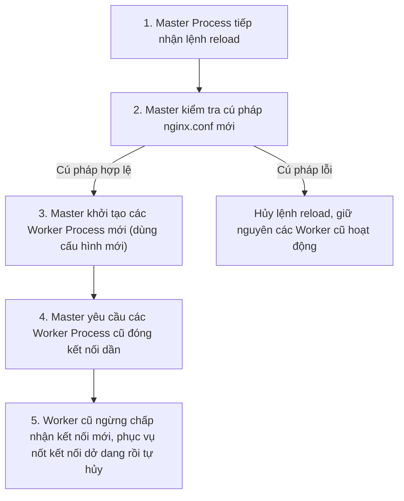

# Chương 2. Kiến trúc & Khái niệm Cốt lõi

Chương này đi sâu vào kiến trúc tiến trình Master-Worker của NGINX, cơ chế xử lý kết nối không chặn (Non-blocking), vòng lặp sự kiện (Event Loop), I/O Multiplexing và kỹ thuật nâng cấp zero-downtime.

## Mục lục

- [2.1 Mô hình Tiến trình (Process Model)](#21-mô-hình-tiến-trình-process-model)
- [2.2 Vai trò của Master Process](#22-vai-trò-của-master-process)
- [2.3 Vai trò của Worker Process](#23-vai-trò-của-worker-process)
  - [2.3.1 Công thức tính Max Clients & Giới hạn File Descriptors](#231-công-thức-tính-max-clients--giới-hạn-file-descriptors)
  - [2.3.2 Chống thảm họa tranh chấp kết nối (Thundering Herd & `SO_REUSEPORT`)](#232-chống-thảm-họa-tranh-chấp-kết-nối-thundering-herd--so_reuseport)
  - [2.3.3 Khái niệm Thread Pools (Giải tỏa nghẽn Disk I/O)](#233-khái-niệm-thread-pools-giải-tỏa-nghẽn-disk-io)
- [2.4 Vòng lặp Sự kiện & Asynchronous Non-blocking I/O](#24-vòng-lặp-sự-kiện--asynchronous-non-blocking-io)
- [2.5 Cơ chế I/O Multiplexing: epoll vs kqueue](#25-cơ-chế-io-multiplexing-epoll-vs-kqueue)
- [2.6 Cơ chế Hot Reload & Binary Upgrade (Zero-Downtime)](#26-cơ-chế-hot-reload--binary-upgrade-zero-downtime)

---

## 2.1 Mô hình Tiến trình (Process Model)

NGINX không sử dụng mô hình đa luồng (Multi-threaded) truyền thống mà áp dụng kiến trúc **Master-Worker dựa trên tiến trình (Process-based Multi-Worker Architecture)**. Trong mô hình này, có duy nhất 1 tiến trình Master và nhiều tiến trình xử lý công việc (**Worker Processes**), kết hợp với các tiến trình phụ trợ quản lý bộ đệm (**Cache Loader** và **Cache Manager**).



Master Process giữ đặc quyền cao nhất để khởi tạo và quản lý vòng đời các Worker Process, trong khi các Worker Process trực tiếp giao tiếp với OS Kernel để xử lý lưu lượng mạng qua vòng lặp sự kiện.

| Thành phần/Khái niệm | Vai trò/Mô tả | Chi tiết |
| :--- | :--- | :--- |
| **Master Process** | Quản lý vòng đời tiến trình con, đọc cấu hình, mở socket (User: `root`) | Không tham gia xử lý trực tiếp request HTTP của Client |
| **Worker Process** | Đơn luồng, xử lý toàn bộ kết nối I/O (User: `nginx` / `www-data`) | Chạy vòng lặp sự kiện Event Loop không chặn |
| **Cache Loader** | Nạp metadata (thông tin đệm) về các tệp đệm vào shared memory zone khi khởi động | Tự thoát (`exit 0`) sau khi hoàn tất nạp metadata |
| **Cache Manager** | Định kỳ dọn dẹp các tệp đệm hết hạn (TTL) | Đảm bảo dung lượng đệm duy trì trong giới hạn cấu hình |

---

## 2.2 Vai trò của Master Process

**Master Process** chạy dưới quyền người dùng đặc quyền (`root`) và tuyệt đối **không** tham gia trực tiếp vào vòng lặp lắng nghe hay xử lý các kết nối HTTP của khách hàng.

Nhiệm vụ chính của Master Process bao gồm:
1. **Đọc Cấu hình & Mở Socket Khởi tạo**: Nạp tệp `nginx.conf`, kiểm tra tính toàn vẹn cú pháp và mở các cổng dịch vụ đặc quyền (như port 80, 443).
2. **Khởi tạo và Giám sát Worker**: Gọi hàm hệ thống `fork()` để tạo ra các Worker Process. Khi Worker Process khởi tạo thành công, chúng kế thừa Socket File Descriptor từ Master để trực tiếp nhận kết nối từ Client. Nếu một Worker Process bị hỏng (crash), Master Process sẽ phát hiện và lập tức khởi tạo Worker mới thay thế.
3. **Tiếp nhận Lệnh Điều khiển**: Tiếp nhận các tín hiệu điều khiển từ người quản trị (như `reload`, `stop`, `reopen`) và gửi tín hiệu phù hợp cho các Worker thực thi.

---

## 2.3 Vai trò của Worker Process

Các **Worker Process** chạy dưới tài khoản không có quyền đặc quyền (ví dụ: `nginx` hoặc `www-data`) để đảm bảo an toàn bảo mật.

Đặc điểm vận hành của Worker Process:
- **Đơn luồng per Worker (Single-Threaded Worker)**: Mỗi Worker là một tiến trình độc lập, chạy một Vòng lặp Sự kiện (Event Loop) không chặn. Ngoại lệ duy nhất là khi cần offload các thao tác I/O đĩa đệm có nguy cơ gây ngắt, NGINX sử dụng thêm luồng phụ từ Thread Pools (cần biên dịch với tùy chọn `--with-threads` từ NGINX 1.7.11, mặc định `threads=32 max_queue=65536`).
- **Phân định ranh giới bộ nhớ & khóa đồng bộ (Locking)**: Do mỗi Worker sở hữu không gian địa chỉ bộ nhớ (Address Space) riêng biệt, NGINX **không cần sử dụng các cơ chế khóa đồng bộ (Mutex/Locking) phức tạp cho bộ nhớ xử lý request thông thường**. Tuy nhiên, đối với các vùng bộ nhớ dùng chung (**Shared Memory**) như `limit_req`, `limit_conn`, SSL Session Cache, upstream zone hay cơ chế điều phối socket (`accept_mutex`), NGINX vẫn áp dụng khóa Mutex để bảo vệ dữ liệu dùng chung giữa các Worker.
- **Số lượng Worker & CPU Affinity**: Thường cấu hình `worker_processes auto;` để NGINX tự động tạo số Worker bằng đúng số logical CPU. Lưu ý rằng `worker_processes auto;` **không tự động ghim Worker vào CPU core**. Để tránh việc Linux Scheduler chuyển đổi (migrate) Worker giữa các core gây ra cache miss, người quản trị cần cấu hình tường minh chỉ thị `worker_cpu_affinity`.

### 2.3.1 Công thức tính Max Clients & Giới hạn File Descriptors

Công thức tính tổng số kết nối đồng thời tối đa lý thuyết (Theoretical Upper Bound):

```text
Công thức giới hạn lý thuyết (Direct Web Server):
Max Clients = worker_processes * worker_connections

Công thức giới hạn ước lượng (Reverse Proxy):
Max Clients ≈ (worker_processes * worker_connections) / 2
```

**Lưu ý quan trọng:**
- **Mô hình Reverse Proxy**: Tỷ lệ chia 2 (hoặc chia 4 trong tài liệu wiki NGINX gốc) là **quy tắc ước lượng kinh nghiệm phổ biến (heuristic)** dựa trên việc một request thông thường tiêu tốn 2 File Descriptors (1 kết nối từ Client đến NGINX và 1 kết nối từ NGINX đến Upstream Backend) cùng các buffer/log tương ứng. Trong thực tế, các yếu tố như Upstream Keepalive Connection, HTTP/2 Multiplexing hay Upstream Connection Reuse sẽ làm thay đổi tỷ lệ này.
- **Giới hạn File Descriptors (`RLIMIT_NOFILE`)**: Đây là giới hạn lý thuyết tối đa. Thực tế, tổng kết nối bị khống chế bởi số File Descriptors cho phép của hệ điều hành (`ulimit -n`) và chỉ thị `worker_rlimit_nofile`. Mỗi kết nối socket, tệp tin đĩa, unix socket, upstream connection đều tiêu tốn File Descriptor.

### 2.3.2 Chống thảm họa tranh chấp kết nối (Thundering Herd & `SO_REUSEPORT`)

Khi có một kết nối mới đến socket lắng nghe, nếu tất cả các Worker Process cùng bị hệ điều hành đánh thức để tranh chấp tiếp nhận kết nối đó (trong khi chỉ 1 Worker xử lý thành công), hiện tượng **Thundering Herd** xuất hiện gây lãng phí tài nguyên CPU.

NGINX xử lý vấn đề này qua hai cơ chế:
- **`accept_mutex` (Cơ chế truyền thống)**: Sử dụng khóa mutex ở cấp ứng dụng để chỉ cho phép duy nhất một Worker đăng ký listening socket vào Event Loop tại một thời điểm, giúp các Worker khác tiếp tục ngủ yên. Từ phiên bản NGINX 1.11.3, chỉ thị `accept_mutex` mặc định là `off` (do nhân Linux 4.5+ hỗ trợ cờ `EPOLLEXCLUSIVE` giải quyết trực tiếp hiện tượng Thundering Herd ở cấp Kernel); trước 1.11.3 mặc định là `on`.
- **`SO_REUSEPORT` (Cơ chế hiện đại)**: Khi khai báo chỉ thị `listen 80 reuseport;`, nhân hệ điều hành Linux (từ Kernel 3.9+) cho phép **nhiều listening socket của các Worker cùng bind vào một cặp IP/Port**. Nhân hệ điều hành sẽ trực tiếp phân phối và cân bằng các kết nối mới vào từng socket lắng nghe của từng Worker mà không cần sử dụng khóa `accept_mutex`.

### 2.3.3 Khái niệm Thread Pools (Giải tỏa nghẽn Disk I/O)

Mặc dù Event Loop chính của Worker Process là đơn luồng, NGINX cung cấp tính năng **Thread Pools** (`aio threads`, hỗ trợ từ NGINX 1.7.11 khi compile với `--with-threads`).

Cần lưu ý: **Thread Pool tuyệt đối KHÔNG xử lý các request HTTP hay logic mạng**. Thread Pool chỉ được sử dụng để chuyển giao (offload) các thao tác I/O đĩa cứng có nguy cơ gây chặn (Blocking Disk I/O) — ví dụ như đọc/ghi tệp tin lớn từ đĩa đệm (`aio threads`, `sendfile` offload) khi dữ liệu chưa có trong RAM Cache. Thao tác này giúp Event Loop chính của Worker không bị gián đoạn và tiếp tục phục vụ hàng nghìn kết nối mạng khác.

---

## 2.4 Vòng lặp Sự kiện & Asynchronous Non-blocking I/O

Trái ngược với mô hình đồng bộ (Blocking I/O) nơi tiến trình bị treo để chờ dữ liệu từ đĩa hoặc mạng, NGINX áp dụng mô hình **Bất đồng bộ Không chặn (Asynchronous Non-blocking)**.



| Bước/Thành phần | Vai trò/Mô tả | Chi tiết |
| :--- | :--- | :--- |
| **1. Request Arrival** | Client gửi dữ liệu qua socket mạng | Kernel kích hoạt sự kiện `READ_READY` |
| **2. Non-blocking Read** | Worker đọc dữ liệu từ socket | NGINX đọc hết buffer sẵn có mà không bị block |
| **3. Event Loop Processing** | Worker xử lý logic/chuyển tiếp tới Backend | Worker tiếp tục phục vụ request khác trong khi chờ Backend |
| **4. Response Delivery** | Backend phản hồi, Worker ghi trả Client | Thực thi Non-blocking write gửi dữ liệu cho Client |

Worker Process vận hành như một Máy trạng thái (State Machine): khi nhận thông báo sự kiện từ Kernel, nó xử lý bước tương ứng rồi lập tức chuyển sang sự kiện tiếp theo trong Event Loop mà không bao giờ đứng chờ ngắt I/O.

---

## 2.5 Cơ chế I/O Multiplexing: epoll vs kqueue

Trái tim tạo nên khả năng xử lý hàng trăm nghìn kết nối đồng thời của NGINX là cơ chế **I/O Multiplexing** của nhân hệ điều hành.

| Cơ chế hệ điều hành | Độ phức tạp thời gian | Mô tả vận hành |
| :--- | :--- | :--- |
| `select` / `poll` *(Cổ điển)* | $O(N)$ | Kernel phải quét tuần tự toàn bộ danh sách $N$ file descriptors để tìm socket có sự kiện. Hiệu năng giảm mạnh khi $N$ tăng cao. |
| `epoll` *(Linux Kernel $\ge$ 2.6)* | $\approx O(\text{active events})$ | Kernel duy trì danh sách Event Callback. `epoll_wait()` chỉ trả về danh sách các sự kiện thực sự sẵn sàng, không phụ thuộc vào tổng số FD đã đăng ký. |
| `kqueue` *(FreeBSD / macOS)* | $\approx O(\text{active events})$ | Cơ chế thông báo sự kiện hiệu năng cao trên hệ điều hành họ BSD, hỗ trợ cả timer, signal và file change events. |
| `/dev/poll` *(Solaris / Illumos)* | $\approx O(\text{active events})$ | Cơ chế I/O Multiplexing khuyến nghị sử dụng trên Solaris/Illumos. |
| `eventport` *(Solaris)* | $\approx O(\text{active events})$ | Cơ chế Event Completion Port trên Sun Solaris (có một số vấn đề tương thích đã biết, khuyến nghị dùng `/dev/poll`). |

---

## 2.6 Cơ chế Hot Reload & Binary Upgrade (Zero-Downtime)

NGINX được thiết kế để hoạt động liên tục 24/7/365. Mọi thao tác thay đổi cấu hình hoặc nâng cấp phiên bản phần mềm đều được thực hiện dưới cơ chế Zero-downtime (không gián đoạn dịch vụ).

### 1. Nạp lại Cấu hình Không gián đoạn (Graceful Reload)
Khi quản trị viên thực thi lệnh `nginx -s reload`:



| Bước | Hành động của Master Process | Tác động tới Client |
| :--- | :--- | :--- |
| **Bước 1–2** | Tiếp nhận lệnh `reload`, thẩm định cú pháp `nginx.conf` | Nếu cú pháp lỗi, quá trình hủy ngay, không ảnh hưởng hệ thống |
| **Bước 3** | Khởi tạo Worker mới áp dụng cấu hình mới | Kết nối mới lập tức được phục vụ bởi Worker mới |
| **Bước 4–5** | Gửi tín hiệu ngưng nhận kết nối mới cho Worker cũ | Worker cũ phục vụ nốt kết nối hiện tại rồi tự dừng (Zero downtime) |

### 2. Nâng cấp Phần mềm Không gián đoạn (Hot Binary Upgrade)
Khi nâng cấp nhị phân NGINX (ví dụ từ v1.24 lên v1.26) thông qua tín hiệu `SIGUSR2`:
1. Master Process cũ khởi chạy file nhị phân NGINX mới, tạo ra một Master Process thứ hai chạy song song.
2. Master Process mới khởi tạo các Worker Process mới để tiếp nhận các kết nối mới.
3. Quản trị viên gửi tín hiệu `WINCH` cho Master Process cũ để ngưng các Worker Process cũ (chúng phục vụ xong kết nối hiện tại rồi tự dừng).
4. Sau khi kiểm tra hệ thống mới vận hành ổn định, gửi tín hiệu `QUIT` ngưng hoàn toàn Master Process cũ, hoàn tất quy trình nâng cấp mà không đứt gãy kết nối nào.

---
[← Quay lại mục lục](README.md)
