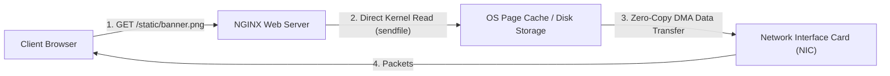
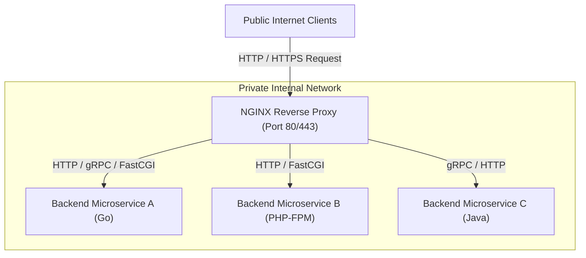
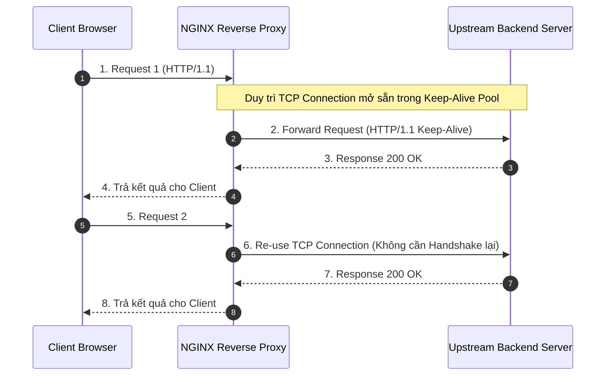
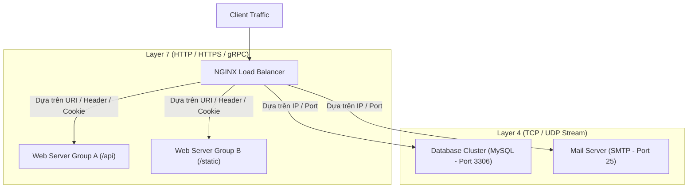
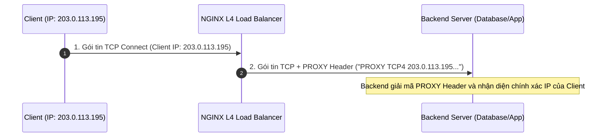
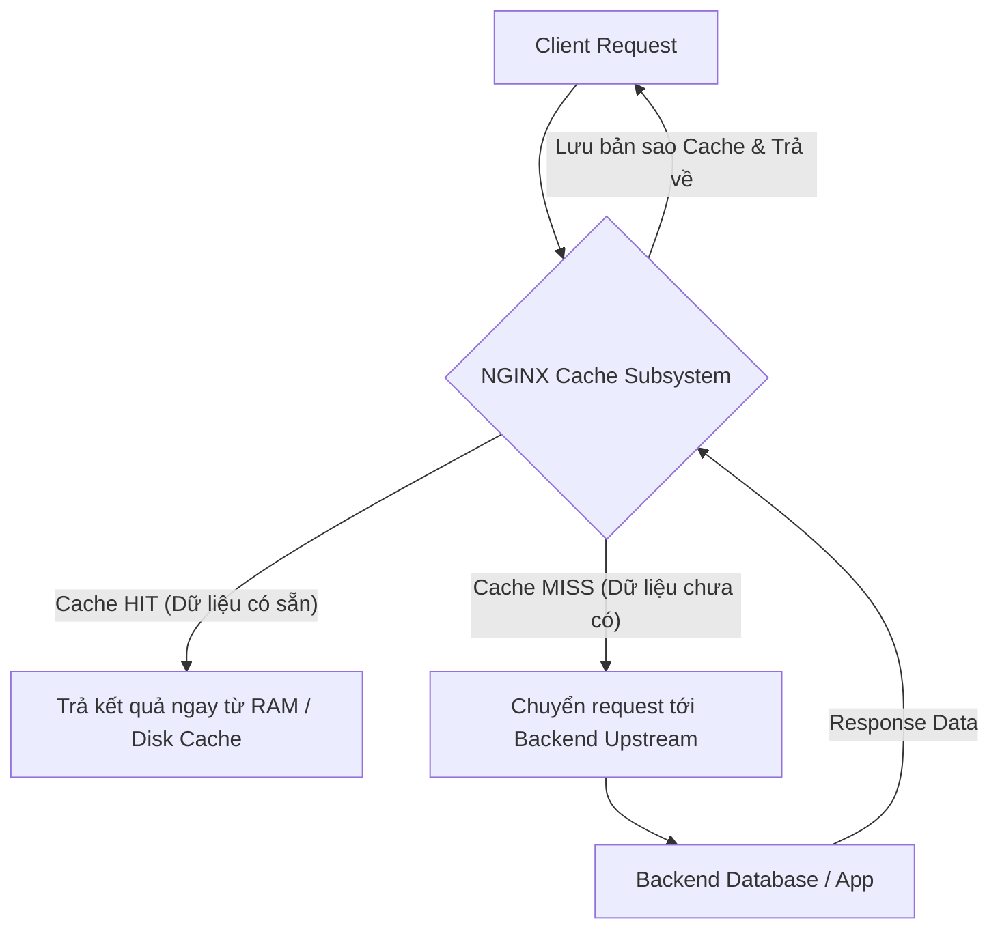
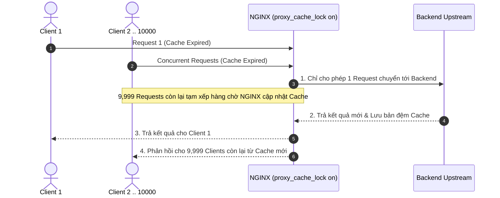

# Chương 3. Các Vai trò & Kịch bản Sử dụng Cốt lõi

Chương này phân tích 6 vai trò kiến trúc quan trọng nhất của NGINX trong hạ tầng mạng hiện đại: Web Server tĩnh, Reverse Proxy, Load Balancer (L4/L7), API Gateway, SSL/TLS Termination Proxy và Content Caching Engine.

## Mục lục

- [3.1 Web Server Phục vụ Nội dung Tĩnh](#31-web-server-phục-vụ-nội-dung-tĩnh)
  - [3.1.1 Giới hạn của sendfile với HTTPS & Giải pháp Kernel TLS (kTLS)](#311-giới-hạn-của-sendfile-với-https--giải-pháp-kernel-tls-ktls)
- [3.2 Reverse Proxy Máy chủ Trung gian](#32-reverse-proxy-máy-chủ-trung-gian)
  - [3.2.1 Cấu hình Bắt buộc cho HTTP Keep-Alive Connection Pool](#321-cấu-hình-bắt-buộc-cho-http-keep-alive-connection-pool)
- [3.3 Load Balancer Cân bằng tải (L4 & L7)](#33-load-balancer-cân-bằng-tải-l4--l7)
  - [3.3.1 PROXY Protocol cho Layer 4 Load Balancing](#331-proxy-protocol-cho-layer-4-load-balancing)
- [3.4 API Gateway & Security Gateway](#34-api-gateway--security-gateway)
- [3.5 SSL/TLS Termination Proxy](#35-ssltls-termination-proxy)
- [3.6 Edge Caching & Content Delivery Engine](#36-edge-caching--content-delivery-engine)
  - [3.6.1 Chống thảm họa Cache Stampede với proxy_cache_lock](#361-chống-thảm-họa-cache-stampede-với-proxy_cache_lock)

---

## 3.1 Web Server Phục vụ Nội dung Tĩnh

NGINX nổi tiếng thế giới nhờ khả năng phục vụ các tệp tin tĩnh (Static Assets: HTML, CSS, JS, Images, Videos, PDF) với tốc độ tiệm cận giới hạn vật lý của đĩa cứng và băng thông mạng.



Sơ đồ trên thể hiện luồng phục vụ tài nguyên tĩnh của NGINX. Nhờ tận dụng lời gọi hệ thống `sendfile`, dữ liệu từ đĩa hoặc RAM Page Cache được đẩy thẳng sang card mạng mà không cần sao chép qua bộ nhớ không gian người dùng (User Space Memory), giúp giảm tải CPU tối đa.

### 3.1.1 Giới hạn của sendfile với HTTPS & Giải pháp Kernel TLS (kTLS)

Cơ chế Zero-Copy `sendfile` hoàn hảo đối với các kết nối HTTP thô (Unencrypted Plaintext). Tuy nhiên, đối với kết nối mã hóa **HTTPS**:
- **Giới hạn kỹ thuật**: NGINX buộc phải đọc dữ liệu từ Disk/Page Cache lên không gian bộ nhớ người dùng (User Space Memory) để thực thi thuật toán mã hóa TLS (như AES hay ChaCha20) trước khi ghi vào Socket Buffer. Điều này khiến cơ chế `sendfile` truyền thống bị vô hiệu hóa.
- **Giải pháp Kernel TLS (kTLS)**: Từ Linux Kernel $\ge 4.13$ kết hợp OpenSSL 3.0+, Linux giới thiệu cơ chế **kTLS**. Khi bật kTLS trong NGINX (thông qua cấu hình `ssl_conf Command Options=KTLS;`), công đoạn mã hóa TLS được chuyển giao trực tiếp xuống Kernel đảm nhận. Nhờ đó, NGINX duy trì được sức mạnh Zero-Copy `sendfile` ngay cả trên các kết nối HTTPS mã hóa cao cấp.

---

## 3.2 Reverse Proxy Máy chủ Trung gian

Trong mô hình **Reverse Proxy**, NGINX đứng trước hệ thống backend (Node.js, Java Spring Boot, Python Django, Go, PHP-FPM), đại diện cho các ứng dụng nội bộ tiếp nhận toàn bộ yêu cầu từ môi trường Internet.



Lợi ích kiến trúc của Reverse Proxy:
- **Che giấu Hạ tầng Nội bộ (Topology Hiding)**: Client bên ngoài chỉ biết địa chỉ IP duy nhất của NGINX, không biết địa chỉ IP hay cổng dịch vụ thực sự của các máy chủ backend.
- **Tối ưu hóa Kết nối HTTP Keep-Alive**: NGINX duy trì một pool các kết nối mở sẵn (Connection Pool) tới backend, giúp giảm thiểu chi phí bắt tay TCP Handshake cho từng request.
- **Chuyển đổi Giao thức (Protocol Translation)**: NGINX có thể nhận giao thức HTTP/2 hoặc HTTP/3 từ client và chuyển đổi thành HTTP/1.1 đơn giản tới backend.

### 3.2.1 Cấu hình Bắt buộc cho HTTP Keep-Alive Connection Pool

Mặc định, chỉ thị `proxy_pass` của NGINX sử dụng phiên bản **HTTP/1.0** khi gửi yêu cầu tới backend (mỗi yêu cầu sẽ tạo mới và đóng 1 TCP connection). Để NGINX thực sự duy trì Connection Pooling tới Backend Server, lập trình viên bắt buộc phải cấu hình đồng thời các chỉ thị sau:

```nginx
upstream backend_pool {
    server 127.0.0.1:8080;
    keepalive 32; # Duy trì tối đa 32 kết nối idle mở sẵn
}

server {
    listen 80;
    location /api/ {
        proxy_pass http://backend_pool;
        proxy_http_version 1.1;        # Bắt buộc sử dụng HTTP/1.1
        proxy_set_header Connection ""; # Xóa Header Connection 'close' mặc định
    }
}
```

Sơ đồ trình tự dưới đây minh họa hiệu quả của Connection Pool khi kết nối tới Upstream:



---

## 3.3 Load Balancer Cân bằng tải (L4 & L7)

NGINX hỗ trợ cân bằng tải ở cả hai tầng trong mô hình OSI:



### 1. Layer 7 Load Balancing (HTTP / HTTPS)
NGINX đọc và phân tích sâu dữ liệu tầng ứng dụng (HTTP Headers, URI, Cookies, Request Method) để đưa ra quyết định định tuyến chính xác đến cụm server thích hợp.

### 2. Layer 4 Load Balancing (TCP / UDP Stream Module)
NGINX hoạt động ở tầng giao vận (Transport Layer), phân phối gói tin TCP/UDP dựa trên địa chỉ IP và Cổng mà không giải mã nội dung bên trong gói tin. Thường dùng làm Load Balancer cho Database Clusters (MySQL, PostgreSQL, Redis) hoặc Mail Servers.

### 3.3.1 PROXY Protocol cho Layer 4 Load Balancing

- **Vấn đề mất IP gốc của Client**: Ở Layer 4 (`stream` module), NGINX chuyển tiếp luồng gói tin TCP thô nên Backend Server chỉ nhìn thấy địa chỉ IP của NGINX Load Balancer mà không biết địa chỉ IP thực tế của Client (do Layer 4 không đọc được Header `X-Forwarded-For` của Layer 7 HTTP).
- **Giải pháp PROXY Protocol**: Khai báo chỉ thị `proxy_protocol on;` trong khối cấu hình `stream`. NGINX sẽ chèn một đoạn Header TCP nhỏ chứa IP và Cổng gốc của Client vào trước luồng dữ liệu TCP thô trước khi gửi tới Backend Server (yêu cầu ứng dụng backend có hỗ trợ giải mã PROXY Protocol).



---

## 3.4 API Gateway & Security Gateway

Trong kiến trúc Microservices, NGINX đảm nhận vai trò điểm đầu vào tập trung (**API Gateway**):
- **Định tuyến Yêu cầu (Request Routing)**: Điều hướng `/api/v1/users` về User Service và `/api/v1/orders` về Order Service.
- **Xác thực Cổng vào (Authentication & Authorization)**: Kiểm tra tính hợp lệ của JWT Token, API Key trước khi chuyển tiếp yêu cầu tới microservices nội bộ.
- **Bảo vệ Hệ thống (Rate Limiting & Throttling)**: Giới hạn số lượng request tối đa trên mỗi IP/User để chống tấn công DDoS hoặc vét cạn tài nguyên.
- **CORS Management**: Khai báo và xử lý tập trung các Header Cross-Origin Resource Sharing cho toàn bộ các dịch vụ frontend.

---

## 3.5 SSL/TLS Termination Proxy

Việc giải mã mã hóa TLS (RSA/ECC Key Exchange, AES Decryption) đòi hỏi năng lực tính toán CPU rất lớn. 

Bằng cách cấu hình NGINX làm **SSL/TLS Termination Proxy**:
1. NGINX trực tiếp xử lý các quá trình bắt tay HTTPS (TLS Handshake) phức tạp với client.
2. Sau khi mã hóa được giải mã, NGINX gửi các chuỗi HTTP thô (Unencrypted Plaintext) qua mạng nội bộ bảo mật (Internal Private VPC) tới các ứng dụng backend.
3. Giải phóng hoàn toàn gánh nặng xử lý mật mã học cho các máy chủ ứng dụng nội bộ.

---

## 3.6 Edge Caching & Content Delivery Engine

NGINX hoạt động như một máy chủ đệm dữ liệu (Caching Server) thông qua module `ngx_http_proxy_module`.



Nút thắt cổ chai về hiệu năng của hầu hết các hệ thống web nằm ở các câu truy vấn cơ sở dữ liệu nặng. NGINX Caching giúp phản hồi kết quả cho hàng triệu request trùng lặp với độ trễ cỡ miligiây mà không làm ảnh hưởng đến backend.

### 3.6.1 Chống thảm họa Cache Stampede với proxy_cache_lock

- **Hiện tượng Cache Stampede**: Khi một tài nguyên có lưu lượng truy cập cao (ví dụ 10.000 req/sec) vừa hết hạn đệm (`Cache Expired`), 10.000 yêu cầu đồng thời nhận trạng thái `Cache MISS` và cùng lúc dội vào Backend Server để yêu cầu tạo dữ liệu mới, làm sụp đổ Backend.
- **Giải pháp `proxy_cache_lock`**: Bật chỉ thị `proxy_cache_lock on;`. Khi xảy ra `Cache MISS`, NGINX chỉ cho phép **duy nhất 1 request** chuyển tiếp tới Backend để tạo cache mới, trong khi 9.999 request còn lại kiên nhẫn chờ NGINX cập nhật xong cache rồi lập tức dùng chung kết quả từ bản đệm mới.



---

## Bảng So sánh Tổng hợp các Vai trò của NGINX

| Vai trò Kiến trúc | Cụm Chỉ thị Cốt lõi | Giá trị Kỹ thuật chính |
| :--- | :--- | :--- |
| **Web Server** | `root`, `alias`, `try_files`, `sendfile` | Phục vụ tệp tĩnh cực nhanh với Zero-Copy `sendfile` (bổ sung kTLS cho HTTPS). |
| **Reverse Proxy** | `proxy_pass`, `keepalive`, `proxy_http_version` | Che giấu topology nội bộ, duy trì Connection Pool tới Backend. |
| **Load Balancer** | `upstream`, `least_conn`, `proxy_protocol` | Phân phối tải thông minh L4/L7, giữ nguyên Client IP qua PROXY Protocol. |
| **API Gateway** | `limit_req`, `limit_conn`, `auth_request` | Bảo vệ microservices, giới hạn rate limit & authentication. |
| **SSL Termination** | `ssl_certificate`, `ssl_protocols` | Tối ưu hóa CPU, xử lý tập trung chứng chỉ HTTPS. |
| **Caching Engine** | `proxy_cache`, `proxy_cache_lock` | Giảm tải cho Database/Backend, chống thảm họa Cache Stampede. |

---
[← Quay lại mục lục](README.md)
