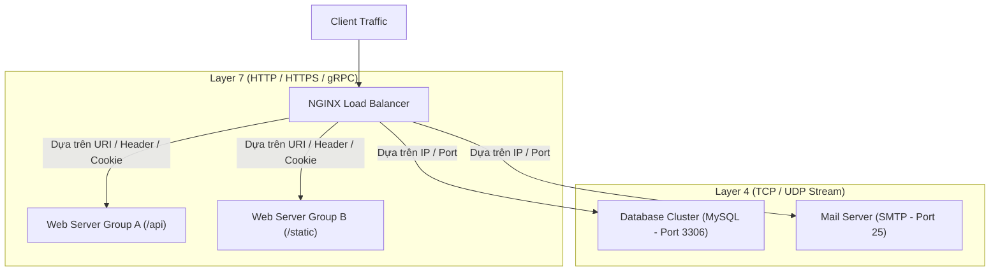

# Chương 3. Các Vai trò & Kịch bản Sử dụng Cốt lõi

Chương này phân tích 6 vai trò kiến trúc quan trọng nhất của NGINX trong hạ tầng mạng hiện đại: Web Server tĩnh, Reverse Proxy, Load Balancer (L4/L7), API Gateway, SSL/TLS Termination Proxy và Content Caching Engine.

## Mục lục

- [3.1 Web Server Phục vụ Nội dung Tĩnh](#31-web-server-phục-vụ-nội-dung-tĩnh)
- [3.2 Reverse Proxy Máy chủ Trung gian](#32-reverse-proxy-máy-chủ-trung-gian)
- [3.3 Load Balancer Cân bằng tải (L4 & L7)](#33-load-balancer-cân-bằng-tải-l4--l7)
- [3.4 API Gateway & Security Gateway](#34-api-gateway--security-gateway)
- [3.5 SSL/TLS Termination Proxy](#35-ssltls-termination-proxy)
- [3.6 Edge Caching & Content Delivery Engine](#36-edge-caching--content-delivery-engine)

---

## 3.1 Web Server Phục vụ Nội dung Tĩnh

NGINX nổi tiếng thế giới nhờ khả năng phục vụ các tệp tin tĩnh (Static Assets: HTML, CSS, JS, Images, Videos, PDF) với tốc độ tiệm cận giới hạn vật lý của đĩa cứng và băng thông mạng.

```mermaid
graph LR
    User["Client Browser"] -->|1. GET /static/banner.png| NGINX["NGINX Web Server"]
    NGINX -->|2. Direct Kernel Read (sendfile)| OS["OS Page Cache / Disk Storage"]
    OS -->|3. Zero-Copy DMA Data Transfer| Net["Network Interface Card (NIC)"]
    Net -->|4. Packets| User
```

Sơ đồ trên thể hiện luồng phục vụ tài nguyên tĩnh của NGINX. Nhờ tận dụng lời gọi hệ thống `sendfile`, dữ liệu từ đĩa hoặc RAM Page Cache được đẩy thẳng sang card mạng mà không cần sao chép qua bộ nhớ không gian người dùng (User Space Memory), giúp giảm tải CPU tối đa.

---

## 3.2 Reverse Proxy Máy chủ Trung gian

Trong mô hình **Reverse Proxy**, NGINX đứng trước hệ thống backend (Node.js, Java Spring Boot, Python Django, Go, PHP-FPM), đại diện cho các ứng dụng nội bộ tiếp nhận toàn bộ yêu cầu từ môi trường Internet.


Lợi ích kiến trúc của Reverse Proxy:
- **Che giấu Hạ tầng Nội bộ (Topology Hiding)**: Client bên ngoài chỉ biết địa chỉ IP duy nhất của NGINX, không biết địa chỉ IP hay cổng dịch vụ thực sự của các máy chủ backend.
- **Tối ưu hóa Kết nối HTTP Keep-Alive**: NGINX duy trì một pool các kết nối mở sẵn (Connection Pool) tới backend, giúp giảm thiểu chi phí bắt tay TCP Handshake cho từng request.
- **Chuyển đổi Giao thức (Protocol Translation)**: NGINX có thể nhận giao thức HTTP/2 hoặc HTTP/3 từ client và chuyển đổi thành HTTP/1.1 đơn giản tới backend.

---

## 3.3 Load Balancer Cân bằng tải (L4 & L7)

NGINX hỗ trợ cân bằng tải ở cả hai tầng trong mô hình OSI:



### 1. Layer 7 Load Balancing (HTTP / HTTPS)
NGINX đọc và phân tích sâu dữ liệu tầng ứng dụng (HTTP Headers, URI, Cookies, Request Method) để đưa ra quyết định định tuyến chính xác đến cụm server thích hợp.

### 2. Layer 4 Load Balancing (TCP / UDP Stream Module)
NGINX hoạt động ở tầng giao vận (Transport Layer), phân phối gói tin TCP/UDP dựa trên địa chỉ IP và Cổng mà không giải mã nội dung bên trong gói tin. Thường dùng làm Load Balancer cho Database Clusters (MySQL, PostgreSQL, Redis) hoặc Mail Servers.

---

## 3.4 API Gateway & Security Gateway

Trong kiến trúc Microservices, NGINX đảm nhận vai trò điểm đầu vào tập trung (**API Gateway**):
- **Định tuyến Yêu cầu (Request Routing)**: Điều hướng `/api/v1/users` về User Service và `/api/v1/orders` về Order Service.
- **Xác thực Cổng vào (Authentication & Authorization)**: Kiểm tra tính hợp lệ của JWT Token, API Key trước khi chuyển tiếp yêu cầu tới microservices nội bộ.
- **Bảo vệ Hệ thống (Rate Limiting & Throttling)**: Giới hạn số lượng request tối đa trên mỗi IP/User để chống tấn công DDoS hoặc vét cạn tài nguyên.
- **CORS Management**: Khai báo và xử lý tập trung các Header Cross-Origin Resource Sharing cho toàn bộ các dịch vụ frontend.

---

## 3.5 SSL/TLS Termination Proxy

Việc giải mã mã hóa TLS (RSA/ECC Key Exchange, AES Decryption) đòi hỏi năng lực tính toán CPU rất lớn. 

Bằng cách cấu hình NGINX làm **SSL/TLS Termination Proxy**:
1. NGINX trực tiếp xử lý các quá trình bắt tay HTTPS (TLS Handshake) phức tạp với client.
2. Sau khi mã hóa được giải mã, NGINX gửi các chuỗi HTTP thô (Unencrypted Plaintext) qua mạng nội bộ bảo mật (Internal Private VPC) tới các ứng dụng backend.
3. Giải phóng hoàn toàn gánh nặng xử lý mật mã học cho các máy chủ ứng dụng nội bộ.

---

## 3.6 Edge Caching & Content Delivery Engine

NGINX hoạt động như một máy chủ đệm dữ liệu (Caching Server) thông qua module `ngx_http_proxy_module`.

```mermaid
graph TD
    Client["Client Request"] --> NGINXCache{"NGINX Cache Subsystem"}
    
    NGINXCache -->|Cache HIT (Dữ liệu có sẵn)| ReturnClient["Trả kết quả ngay từ RAM / Disk Cache"]
    NGINXCache -->|Cache MISS (Dữ liệu chưa có)| FetchBackend["Chuyển request tới Backend Upstream"]
    
    FetchBackend --> BackendApp["Backend Database / App"]
    BackendApp -->|Response Data| NGINXCache
    NGINXCache -->|Lưu bản sao Cache & Trả về| Client
```

Nút thắt cổ chai về hiệu năng của hầu hết các hệ thống web nằm ở các câu truy vấn cơ sở dữ liệu nặng. NGINX Caching giúp phản hồi kết quả cho hàng triệu request trùng lặp với độ trễ cỡ miligiây mà không làm ảnh hưởng đến backend.

---

## Bảng So sánh Tổng hợp các Vai trò của NGINX

| Vai trò Kiến trúc | Cụm Chỉ thị Cốt lõi | Giá trị Kỹ thuật chính |
| :--- | :--- | :--- |
| **Web Server** | `root`, `alias`, `index`, `try_files` | Phục vụ tệp tĩnh cực nhanh với `sendfile` zero-copy. |
| **Reverse Proxy** | `proxy_pass`, `proxy_set_header` | Che giấu topology nội bộ, chuyển đổi giao thức HTTP. |
| **Load Balancer** | `upstream`, `least_conn`, `ip_hash` | Phân phối tải thông minh L4/L7, hỗ trợ failover. |
| **API Gateway** | `limit_req`, `limit_conn`, `auth_request` | Bảo vệ microservices, giới hạn rate limit & authentication. |
| **SSL Termination** | `ssl_certificate`, `ssl_protocols` | Tối ưu hóa CPU, xử lý tập trung chứng chỉ HTTPS. |
| **Caching Engine** | `proxy_cache_path`, `proxy_cache` | Giảm tải tức thì cho Database và Backend Servers. |

---
[← Quay lại mục lục](README.md)
