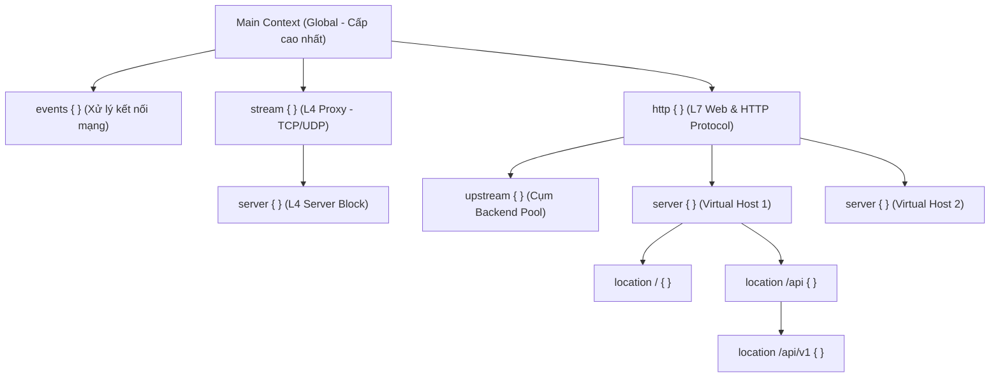

# Chương 4. Cấu trúc File & Ngữ cảnh Cấu hình (Contexts)

Chương này giải mã cấu trúc file cấu hình NGINX, phân cấp ngữ cảnh (Context Hierarchy), quy tắc cú pháp của các chỉ thị (Directives), nguyên lý kế thừa giá trị và cạm bẫy phổ biến liên quan đến các directive dạng mảng (Array-type Directives).

## Mục lục

- [4.1 Cấu trúc Thư mục & Tệp tin Cấu hình Standard](#41-cấu-trúc-thư-mục--tệp-tin-cấu-hình-standard)
- [4.2 Phân cấp Ngữ cảnh (Context Hierarchy)](#42-phân-cấp-ngữ-cảnh-context-hierarchy)
- [4.3 Chi tiết các Ngữ cảnh Cốt lõi](#43-chi-tiết-các-ngữ-cảnh-cốt-lõi)
- [4.4 Cú pháp Directive & Quy tắc Cú pháp](#44-cú-pháp-directive--quy-tắc-cú-pháp)
- [4.5 Quy tắc Kế thừa & Cạm bẫy Directive Dạng Mảng](#45-quy-tắc-kế-thừa--cạm-bẫy-directive-dạng-mảng)

---

## 4.1 Cấu trúc Thư mục & Tệp tin Cấu hình Standard

Hệ thống file cấu hình của NGINX được tổ chức theo cơ chế modularization (mô-đun hóa) nhằm tách biệt cấu hình toàn cục với cấu hình của từng trang web hoặc dịch vụ riêng lẻ.

### Thư mục cấu hình `/etc/nginx/`

```text
/etc/nginx/
├── nginx.conf              # Tệp cấu hình chính của hệ thống (Entry point)
├── mime.types              # Ánh xạ giữa định dạng file (extension) và Content-Type HTTP
├── conf.d/                 # Thư mục chứa các file cấu hình Virtual Host (*.conf)
├── sites-available/        # [Debian/Ubuntu] Chứa các cấu hình Virtual Host khả thi
├── sites-enabled/          # [Debian/Ubuntu] Symlink trỏ đến sites-available để kích hoạt
└── modules-enabled/        # [Debian/Ubuntu] Nạp các mô-đun động (Dynamic Modules)
```

> [!NOTE]
> **Sự khác biệt giữa các bản phân phối Linux:**
> - **Debian / Ubuntu**: Sử dụng mô hình liên kết mềm (`sites-available/` → `sites-enabled/`). Tệp `nginx.conf` nạp cấu hình qua chỉ thị `include /etc/nginx/sites-enabled/*;`.
> - **RHEL / CentOS / Rocky Linux / Docker**: Nạp trực tiếp tất cả các tệp cấu hình từ thư mục `conf.d/` qua chỉ thị `include /etc/nginx/conf.d/*.conf;`.

---

## 4.2 Phân cấp Ngữ cảnh (Context Hierarchy)

Tệp cấu hình NGINX được phân thành các **Ngữ cảnh (Contexts)** hay khối cấu hình lồng nhau. Mỗi ngữ cảnh xác định một phạm vi áp dụng (scope) riêng biệt cho các chỉ thị bên trong.



| Ngữ cảnh (Context) | Vai trò/Mô tả | Chi tiết |
| :--- | :--- | :--- |
| **`main` (Global)** | Ngữ cảnh cấp cao nhất, nằm ngoài mọi khối `{}` | Chứa các chỉ thị toàn cục như `user`, `worker_processes`, `pid` |
| **`events`** | Quản lý cấu hình xử lý kết nối mạng của Worker | Chứa `worker_connections`, `multi_accept` |
| **`http` / `stream`** | Định nghĩa dịch vụ L7 (Web/HTTP) hoặc L4 (TCP/UDP) | Chứa cấu hình protocol, upstream pool, virtual hosts (`server`) |
| **`server` / `location`** | Khai báo Virtual Host và định tuyến URI chi tiết | Xử lý request matching, `root`, `alias`, `proxy_pass` |

---

## 4.3 Chi tiết các Ngữ cảnh Cốt lõi


| Ngữ cảnh (Context) | Phạm vi / Mục tiêu | Các Directive tiêu biểu |
| :--- | :--- | :--- |
| **`main`** | Cấu hình toàn cục hệ thống (nằm ngoài mọi khối `{}`) | `user`, `worker_processes`, `error_log`, `pid` |
| **`events`** | Thiết lập mô hình xử lý kết nối mạng của Worker | `worker_connections`, `use epoll` *(tùy chọn; NGINX tự chọn cơ chế tối ưu theo OS)*, `multi_accept` |
| **`http`** | Cấu hình toàn bộ giao thức HTTP/HTTPS và Web Service | `include mime.types`, `sendfile`, `keepalive_timeout` |
| **`server`** | Định nghĩa một máy chủ ảo (Virtual Host / Domain / IP) | `listen`, `server_name`, `ssl_certificate` |
| **`location`** | Định tuyến và xử lý các URI cụ thể thuộc `server` | `root`, `alias`, `proxy_pass`, `try_files` |
| **`upstream`** | Định nghĩa nhóm các máy chủ backend để cân bằng tải | `server`, `least_conn`, `ip_hash`, `keepalive` |
| **`stream`** | Cấu hình Reverse Proxy và Load Balancer cấp L4 (TCP/UDP) | `listen`, `proxy_pass`, `proxy_timeout` |

---

## 4.4 Cú pháp Directive & Quy tắc Cú pháp

Một tệp cấu hình NGINX bao gồm hai loại chỉ thị (Directives):

### 1. Simple Directive (Chỉ thị Đơn)
Gồm tên chỉ thị và các tham số phân cách bằng khoảng trắng, **bắt buộc kết thúc bằng dấu chấm phẩy (`;`)**.

```nginx
# Khai báo số lượng tiến trình worker bằng số lõi CPU
worker_processes auto;

# Đặt thời gian chờ keep-alive là 65 giây
keepalive_timeout 65;
```

### 2. Block Directive (Chỉ thị Khối)
Gồm tên chỉ thị, theo sau là cặp dấu ngoặc nhọn `{}` chứa các chỉ thị bên trong.

```nginx
http {
    include       /etc/nginx/mime.types;
    default_type  application/octet-stream;
    
    server {
        listen       80;
        server_name  example.com;
    }
}
```

---

## 4.5 Quy tắc Kế thừa & Cạm bẫy Directive Dạng Mảng

NGINX áp dụng cơ chế kế thừa từ trên xuống dưới (từ ngữ cảnh cha `http` → `server` → `location`). Tuy nhiên, cách thức kế thừa phụ thuộc hoàn toàn vào **Loại của Directive**.

### 1. Kế thừa của Single-value Directives (Chỉ thị Giá trị Đơn)
Nếu ngữ cảnh con không khai báo lại, nó sẽ kế thừa giá trị từ ngữ cảnh cha. Nếu ngữ cảnh con khai báo giá trị mới, nó sẽ **ghi đè (override)** giá trị của ngữ cảnh cha trong phạm vi của nó.

```nginx
http {
    root /var/www/default; # Ngữ cảnh cha HTTP

    server {
        server_name app.com;
        # Khối này không khai báo root -> kế thừa /var/www/default
    }

    server {
        server_name api.com;
        root /var/www/api_data; # Ghi đè root cho server này
    }
}
```

### 2. Cạm bẫy Array-type Directives (Chỉ thị Dạng Mảng)
Các directive như `add_header`, `proxy_set_header`, `fastcgi_param` thuộc loại chỉ thị dạng mảng.

**Quy tắc kế thừa mảng của NGINX:** Mặc định các directive dạng mảng **không hợp nhất (No Merge)** dữ liệu từ cấp cha xuống cấp con. Nếu ngữ cảnh con khai báo **bất kỳ** chỉ thị dạng mảng nào cùng loại, toàn bộ các chỉ thị dạng mảng cùng loại ở ngữ cảnh cha sẽ bị **xóa sạch và thay thế hoàn toàn** trong phạm vi ngữ cảnh con đó.

Ví dụ cấu hình bị rò rỉ bảo mật do hiểu sai cơ chế kế thừa:
```nginx
server {
    add_header X-Frame-Options "DENY";
    add_header X-Content-Type-Options "nosniff";
    add_header X-XSS-Protection "1; mode=block";

    location / {
        root /var/www/html;
        # Location này không khai báo add_header -> kế thừa đầy đủ 3 Security Headers
    }

    location /download/ {
        root /var/www/files;
        add_header Cache-Control "no-cache";
        
        # [Cạm bẫy]: Do khai báo add_header ở đây,
        # TOÀN BỘ 3 Security Headers phía trên đã bị xóa bỏ hoàn toàn!
    }
}
```

**Giải pháp:** 
- **Cách truyền thống**: Khai báo lại đầy đủ tất cả các giá trị mảng tại ngữ cảnh con khi cần bổ sung thêm header.
- **Tính năng mới (`add_header_inherit` - NGINX 1.29.3+)**: Từ phiên bản 1.29.3 (tháng 10/2025), NGINX bổ sung chỉ thị `add_header_inherit` cho phép bật cơ chế kế thừa header từ ngữ cảnh cha (`add_header_inherit on;`), giải quyết triệt để cạm bẫy xóa sạch mảng header khi khai báo bổ sung ở ngữ cảnh con.

---
[← Quay lại mục lục](README.md)
