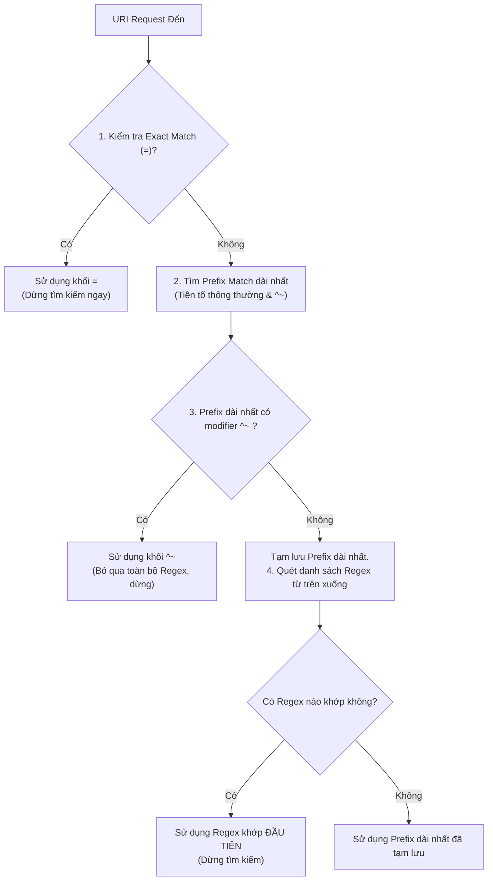
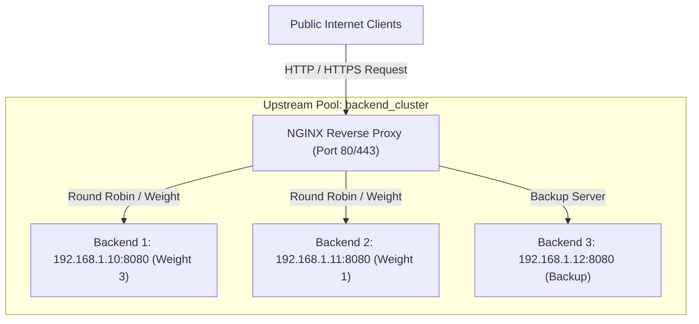
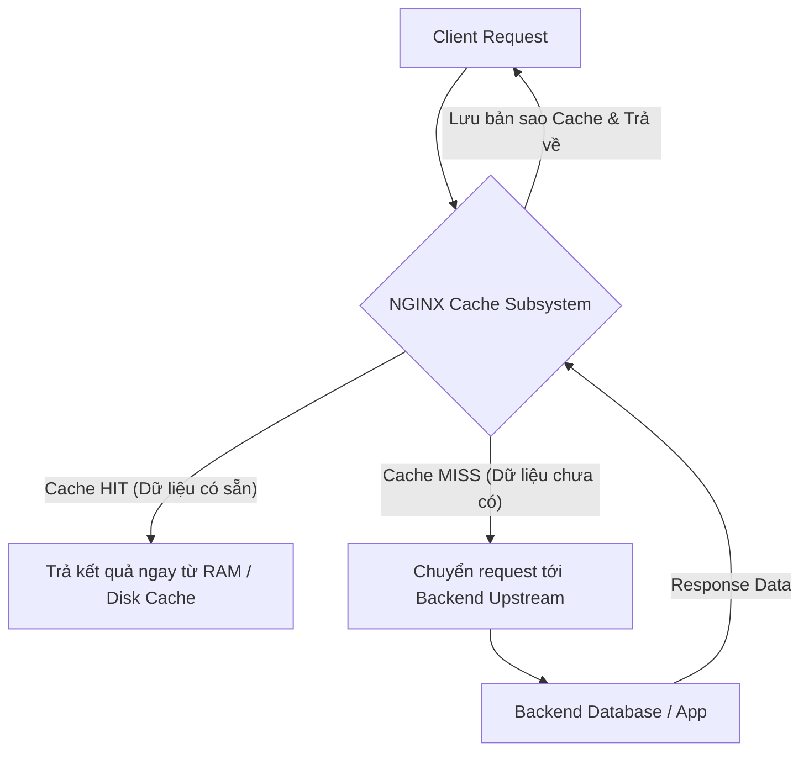
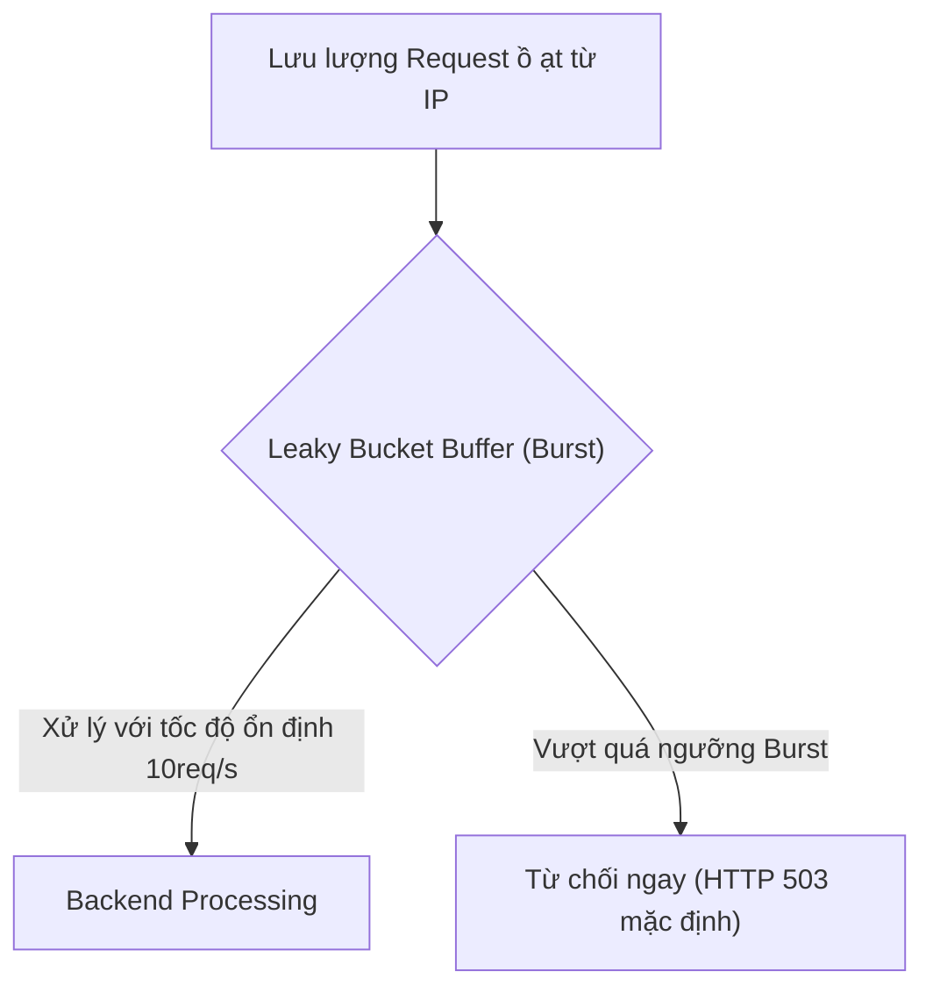

# Chương 5. Các Tính năng Cốt lõi của NGINX (Core Features)

Chương này tổng hợp 4 nhóm tính năng quan trọng nhất làm nên tên tuổi của NGINX trong hạ tầng web hiện đại: Khớp địa chỉ URI & Định tuyến, Reverse Proxy & Cân bằng tải, Caching & Tối ưu hiệu năng, cùng Bảo mật SSL/TLS & Khống chế lưu lượng (Rate Limiting).

## Mục lục

- [5.1 Định tuyến & Khớp Location (Location Matching & Routing)](#51-định-tuyến--khớp-location-location-matching--routing)
- [5.2 Reverse Proxy & Cân bằng tải (Load Balancing)](#52-reverse-proxy--cân-bằng-tải-load-balancing)
- [5.3 Caching & Tối ưu hiệu năng (Performance Tuning)](#53-caching--tối-ưu-hiệu-năng-performance-tuning)
- [5.4 Bảo mật, SSL/TLS Termination & Rate Limiting](#54-bảo-mật-ssltls-termination--rate-limiting)

---

## 5.1 Định tuyến & Khớp Location (Location Matching & Routing)

Khối `location` nằm trong ngữ cảnh `server` chịu trách nhiệm định tuyến các request HTTP incoming dựa trên đường dẫn URI. NGINX dùng quy trình 5 bước để tìm ra khối `location` khớp nhất cho mỗi request.

| Modifier | Tên gọi | Mức độ ưu tiên | Mô tả cơ chế |
| :--- | :--- | :--- | :--- |
| `=` | Exact Match | Cao nhất (1) | Khớp chính xác từng ký tự URI. Khớp là dừng ngay. |
| `^~` | Preferential Prefix | Ưu tiên 2 | Nếu là prefix dài nhất, dừng tìm kiếm và bỏ qua tất cả các khối Regex. |
| `~` / `~*` | Case-Sensitive / Insensitive Regex | Ưu tiên 3 | Biểu thức chính quy (Regex). NGINX sẽ lấy khối Regex đầu tiên khớp từ trên xuống. |
| *(Trống)* | Standard Prefix | Ưu tiên 4 | Tiền tố thông thường. NGINX tạm lưu lại và quét tiếp các khối Regex. |

> [!WARNING]
> **Phân biệt `root` và `alias`:**
> - `root`: Nối chuỗi đường dẫn cấu hình với **toàn bộ URI** (ví dụ: `location /img/ { root /var/www; }` → NGINX tìm tệp tại `/var/www/img/`).
> - `alias`: Thay thế phần tiền tố khớp trong `location` bằng đường dẫn đĩa vật lý (ví dụ: `location /img/ { alias /var/www/images/; }` → NGINX tìm tệp tại `/var/www/images/`).

---

## 5.2 Reverse Proxy & Cân bằng tải (Load Balancing)

Khi làm Reverse Proxy, NGINX đứng trước các dịch vụ backend (Node.js, Java, Go, Python...) để tiếp nhận request từ client và điều phối lưu lượng qua cụm `upstream`.

| Thành phần | Vai trò/Mô tả | Chi tiết |
| :--- | :--- | :--- |
| **Internet Clients** | Khách hàng ngoài truy cập Web/API | Gửi request qua SSL/TLS tới NGINX |
| **NGINX Proxy** | Tiếp nhận request và cân bằng tải | Điều hướng lưu lượng theo trọng số (Weight) |
| **Upstream Pool** | Cụm máy chủ backend nội bộ | Xử lý logic nghiệp vụ, có server backup phòng sự cố |

### Các tính năng cốt lõi khi làm Reverse Proxy:
- **Chuyển tiếp request (`proxy_pass`)**: Điều hướng request tới backend hoặc cụm máy chủ `upstream`.
- **Giữ lại thông tin client**: Truyền IP thực của client về backend qua các header như `X-Real-IP`, `X-Forwarded-For` hoặc giao thức PROXY Protocol ở Layer 4.
- **Hỗ trợ WebSocket**: NGINX hỗ trợ chuyển đổi giao thức (Protocol Upgrade) qua bộ chỉ thị `proxy_http_version 1.1;`, `proxy_set_header Upgrade $http_upgrade;` và `proxy_set_header Connection "upgrade";` để duy trì kết nối thời gian thực.
- **Thuật toán cân bằng tải**:
  - `Round Robin` *(Mặc định)*: Luân phiên chia đều request.
  - `Weighted`: Chia request dựa theo trọng số (phần cứng/năng lực) của từng server.
  - `Least Connections`: Gửi request đến server đang xử lý ít kết nối nhất.
  - `IP Hash`: Cố định client IP vào một backend server cụ thể (gần giống Sticky Session).

> [!IMPORTANT]
> **Tối ưu HTTP Keep-Alive Pool:** Trước phiên bản NGINX 1.29.7 (tháng 3/2026), NGINX mặc định dùng HTTP/1.0 khi gửi request đến backend. Từ NGINX 1.29.7, NGINX cập nhật mặc định sang HTTP/1.1 + keepalive connection pool. Để tái sử dụng kết nối trên các phiên bản NGINX cũ hoặc đảm bảo kiểm soát rõ ràng, bạn nên bật `proxy_http_version 1.1;`, xóa header Connection `proxy_set_header Connection "";` và khai báo chỉ thị `keepalive` trong khối `upstream`.

---

## 5.3 Caching & Tối ưu hiệu năng (Performance Tuning)

Bộ đệm (Caching Subsystem) tích hợp sẵn trong NGINX cho phép lưu bản sao response trên RAM/Disk. Nhờ đó, NGINX có thể trả kết quả trực tiếp cho client mà không cần đẩy request xuống backend hay database.

| Trường hợp | Hành động của NGINX | Tác động Backend |
| :--- | :--- | :--- |
| **Cache HIT** | Phản hồi dữ liệu trực tiếp từ RAM/Disk đệm | Backend không phải xử lý, độ trễ cỡ miligiây |
| **Cache MISS** | Chuyển request xuống Backend, lưu đệm bản sao | Backend xử lý request và trả dữ liệu mới về NGINX |

### Kỹ thuật tối ưu hiệu năng đáng chú ý:
1. **Microcaching cho API**: Lưu cache các response API trong khoảng thời gian rất ngắn (ví dụ `1s`). Trong kịch bản lý tưởng với 1 cache key duy nhất và bật `proxy_cache_lock on;`, khi có spike traffic 10.000 req/s, backend chỉ cần xử lý **1 req/s**, 9.999 req còn lại NGINX sẽ trả thẳng từ RAM.
2. **Chống thảm họa Cache Stampede (`proxy_cache_lock`)**: Khi cache vừa hết hạn, chỉ đúng 1 request được phép gọi xuống backend để cập nhật cache. Các request khác sẽ đợi kết quả đệm mới thay vì đồng loạt dội vào backend.
3. **Kỹ thuật Zero-Copy `sendfile`**: Truyền file trực tiếp từ đĩa cứng (OS Page Cache) ra card mạng ở cấp Kernel mà không cần copy qua User Space, giúp tiết kiệm CPU tối đa.

> [!TIP]
> Bạn nên bật bộ đôi `sendfile on;` và `tcp_nopush on;` trong khối `http` để NGINX gộp đủ gói tin trước khi gửi qua card mạng, giúp giảm overhead mạng.

---

## 5.4 Bảo mật, SSL/TLS Termination & Rate Limiting

NGINX thường được dùng làm cổng bảo mật (Security Gateway), giúp giảm tải công việc mã hóa cho backend và bảo vệ hệ thống trước nguy cơ quá tải hay tấn công DDoS.

| Thành phần/Luồng | Vai trò/Mô tả | Chi tiết |
| :--- | :--- | :--- |
| **Incoming Traffic** | Lưu lượng request từ Client IP | Kiểm tra tần suất theo `limit_req_zone` |
| **Leaky Bucket (Burst)** | Hàng đợi đệm request vượt ngưỡng | Giữ lại tối đa số request theo tham số `burst` |
| **Response / Drop** | Xử lý tốc độ ổn định hoặc từ chối | Trả về HTTP 503 mặc định (hoặc 429 nếu cấu hình) |

### Các tính năng bảo mật chính:
- **SSL/TLS Termination**: NGINX đảm nhận toàn bộ quá trình bắt tay mã hóa HTTPS (TLS Handshake). Nhờ đó, backend chỉ cần xử lý HTTP thô trong mạng nội bộ.
- **Kernel TLS (kTLS)**: Chuyển công đoạn mã hóa TLS xuống nhân Linux Kernel (yêu cầu NGINX ≥ 1.21.4, OpenSSL ≥ 3.0 build `enable-ktls`, Linux Kernel ≥ 4.13 cho TX / ≥ 4.17 cho RX), giữ được lợi thế Zero-Copy của `sendfile` ngay cả trên kết nối HTTPS.
- **Rate Limiting (`limit_req`)**: Sử dụng thuật toán **Leaky Bucket (Thùng rò rỉ)** để giới hạn số lượng request/giây từ mỗi IP, giúp chặn các đợt Brute-force hoặc Web Scraping. Mặc định NGINX trả về mã HTTP 503 khi request vượt ngưỡng (có thể đổi thành 429 bằng chỉ thị `limit_req_status 429;`).
- **Giới hạn kết nối (`limit_conn`) & Băng thông (`limit_rate`)**: Kiểm soát lượng tài nguyên mà mỗi client IP có thể tiêu tốn.

| Tính năng Bảo mật | Directive NGINX tiêu biểu | Mục đích Kỹ thuật |
| :--- | :--- | :--- |
| **SSL/TLS Termination** | `ssl_certificate`, `ssl_protocols TLSv1.2 TLSv1.3` | Giải mã HTTPS tập trung tại cổng vào |
| **Rate Limiting** | `limit_req_zone`, `limit_req zone=... burst=20` | Giới hạn tần suất request (chống DDoS / Spam; trả về HTTP 503 mặc định, hoặc 429 nếu cấu hình `limit_req_status 429;`) |
| **Connection Limiting** | `limit_conn_zone`, `limit_conn` | Giới hạn số lượng kết nối TCP đồng thời |
| **Access Control** | `allow`, `deny` | Chặn hoặc cho phép truy cập theo IP / Subnet |

---
[← Quay lại mục lục](README.md)
