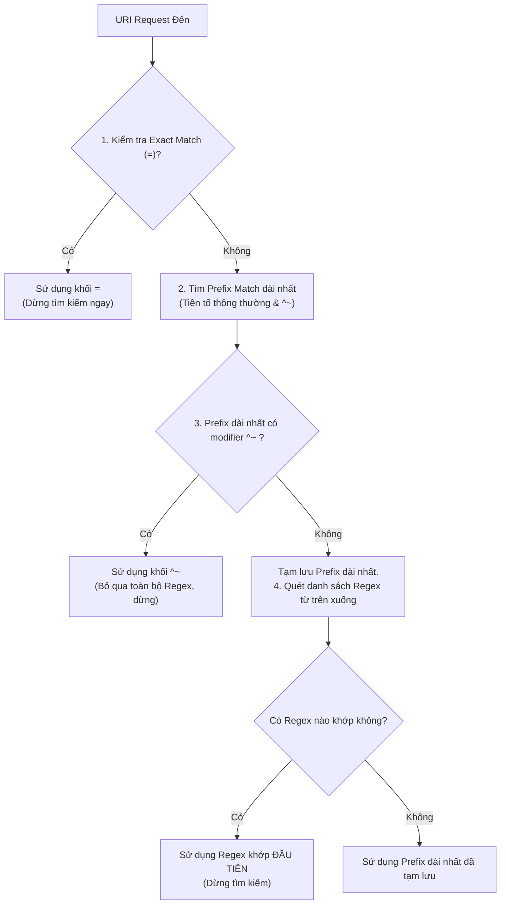

# Chương 5. Giải thuật Khớp Location & Định tuyến URI

Chương này giải mã giải thuật khớp khối `location` trong NGINX, sự khác biệt giữa `root` và `alias`, cùng với cơ chế điều hướng bằng `return` và `rewrite`.

## Mục lục

- [5.1 Các loại Modifier trong Khối Location](#51-các-loại-modifier-trong-khối-location)
- [5.2 Giải thuật Khớp Location 5 bước](#52-giải-thuật-khớp-location-5-bước)
- [5.3 Phân biệt Chỉ thị root và alias](#53-phân-biệt-chỉ-thị-root-và-alias)
- [5.4 Điều hướng Luồng: return vs rewrite](#54-điều-hướng-luồng-return-vs-rewrite)

---

## 5.1 Các loại Modifier trong Khối Location

Khối `location` quyết định cách thức NGINX xử lý một URI yêu cầu. Việc lựa chọn modifier phù hợp quyết định trực tiếp tới tính chính xác và hiệu năng định tuyến.

| Thứ tự ưu tiên | Modifier | Loại Khớp nối | Mô tả & Cơ chế dừng tìm kiếm |
| :---: | :---: | :--- | :--- |
| **1** | `=` | Khớp chính xác (Exact Match) | Trùng khớp từng ký tự URI. Dừng tìm kiếm ngay lập tức khi tìm thấy. |
| **2** | `^~` | Tiền tố ưu tiên (Preferential Prefix) | Nếu tiền tố này dài nhất, dừng tìm kiếm và **bỏ qua toàn bộ Regex**. |
| **3** | `~` | Biểu thức chính quy (Case-sensitive Regex) | Regex có phân biệt chữ hoa/thường. Chọn Regex đầu tiên trùng khớp. |
| **4** | `~*` | Biểu thức chính quy (Case-insensitive Regex) | Regex không phân biệt chữ hoa/thường. Chọn Regex đầu tiên trùng khớp. |
| **5** | *(Trống)* | Tiền tố thông thường (Standard Prefix) | Tìm tiền tố dài nhất, tạm lưu lại và tiếp tục quét danh sách Regex. |

---

## 5.2 Giải thuật Khớp Location 5 bước

Khi một yêu cầu URI đến, NGINX thực hiện tìm kiếm qua một quy trình tuần tự nghiêm ngặt:



Sơ đồ trên minh họa thuật toán chọn `location` của NGINX. Hai điểm cần nắm vững:
1. Modifier `^~` chỉ có hiệu lực khi URI thực sự khớp với tiền tố đó và nó là tiền tố dài nhất — lúc đó nó mới **vô hiệu hóa** toàn bộ các khối Regex.
2. Các khối Regex được quét theo **thứ tự xuất hiện từ trên xuống dưới** trong file cấu hình. Khối Regex nào nằm trên khớp trước sẽ được sử dụng ngay.

---

## 5.3 Phân biệt Chỉ thị root và alias

Hai chỉ thị `root` và `alias` được sử dụng để ánh xạ URI vào đường dẫn đĩa vật lý, nhưng có cơ chế ghép nối hoàn toàn khác nhau:

### Chỉ thị `root`
NGINX cộng dồn giá trị của `root` với **toàn bộ chuỗi URI** yêu cầu:

```nginx
location /images/ {
    root /var/www/media;
}
# Request:  GET /images/logo.png
# Kết quả:  /var/www/media/images/logo.png
```

### Chỉ thị `alias`
NGINX **thay thế** phần URI trùng khớp trong khối `location` bằng đường dẫn khai báo trong `alias`:

```nginx
location /images/ {
    alias /var/www/media/photos/;
}
# Request:  GET /images/logo.png
# Kết quả:  /var/www/media/photos/logo.png
```

**Lưu ý về bảo mật với `alias`:** Nếu khối `location` không kết thúc bằng dấu gạch chéo `/` mà `alias` lại khai báo dấu `/` (hoặc ngược lại), kẻ tấn công có thể khai thác lỗ hổng Path Traversal để đọc các file hệ thống nhạy cảm. Luôn đảm bảo tính đồng nhất về dấu `/` giữa `location` và `alias`.

---

## 5.4 Điều hướng Luồng: return vs rewrite

Khi cần điều hướng lưu lượng hoặc thay đổi URI nội bộ, NGINX cung cấp hai chỉ thị chính:

### 1. Chỉ thị `return`
Thực hiện phản hồi ở tầng giao thức ngay lập tức mà không cần khởi chạy bộ máy Regex. Tối ưu CPU tối đa.

```nginx
# Phản hồi mã HTTP 301 chuyển hướng vĩnh viễn sang HTTPS
return 301 https://$host$request_uri;

# Phản hồi trực tiếp dữ liệu văn bản
return 200 "OK - Service Healthy";
```

### 2. Chỉ thị `rewrite`
Sử dụng biểu thức chính quy để thay đổi URI nội bộ trước khi tiếp tục định tuyến.

Cú pháp: `rewrite regex replacement [flag];`

| Cờ (Flag) | Cơ chế hoạt động |
| :--- | :--- |
| **`last`** | Dừng các lệnh `rewrite` hiện tại. NGINX khởi chạy lại quy trình tìm kiếm khối `location` mới với URI vừa được thay đổi. |
| **`break`** | Dừng các lệnh `rewrite` hiện tại. NGINX giữ nguyên khối `location` hiện tại và tiếp tục xử lý các lệnh bên dưới. |
| **`redirect`** | Trả về mã phản hồi tạm thời **HTTP 302** cho trình duyệt client. |
| **`permanent`** | Trả về mã phản hồi vĩnh viễn **HTTP 301** cho trình duyệt client. |

### Chỉ thị `internal`
Đánh dấu một khối `location` chỉ được phép truy cập từ các yêu cầu nội bộ của NGINX (như lệnh `rewrite`, `error_page`, hoặc `subrequest`), chặn đứng mọi nỗ lực truy cập trực tiếp từ bên ngoài.

```nginx
error_page 404 /custom_404.html;

location = /custom_404.html {
    root /var/www/errors;
    internal; # Chặn client truy cập trực tiếp example.com/custom_404.html
}
```

---
[← Quay lại mục lục](README.md)
