# Chương 7. Caching Engine & Tối ưu hóa Hiệu năng I/O

Chương này đi sâu vào cơ chế bộ đệm HTTP Cache của NGINX, kỹ thuật Microcaching cho hệ thống tải cao, các chỉ thị tối ưu I/O cấp nhân hệ điều hành (`sendfile`, `tcp_nopush`, `tcp_nodelay`) và cách quản lý bộ đệm file descriptor hiệu quả.

## Mục lục

- [7.1 Bộ máy HTTP Caching Engine](#71-bộ-máy-http-caching-engine)
- [7.2 Chiến lược Stale Content & Cache Revalidation](#72-chiến-lược-stale-content--cache-revalidation)
- [7.3 Kỹ thuật Microcaching cho Ứng dụng Động](#73-kỹ-thuật-microcaching-cho-ứng-dụng-động)
- [7.4 Tối ưu hóa I/O cấp Nhân Hệ điều hành](#74-tối-ưu-hóa-io-cấp-nhân-hệ-điều-hành)
- [7.5 Quản lý Bộ đệm File: open_file_cache](#75-quản-lý-bộ-đệm-file-open_file_cache)

---

## 7.1 Bộ máy HTTP Caching Engine

NGINX sở hữu một cơ chế Caching cực kỳ mạnh mẽ: phản hồi từ máy chủ backend được lưu trên đĩa cứng, trong khi danh sách các khóa đệm (Cache Keys) và thông tin chỉ mục được duy trì trực tiếp trong bộ nhớ RAM để đảm bảo tốc độ truy xuất cực nhanh.

```nginx
http {
    # Định nghĩa đường dẫn lưu cache đĩa và vùng nhớ RAM chứa keys
    proxy_cache_path /var/cache/nginx 
                     levels=1:2 
                     keys_zone=MY_CACHE:10m 
                     max_size=10g 
                     inactive=60m 
                     use_temp_path=off;

    server {
        location / {
            proxy_pass http://backend_app;

            # Kích hoạt vùng nhớ Cache
            proxy_cache MY_CACHE;

            # Định nghĩa cấu trúc khóa Cache (Cache Key)
            proxy_cache_key "$scheme$request_method$host$request_uri";

            # Thời gian lưu Cache theo mã trạng thái HTTP
            proxy_cache_valid 200 302 10m;
            proxy_cache_valid 404      1m;

            # Thêm Header kiểm tra trạng thái Cache (HIT, MISS, BYPASS, EXPIRED)
            add_header X-Cache-Status $upstream_cache_status;
        }
    }
}
```

| Giá trị `$upstream_cache_status` | Ý nghĩa |
| :--- | :--- |
| **`HIT`** | Phản hồi được lấy trực tiếp từ bộ đệm NGINX mà không cần chạm vào Backend. |
| **`MISS`** | Dữ liệu chưa có trong bộ đệm. NGINX đã chuyển request tới Backend và lưu lại kết quả. |
| **`BYPASS`** | Yêu cầu bỏ qua bộ đệm (do điều kiện `proxy_cache_bypass`). |
| **`EXPIRED`** | Dữ liệu trong bộ đệm đã hết hạn. NGINX đã gửi request tới Backend để lấy dữ liệu mới. |

---

## 7.2 Chiến lược Stale Content & Cache Revalidation

Một trong những ưu điểm vượt trội của NGINX Caching là khả năng bảo vệ hệ thống khỏi sụp đổ dây chuyền khi backend gặp sự cố.

```nginx
location / {
    proxy_cache MY_CACHE;
    proxy_pass http://backend_app;

    # Nếu Backend bị lỗi 5xx hoặc timeout,
    # NGINX sẽ tiếp tục trả về dữ liệu Cache cũ (Stale Content) cho Client
    proxy_cache_use_stale error timeout updating http_500 http_502 http_503 http_504;

    # Chỉ gửi 1 request duy nhất tới Backend để cập nhật Cache (Chống Cache Stampede)
    proxy_cache_lock on;

    # Tái xác thực Cache bằng Conditional GETs (If-Modified-Since)
    proxy_cache_revalidate on;
}
```

**Chống Cache Stampede:** Khi một file cache phổ biến vừa hết hạn, hàng ngàn request đồng thời có thể đổ về backend cùng lúc. Directive `proxy_cache_lock on;` ép NGINX chỉ cho phép **1 request duy nhất** gọi backend để cập nhật cache, các request còn lại sẽ chờ kết quả từ request đó.

---

## 7.3 Kỹ thuật Microcaching cho Ứng dụng Động

**Microcaching** là kỹ thuật lưu đệm các phản hồi HTTP động (Dynamic Content / API) trong một khoảng thời gian cực ngắn (thường là **1 giây**).

```nginx
proxy_cache_valid 200 1s; # Cache kết quả trong đúng 1 giây
```

### Tại sao Microcaching lại hiệu quả?
Trong các đợt bùng nổ lưu lượng (Flash Crowds) với 10.000 requests/giây:
- **Không dùng Cache**: Backend phải xử lý 10.000 câu truy vấn DB/giây → Sập hệ thống.
- **Dùng Microcaching 1 giây**: Backend chỉ cần xử lý đúng **1 request/giây**, 9.999 request còn lại được NGINX phục vụ tức thì từ RAM.

---

## 7.4 Tối ưu hóa I/O cấp Nhân Hệ điều hành

NGINX tối ưu hóa đường truyền dữ liệu bằng cách khai thác trực tiếp các tính năng cấp hạt nhân (Kernel syscalls):

```mermaid
graph TD
    subgraph Traditional ["Sao chép truyền thống (Không dùng sendfile)"]
        Disk1["Disk / Storage"] -->|"1. Read Data"| KernelBuf1["Kernel Page Cache"]
        KernelBuf1 -->|"2. Copy"| UserBuf["NGINX User Space Buffer"]
        UserBuf -->|"3. Copy"| SocketBuf1["Socket Buffer"]
        SocketBuf1 -->|"4. Send"| NIC1["Card Mạng (NIC)"]
    end

    subgraph ZeroCopy ["Tối ưu Zero-Copy (sendfile = on)"]
        Disk2["Disk / Storage"] -->|"1. Read Data"| KernelBuf2["Kernel Page Cache"]
        KernelBuf2 -->|"2. Direct DMA Transfer"| NIC2["Card Mạng (NIC)"]
    end
```



### Cấu hình bộ chỉ thị tối ưu I/O:

```nginx
http {
    # 1. Bật cơ chế Zero-copy chuyển dữ liệu trực tiếp từ đĩa sang NIC
    sendfile on;

    # Giới hạn dung lượng dữ liệu tối đa gửi trong 1 lần gọi sendfile
    sendfile_max_chunk 1m;

    # 2. Gộp các gói tin TCP để gửi trong một khung truyền lớn duy nhất
    tcp_nopush on;

    # 3. Tắt thuật toán Nagle trên kết nối Keep-Alive (giảm độ trễ)
    tcp_nodelay on;
}
```

---

## 7.5 Quản lý Bộ đệm File: open_file_cache

Khi phục vụ hàng ngàn tệp tĩnh, việc liên tục gọi các hàm hệ thống `stat()`, `open()` để kiểm tra sự tồn tại của file trên đĩa gây tổn hại lớn đến I/O.

NGINX giải quyết bài toán này bằng cách đệm thông tin file descriptor trong memory:

```nginx
http {
    # Lưu thông tin file descriptors, kích thước file và modtime trong RAM
    open_file_cache max=10000 inactive=20s;
    
    # Kiểm tra tính hợp lệ của thông tin cache sau mỗi 30 giây
    open_file_cache_valid 30s;
    
    # Chỉ đệm các file được truy cập ít nhất 2 lần trong khoảng 20s
    open_file_cache_min_uses 2;
    
    # Đệm cả các thông báo lỗi file không tìm thấy (404)
    open_file_cache_errors on;
}
```

---
[← Quay lại mục lục](README.md)
