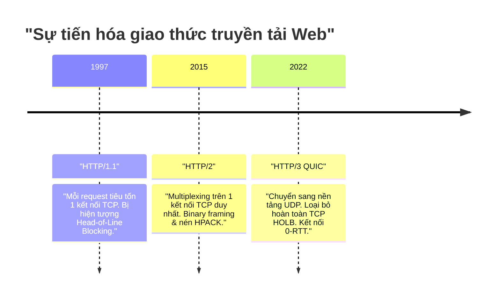
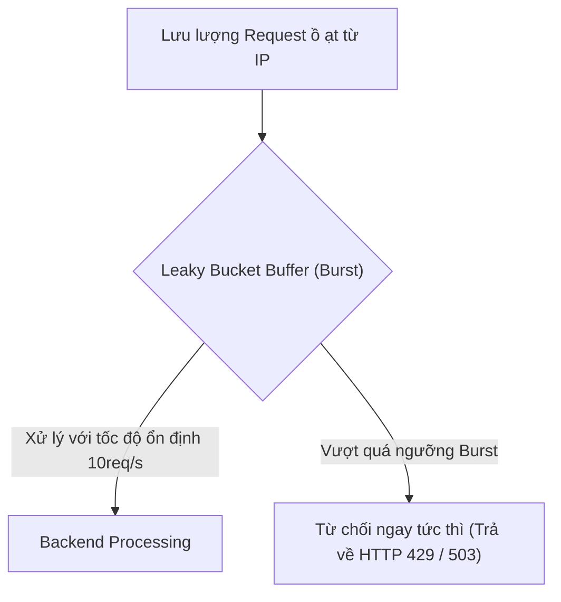

# Chương 8. Bảo mật, SSL/TLS Termination & HTTP Protocols

Chương này trình bày chuyên sâu về cấu hình bảo mật trong NGINX: SSL/TLS Termination, tối ưu hóa quá trình bắt tay TLS với Session Resumption & OCSP Stapling, sự tiến hóa giữa HTTP/2 và HTTP/3 QUIC, cùng các kỹ thuật chống tấn công bằng Rate Limiting và Security Headers.

## Mục lục

- [8.1 Cấu hình HTTPS & SSL/TLS Termination](#81-cấu-hình-https--ssltls-termination)
- [8.2 Tối ưu TLS Handshake: Session Resumption & OCSP Stapling](#82-tối-ưu-tls-handshake-session-resumption--ocsp-stapling)
- [8.3 Tiến trình Giao thức: HTTP/1.1 vs HTTP/2 vs HTTP/3 QUIC](#83-tiến-trình-giao-thức-http11-vs-http2-vs-http3-quic)
- [8.4 Chống Tấn công với Rate Limiting & Connection Limiting](#84-chống-tấn-công-với-rate-limiting--connection-limiting)
- [8.5 Thiết lập Security Headers chuẩn Doanh nghiệp](#85-thiết-lập-security-headers-chuẩn-doanh-nghiệp)

---

## 8.1 Cấu hình HTTPS & SSL/TLS Termination

NGINX đóng vai trò máy chủ kết thúc mã hóa (SSL/TLS Termination), chịu trách nhiệm thực hiện quá trình bắt tay cryptographic phức tạp với client trước khi truyền tải dữ liệu an toàn.

```nginx
server {
    listen 443 ssl;
    server_name example.com;

    # Đường dẫn tới Chứng chỉ số SSL (Certificate) và Khóa tư (Private Key)
    ssl_certificate     /etc/ssl/certs/example.com.crt;
    ssl_certificate_key /etc/ssl/private/example.com.key;

    # Chỉ hỗ trợ các phiên bản giao thức TLS an toàn (Bỏ hoàn toàn SSLv3, TLS 1.0, TLS 1.1)
    ssl_protocols TLSv1.2 TLSv1.3;

    # Tập hợp các thuật toán mã hóa (Ciphers) mạnh nhất
    ssl_ciphers ECDHE-ECDSA-AES128-GCM-SHA256:ECDHE-RSA-AES128-GCM-SHA256:ECDHE-ECDSA-AES256-GCM-SHA384:ECDHE-RSA-AES256-GCM-SHA384;
    ssl_prefer_server_ciphers off;
}
```

> [!IMPORTANT]
> **Server Name Indication (SNI):** SNI là một mở rộng của giao thức TLS cho phép client gửi tên miền (Hostname) muốn kết nối ngay trong gói tin TLS Client Hello đầu tiên. Nhờ SNI, NGINX có thể phục vụ hàng trăm chứng chỉ SSL/TLS khác nhau cho hàng trăm domain chạy chung trên **duy nhất một địa chỉ IP**.

---

## 8.2 Tối ưu TLS Handshake: Session Resumption & OCSP Stapling

Quá trình bắt tay TLS (TLS Handshake) mặc định tiêu tốn từ 1 đến 2 vòng truyền dữ liệu mạng (Round Trip Times — RTT). NGINX tối ưu hóa độ trễ này bằng hai giải pháp kỹ thuật cốt lõi:

### 1. SSL Session Resumption (Tái sử dụng Phiên TLS)
NGINX lưu đệm các tham số mã hóa của phiên kết nối TLS trong vùng nhớ RAM chung giữa các Worker. Khi client quay lại, hệ thống bỏ qua quá trình bắt tay mã hóa lại từ đầu.

```nginx
# Tạo vùng nhớ RAM chung 10MB lưu trữ thông tin phiên TLS (chứa ~40.000 sessions)
ssl_session_cache shared:SSL:10m;
ssl_session_timeout 1d;
ssl_session_tickets off;
```

### 2. OCSP Stapling (Dán tem xác thực chứng chỉ)
Mặc định, trình duyệt client phải tự gửi request đến máy chủ CA (Certificate Authority) để kiểm tra xem chứng chỉ SSL có bị thu hồi hay không, gây ra độ trễ cực lớn.

Với **OCSP Stapling**, NGINX chủ động gửi query đến máy chủ CA định kỳ, lấy phản hồi xác thực có ký số (OCSP Response) và "dán" (staple) sẵn vào gói tin TLS Handshake gửi cho client.

```mermaid
graph TD
    subgraph "Không dùng OCSP Stapling (Chậm)"
        Client1["Browser"] -->|1. TLS Handshake| NGINX1["NGINX"]
        Client1 -->|2. Query status (RTT trễ)| CA1["CA Server"]
    end

    subgraph "Dùng OCSP Stapling (Nhanh)"
        NGINX2["NGINX"] <--->|Chủ động query ngầm định kỳ| CA2["CA Server"]
        Client2["Browser"] -->|1. TLS Handshake + Dán sẵn OCSP Proof| NGINX2
    end
```

```nginx
# Kích hoạt OCSP Stapling
ssl_stapling on;
ssl_stapling_verify on;
ssl_trusted_certificate /etc/ssl/certs/fullchain.pem;
resolver 8.8.8.8 8.8.4.4 valid=300s;
```

---

## 8.3 Tiến trình Giao thức: HTTP/1.1 vs HTTP/2 vs HTTP/3 QUIC



### 1. HTTP/2 Multiplexing
HTTP/2 cho phép truyền nhận đồng thời hàng trăm Yêu cầu/Phản hồi (Requests/Responses) song song trên **duy nhất một kết nối TCP**, loại bỏ hiện tượng nghẽn đầu hàng (Head-of-Line Blocking) ở tầng ứng dụng.

```nginx
server {
    listen 443 ssl http2;
    server_name example.com;
}
```

### 2. HTTP/3 QUIC (UDP-based Transport)
HTTP/3 thay thế hoàn toàn giao thức TCP bên dưới bằng **QUIC (Quick UDP Internet Connections)** chạy trên nền UDP. 

HTTP/3 giải quyết triệt để hiện tượng Head-of-Line Blocking ở cả tầng giao vận (Transport Layer): nếu 1 gói tin UDP bị mất, các luồng dữ liệu khác vẫn tiếp tục được xử lý bình thường mà không bị tạm dừng toàn bộ kết nối như TCP.

```nginx
server {
    # Lắng nghe cổng 443 trên cả TCP (HTTP/2) và UDP (HTTP/3 QUIC)
    listen 443 quic reuseport;
    listen 443 ssl;

    server_name example.com;

    # Thông báo cho trình duyệt biết server hỗ trợ HTTP/3 qua Alt-Svc Header
    add_header Alt-Svc 'h3=":443"; ma=86400';
}
```

---

## 8.4 Chống Tấn công với Rate Limiting & Connection Limiting

NGINX bảo vệ hệ thống khỏi các đợt tấn công từ chối dịch vụ (DDoS) và cào dữ liệu (Web Scraping) dựa trên thuật toán **Leaky Bucket (Thùng rò rỉ)**.



### 1. Giới hạn Tốc độ Yêu cầu (Rate Limiting - `limit_req`)
```nginx
http {
    # Khai báo vùng nhớ 10MB lưu IP client, giới hạn tốc độ 10 requests/giây
    limit_req_zone $binary_remote_addr zone=req_limit_per_ip:10m rate=10r/s;

    server {
        location /api/login {
            # Cho phép burst tối đa 20 request trong hàng đợi, xử lý nodelay
            limit_req zone=req_limit_per_ip burst=20 nodelay;
            limit_req_status 429; # Trả về mã HTTP 429 Too Many Requests
            
            proxy_pass http://backend_login;
        }
    }
}
```

### 2. Giới hạn Số lượng Kết nối Đồng thời (Connection Limiting - `limit_conn`)
```nginx
http {
    # Giới hạn số kết nối TCP đồng thời từ một địa chỉ IP
    limit_conn_zone $binary_remote_addr zone=conn_limit_per_ip:10m;

    server {
        location /download/ {
            # Tối đa 5 kết nối đồng thời từ cùng 1 IP
            limit_conn conn_limit_per_ip 5;
        }
    }
}
```

---

## 8.5 Thiết lập Security Headers chuẩn Doanh nghiệp

NGINX đóng vai trò tấm lá chắn bổ sung các Header bảo mật bắt buộc để chống lại các lỗ hổng web phổ biến (XSS, Clickjacking, MIME Sniffing):

```nginx
server {
    listen 443 ssl;
    server_name example.com;

    # 1. HSTS: Ép buộc trình duyệt chỉ dùng HTTPS trong 1 năm (gồm subdomains)
    add_header Strict-Transport-Security "max-age=31536000; includeSubDomains; preload" always;

    # 2. Chống lỗ hổng Clickjacking (Chặn trang web bị nhúng vào iframe)
    add_header X-Frame-Options "DENY" always;

    # 3. Chống lỗ hổng MIME-type Sniffing
    add_header X-Content-Type-Options "nosniff" always;

    # 4. Bảo vệ chống tấn công Cross-Site Scripting (XSS Filter)
    add_header X-XSS-Protection "1; mode=block" always;

    # 5. Kiểm soát thông tin Referrer rò rỉ sang domain khác
    add_header Referrer-Policy "strict-origin-when-cross-origin" always;
}
```

---
[← Quay lại mục lục](README.md)
