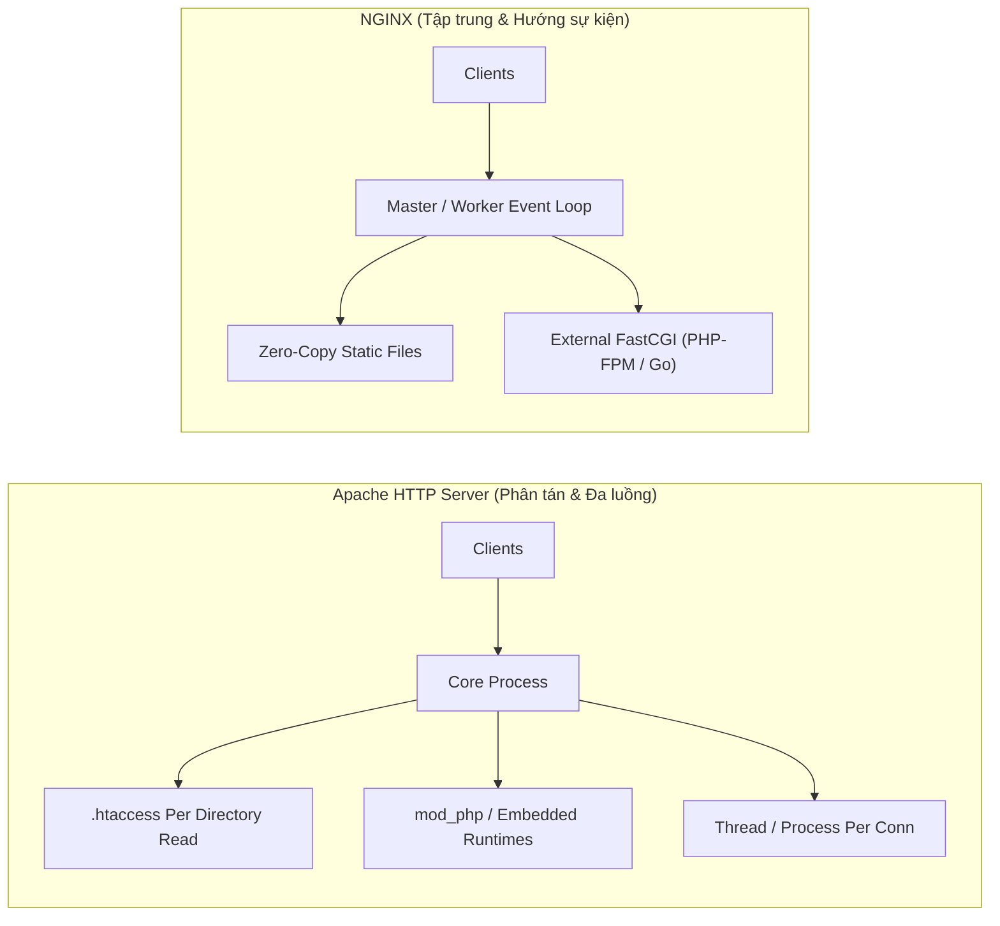

# Chương 9. Trade-offs & Phân tích So sánh Chuyên sâu

Chương này tổng kết phân tích đánh đổi (Trade-offs) khi lựa chọn NGINX, so sánh đối chiếu NGINX với các công nghệ máy chủ và proxy phổ biến (Apache, HAProxy, Envoy, Traefik, Caddy), và cung cấp Ma trận Quyết định Kiến trúc cho các dự án phần mềm.

## Mục lục

- [9.1 Phân tích Ưu điểm & Điểm hạn chế (Trade-offs)](#91-phân-tích-ưu-điểm--điểm-hạn-chế-trade-offs)
- [9.2 So sánh Chi tiết: NGINX vs Apache HTTP Server](#92-so-sánh-chi-tiết-nginx-vs-apache-http-server)
- [9.3 So sánh Chi tiết: NGINX vs HAProxy](#93-so-sánh-chi-tiết-nginx-vs-haproxy)
- [9.4 So sánh Chi tiết: NGINX vs Cloud-Native Proxy](#94-so-sánh-chi-tiết-nginx-vs-cloud-native-proxy)
- [9.5 Ma trận Quyết định Lựa chọn Hạ tầng](#95-ma-trận-quyết-định-lựa-chọn-hạ-tầng)

---

## 9.1 Phân tích Ưu điểm & Điểm hạn chế (Trade-offs)

Không có một công nghệ phần mềm nào là hoàn hảo cho mọi kịch bản (No Silver Bullet). Việc lựa chọn NGINX đòi hỏi các kiến trúc sư phần mềm phải cân nhắc kỹ lưỡng giữa điểm mạnh vượt trội và những hạn chế cố hữu của nó.

### 🟢 Ưu điểm Vượt trội (Pros)
1. **Hiệu năng I/O & Tiêu thụ Tài nguyên cực thấp**: Nhờ kiến trúc Event-Driven bất đồng bộ, NGINX tiêu tốn lượng RAM và CPU cố định và cực kỳ nhỏ ngay cả khi phục vụ hàng chục ngàn kết nối đồng thời.
2. **Khả năng Phục vụ Tệp tĩnh Vượt trội**: Tận dụng cơ chế `sendfile` zero-copy cấp hạt nhân, tốc độ trả về dữ liệu tĩnh của NGINX đạt tới ngưỡng giới hạn vật lý của phần cứng.
3. **Giải pháp Tất-cả-trong-Một (All-in-One)**: Đóng đồng thời nhiều vai trò (Web Server, Reverse Proxy, Load Balancer, SSL Termination, Caching Engine), giúp đơn giản hóa hạ tầng.
4. **Độ Tin cậy & Tính Phổ biến**: Được kiểm chứng qua hơn 20 năm vận hành trên các website lớn nhất hành tinh (Google, Netflix, WordPress.com, GitHub).

### 🔴 Điểm Hạn chế & Đánh đổi (Cons)
1. **Không hỗ trợ Cấu hình Phân tán (`.htaccess`)**: NGINX từ chối hỗ trợ các tệp cấu hình động theo từng thư mục để tránh việc liên tục thực hiện các phép đọc đĩa I/O `stat()`. Mọi thay đổi cấu hình phải được thực hiện tập trung tại tệp chính và nạp lại tiến trình.
2. **Mở rộng Mô-đun Phức tạp**: Khác với Apache cho phép nạp động các mô-đun C tự do, các mô-đun mở rộng NGINX nâng cao thường yêu cầu biên dịch lại (recompile) cùng với mã nguồn NGINX (trừ khi dùng Dynamic Modules tương thích ABI chính xác).
3. **Giới hạn Tính năng ở Bản Open Source**: Một số tính năng hạ tầng doanh nghiệp nâng cao (Active Health Check, Dynamic Upstream API, Session Persistence, Native Monitoring Dashboard) bị khóa và chỉ xuất hiện trên bản trả phí NGINX Plus.

---

## 9.2 So sánh Chi tiết: NGINX vs Apache HTTP Server

Apache HTTP Server và NGINX đại diện cho hai triết lý thiết kế máy chủ web hoàn toàn trái ngược nhau:



| Tiêu chí So sánh | NGINX | Apache HTTP Server |
| :--- | :--- | :--- |
| **Mô hình Xử lý** | Hướng sự kiện (Event-Driven), Asynchronous, Non-blocking. | Đa tiến trình / Đa luồng (MPM Prefork, Worker, Event). |
| **Tiêu tốn Tài nguyên** | Cực kỳ thấp và cố định ($O(1)$ RAM). | Tăng tuyến tính theo số kết nối ($O(N)$ RAM). |
| **Cấu hình Phân tán** | Không hỗ trợ (Chỉ dùng cấu hình tập trung). | Hỗ trợ tệp `.htaccess` phân tán từng thư mục. |
| **Xử lý Mã Động** | Chuyển tiếp tới FastCGI / uWSGI ngoại vi (PHP-FPM). | Biên dịch và thực thi trực tiếp qua mô-đun nhúng (`mod_php`). |
| **Độ Phức tạp Cấu hình** | Cú pháp gọn gàng, rõ ràng, phân cấp logic. | Phong phú tính năng nhưng cú pháp rườm rà. |

---

## 9.3 So sánh Chi tiết: NGINX vs HAProxy

HAProxy và NGINX là hai giải pháp hàng đầu cho bài toán Reverse Proxy và Cân bằng tải, nhưng có phạm vi chuyên biệt khác nhau:

| Tiêu chí So sánh | NGINX | HAProxy |
| :--- | :--- | :--- |
| **Phạm vi Chức năng** | Web Server + Reverse Proxy + Load Balancer + Cache. | **Chuyên biệt Cân bằng tải & Proxy (L4 & L7)**. |
| **Phục vụ Tệp tĩnh** | **Vượt trội** (Là Web Server thực sự). | **Không hỗ trợ** (Không thể phục vụ file HTML/Images từ đĩa). |
| **Thuật toán Cân bằng tải** | Phong phú (Round Robin, Least Conn, IP Hash). | **Cực kỳ chuyên sâu** (Hỗ trợ hàng chục thuật toán & chỉ số). |
| **Giám sát & Stats** | Trang `stub_status` cơ bản (Bản Plus mới có Dashboard). | Trang Dashboard Stats thời gian thực cực kỳ chi tiết sẵn có. |
| **Health Check** | Thụ động (Passive) ở bản Open Source. | **Chủ động (Active)** chuyên sâu hoàn toàn miễn phí. |

> [!NOTE]
> **Quy tắc phối hợp kinh nghiệm:** Trong các hạ tầng lớn, người ta thường dùng **HAProxy** ở lớp ngoài cùng làm Cân bằng tải tập trung (L4/L7 Load Balancer), sau đó đẩy lưu lượng về cụm các máy chủ **NGINX** làm Web Server và Caching phía sau.

---

## 9.4 So sánh Chi tiết: NGINX vs Cloud-Native Proxy

Sự phát triển của Kubernetes và kiến trúc Microservices đã thúc đẩy sự ra đời của các công nghệ Proxy thế hệ mới:

| Tiêu chí | NGINX | Envoy Proxy | Traefik | Caddy |
| :--- | :--- | :--- | :--- | :--- |
| **Ngôn ngữ phát triển** | C | C++ | Go | Go |
| **Hệ sinh thái chính** | Traditional & Cloud Infrastructure | Service Mesh (Istio) & Cloud-Native | Kubernetes Ingress Controller | Small/Medium Web Apps & Dev Environment |
| **Cấu hình Động (Dynamic Config)** | Cần reload (bản Open Source) | **Native xDS API** (Cấu hình qua gRPC không reload) | **Tự động quét (Auto-discovery)** Docker/K8s | Khai báo qua JSON REST API |
| **HTTPS Tự động** | Cần cấu hình Certbot / Cronjob | Cần Cert-Manager | **Tự động lấy Let's Encrypt sẵn có** | **Tự động lấy Let's Encrypt sẵn có** |
| **Mở rộng (Extensibility)** | C / Lua Module | C++ / WASM (WebAssembly) | Go Plugins | Go Plugins |

---

## 9.5 Ma trận Quyết định Lựa chọn Hạ tầng

```mermaid
decisionTree
```

Để giúp bạn đưa ra quyết định kiến trúc chính xác, hãy tham khảo ma trận dưới đây:

### 🟢 NÊN LỰA CHỌN NGINX KHI:
1. **Phục vụ ứng dụng Web có lượng truy cập lớn (High-Traffic Web Applications)** yêu cầu tối ưu tài nguyên CPU & RAM.
2. **Cần một giải pháp All-in-One** tích hợp đồng thời Web Server tĩnh, Reverse Proxy, SSL Termination và Caching.
3. **Triển khai ứng dụng Web với PHP-FPM, Node.js, Go, Python, Java Spring Boot**.
4. **Xây dựng hệ thống Edge Caching** giúp giảm tải cho cơ sở dữ liệu và máy chủ backend.

### 🔴 KHÔNG NÊN LỰA CHỌN NGINX KHI:
1. **Môi trường Shared Hosting**: Nơi mỗi người dùng cần tự điều chỉnh quy tắc rewrite hoặc phân quyền thông qua `.htaccess` (Nên chọn **Apache** hoặc **LiteSpeed**).
2. **Hạ tầng K8s Service Mesh phức tạp cần điều khiển động 100% qua API ở mức miligiây**: (Nên chọn **Envoy**).
3. **Cần một máy chủ Web đơn giản tự tạo HTTPS cho dự án cá nhân/nhỏ mà không muốn viết file cấu hình**: (Nên chọn **Caddy**).
4. **Hạ tầng Microservices K8s liên tục thêm/xóa pod và cần tự động nhận diện service**: (Nên chọn **Traefik** hoặc **NGINX Ingress Controller**).

---
[← Quay lại mục lục](README.md)
