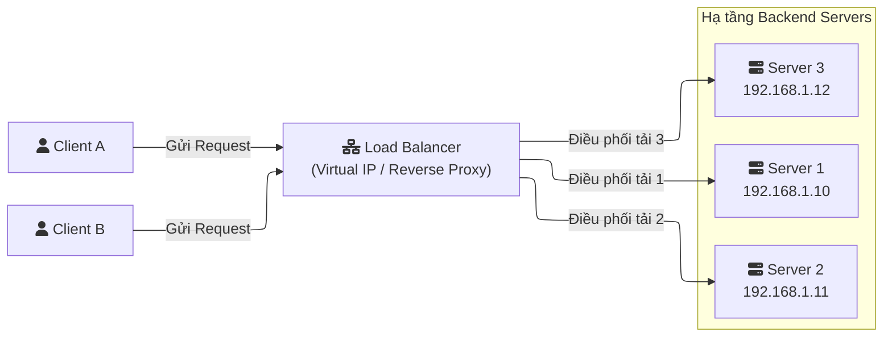
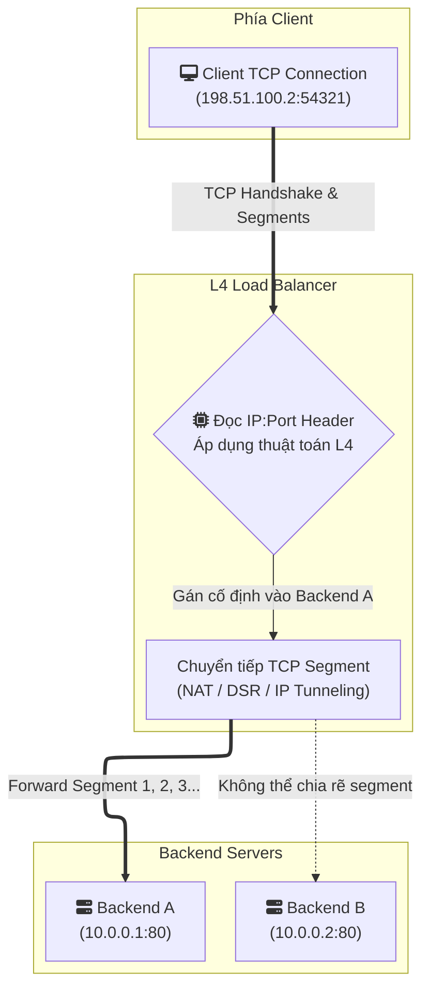
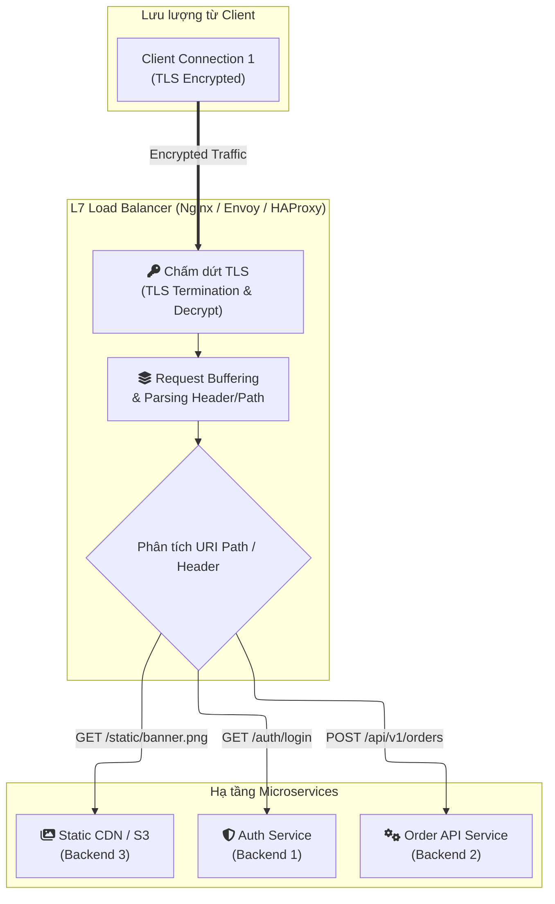
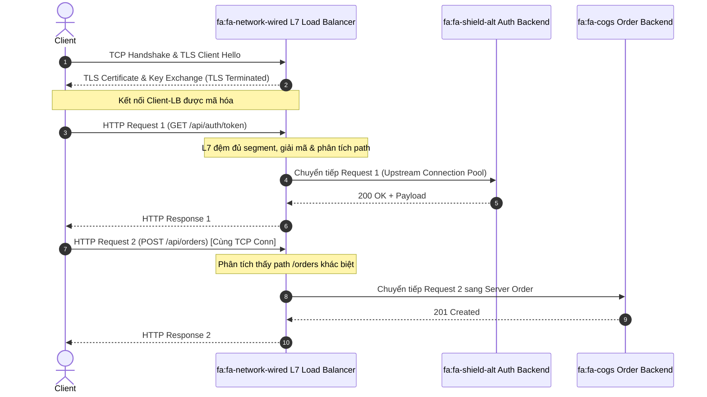
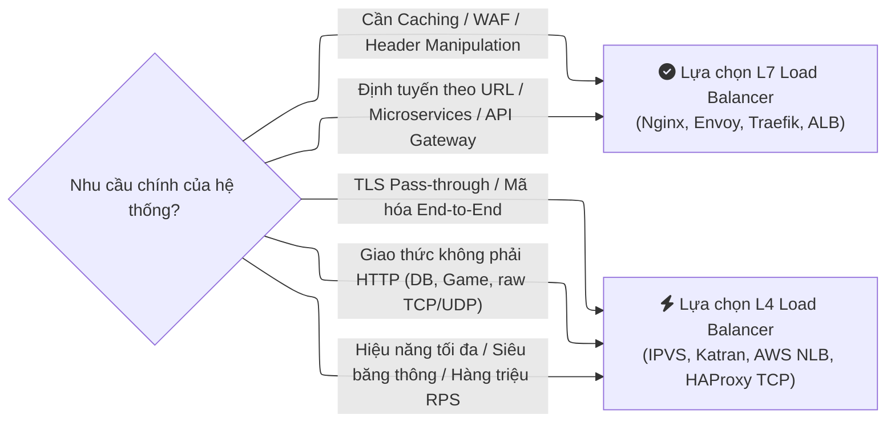
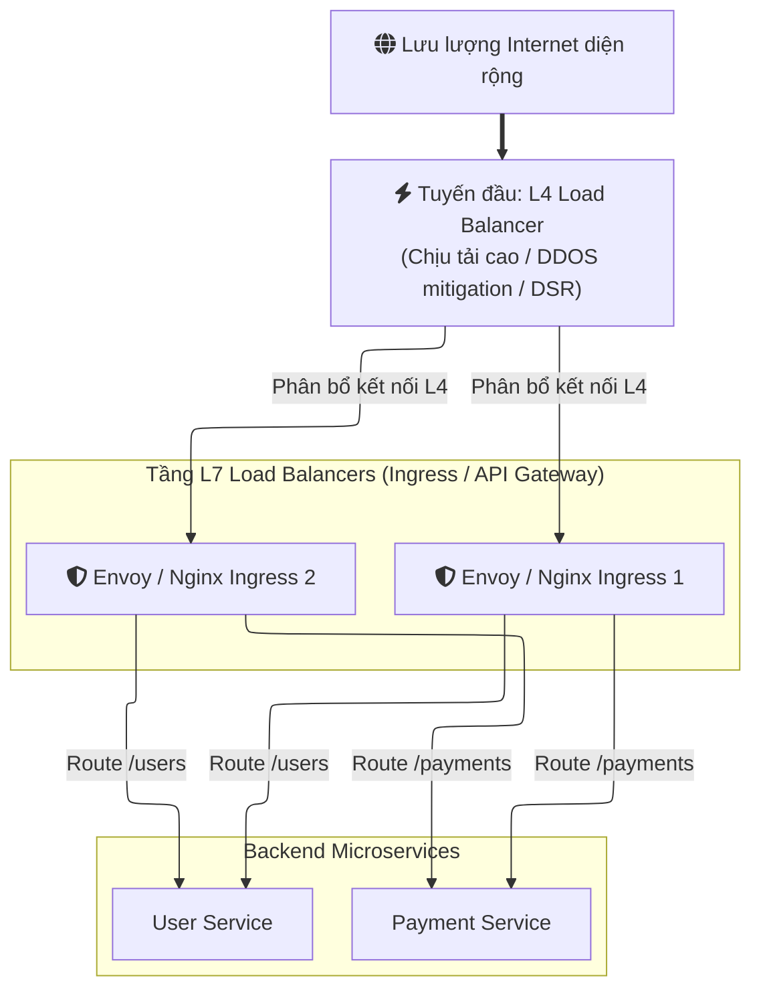

# Cân bằng tải Lớp 4 (L4) vs. Lớp 7 (L7): Cuộc chiến giữa Tốc độ và Trí thông minh

## Mục lục

*   [1. Load Balancer là gì?](#1-load-balancer-là-gì)
*   [2. Cân bằng tải Lớp 4 (L4): Người Giao hàng Tốc độ](#2-cân-bằng-tải-lớp-4-l4-người-giao-hàng-tốc-độ)
*   [3. Ưu và Nhược điểm của L4](#3-ưu-và-nhược-điểm-của-l4)
*   [4. Cân bằng tải Lớp 7 (L7): Người Quản lý Thông minh](#4-cân-bằng-tải-lớp-7-l7-người-quản-lý-thông-minh)
*   [5. Ưu và Nhược điểm của L7](#5-ưu-và-nhược-điểm-của-l7)
*   [6. Ma trận So sánh Kỹ thuật](#6-ma-trận-so-sánh-kỹ-thuật)
*   [7. Tổng kết & Tiêu chí Lựa chọn](#7-tổng-kết--tiêu-chí-lựa-chọn)

---

## 1. Load Balancer là gì?

Một **Bộ cân bằng tải (Load Balancer - LB)** là một hệ thống được thiết kế nhằm nâng cao tính sẵn sàng và khả năng chịu lỗi (**fault tolerance**) cho toàn bộ hạ tầng mạng.

Từ góc độ của Client, mọi tương tác chỉ diễn ra với một địa chỉ IP/Virtual IP (VIP) duy nhất đại diện cho Load Balancer. Phía sau bức màn đó, LB điều phối lưu lượng tới một cụm gồm nhiều máy chủ backend.

> [!NOTE]
> **Công thức cốt lõi:**
>
> $$\text{Load Balancer} = \text{Reverse Proxy} + \text{Logic Cân bằng tải}$$
>
> Mọi Load Balancer đều hoạt động như một Reverse Proxy, nhưng Reverse Proxy đơn thuần có thể chỉ trỏ cố định về một backend duy nhất. Load Balancer bắt buộc phải sở hữu thuật toán phân phối lưu lượng (như Round Robin, Least Connections, IP Hash) để dàn đều tải cho hạ tầng.

Kiến trúc tổng quan luồng đi của gói tin qua một hệ thống cân bằng tải:

| Thành phần | Vai trò | Chi tiết kỹ thuật |
| :--- | :--- | :--- |
| **Client** | Điểm khởi tạo kết nối | Giao tiếp với duy nhất một địa chỉ Virtual IP (VIP) của Load Balancer. |
| **Load Balancer** | Trạm trung chuyển & điều phối | Tiếp nhận kết nối, áp dụng thuật toán phân phối tải và quản lý kết nối tới backend. |
| **Backend Cluster** | Xử lý logic nghiệp vụ | Cụm máy chủ nhận request phân bổ, đảm bảo tính dự phòng và khả năng mở rộng ngang (*horizontal scaling*). |

---

## 2. Cân bằng tải Lớp 4 (L4): Người Giao hàng Tốc độ

Bộ cân bằng tải Lớp 4 hoạt động tại **Lớp Vận chuyển (Transport Layer)** trong mô hình OSI.

Ở tầng này, bộ cân bằng tải chỉ trích xuất và xử lý thông tin tiêu đề L4: **Địa chỉ IP nguồn/đích** và **Cổng (Port)**. Nó hoàn toàn không giải mã hoặc phân tích nội dung dữ liệu bên trong các gói tin. Đối với L4 LB, mọi giao thức như HTTP, gRPC, WebSocket hay database payload đều chỉ là một dòng chảy của các **TCP segment** hoặc **UDP datagram**.

> [!TIP]
> **Ẩn dụ Bưu điện Lớp 4:**
> - **Nhiệm vụ:** Nhân viên giao hàng chỉ nhìn vào mã màu trên nhãn phong bì (IP:Port).
> - **Quy tắc:** "Tất cả gói mang nhãn Client A phải chuyển thẳng vào hòm thư Backend 1."
> - **Hành động:** Nhân viên không mở thư kiểm tra nội dung. Quá trình xử lý diễn ra trực tiếp ở cấp độ packet-forwarding, đem lại tốc độ cực nhanh và mức tiêu thụ CPU tối thiểu.

### 2.1. Cơ chế Hoạt động Cốt lõi (Sticky Connection)

Mô hình ánh xạ 1:1 theo kết nối TCP của L4 Load Balancing:

Chu trình xử lý diễn ra theo 4 giai đoạn kỹ thuật:

1. **Khởi tạo & Duy trì Pool:** LB có thể duy trì pool kết nối sẵn hoặc thiết lập cơ chế NAT / Direct Server Return (DSR) tới backend.
2. **Client bắt tay kết nối:** Khi Client khởi tạo bắt tay TCP 3 bước (`SYN`, `SYN-ACK`, `ACK`) tới VIP, thuật toán L4 được kích hoạt.
3. **Ánh xạ 1:1 (Stateful Table):** LB ghi nhận entry vào bảng trạng thái (Connection Tracking Table), ghép nối socket Client với một backend được chọn.
4. **Chuyển tiếp cố định (Sticky):** Mọi segment tiếp theo trên cùng socket TCP này bắt buộc phải đi đúng tới backend đó. L4 không thể chuyển segment 1 sang Backend A và segment 2 sang Backend B vì sẽ làm sai lệch TCP Sequence Number và phá vỡ phiên truyền thông.

---

## 3. Ưu và Nhược điểm của L4

| Ưu điểm (Pros) | Nhược điểm (Cons) |
| :--- | :--- |
| **Đơn giản & Thông lượng cực cao:** Không tốn chi phí CPU để parse payload hay buffering. Chỉ đọc/ghi packet header ở kernel space (như IPVS, DPDK). | **Không thể định tuyến thông minh:** Không đọc được URI path, HTTP headers hoặc payload để điều phối yêu cầu theo ngữ cảnh. |
| **Bảo mật End-to-End:** Traffic TLS đi xuyên suốt (pass-through) từ Client tới Backend. LB không cần lưu trữ Certificate/Private Key. | **Dính chặt (Connection-bound):** Tất cả requests trên cùng 1 kết nối TCP (ví dụ HTTP/2 multiplexing) đều đổ dồn vào duy nhất 1 backend server. |
| **Độc lập giao thức (Protocol-Agnostic):** Hỗ trợ toàn bộ các giao thức chạy trên TCP/UDP (MySQL, PostgreSQL, Redis, DNS, Game UDP, gRPC raw TCP). | **Không hỗ trợ Caching & L7 Security:** Không thể tự động cache tài nguyên tĩnh, không kiểm tra được WAF rules hay payload injection. |
| **Hỗ trợ Direct Server Return (DSR):** Cho phép backend phản hồi trực tiếp cho Client mà không cần đi vòng lại qua LB, tối ưu hóa băng thông tải về khổng lồ. | **Rủi ro khi giao thức nâng cấp:** Khi gặp giao thức chuyển tiếp như WebSocket qua HTTP Upgrade, L4 không kiểm soát được các policy mức ứng dụng sau đó. |

---

## 4. Cân bằng tải Lớp 7 (L7): Người Quản lý Thông minh

Bộ cân bằng tải Lớp 7 hoạt động ở **Lớp Ứng dụng (Application Layer)**, phụ thuộc chặt chẽ vào giao thức ứng dụng (**protocol-specific**) như HTTP/1.1, HTTP/2, HTTP/3, gRPC, WebSocket.

Ở tầng này, LB đóng vai trò là một điểm kết thúc kết nối đầy đủ. Nó nhận dữ liệu, giải mã TLS, gom các segment thành một thông điệp HTTP hoàn chỉnh, sau đó đọc từng thành phần: Request Method, Path, Header, Cookie và Body.

> [!IMPORTANT]
> **Ẩn dụ Bưu điện Lớp 7:**
> - **Nhiệm vụ:** Người quản lý bưu điện mở từng phong bì (giải mã TLS) và đọc kỹ văn bản bên trong.
> - **Quy tắc:** "Nếu thư yêu cầu thanh toán (`/api/v1/billing`), chuyển tới phòng Tài chính (Backend 1). Nếu yêu cầu tải ảnh (`/static/images`), chuyển tới kho Lưu trữ (Backend 2)."
> - **Hành động:** Khả năng định tuyến linh hoạt tuyệt đối, nhưng tốn nhiều chi phí xử lý và yêu cầu LB phải thông thạo ngôn ngữ giao thức của thông điệp.

### 4.1. Cơ chế Hoạt động Cốt lõi (Buffering, TLS Termination & Multiplexing)

Mô hình định tuyến dựa trên nội dung (Content-based Routing) và tách biệt kết nối tại L7:

### 4.2. Trình tự Xử lý Kỹ thuật (Sequence Flow)

Trình tự tách biệt 2 phiên TCP riêng biệt giữa Client - LB và LB - Backend:

| Bước | Hành động | Giải thích kỹ thuật |
| :--- | :--- | :--- |
| **1 - 2** | **TLS Termination** | Kết nối TLS giữa Client và LB hoàn tất độc lập. LB nắm giữ SSL Certificate. |
| **3 - 4** | **Đệm & Định tuyến Request 1** | LB nhận các segment, ráp thành request `/api/auth/token` và đẩy sang Auth Backend. |
| **5 - 6** | **Phản hồi Request 1** | Nhận kết quả từ Auth Backend và trả về qua socket mã hóa của Client. |
| **7 - 9** | **Multiplexing Request 2** | Dù cùng 1 kết nối Client, request `/api/orders` được định tuyến độc lập sang Order Backend. |

---

## 5. Ưu và Nhược điểm của L7

| Ưu điểm (Pros) | Nhược điểm (Cons) |
| :--- | :--- |
| **Định tuyến thông minh (Content-aware):** Phân luồng dựa trên URL Path, Query string, HTTP Method, Header, Cookie. Tối ưu cho kiến trúc Microservices và API Gateway. | **Tốn tài nguyên tính toán (High CPU & RAM):** Tốn chu kỳ CPU đáng kể cho tác vụ giải mã TLS, đệm bộ nhớ (buffering) và phân tích chuỗi ký tự HTTP. |
| **Tối ưu hóa kết nối Backend:** Hỗ trợ connection pooling và multiplexing: hàng ngàn client connections có thể chia sẻ một số lượng nhỏ persistent connections tới backend. | **Bắt buộc hỗ trợ giao thức:** LB phải tích hợp parser cụ thể cho từng giao thức. Nếu LB không hỗ trợ gRPC streaming hay HTTP/3, nó không thể hoạt động ở chế độ L7 cho giao thức đó. |
| **Tích hợp Caching & Compression:** Tự động phản hồi các tài nguyên tĩnh từ bộ nhớ cache hoặc nén gzip/brotli trực tiếp, giảm tải tới 80% lưu lượng cho backend. | **Độ trễ bổ sung (Latency Overhead):** Quá trình gom đủ segment tạo thành full logical request trước khi gửi làm tăng độ trễ thêm một khoảng nhỏ (thường vài mili-giây). |
| **Tính năng API Gateway toàn diện:** Hỗ trợ JWT validation, rate limiting theo IP/User, WAF injection inspection, header modification và canary deployment. | **Rủi ro bảo mật tập trung:** Vì TLS bị ngắt tại LB, toàn bộ dữ liệu ở dạng cleartext bên trong bộ nhớ của LB và yêu cầu quản lý khóa bí mật (Private Key) an toàn tuyệt đối. |

---

## 6. Ma trận So sánh Kỹ thuật

Bảng so sánh chi tiết các chỉ số kỹ thuật giữa hai kiến trúc:

| Tiêu chí | Cân bằng tải Lớp 4 (L4) | Cân bằng tải Lớp 7 (L7) |
| :--- | :--- | :--- |
| **Tầng hoạt động** | Transport Layer (TCP / UDP) | Application Layer (HTTP, HTTPS, gRPC, WebSocket) |
| **Đơn vị xử lý** | IP Packet / TCP Segment | Logical Application Message (HTTP Request/Response) |
| **Khả năng định tuyến** | Địa chỉ IP và Port đích | URI Path, HTTP Headers, Cookie, Payload data |
| **TLS / SSL** | Pass-through (Không can thiệp giải mã) | TLS Termination (Giải mã và mã hóa lại nếu cần) |
| **Độ trễ (Latency)** | Cực thấp (Microseconds - $\mu s$) | Thấp tới Trung bình (Milliseconds - $ms$) |
| **Thông lượng (Throughput)** | Hàng triệu RPS với chi phí phần cứng tối thiểu | Giới hạn hơn do ràng buộc CPU/RAM cho việc parse |
| **Mô hình kết nối** | 1 Client Connection $\rightarrow$ 1 Backend Connection | Nhiều Client Requests $\rightarrow$ Ghép Pool Backend Connections |
| **Giải pháp tiêu biểu** | AWS NLB, Linux IPVS, Katran (Meta), HAProxy (TCP mode) | AWS ALB, Nginx, Envoy Proxy, Traefik, Kong |

---

## 7. Tổng kết & Tiêu chí Lựa chọn

Trong thực tế thiết kế hệ thống quy mô lớn, kiến trúc hiện đại thường **kết hợp cả hai**: Sử dụng L4 Load Balancer ở tuyến đầu (như Maglev, Katran hoặc AWS NLB) để đón đầu hàng triệu luồng kết nối Internet, sau đó phân phối lưu lượng tới cụm L7 Load Balancers (như Envoy, Nginx) để thực hiện định tuyến microservices, lọc bảo mật và quản lý giao thức.

- **Chọn Lớp 4 (L4)** khi ưu tiên hàng đầu là hiệu năng thô, độ trễ tối thiểu, tải lượng dữ liệu khổng lồ hoặc các giao thức phi HTTP.
- **Chọn Lớp 7 (L7)** khi hệ thống vận hành theo kiến trúc Microservices đòi hỏi khả năng điều hướng thông minh theo đường dẫn, kiểm soát chính sách bảo mật và tối ưu hóa tài nguyên ứng dụng.

---
[← Quay lại mục lục](../README.md)

