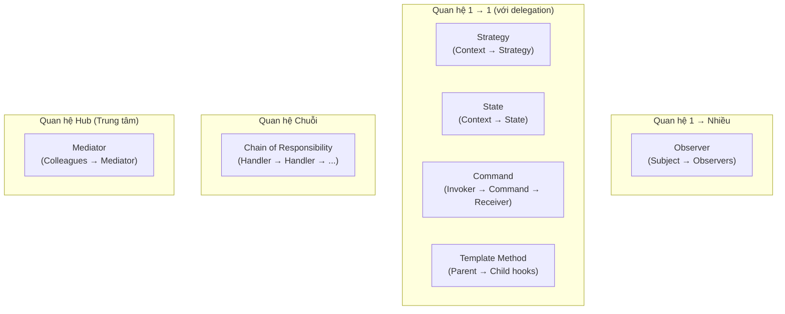

# Behavioral Patterns (Nhóm mẫu hành vi)

Nhóm **Behavioral Patterns (Nhóm mẫu hành vi)** tập trung vào việc phân bổ trách nhiệm giữa các đối tượng và cách các đối tượng liên lạc, tương tác với nhau. Các mẫu này không chỉ mô tả các thực thể (objects/classes) mà còn mô tả cả các mô hình truyền thông giữa chúng.

---

## Mục lục

-   [1. Observer](#1-observer)
-   [2. Strategy](#2-strategy)
-   [3. Command](#3-command)
-   [4. State](#4-state)
-   [5. Template Method](#5-template-method)
-   [6. Mediator](#6-mediator)
-   [7. Chain of Responsibility](#7-chain-of-responsibility)
-   [Thảo luận chung về các mẫu Behavioral](#thảo-luận-chung-về-các-mẫu-behavioral)

---

## 1. Observer

*   **Mục đích:** Định nghĩa mối phụ thuộc một-nhiều (one-to-many) giữa các đối tượng, sao cho khi một đối tượng thay đổi trạng thái, tất cả đối tượng phụ thuộc của nó đều được thông báo và cập nhật tự động.
*   **Chi tiết tài liệu:** [Xem chi tiết Observer Pattern](./observer.md)

---

## 2. Strategy

*   **Mục đích:** Định nghĩa một họ các thuật toán, đóng gói từng thuật toán lại và làm cho chúng có thể thay thế hoán đổi cho nhau linh hoạt tại runtime.
*   **Chi tiết tài liệu:** [Xem chi tiết Strategy Pattern](./strategy.md)

---

## 3. Command

*   **Mục đích:** Đóng gói một yêu cầu dưới dạng một đối tượng độc lập, cho phép tham số hóa client với các yêu cầu khác nhau, hỗ trợ xếp hàng, ghi log và hoàn tác (undo).
*   **Chi tiết tài liệu:** [Xem chi tiết Command Pattern](./command.md)

---

## 4. State

*   **Mục đích:** Cho phép một đối tượng thay đổi hành vi khi trạng thái nội bộ của nó thay đổi. Giao diện bên ngoài giữ nguyên nhưng đối tượng hoạt động như thể đổi lớp.
*   **Chi tiết tài liệu:** [Xem chi tiết State Pattern](./state.md)

---

## 5. Template Method

*   **Mục đích:** Định nghĩa bộ khung (skeleton) của một thuật toán trong lớp cha và trì hoãn một số bước triển khai cụ thể xuống cho các lớp con mà không làm thay đổi cấu trúc thuật toán.
*   **Chi tiết tài liệu:** [Xem chi tiết Template Method Pattern](./template_method.md)

---

## 6. Mediator

*   **Mục đích:** Định nghĩa một đối tượng đóng vai trò trung gian đóng gói cách tương tác của một tập hợp các đối tượng khác, giúp chúng liên kết lỏng lẻo (loose coupling) và dễ tương tác.
*   **Chi tiết tài liệu:** [Xem chi tiết Mediator Pattern](./mediator.md)

---

## 7. Chain of Responsibility

*   **Mục đích:** Tránh liên kết chặt chẽ giữa người gửi yêu cầu và người nhận bằng cách kết nối các đối tượng nhận thành một chuỗi và truyền yêu cầu dọc theo chuỗi cho đến khi có đối tượng xử lý.
*   **Chi tiết tài liệu:** [Xem chi tiết Chain of Responsibility Pattern](./chain_of_responsibility.md)

---

## Thảo luận chung về các mẫu Behavioral

*   **Sự giao tiếp và phân rã chức năng:** Nhóm mẫu Behavioral giúp các đối tượng phối hợp với nhau mà không cần biết quá rõ về nhau, thúc đẩy nguyên tắc lỏng lẻo (Loose Coupling).
*   **Thay thế các câu lệnh rẽ nhánh phức tạp:** Các mẫu như *Strategy* và *State* giúp loại bỏ các cấu trúc `if-else` hoặc `switch-case` khổng lồ bằng cách đa hình hóa các thuật toán hoặc trạng thái thành các lớp riêng biệt.
*   **Phân tách bên gửi và bên nhận:** Mẫu *Command* và *Chain of Responsibility* tách biệt hoàn toàn đối tượng gửi yêu cầu khỏi đối tượng thực thi, cho phép xếp hàng, thay đổi quy trình xử lý linh hoạt tại runtime.

---

## Bảng So sánh Tổng quan 7 Behavioral Patterns

| Pattern | Mục tiêu cốt lõi | Cấu trúc quan hệ | Khi nào dùng |
| :--- | :--- | :--- | :--- |
| **Observer** | Đồng bộ trạng thái 1-nhiều | Subject → nhiều Observer | Event system, UI data binding, pub-sub |
| **Strategy** | Hoán đổi thuật toán tại runtime | Context → Strategy interface | Thay thế if-else về thuật toán |
| **Command** | Đóng gói yêu cầu thành object | Invoker → Command → Receiver | Undo/Redo, Queue, Transaction log |
| **State** | Thay đổi hành vi theo trạng thái | Context → State interface | State machine, vòng đời đối tượng |
| **Template Method** | Cố định khung thuật toán, thay phần chi tiết | Abstract Class → Concrete subclass | Code reuse, framework hooks |
| **Mediator** | Tập trung hóa giao tiếp nhiều-nhiều | Colleague → Mediator ← Colleague | Chat system, UI controller, Air traffic |
| **Chain of Responsibility** | Truyền yêu cầu qua chuỗi handler | Handler → Handler → Handler | Middleware pipeline, logging, filter |

### Sơ đồ phân loại theo cơ chế giao tiếp

---
[← Quay lại trang chủ](../../README.md)

