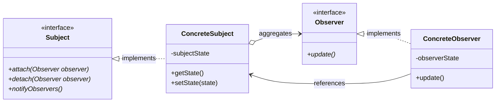
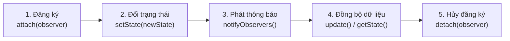
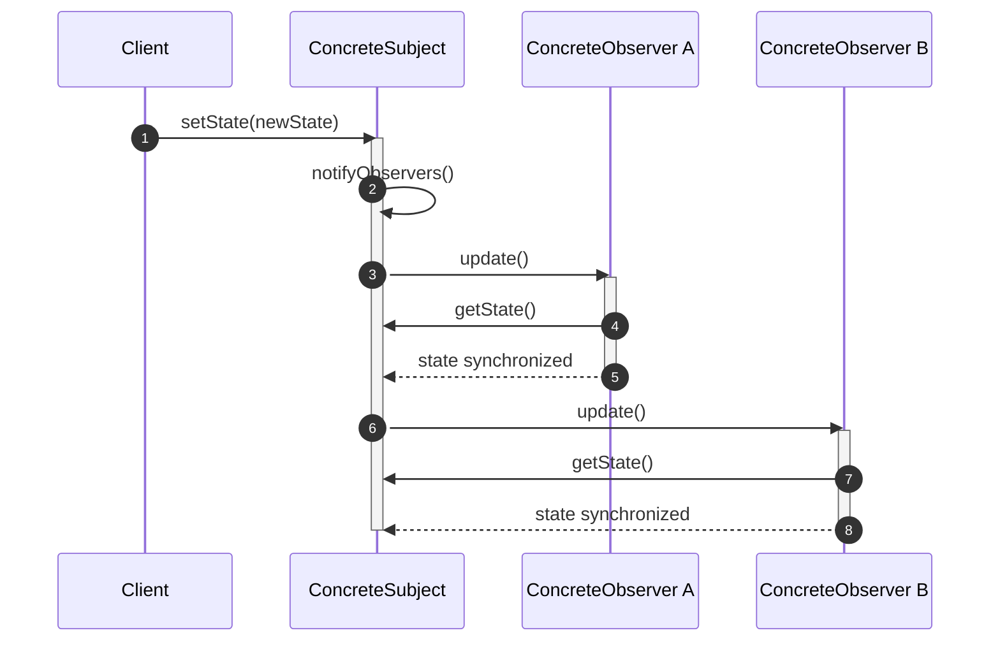
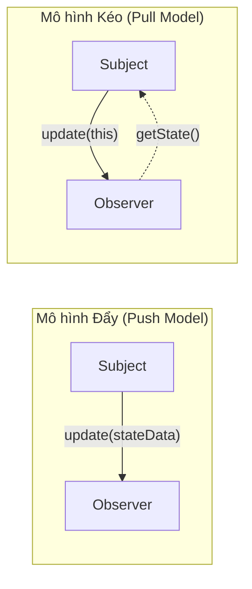
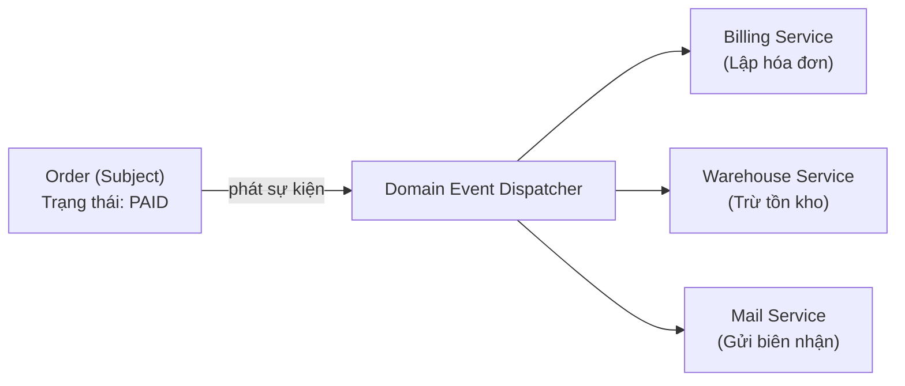

# Observer Pattern

## Table of Contents

- [1. Động lực và Ý đồ Thiết kế](#1-động-lực-và-ý-đồ-thiết-kế)
- [2. Cấu trúc và Thành phần Tham gia](#2-cấu-trúc-và-thành-phần-tham-gia)
- [3. Luồng Hoạt động và Vòng đời Tương tác](#3-luồng-hoạt-động-và-vòng-đời-tương-tác)
- [4. Kỹ thuật Triển khai Nâng cao](#4-kỹ-thuật-triển-khai-nâng-cao)
- [5. Bối cảnh Ứng dụng Thực tế](#5-bối-cảnh-ứng-dụng-thực-tế)
- [6. Đánh giá Hệ quả và Thực tiễn Sản xuất](#6-đánh-giá-hệ-quả-và-thực-tiễn-sản-xuất)

---

## 1. Động lực và Ý đồ Thiết kế

Mẫu thiết kế **Observer** (còn được biết đến với tên gọi **Dependents** hoặc **Publish-Subscribe**) là mẫu thiết kế thuộc nhóm hành vi (*Behavioral Pattern*) nhằm giải quyết bài toán duy trì tính nhất quán trạng thái giữa các đối tượng phân tán mà không tạo ra liên kết chặt chẽ (**Tight Coupling**).

Trong kiến trúc phần mềm hướng đối tượng, việc phân rã hệ thống thành các lớp nhỏ độc lập thường dẫn đến thách thức: làm thế nào để đồng bộ trạng thái giữa các đối tượng liên quan mà không biến chúng thành một khối liên kết phụ thuộc cứng nhắc?

Ý đồ cốt lõi của **Observer** là:

> **"Định nghĩa mối quan hệ phụ thuộc một-nhiều (one-to-many) giữa các đối tượng, sao cho khi một đối tượng thay đổi trạng thái, tất cả các đối tượng phụ thuộc của nó sẽ tự động nhận được thông báo và cập nhật lại trạng thái tương ứng."**

### Bối cảnh Khởi nguồn: Kiến trúc Smalltalk-80 MVC

Ví dụ kinh điển nhất khai sinh ra mẫu thiết kế Observer nằm trong kiến trúc **Model/View/Controller (MVC)** của môi trường Smalltalk-80:

*   **Model (Subject):** Đóng vai trò là nguồn dữ liệu nghiệp vụ trung tâm.
*   **Views (Observers):** Là các giao diện người dùng hiển thị dữ liệu dưới dạng bảng tính, biểu đồ cột hoặc biểu đồ tròn.

Khi dữ liệu trong **Model** biến đổi, nó tự động phát thông báo tới tất cả các **View** đã đăng ký để chúng tự vẽ lại. Kiến trúc này cho phép đính kèm vô số kiểu giao diện mới vào cùng một nguồn dữ liệu mà không cần chỉnh sửa hay tái biên dịch cấu trúc của **Model**.

---

## 2. Cấu trúc và Thành phần Tham gia

Mẫu thiết kế Observer được cấu thành từ 4 thành phần chính tham gia vào chu trình đăng ký và thông báo.

### Kiến trúc Lớp và Quan hệ Kế thừa - Ủy quyền (Class Diagram)

### Bảng Phân tích Trách nhiệm Thành phần

| Thành phần | Phân loại | Vai trò và Trách nhiệm |
| :--- | :--- | :--- |
| `Subject` | Interface / Abstract Class | Quản lý danh sách các đối tượng quan sát; cung cấp giao diện chuẩn để đính kèm (`attach`) và gỡ bỏ (`detach`) các observer. |
| `Observer` | Interface | Định nghĩa giao diện cập nhật chung (phương thức `update()`) để tiếp nhận thông báo thay đổi từ chủ thể. |
| `ConcreteSubject` | Lớp cụ thể | Lưu trữ trạng thái nghiệp vụ thực tế; kích hoạt thông báo tới danh sách observer thông qua `notifyObservers()` khi trạng thái biến đổi. |
| `ConcreteObserver` | Lớp cụ thể | Duy trì một tham chiếu đến `ConcreteSubject`; lưu trữ trạng thái riêng sao cho nhất quán với chủ thể; hiện thực hóa hành vi xử lý khi nhận thông báo `update()`. |

---

## 3. Luồng Hoạt động và Vòng đời Tương tác

Mẫu Observer vận hành thông qua một vòng đời khép kín gồm 5 giai đoạn chính: Đăng ký $\rightarrow$ Biến đổi trạng thái $\rightarrow$ Lan truyền thông báo $\rightarrow$ Đồng bộ dữ liệu $\rightarrow$ Hủy đăng ký.

### Vòng đời Lan truyền Sự kiện Tổng thể (Lifecycle Flow)

### Luồng Tương tác Đồng bộ Trạng thái (Sequence Diagram)

### Đối chiếu Cơ chế Truyền tin: Push Model vs. Pull Model

Khi chủ thể phát thông báo thay đổi, quyết định gửi kèm toàn bộ dữ liệu hay chỉ gửi tín hiệu là một đánh đổi kiến trúc quan trọng:

| Tiêu chí | Mô hình Đẩy (Push Model) | Mô hình Kéo (Pull Model) |
| :--- | :--- | :--- |
| **Cách truyền dữ liệu** | `Subject` chủ động gửi toàn bộ dữ liệu thay đổi qua tham số của hàm `update(data)`. | `Subject` chỉ gửi thông báo tối thiểu (hoặc truyền chính tham chiếu `this`), `Observer` tự gọi `getState()` để lấy thông tin. |
| **Mức độ phụ thuộc** | Giảm tính tái sử dụng vì `Subject` phải giả định trước dữ liệu mà các `Observer` cần. | Tối ưu tính tái sử dụng; `Observer` chỉ truy xuất đúng dữ liệu nó quan tâm. |
| **Hiệu năng truyền tin** | Có thể lãng phí băng thông/bộ nhớ nếu dữ liệu gửi đi quá lớn mà observer không dùng đến. | Phát sinh thêm lời gọi hàm truy vấn ngược (`getState()`), nhưng tải trọng thông báo gọn nhẹ. |
| **Tình huống khuyến nghị** | Khi hầu hết các observer đều cần cùng một tập dữ liệu nhỏ, cố định. | Khi các observer có nhu cầu dữ liệu phân hóa đa dạng hoặc dữ liệu cập nhật có dung lượng lớn. |

---

## 4. Kỹ thuật Triển khai Nâng cao

Để áp dụng mẫu Observer an toàn và hiệu quả trong môi trường sản xuất quy mô lớn, kiến trúc sư cần lưu ý ba bài toán kỹ thuật then chốt:

### 1. Đảm bảo Tính Tự Nhất Quán của Subject (Self-Consistency)

Một cạm bẫy thường gặp khi triển khai kế thừa là phương thức cập nhật trạng thái ở lớp con gọi lệnh thông báo `notifyObservers()` trước khi toàn bộ các trường trạng thái của lớp con kịp thiết lập xong. Điều này khiến `Observer` khi truy vấn ngược lại sẽ đọc phải trạng thái chưa hoàn thiện (**inconsistent state**).

> [!TIP]
> **Giải pháp kiến trúc:** Sử dụng mẫu **Template Method** trong lớp cha `Subject` để cố định quy trình xử lý, đảm bảo hàm thông báo `notifyObservers()` luôn là bước cuối cùng được thực thi sau khi logic thiết lập trạng thái của lớp con hoàn tất.

### 2. Quản lý Đồ thị Phụ thuộc Phức tạp với ChangeManager

Trong các hệ thống lớn, một `Observer` có thể quan sát nhiều `Subject`, và ngược lại một `Subject` có thể kích hoạt chuỗi thay đổi tới nhiều đối tượng liên đới. Điều này dễ dẫn đến các cập nhật lặp lại dư thừa hoặc vòng lặp thông báo vô tận (**circular update loops**).

> [!NOTE]
> **ChangeManager** (một biến thể chuyên biệt của mẫu **Mediator**) đóng vai trò như một bộ điều phối trung tâm:
> 1. Thay thế liên kết trực tiếp giữa các cặp Subject - Observer bằng sơ đồ ánh xạ trung tâm.
> 2. Định nghĩa chiến lược cập nhật tập trung (thu thập các thay đổi nhỏ, gộp lại và chỉ gửi một thông báo duy nhất tới observer).
> 3. Lọc bỏ các tín hiệu cập nhật trùng lặp nhằm tối ưu hóa hiệu năng tính toán.

### 3. Vấn đề Rò rỉ Bộ nhớ (The "Lapsed Listener" Problem)

Trong các ngôn ngữ có bộ gom rác tự động (**Garbage Collector**) như Java hay C#, `Subject` duy trì một tham chiếu mạnh (**strong reference**) đến từng `Observer` trong danh sách đăng ký. Nếu đối tượng `Observer` kết thúc vòng đời nhưng không gọi `detach()`, nó sẽ không bao giờ được GC thu hồi, dẫn tới rò rỉ bộ nhớ nghiêm trọng.

> [!WARNING]
> **Khắc phục:** Luôn triển khai cơ chế hủy đăng ký rõ ràng trong các hook vòng đời (như `dispose()`, `close()`), hoặc sử dụng tham chiếu yếu (**WeakReference** / Weak Observer pattern) để cho phép GC tự động giải phóng đối tượng quan sát khi không còn nơi nào khác tham chiếu tới nó.

---

## 5. Bối cảnh Ứng dụng Thực tế

Thay vì xem Observer như một kỹ thuật cài đặt mã nguồn đơn thuần, trong kiến trúc phần mềm hiện đại, mẫu này là nền tảng giải quyết bài toán phân tách trách nhiệm trong ba bối cảnh chủ đạo:

### 1. Kiến trúc Giao diện Người dùng (UI Event Binding & MVVM)

*   **Bối cảnh:** Trong các ứng dụng Web/Mobile hiện đại, tầng hiển thị (View) cần phản ánh trung thực trạng thái dữ liệu (State/Store) theo thời gian thực mà không can thiệp trực tiếp vào logic nghiệp vụ.
*   **Luồng tương tác:** Khi người dùng tương tác làm biến đổi dữ liệu trong Store, Store phát ra sự kiện thay đổi. Các thành phần giao diện đã đăng ký lắng nghe (như Header, Badge thông báo, Danh sách sản phẩm) sẽ tự động kích hoạt tiến trình render lại nội dung mới.
*   **Giá trị kiến trúc:** Tách biệt hoàn toàn tầng giao diện khỏi tầng lưu trữ trạng thái, cho phép xây dựng thêm các widget mới mà không phải sửa đổi cấu trúc dữ liệu trung tâm.

### 2. Kiến trúc Xử lý Sự kiện Miền (Domain Events trong DDD)

*   **Bối cảnh:** Trong kiến trúc hướng miền (**Domain-Driven Design**), khi một thực thể thay đổi trạng thái (ví dụ một đơn hàng chuyển sang trạng thái đã thanh toán), hệ thống cần kích hoạt hàng loạt nghiệp vụ liên quan như tạo hóa đơn, trừ kho, gửi email cho khách hàng, và ghi log kiểm toán.
*   **Luồng tương tác:** Thực thể `Order` đóng vai trò là `Subject` phát ra sự kiện `OrderPaidEvent`. Bộ điều phối sự kiện tiếp nhận và chuyển giao tới các dịch vụ quan sát độc lập.

*   **Giá trị kiến trúc:** Tuân thủ nguyên tắc đơn trách nhiệm (**Single Responsibility Principle**), giữ cho logic của đơn hàng không bị phình to bởi các tác vụ phụ trợ (**side-effects**).

### 3. Mô hình Dòng phản ứng (Reactive Streams)

*   **Bối cảnh:** Xử lý các luồng dữ liệu thời gian thực có thông lượng biến thiên liên tục (như dữ liệu cảm biến IoT, báo giá thị trường chứng khoán, kết nối WebSocket).
*   **Luồng tương tác:** Đối tượng phát sinh dữ liệu đóng vai trò là `Publisher` và các luồng tiêu thụ là `Subscriber`. Cơ chế thông báo được nâng cấp thêm khả năng điều tiết áp lực ngược (**Backpressure**) để ngăn tình trạng Subscriber bị quá tải bộ nhớ khi Publisher phát tín hiệu quá nhanh.
*   **Giá trị kiến trúc:** Mở rộng mẫu Observer truyền thống thành mô hình xử lý bất đồng bộ, bền bỉ và kiểm soát tài nguyên hệ thống một cách chủ động.

---

## 6. Đánh giá Hệ quả và Thực tiễn Sản xuất

### Ưu điểm Kiến trúc

1.  **Khớp nối trừu tượng (Abstract Coupling):** Chủ thể chỉ biết đến giao diện `Observer` mà không hề phụ thuộc vào kiểu lớp cụ thể hay logic nội bộ của các observer. Chúng có thể thuộc về các tầng kiến trúc hoàn toàn tách biệt.
2.  **Khả năng mở rộng (Open/Closed Principle):** Bổ sung thêm các loại đối tượng quan sát mới trong tương lai mà không cần can thiệp hay thay đổi mã nguồn của lớp `Subject`.
3.  **Hỗ trợ truyền thông quảng bá (Broadcast Communication):** Chủ thể phát đi một tín hiệu duy nhất, hệ thống tự động định tuyến và chuyển giao tới tất cả các thực thể quan tâm tại runtime.

### Nhược điểm và Thách thức

1.  **Cập nhật ngoài ý muốn (Unexpected Updates):** Do các observer hoàn toàn độc lập và không biết về sự tồn tại của nhau, một hành vi kích hoạt thay đổi tưởng chừng vô hại của một observer lên subject có thể châm ngòi cho một chuỗi cập nhật dây chuyền (**cascading updates**) tiêu tốn tài nguyên và rất khó kiểm soát nguồn gốc lỗi.
2.  **Thứ tự cập nhật không xác định:** Giao diện chuẩn không cam kết thứ tự thông báo giữa các observer. Việc mã nguồn phụ thuộc ngầm vào thứ tự thực thi của danh sách observer là một nguồn lỗi tiềm ẩn nghiêm trọng.

### Đối chiếu: GoF Observer Cổ Điển và Message Broker Pub-Sub Hiện Đại

| Tiêu chí | GoF Observer Pattern (1994) | Message Broker Pub-Sub (Hiện đại) |
| :--- | :--- | :--- |
| **Không gian (Space)** | Trong cùng một tiến trình bộ nhớ (**In-Memory**). | Phân tán giữa nhiều dịch vụ, mạng lưới khác nhau (**Distributed**). |
| **Thời gian (Time)** | Thường là lời gọi hàm đồng bộ (**Synchronous** method invocation). | Bất đồng bộ (**Asynchronous**), hỗ trợ lưu trữ tạm (message queue persistence). |
| **Thành phần trung gian** | `Subject` trực tiếp lưu danh sách tham chiếu tới `Observer`. | Tách biệt hoàn toàn qua **Message Broker** trung gian (Kafka, RabbitMQ, Redis). |
| **Độ tin cậy & Bền vững** | Tự quản lý trong ứng dụng; mất dữ liệu nếu tiến trình dừng đột ngột. | Hỗ trợ retry, dead-letter queue, xác nhận biên nhận (**ack**), và lưu trữ đĩa. |

---
[← Back to README](README.md)
