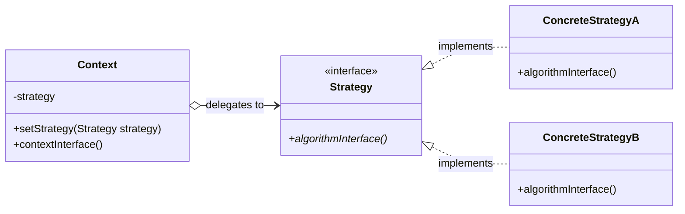
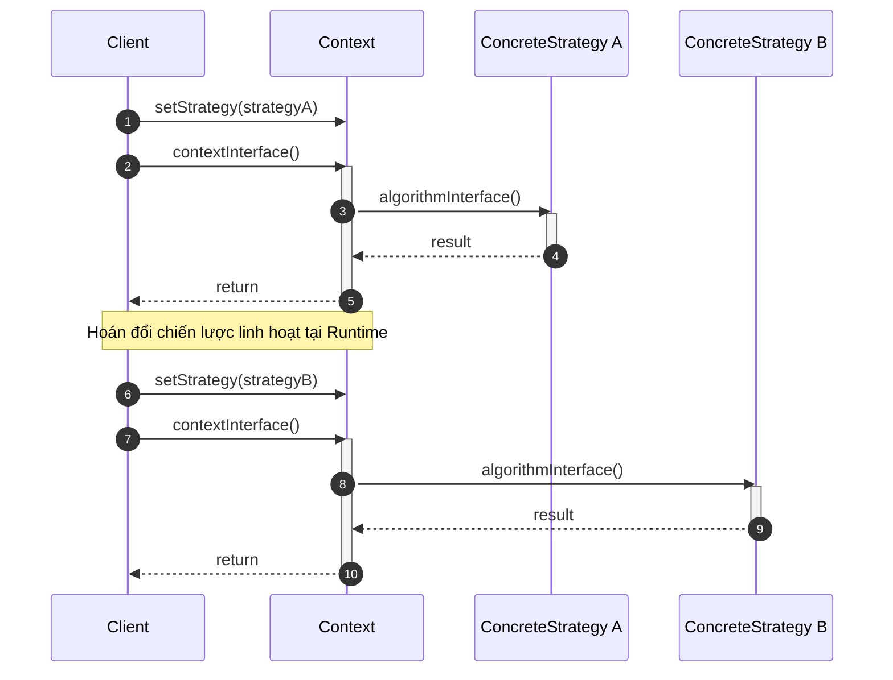
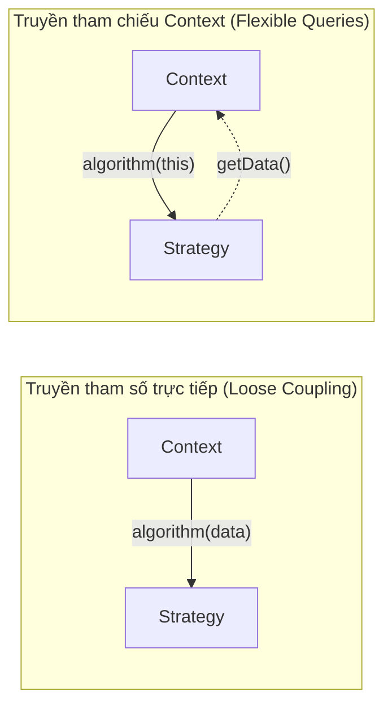
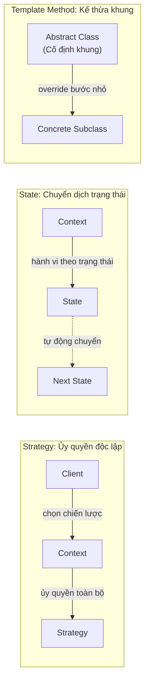
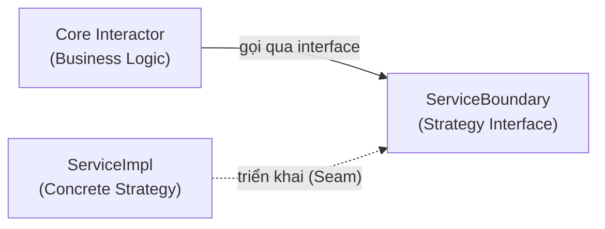

# Strategy Pattern

## Table of Contents

- [1. Động lực và Ý đồ Thiết kế](#1-động-lực-và-ý-đồ-thiết-kế)
- [2. Cấu trúc và Thành phần Tham gia](#2-cấu-trúc-và-thành-phần-tham-gia)
- [3. Luồng Hoạt động và Cơ chế Trao đổi Dữ liệu](#3-luồng-hoạt-động-và-cơ-chế-trao-đổi-dữ-liệu)
- [4. Kỹ thuật Triển khai và Tối ưu Hóa](#4-kỹ-thuật-triển-khai-và-tối-ưu-hóa)
- [5. Phân biệt Strategy với State và Template Method](#5-phân-biệt-strategy-với-state-và-template-method)
- [6. Đánh giá Hệ quả và Góc nhìn Clean Architecture](#6-đánh-giá-hệ-quả-và-góc-nhìn-clean-architecture)

---

## 1. Động lực và Ý đồ Thiết kế

Mẫu thiết kế **Strategy** (còn được biết đến rộng rãi với tên gọi **Policy**) là một mẫu thiết kế thuộc nhóm hành vi (*Behavioral Pattern*) nhằm định nghĩa một họ các thuật toán, đóng gói từng thuật toán lại và giúp chúng có thể thay thế hoán đổi cho nhau một cách linh hoạt tại thời điểm thực thi (**Runtime**).

Trong thiết kế hướng đối tượng truyền thống, khi một lớp cần thực hiện một công việc theo nhiều phương pháp khác nhau (ví dụ: các giải thuật nén dữ liệu khác nhau, các cơ chế định tuyến mạng hay các giải pháp bố cục giao diện), lập trình viên thường có xu hướng sử dụng kế thừa để tạo ra các lớp con tương ứng.

Tuy nhiên, cách tiếp cận này sẽ cố định (**hard-bind**) thuật toán vào bối cảnh ngay từ thời điểm biên dịch (**compile-time**), làm cho lớp bối cảnh trở nên cồng kềnh, khó bảo trì và không thể thay đổi hành vi một cách động tại thời điểm chạy (**runtime**).

Ý đồ cốt lõi của **Strategy** là:

> **"Định nghĩa một họ các thuật toán, đóng gói từng thuật toán đó lại và giúp chúng có thể thay thế cho nhau một cách linh hoạt. Strategy tách biệt phần thuật toán biến đổi khỏi phần bối cảnh (Context) sử dụng nó, cho phép thuật toán thay đổi độc lập mà không ảnh hưởng đến Client tiêu thụ."**

Bằng cách áp dụng Strategy, chúng ta đóng gói khái niệm biến đổi vào các đối tượng riêng biệt đại diện cho thuật toán, hiện thực hóa nguyên tắc *"Lập trình dựa trên giao diện thay vì cài đặt cụ thể"* và nguyên lý Đóng/Mở (**Open/Closed Principle - OCP**).

---

## 2. Cấu trúc và Thành phần Tham gia

Mẫu thiết kế Strategy được cấu thành từ 3 thành phần chính phối hợp thông qua cơ chế ủy quyền (**Delegation**).

### Kiến trúc Lớp và Cơ chế Ủy quyền (Class Diagram)

### Bảng Phân tích Trách nhiệm Thành phần

| Thành phần | Phân loại | Vai trò và Trách nhiệm |
| :--- | :--- | :--- |
| `Strategy` | Interface / Abstract Class | Định nghĩa một chữ ký chung cho tất cả các thuật toán được hỗ trợ; là hợp đồng mà `Context` sử dụng để gọi thuật toán. |
| `ConcreteStrategy` | Lớp cụ thể | Hiện thực hóa giải thuật thực tế tuân theo giao diện `Strategy`. |
| `Context` | Lớp cụ thể | Duy trì một tham chiếu đến đối tượng `Strategy`; được cấu hình động bởi `Client` và ủy quyền thực thi thuật toán cho chiến lược đang nắm giữ. |

---

## 3. Luồng Hoạt động và Cơ chế Trao đổi Dữ liệu

`Client` khởi tạo một đối tượng `ConcreteStrategy` cụ thể và gán vào `Context`. Khi cần thực thi, `Context` chuyển tiếp yêu cầu đến đối tượng chiến lược thông qua lời gọi hàm đa hình.

### Luồng Cấu hình và Hoán đổi Chiến lược tại Runtime (Sequence Diagram)

### Đối chiếu Cơ chế Trao đổi Dữ liệu giữa Context và Strategy

Sự tương tác giữa `Context` và `Strategy` đòi hỏi thiết kế giao diện trao đổi dữ liệu cẩn trọng:

| Tiêu chí | Truyền Tham Số Trực Tiếp | Truyền Tham Chiếu Context (`this`) |
| :--- | :--- | :--- |
| **Bản chất cơ chế** | `Context` truyền chính xác các trường dữ liệu cần thiết qua đối số của `algorithm(data)`. | `Context` truyền chính nó làm tham số `algorithm(this)`; `Strategy` chủ động gọi các getter để lấy dữ liệu. |
| **Mức độ kết hợp (Coupling)** | **Loose Coupling:** `Strategy` hoàn toàn không biết cấu trúc nội bộ của `Context`. | **Higher Coupling:** `Strategy` phụ thuộc vào giao diện công khai của `Context`. |
| **Khả năng mở rộng** | Kém linh hoạt nếu một chiến lược mới đòi hỏi thêm dữ liệu mà chữ ký hàm chưa có. | Rất linh hoạt; chiến lược mới có thể tự do truy xuất thêm thuộc tính từ `Context`. |
| **Khuyến nghị** | Dùng khi tập dữ liệu đầu vào nhỏ, cố định và rõ ràng. | Dùng khi thuật toán phức tạp, đòi hỏi nhiều dữ liệu không cố định từ ngữ cảnh. |

---

## 4. Kỹ thuật Triển khai và Tối ưu Hóa

### 1. Loại bỏ Câu lệnh Rẽ nhánh Phức tạp

Ứng dụng trực quan nhất của Strategy là xóa bỏ hoàn toàn các khối `if-else` hoặc `switch-case` khổng lồ dùng để chọn hành vi. Mỗi nhánh điều kiện được đa hình hóa thành một lớp `ConcreteStrategy` độc lập, giúp mã nguồn `Context` sạch sẽ và tuân thủ nguyên tắc **Single Responsibility**.

### 2. Cân đối Dung lượng và Tốc độ (Space/Time Trade-offs)

Strategy cho phép cung cấp các cài đặt khác nhau của cùng một hành vi để người dùng lựa chọn tối ưu theo ngữ cảnh hạ tầng:
*   Chiến lược nén dữ liệu nhanh nhưng tỷ lệ nén thấp (ưu tiên **tốc độ** CPU).
*   Chiến lược nén dữ liệu chậm nhưng dung lượng nhỏ nhất (ưu tiên **bộ nhớ** lưu trữ).

### 3. Tối ưu Hóa Biên Dịch bằng C++ Templates (Static Strategy)

Trong các ngôn ngữ hỗ trợ lập trình hướng mẫu như C++, việc gọi hàm ảo qua con trỏ (`vtable lookup`) và chi phí cấp phát bộ nhớ heap cho nhiều đối tượng Strategy nhỏ lẻ có thể gây ảnh hưởng hiệu năng trong các hệ thống đòi hỏi độ trễ cực thấp.

> [!TIP]
> **Giải pháp tối ưu hóa:** Sử dụng **Templates** để liên kết tĩnh thuật toán vào `Context` tại thời điểm biên dịch (`Context<ConcreteStrategy>`). Cơ chế này loại bỏ hoàn toàn chi phí hàm ảo và không cần khai báo lớp trừu tượng; đổi lại, hệ thống sẽ mất đi khả năng hoán đổi thuật toán động tại runtime.

---

## 5. Phân biệt Strategy với State và Template Method

Trong bức tranh tổng thể của các mẫu hành vi, Strategy có cấu trúc tương đồng nhưng mục tiêu thiết kế hoàn toàn khác biệt với **State** và **Template Method**:

| Tiêu chí | Strategy Pattern | State Pattern | Template Method Pattern |
| :--- | :--- | :--- | :--- |
| **Cơ chế cốt lõi** | Ủy quyền (**Delegation**) & Kết hợp (**Composition**). | Ủy quyền (**Delegation**) & Kết hợp (**Composition**). | Kế thừa lớp (**Class Inheritance**). |
| **Phạm vi biến đổi** | Thay đổi **toàn bộ** thuật toán/chiến lược tại runtime. | Thay đổi **hành vi** tương ứng với trạng thái nội tại. | Thay đổi **một phần** các bước chi tiết; khung thuật toán cố định. |
| **Mối quan hệ giữa các lớp con** | Hoàn toàn độc lập, không biết về sự hiện diện của nhau. | Có sự chuyển dịch phụ thuộc (**State Transition**) qua lại giữa các trạng thái. | Các lớp con không biết nhau; chỉ liên kết với lớp cha. |
| **Chủ thể quyết định** | Được cấu hình tường minh bởi **Client**. | Thường do bản thân các lớp **State** hoặc **Context** tự quyết định chuyển đổi. | Cố định ở thời điểm biên dịch thông qua lớp con cụ thể. |

---

## 6. Đánh giá Hệ quả và Góc nhìn Clean Architecture

### Ưu điểm Kiến trúc

1.  **Linh hoạt hoán đổi tại Runtime:** Dễ dàng thay đổi giải thuật thực thi của hệ thống mà không cần dừng hoặc biên dịch lại ứng dụng.
2.  **Mở rộng theo nguyên tắc OCP:** Bổ sung thuật toán mới chỉ đơn giản là tạo thêm một lớp cài đặt `Strategy` mới mà không chạm vào mã nguồn của `Context`.
3.  **Tách biệt mối quan tâm (SoC):** Đóng gói cấu trúc dữ liệu nội tại của thuật toán tách biệt khỏi đối tượng ngữ cảnh sử dụng nó.

### Nhược điểm và Thách thức

1.  **Gánh nặng nhận thức cho Client (Client Overhead):** Client bắt buộc phải hiểu rõ sự khác biệt giữa các `ConcreteStrategy` để quyết định lựa chọn giải thuật phù hợp, điều này làm lộ một phần chi tiết cài đặt của thuật toán cho Client.
2.  **Gia tăng số lượng đối tượng:** Mỗi chiến lược là một đối tượng độc lập, làm tăng áp lực quản lý vòng đời bộ nhớ nếu không áp dụng kết hợp cùng **Flyweight** hoặc **Singleton**.

### Góc nhìn Clean Architecture: Strategy như một Ranh giới Một phần (Partial Boundary)

Dưới lăng kính kiến trúc hệ thống cấp cao (được phân tích bởi Robert C. Martin trong *Clean Architecture*), mẫu Strategy đóng vai trò là một **ranh giới kiến trúc một phần (Partial Boundary)** vô cùng giá trị:

*   **Đảo ngược phụ thuộc (DIP):** Việc định nghĩa một giao diện ranh giới dịch vụ (`ServiceBoundary`) được gọi bởi Client/Interactor và được hiện thực hóa bởi các lớp dịch vụ cụ thể (`ServiceImpl`) chính là ứng dụng trực tiếp của Strategy.
*   **Thiết lập điểm tiếp giáp (Seam):** Cơ chế này tạo ra một Seam bảo vệ bối cảnh nghiệp vụ lõi (Core Business Rules / Use Cases) hoàn toàn miễn nhiễm trước những biến đổi từ chi tiết ngoại vi (cơ sở dữ liệu, giao diện người dùng, nhà cung cấp dịch vụ bên thứ ba).
*   **Tiền đề tiến hóa kiến trúc:** Cho phép kiến trúc sư giữ chi phí phát triển ban đầu ở mức tối thiểu nhưng vẫn chuẩn bị sẵn cấu trúc để nâng cấp lên một ranh giới kiến trúc toàn phần (**Full Boundary**) đắt đỏ hơn khi hệ thống mở rộng quy mô.

---
[← Back to README](README.md)
